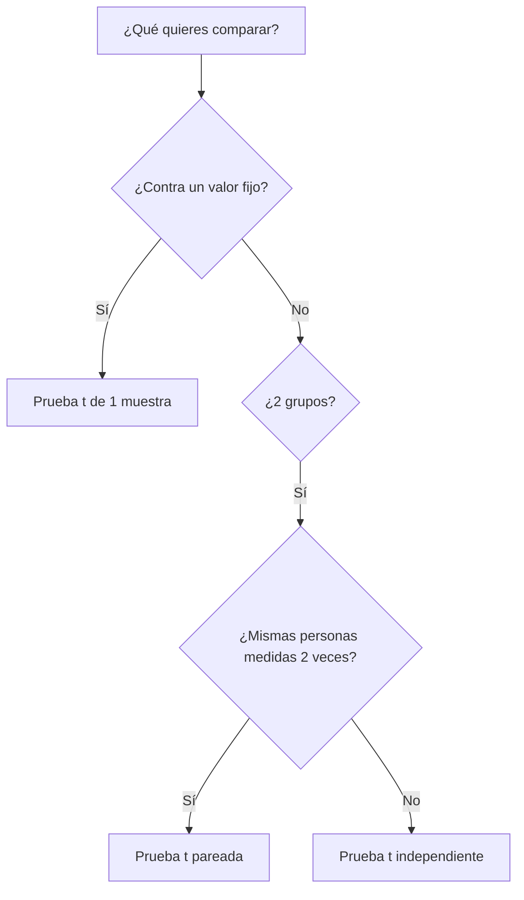

# 📅 Plan de Clases - Semana 1

## Estadística Básica y Pruebas de Hipótesis

**Total:** 4 clases × 2 horas = 8 horas
**Modalidad:** Presencial con práctica en computadora
**Herramientas:** Python, Google Colab, pandas, scipy

---

## 📌 Clase 1: Introducción a Estadística Descriptiva

**Duración:** 2 horas
**Objetivo:** Introducir conceptos básicos de estadística y medidas de tendencia central

### 📋 Agenda Detallada

| Tiempo | Actividad | Descripción |
|--------|-----------|-------------|
| **15 min** | 🎯 Bienvenida y expectativas | - Presentación del curso<br>- Objetivos de la semana<br>- Explicación de entregables<br>- Política de uso de IA |
| **45 min** | 💻 Notebook 01: Introducción | - Exploración de datasets con pandas<br>- Análisis descriptivo básico<br>- Visualizaciones iniciales<br>- Ejercicios guiados |
| **45 min** | 📊 Inicio Notebook 02 | - Media, mediana, moda<br>- Interpretación y comparación<br>- Ejemplos con datos reales |
| **15 min** | 💬 Cierre y Q&A | - Resolver dudas<br>- Tarea para casa<br>- Preparación para Clase 2 |

### 📚 Material para revisar en casa:
- ✅ Completar Notebook 02 (secciones 3-7)
- ✅ Ejercicio opcional: [ejercicio_medidas_tendencia.ipynb](ejercicios/ejercicio_medidas_tendencia.ipynb)
- ✅ Leer sobre desviación estándar (preparación para Clase 2)

### 🎮 Actividad de Equipo Opcional (15 min)

<details>
<summary><b>💡 IA EXPLAINER BATTLE: ¿Quién explica mejor?</b> ⚠️ OPCIONAL - A DISCRECIÓN DEL PROFESOR</summary>

**Objetivo:** Comparar cómo diferentes IAs explican conceptos estadísticos

**Equipos:** 3-4 personas

**Instrucciones:**
1. **Dividir herramientas** (2 min):
   - Equipo A: ChatGPT
   - Equipo B: Gemini
   - Equipo C: Claude
   - Equipo D: DeepSeek (si hay 4+ equipos)

2. **Hacer la misma pregunta** (5 min):
   ```
   Prompt: "Explica la diferencia entre media y mediana usando un
   ejemplo del mundo real relacionado con salarios. ¿En qué situación
   usarías cada una? Hazlo en menos de 100 palabras."
   ```

3. **Comparar respuestas** (5 min):
   - ¿Cuál fue más clara?
   - ¿Cuál dio mejor ejemplo?
   - ¿Cuál fue más precisa técnicamente?

4. **Conclusión grupal** (3 min):
   - Cada equipo comparte: "Nuestra IA dijo... y nos gustó/no gustó porque..."
   - Votar: ¿Qué IA ganó?

**Entregable:** Una diapositiva o mensaje en chat con la respuesta ganadora + por qué

**Beneficios:**
- ✅ Aprenden a usar IA como herramienta de estudio
- ✅ Practican pensamiento crítico (no toda salida de IA es perfecta)
- ✅ Concepto estadístico reforzado con múltiples explicaciones

</details>

### 📌 Notas para el Profesor:
- Asegúrate de que todos tengan Google Colab funcionando
- Ten datasets de ejemplo pre-cargados
- Prepara 2-3 ejemplos de salarios/datos reales para ilustrar media vs mediana
- Si hay problemas técnicos, ten notebooks descargables como backup

---

## 📌 Clase 2: Medidas de Dispersión y Visualización

**Duración:** 2 horas
**Objetivo:** Entender variabilidad de datos y crear visualizaciones efectivas

### 📋 Agenda Detallada

| Tiempo | Actividad | Descripción |
|--------|-----------|-------------|
| **10 min** | 🔄 Repaso rápido | - Quiz oral de Clase 1<br>- Resolver dudas de tarea |
| **50 min** | 📊 Notebook 02 - Continuación | - Varianza y desviación estándar<br>- Cuartiles e IQR<br>- Detección de outliers<br>- Comparación entre grupos |
| **45 min** | 🎨 Práctica guiada: Visualizaciones | - Histogramas<br>- Boxplots<br>- Interpretación de gráficos<br>- Ejercicios en parejas |
| **15 min** | 💬 Q&A y cierre | - Dudas<br>- Preparación para Clase 3 (hipótesis) |

### 📚 Material para revisar en casa:
- ✅ Leer inicio de Notebook 03 (secciones 1-3)
- ✅ Repasar conceptos de hipótesis nula y alternativa
- ✅ Ver video recomendado sobre p-values (Khan Academy)

### 🎮 Actividad de Equipo Opcional (20 min)

<details>
<summary><b>📊 VISUALIZACIÓN CHALLENGE: IA vs Humano</b> ⚠️ OPCIONAL - A DISCRECIÓN DEL PROFESOR</summary>

**Objetivo:** Generar gráficos con IA y evaluar calidad críticamente

**Equipos:** 3-4 personas

**Instrucciones:**
1. **Dataset:** Usar `ejemplo_satisfaccion_clientes.csv` (ya cargado en clase)

2. **Pedir a IA que genere código de gráfico** (7 min):
   ```
   Prompt para ChatGPT/Gemini/Claude:
   "Genera código Python para crear un boxplot comparativo de
   'satisfaccion' por 'area' usando matplotlib y seaborn.
   El gráfico debe tener título, etiquetas claras y colores
   profesionales."
   ```

3. **Ejecutar el código** (3 min):
   - Copiar en Colab
   - Ejecutar
   - Captura de pantalla del resultado

4. **Crítica en equipo** (7 min):
   - ✅ ¿Qué está bien? (colores, etiquetas, claridad)
   - ❌ ¿Qué falta? (leyenda, grid, escala)
   - 🔧 ¿Cómo mejorarías el prompt?

5. **Compartir** (3 min):
   - Mostrar gráfico generado
   - Conclusión: "La IA hizo bien X pero falló en Y"

**Entregable:** Captura de pantalla del gráfico + 2 mejoras sugeridas

**Beneficios:**
- ✅ Aprenden que IA genera código útil pero necesita validación
- ✅ Practican ingeniería de prompts
- ✅ Refuerzan conceptos de visualización

</details>

### 📌 Notas para el Profesor:
- Mostrar ejemplos de gráficos buenos vs malos
- Tener código base de visualizaciones como referencia
- Explicar interpretación de boxplots con ejemplos reales
- Conectar IQR con detección de outliers

---

## 📌 Clase 3: Pruebas de Hipótesis (1 y 2 Muestras)

**Duración:** 2 horas
**Objetivo:** Realizar pruebas estadísticas y tomar decisiones basadas en datos

### 📋 Agenda Detallada

| Tiempo | Actividad | Descripción |
|--------|-----------|-------------|
| **20 min** | 🎯 Introducción a pruebas de hipótesis | - Conceptos: H₀, H₁, α, p-value<br>- ¿Cuándo usar cada prueba?<br>- Árbol de decisión |
| **70 min** | 💻 Notebook 03: Pruebas de hipótesis | - Prueba t para 1 muestra<br>- Prueba t para 2 muestras independientes<br>- Prueba t pareada<br>- Interpretación de resultados<br>- Ejemplos con casos reales |
| **20 min** | 📝 Ejercicio guiado | - Resolver en clase un caso completo<br>- Desde planteamiento hasta conclusión |
| **10 min** | 💬 Cierre | - Dudas<br>- Introducción al Workshop 1 |

### 📚 Material para revisar en casa:
- ✅ Completar Notebook 03 (secciones finales)
- ✅ Practicar con: [ejercicio_pruebas_hipotesis.ipynb](ejercicios/ejercicio_pruebas_hipotesis.ipynb)
- ✅ Revisar rúbrica del Workshop 1

### 🎮 Actividad de Equipo Opcional (20 min)

<details>
<summary><b>🌳 MERMAID DECISION TREE: ¿Qué prueba usar?</b> ⚠️ OPCIONAL - A DISCRECIÓN DEL PROFESOR</summary>

**Objetivo:** Crear árbol de decisión para elegir prueba estadística correcta

**Equipos:** 3-4 personas

**Instrucciones:**
1. **Brainstorming** (5 min):
   - ¿Qué preguntas haces para elegir prueba?
   - Ejemplos: ¿Cuántos grupos? ¿Datos pareados? ¿Comparas con valor fijo?

2. **Pedir ayuda a IA** (7 min):
   ```
   Prompt para ChatGPT/Claude:
   "Crea un diagrama de flujo en sintaxis Mermaid que ayude a
   decidir entre:
   - Prueba t de 1 muestra
   - Prueba t de 2 muestras independientes
   - Prueba t pareada

   El diagrama debe empezar preguntando '¿Qué quieres comparar?'
   y terminar con la prueba recomendada."
   ```

3. **Visualizar en Mermaid Live** (3 min):
   - Ir a [mermaid.live](https://mermaid.live/)
   - Pegar código generado
   - Ajustar si es necesario

4. **Compartir y comparar** (5 min):
   - Proyectar diagramas de cada equipo
   - Votar: ¿Cuál es más claro?
   - Consensuar un diagrama "oficial" del grupo

**Entregable:** Link a Mermaid Live o screenshot del diagrama

**Ejemplo de salida esperada:**


**Beneficios:**
- ✅ Diagrama visual ayuda a memorizar
- ✅ Aprenden Mermaid (útil para documentación)
- ✅ Trabajo colaborativo con IA

</details>

### 📌 Notas para el Profesor:
- Enfatizar interpretación de p-values (no solo mecánica)
- Mostrar ejemplos de buenas y malas interpretaciones
- Conectar con decisiones de negocio reales
- Preparar template de interpretación para estudiantes

---

## 📌 Clase 4: Workshop y Revisión

**Duración:** 2 horas
**Objetivo:** Aplicar todos los conceptos en Workshop 1 y resolver dudas

### 📋 Agenda Detallada

| Tiempo | Actividad | Descripción |
|--------|-----------|-------------|
| **20 min** | 🔄 Repaso de conceptos clave | - Medidas de tendencia y dispersión<br>- Interpretación de p-values<br>- Cuándo usar cada prueba<br>- Quiz rápido |
| **15 min** | 📋 Introducción al Workshop 1 | - Explicación de entregables<br>- Revisión de rúbrica<br>- Estructura MEAL (bonus)<br>- FAQ |
| **70 min** | 💻 Tiempo de trabajo en clase | - Estudiantes trabajan en Workshop 1<br>- Profesor circula para resolver dudas<br>- Peer review en parejas (opcional)<br>- Checkpoint a mitad de tiempo |
| **15 min** | 💬 Cierre y próximos pasos | - Recordatorio de fecha de entrega<br>- Vista previa de Semana 2<br>- Palabras de ánimo |

### 📚 Tarea para entregar:
- ⭐ **Workshop 1:** [workshop1_plantilla.ipynb](ejercicios/workshop1_plantilla.ipynb)
- 📅 **Fecha límite:** Ver calendario del curso
- 🎯 **Valor:** 10% de la calificación final

### 🎮 Actividad de Equipo Opcional (20 min)

<details>
<summary><b>⚔️ DEBATE: Correlación ≠ Causalidad</b> ⚠️ OPCIONAL - A DISCRECIÓN DEL PROFESOR</summary>

**Objetivo:** Entender profundamente la diferencia entre correlación y causalidad

**Equipos:** 2 grandes grupos (mitad de la clase cada uno)

**Instrucciones:**
1. **Caso provocador** (3 min):
   - Profesor presenta: "Estudiantes que usan ChatGPT tienen calificaciones 15% más altas"
   - Pregunta: ¿ChatGPT CAUSA mejores calificaciones?

2. **Preparación de argumentos** (7 min):
   - **Grupo A (Correlación):** Argumenta que es solo correlación
     - Buscar con IA: "Dame 3 variables confusoras que podrían explicar..."
   - **Grupo B (Causalidad):** Argumenta que SÍ hay relación causal
     - Buscar con IA: "Dame 3 mecanismos por los cuales ChatGPT podría causar..."

3. **Debate** (8 min):
   - Cada grupo presenta (3 min c/u)
   - Réplica (1 min c/u)

4. **Resolución** (2 min):
   - Profesor explica: Variables confusoras, diseño experimental vs observacional
   - Conclusión: "Correlación es el primer paso, causalidad requiere experimento"

**Entregable:** Cada equipo escribe en chat:
- 2 variables confusoras identificadas
- 1 conclusión del debate

**Beneficios:**
- ✅ Concepto crítico para análisis de datos
- ✅ Práctica de pensamiento crítico
- ✅ Divertido y participativo

</details>

### 📌 Notas para el Profesor:
- Crear ambiente de trabajo productivo (música suave opcional)
- Tener respuestas preparadas para preguntas frecuentes
- Hacer checkpoint a los 35 min para ver progreso general
- Recordar que el workshop NO debe terminarse en clase (es para empezar)
- Compartir mejores prácticas de estudiantes que terminan rápido

---

## 📊 Resumen de Entregables de la Semana

| Entregable | Tipo | Fecha | Valor |
|------------|------|-------|-------|
| Ejercicios opcionales | Práctica | - | 0% (preparación) |
| **Workshop 1** | Evaluación | Fin de semana | **10%** |

---

## 🎯 Checklist para el Profesor

**Antes de la semana:**
- [ ] Verificar que todos los notebooks estén actualizados
- [ ] Probar que los datasets se cargan correctamente desde URLs
- [ ] Preparar ejemplos adicionales por si hay dudas
- [ ] Revisar actividades opcionales y decidir cuáles usar

**Durante cada clase:**
- [ ] Compartir link de Colab al inicio
- [ ] Hacer pausas cada 30 min (attention span)
- [ ] Tomar asistencia
- [ ] Circular por el salón durante ejercicios

**Después de Clase 4:**
- [ ] Compartir rúbrica de Workshop 1 detallada
- [ ] Enviar recordatorio de fecha de entrega
- [ ] Publicar FAQ basado en preguntas de la semana

---

## 💡 Tips de Enseñanza

### Para mantener engagement:
- 🎮 Usar actividades de equipo (15-20 min máximo)
- 🤖 Mostrar ejemplos de uso correcto/incorrecto de IA
- 📊 Usar datos de interés estudiantil (salarios, videojuegos, redes sociales)
- 🏆 Gamificar cuando sea posible (puntos extra por participación)

### Para gestionar ritmo:
- ⏱️ Usar timer visible para actividades
- 🚦 Código de colores: Verde (vamos bien), Amarillo (dudas?), Rojo (pausa necesaria)
- 📢 Checkpoint cada 30-40 min: "¿Todos llegamos hasta aquí?"

### Para resolver dudas:
- 👥 Peer instruction: Estudiantes explican a compañeros primero
- 💬 Parking lot: Pizarrón para dudas que se responden al final
- 🎥 Grabar sesiones (opcional) para estudiantes que faltan

---

**¿Preguntas sobre el plan de clases?**
Consulta el [README principal](README.md) o las [guías de workshops](workshop/)
