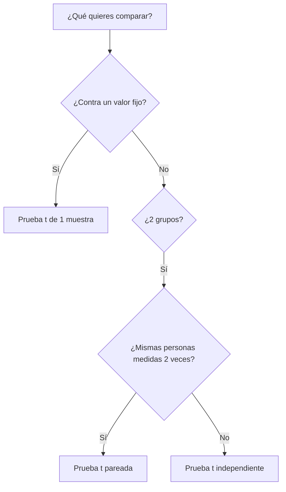

# 📊 Semana 1: Introducción a Estadística y Pruebas de Hipótesis

## 📚 Módulo 1 - Parte 1

---

## 🎯 Objetivos de Aprendizaje

Al finalizar esta semana, serás capaz de:
- ✅ Calcular e interpretar medidas de tendencia central y dispersión
- ✅ Realizar pruebas de hipótesis para una muestra (t de Student)
- ✅ Realizar pruebas de hipótesis para dos muestras (independientes y pareadas)
- ✅ Interpretar p-values y tomar decisiones estadísticas
- ✅ Crear visualizaciones efectivas con Python (histogramas, boxplots)
- ✅ Aplicar estadística a problemas de negocios reales

---

## 📅 Plan por Día (4 clases × 2 horas)

### **📌 Clase 1: Introducción a Estadística Descriptiva** (2 horas)

**Contenido:**
- 🔹 Bienvenida al curso y expectativas (15 min)
- 🔹 Notebook: [01_introduccion_estadistica.ipynb](notebooks/01_introduccion_estadistica.ipynb) (45 min)
  - Exploración de datasets con pandas
  - Análisis descriptivo básico
  - Visualizaciones iniciales
- 🔹 Inicio de Notebook: [02_medidas_tendencia_central.ipynb](notebooks/02_medidas_tendencia_central.ipynb) (45 min)
  - Media, mediana, moda
  - Interpretación y comparación
- 🔹 Cierre y Q&A (15 min)

**📚 Material para revisar en casa:**
- Completar Notebook 02 (secciones 3-7)
- Ejercicio opcional: [ejercicio_medidas_tendencia.ipynb](ejercicios/ejercicio_medidas_tendencia.ipynb)

**🎮 Actividad de Equipo Opcional:**

<details>
<summary><b>💡 IA EXPLAINER BATTLE: ¿Quién explica mejor?</b> (15 min) ⚠️ OPCIONAL - A DISCRECIÓN DEL PROFESOR</summary>

**Objetivo:** Comparar cómo diferentes IAs explican conceptos estadísticos

**Equipos:** 3-4 personas

**Instrucciones:**
1. **Dividir herramientas** (2 min):
   - Equipo A: ChatGPT
   - Equipo B: Gemini
   - Equipo C: Claude
   - Equipo D: DeepSeek (si hay 4+ equipos)

2. **Hacer la misma pregunta** (5 min):
   ```
   Prompt: "Explica la diferencia entre media y mediana usando un
   ejemplo del mundo real relacionado con salarios. ¿En qué situación
   usarías cada una? Hazlo en menos de 100 palabras."
   ```

3. **Comparar respuestas** (5 min):
   - ¿Cuál fue más clara?
   - ¿Cuál dio mejor ejemplo?
   - ¿Cuál fue más precisa técnicamente?

4. **Conclusión grupal** (3 min):
   - Cada equipo comparte: "Nuestra IA dijo... y nos gustó/no gustó porque..."
   - Votar: ¿Qué IA ganó?

**Entregable:** Una diapositiva o mensaje en chat con la respuesta ganadora + por qué

**Beneficios:**
- ✅ Aprenden a usar IA como herramienta de estudio
- ✅ Practican pensamiento crítico (no toda salida de IA es perfecta)
- ✅ Concepto estadístico reforzado con múltiples explicaciones

</details>

---

### **📌 Clase 2: Medidas de Dispersión y Visualización** (2 horas)

**Contenido:**
- 🔹 Repaso rápido de Clase 1 (10 min)
- 🔹 Notebook 02 - Continuación (50 min):
  - Varianza y desviación estándar
  - Cuartiles e IQR
  - Detección de outliers
  - Comparación entre grupos
- 🔹 Práctica guiada: Crear visualizaciones efectivas (45 min)
  - Histogramas
  - Boxplots
  - Interpretación de gráficos
- 🔹 Q&A y cierre (15 min)

**📚 Material para revisar en casa:**
- Leer inicio de Notebook 03 (secciones 1-3)
- Repasar conceptos de hipótesis nula y alternativa

**🎮 Actividad de Equipo Opcional:**

<details>
<summary><b>📊 VISUALIZACIÓN CHALLENGE: IA vs Humano</b> (20 min) ⚠️ OPCIONAL - A DISCRECIÓN DEL PROFESOR</summary>

**Objetivo:** Generar gráficos con IA y evaluar calidad críticamente

**Equipos:** 3-4 personas

**Instrucciones:**
1. **Dataset:** Usar `ejemplo_satisfaccion_clientes.csv` (ya cargado en clase)

2. **Pedir a IA que genere código de gráfico** (7 min):
   ```
   Prompt para ChatGPT/Gemini/Claude:
   "Genera código Python para crear un boxplot comparativo de
   'satisfaccion' por 'area' usando matplotlib y seaborn.
   El gráfico debe tener título, etiquetas claras y colores
   profesionales."
   ```

3. **Ejecutar el código** (3 min):
   - Copiar en Colab
   - Ejecutar
   - Captura de pantalla del resultado

4. **Crítica en equipo** (7 min):
   - ✅ ¿Qué está bien? (colores, etiquetas, claridad)
   - ❌ ¿Qué falta? (leyenda, grid, escala)
   - 🔧 ¿Cómo mejorarías el prompt?

5. **Compartir** (3 min):
   - Mostrar gráfico generado
   - Conclusión: "La IA hizo bien X pero falló en Y"

**Entregable:** Captura de pantalla del gráfico + 2 mejoras sugeridas

**Beneficios:**
- ✅ Aprenden que IA genera código útil pero necesita validación
- ✅ Practican ingeniería de prompts
- ✅ Refuerzan conceptos de visualización

</details>

---

### **📌 Clase 3: Pruebas de Hipótesis (1 y 2 Muestras)** (2 horas)

**Contenido:**
- 🔹 Introducción a pruebas de hipótesis (20 min)
  - Conceptos: H₀, H₁, α, p-value
  - ¿Cuándo usar cada prueba?
- 🔹 Notebook: [03_pruebas_hipotesis_1_2_muestras.ipynb](notebooks/03_pruebas_hipotesis_1_2_muestras.ipynb) (70 min)
  - Prueba t para 1 muestra
  - Prueba t para 2 muestras independientes
  - Prueba t pareada
  - Interpretación de resultados
- 🔹 Ejercicio guiado (20 min)
- 🔹 Cierre (10 min)

**📚 Material para revisar en casa:**
- Completar Notebook 03 (secciones finales)
- Practicar con: [ejercicio_pruebas_hipotesis.ipynb](ejercicios/ejercicio_pruebas_hipotesis.ipynb)

**🎮 Actividad de Equipo Opcional:**

<details>
<summary><b>🌳 MERMAID DECISION TREE: ¿Qué prueba usar?</b> (20 min) ⚠️ OPCIONAL - A DISCRECIÓN DEL PROFESOR</summary>

**Objetivo:** Crear árbol de decisión para elegir prueba estadística correcta

**Equipos:** 3-4 personas

**Instrucciones:**
1. **Brainstorming** (5 min):
   - ¿Qué preguntas haces para elegir prueba?
   - Ejemplos: ¿Cuántos grupos? ¿Datos pareados? ¿Comparas con valor fijo?

2. **Pedir ayuda a IA** (7 min):
   ```
   Prompt para ChatGPT/Claude:
   "Crea un diagrama de flujo en sintaxis Mermaid que ayude a
   decidir entre:
   - Prueba t de 1 muestra
   - Prueba t de 2 muestras independientes
   - Prueba t pareada

   El diagrama debe empezar preguntando '¿Qué quieres comparar?'
   y terminar con la prueba recomendada."
   ```

3. **Visualizar en Mermaid Live** (3 min):
   - Ir a [mermaid.live](https://mermaid.live/)
   - Pegar código generado
   - Ajustar si es necesario

4. **Compartir y comparar** (5 min):
   - Proyectar diagramas de cada equipo
   - Votar: ¿Cuál es más claro?
   - Consensuar un diagrama "oficial" del grupo

**Entregable:** Link a Mermaid Live o screenshot del diagrama

**Ejemplo de salida esperada:**


**Beneficios:**
- ✅ Diagrama visual ayuda a memorizar
- ✅ Aprenden Mermaid (útil para documentación)
- ✅ Trabajo colaborativo con IA

</details>

---

### **📌 Clase 4: Workshop y Revisión** (2 horas)

**Contenido:**
- 🔹 Repaso de conceptos clave (20 min)
  - Medidas de tendencia y dispersión
  - Interpretación de p-values
  - Cuándo usar cada prueba
- 🔹 Introducción al Workshop 1 (15 min)
  - Explicación de entregables
  - Revisión de rúbrica
  - Estructura MEAL (bonus)
- 🔹 Tiempo de trabajo en clase (70 min)
  - Estudiantes trabajan en Workshop 1
  - Profesor circula para resolver dudas
  - Peer review en parejas
- 🔹 Cierre y próximos pasos (15 min)

**📚 Tarea para entregar:**
- **Workshop 1:** [workshop1_plantilla.ipynb](ejercicios/workshop1_plantilla.ipynb)
- **Fecha límite:** Ver calendario del curso
- **Valor:** 10% de la calificación final

**🎮 Actividad de Equipo Opcional:**

<details>
<summary><b>⚔️ DEBATE: Correlación ≠ Causalidad</b> (20 min) ⚠️ OPCIONAL - A DISCRECIÓN DEL PROFESOR</summary>

**Objetivo:** Entender profundamente la diferencia entre correlación y causalidad

**Equipos:** 2 grandes grupos (mitad de la clase cada uno)

**Instrucciones:**
1. **Caso provocador** (3 min):
   - Profesor presenta: "Estudiantes que usan ChatGPT tienen calificaciones 15% más altas"
   - Pregunta: ¿ChatGPT CAUSA mejores calificaciones?

2. **Preparación de argumentos** (7 min):
   - **Grupo A (Correlación):** Argumenta que es solo correlación
     - Buscar con IA: "Dame 3 variables confusoras que podrían explicar..."
   - **Grupo B (Causalidad):** Argumenta que SÍ hay relación causal
     - Buscar con IA: "Dame 3 mecanismos por los cuales ChatGPT podría causar..."

3. **Debate** (8 min):
   - Cada grupo presenta (3 min c/u)
   - Réplica (1 min c/u)

4. **Resolución** (2 min):
   - Profesor explica: Variables confusoras, diseño experimental vs observacional
   - Conclusión: "Correlación es el primer paso, causalidad requiere experimento"

**Entregable:** Cada equipo escribe en chat:
- 2 variables confusoras identificadas
- 1 conclusión del debate

**Beneficios:**
- ✅ Concepto crítico para análisis de datos
- ✅ Práctica de pensamiento crítico
- ✅ Divertido y participativo

</details>

---

## 📁 Estructura de la Semana

```
Semana1/
├── README.md                                    # Este archivo
├── notebooks/
│   ├── 01_introduccion_estadistica.ipynb       # Clase 1: Conceptos básicos
│   ├── 02_medidas_tendencia_central.ipynb      # Clase 1-2: Medidas descriptivas
│   └── 03_pruebas_hipotesis_1_2_muestras.ipynb # Clase 3: Pruebas estadísticas
├── ejercicios/
│   ├── ejercicio_medidas_tendencia.ipynb       # Práctica opcional
│   ├── ejercicio_pruebas_hipotesis.ipynb       # Práctica opcional
│   ├── ejercicio_satisfaccion_ong.ipynb        # Práctica opcional
│   └── workshop1_plantilla.ipynb               # ⭐ ENTREGABLE - 10% calificación
├── ejercicios_extra/
│   ├── practica_ong_estadistica_basica.ipynb   # Práctica adicional (ONG)
│   └── practica_ong_estadistica_basica_SOLUCIONES.ipynb
├── datos/
│   ├── ejemplo_satisfaccion_clientes.csv       # Dataset para clases
│   ├── student-alcohol-consumption.csv         # Dataset para Workshop 1
│   ├── fundacion_esperanza_donadores.csv       # Dataset ONG (1000 registros)
│   └── CODEBOOK_fundacion_esperanza.md         # Documentación dataset ONG
└── workshop/
    └── README.md                                # Guía del workshop
```

---

## 📊 Entregables de la Semana

### **🎯 Workshop 1: Análisis Estadístico Básico**

**Archivo:** [workshop1_plantilla.ipynb](ejercicios/workshop1_plantilla.ipynb)
**Dataset:** `student-alcohol-consumption.csv` (consumo de alcohol en estudiantes portugueses)
**Valor:** 10% de la calificación final
**Fecha límite:** Ver calendario del curso

**Contenido del Workshop:**

| Sección | Descripción | Puntos |
|---------|-------------|--------|
| **Parte 1: Análisis Descriptivo** | Medidas de tendencia, dispersión, visualizaciones | 40 pts |
| **Parte 2: Prueba t (1 muestra)** | ¿Calificación promedio es diferente de 12? | 30 pts |
| **Parte 3: Prueba t (2 muestras)** | ¿Diferencia entre bajo vs alto consumo alcohol? | 30 pts |
| **BONUS: Reflexión MEAL** | Análisis académico con citaciones APA 7 | +10 pts |
| **TOTAL** | | **100 pts** (+10 bonus) |

**Lo que necesitas entregar:**
- ✅ Notebook con TODO el código ejecutado (celdas con output visible)
- ✅ TODAS las preguntas de interpretación respondidas
- ✅ Gráficos con títulos y etiquetas claras
- ✅ (Opcional) Reflexión MEAL de 300-400 palabras

**Formato de archivo:** `Workshop1_NombreApellido_Matricula.ipynb`

---

## 🔧 Herramientas Python

### **Librerías principales:**
```python
import pandas as pd              # Manipulación de datos
import numpy as np               # Operaciones numéricas
from scipy import stats          # Funciones estadísticas (t-test, etc.)
import matplotlib.pyplot as plt  # Visualización básica
import seaborn as sns            # Visualización estadística
```

### **Comandos clave:**

**Medidas de tendencia:**
```python
df['columna'].mean()    # Media
df['columna'].median()  # Mediana
df['columna'].mode()[0] # Moda
```

**Medidas de dispersión:**
```python
df['columna'].std()             # Desviación estándar
df['columna'].var()             # Varianza
df['columna'].quantile(0.25)    # Q1
df['columna'].quantile(0.75)    # Q3
```

**Pruebas de hipótesis:**
```python
# Prueba t de 1 muestra
stats.ttest_1samp(df['columna'], valor_comparacion)

# Prueba t de 2 muestras independientes
stats.ttest_ind(grupo1, grupo2)

# Prueba t pareada
stats.ttest_rel(antes, despues)
```

---

## 💡 Tips de Estudio

### **Para aprobar la semana:**

1. **📖 No memorices, entiende:**
   - No importa recordar fórmulas → Python las calcula
   - SÍ importa saber CUÁNDO usar cada prueba
   - SÍ importa INTERPRETAR resultados en contexto

2. **📊 Visualiza primero, calcula después:**
   - Siempre haz histograma/boxplot ANTES de prueba t
   - Las gráficas te dicen si hay diferencias obvias
   - Ayudan a detectar outliers que invalidan pruebas

3. **🤖 Usa IA como asistente, no como reemplazo:**
   - ✅ OK: "Explícame qué es un p-value con una analogía"
   - ✅ OK: "¿Por qué mi código da error?"
   - ❌ NO: "Dame el código completo del workshop"
   - ❌ NO: "Escribe mi reflexión MEAL"

4. **👥 Estudia en grupo:**
   - Explica conceptos a compañeros (mejor forma de aprender)
   - Compara gráficos y resultados
   - Discute interpretaciones

5. **⏰ Gestiona tu tiempo:**
   - Clase 1-2: Domina descriptiva (es la base)
   - Clase 3: Entiende pruebas de hipótesis (40% del workshop)
   - Clase 4: Termina workshop en clase (aprovecha tiempo con profesor)

---

## 🆘 Recursos de Apoyo

### **Material del curso:**
- [Semana 0: Introducción a Herramientas](../Semana0/) - Repaso de Python básico
- [CODEBOOK: Dataset ONG](datos/CODEBOOK_fundacion_esperanza.md) - Documentación completa
- [Práctica extra con ONG](ejercicios_extra/practica_ong_estadistica_basica.ipynb) - Ejercicios adicionales

### **Recursos externos:**

**Estadística:**
- [Khan Academy - Estadística](https://es.khanacademy.org/math/statistics-probability) - Videos en español
- [Stat Quest (YouTube)](https://www.youtube.com/c/joshstarmer) - Explicaciones visuales (inglés)
- [Seeing Theory](https://seeing-theory.brown.edu/es.html) - Visualizaciones interactivas

**Python:**
- [Pandas Cheat Sheet](https://pandas.pydata.org/Pandas_Cheat_Sheet.pdf) - Referencia rápida
- [SciPy Stats Documentation](https://docs.scipy.org/doc/scipy/reference/stats.html) - Funciones estadísticas
- [Seaborn Gallery](https://seaborn.pydata.org/examples/index.html) - Ejemplos de gráficos

**Para el workshop:**
- [Guía APA 7 - Citaciones](https://apastyle.apa.org/style-grammar-guidelines/citations) - Para reflexión MEAL
- [Estructura MEAL](ejercicios/workshop1_plantilla.ipynb#MEAL) - Ejemplo completo en workshop

---

## 📚 Lecturas Recomendadas (Opcional)

**Libro de texto principal:**
- Levin, R. I. & Rubin, D. S. (2010). *Estadística para administradores* (7ª ed.). Pearson.
  - **Capítulo 1:** Introducción a estadística
  - **Capítulo 2:** Medidas de tendencia central y dispersión
  - **Capítulo 8:** Pruebas de hipótesis para una muestra
  - **Capítulo 9:** Pruebas de hipótesis para dos muestras

**Complementaria:**
- Newbold, P., Carlson, W. & Thorne, B. (2013). *Estadística para administración y economía* (8ª ed.). Pearson.

---

## ❓ Preguntas Frecuentes

**P: ¿Puedo usar Excel o SPSS en lugar de Python?**
R: El curso está diseñado para Python, pero puedes usar otras herramientas para **verificar** resultados. El entregable debe ser en Python (Jupyter Notebook).

**P: ¿Qué hago si no tengo experiencia con Python?**
R:
1. Completa [Semana 0](../Semana0/) primero (2-3 horas)
2. Mira videos de Khan Academy sobre pandas
3. Copia y modifica código de los notebooks de clase
4. Pide ayuda a IA: "Explica este código línea por línea"

**P: ¿Los ejercicios opcionales cuentan para la calificación?**
R: No, pero **altamente recomendados**. Te preparan para el workshop (que sí cuenta 10%).

**P: ¿Qué pasa si no entrego el workshop a tiempo?**
R: Consulta la política de entregas tardías en el syllabus del curso.

**P: ¿Puedo trabajar el workshop en equipo?**
R: Puedes discutir conceptos, pero cada quien entrega su propio notebook. **No copies código de compañeros** - es plagio académico.

**P: ¿Cómo sé si mi interpretación de p-value es correcta?**
R: Usa este template:
> "Con un p-value de [X.XX] y α = 0.05, [rechazamos/no rechazamos] H₀. Esto significa que [interpretación en contexto del negocio]."

**P: ¿Qué son las actividades de equipo opcionales?**
R: Son actividades cortas (10-20 min) que el profesor **puede** usar en clase para reforzar conceptos de forma interactiva. No son obligatorias ni calificadas.

---

## 🚀 Próximos Pasos

**Al terminar Semana 1:**
1. ✅ Dominas estadística descriptiva
2. ✅ Sabes hacer pruebas t en Python
3. ✅ Puedes interpretar p-values
4. ✅ Has completado Workshop 1 (10% de tu calificación)

**Siguiente semana:**
- [Semana 2: Pruebas Estadísticas Avanzadas](../Semana2/)
  - Chi-cuadrada (variables categóricas)
  - ANOVA (comparar 3+ grupos)
  - Regresión lineal (predecir variables continuas)

---

## 📝 Checklist de la Semana

Marca las actividades completadas:

**Antes de Clase 1:**
- [ ] Revisé [Semana 0](../Semana0/) si necesito repaso de Python
- [ ] Tengo Google Colab funcionando
- [ ] Descargué/accedí a los notebooks

**Durante Clase 1:**
- [ ] Completé Notebook 01
- [ ] Entendí diferencia entre media/mediana/moda
- [ ] (Opcional) Participé en actividad "IA Explainer Battle"

**Entre Clase 1-2:**
- [ ] Completé Notebook 02 hasta sección 7
- [ ] Practiqué con ejercicio de medidas de tendencia

**Durante Clase 2:**
- [ ] Entendí varianza, desv. estándar, IQR
- [ ] Sé cómo detectar outliers
- [ ] Puedo crear e interpretar boxplots
- [ ] (Opcional) Participé en "Visualización Challenge"

**Entre Clase 2-3:**
- [ ] Leí introducción de Notebook 03 (conceptos de hipótesis)
- [ ] Entiendo qué es H₀ y H₁

**Durante Clase 3:**
- [ ] Sé cuándo usar prueba t de 1 muestra
- [ ] Sé cuándo usar prueba t de 2 muestras
- [ ] Puedo interpretar un p-value
- [ ] (Opcional) Creé diagrama Mermaid del árbol de decisión

**Entre Clase 3-4:**
- [ ] Completé Notebook 03
- [ ] Practiqué con ejercicio de pruebas de hipótesis

**Durante Clase 4:**
- [ ] Entendí la rúbrica del Workshop 1
- [ ] Trabajé en Workshop 1 en clase
- [ ] Resolví dudas con profesor
- [ ] (Opcional) Participé en debate correlación vs causalidad

**Después de Clase 4:**
- [ ] **Entregué Workshop 1 completo y a tiempo** ⭐

---

**¡Éxito en tu primera semana!** 📊🚀

Recuerda: La estadística no es solo matemáticas - es **tomar decisiones informadas con datos**. ¡Cada empresa necesita personas que sepan hacer esto!
