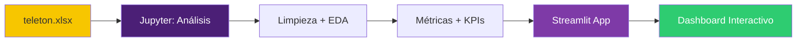
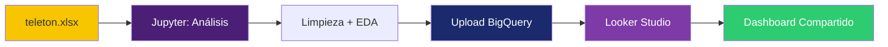

# Proyecto Reto: Dashboard Teletón

## Visualización de Datos para la Toma de Decisiones

CD2001B | Tec de Monterrey Campus Puebla

<div class="pt-12">
  <span @click="$slidev.nav.next" class="px-2 py-1 rounded cursor-pointer" hover="bg-white bg-opacity-10">
    Presiona espacio para continuar <carbon:arrow-right class="inline"/>
  </span>
</div>

---

# 🎯 Subcompetencias a Demostrar

<div class="grid grid-cols-2 gap-8 mt-8">

<div>

## SCD0104
### Análisis Descriptivo

Resume la información mediante herramientas de **estadística descriptiva** utilizando soluciones tecnológicas actuales.

✅ Media, mediana, moda
✅ Desviación estándar
✅ Rango, IQR
✅ Identificación de outliers

</div>

<div>

## SCD0105
### Gráficos Dinámicos

Genera gráficos dinámicos acordes a las **escalas de las variables**, asegurándose que muestran información relevante para la **toma de decisiones**.

✅ Dashboards interactivos
✅ Filtros dinámicos
✅ Visualizaciones apropiadas
✅ Paleta de colores efectiva

</div>

</div>

---

# 📊 El Dataset: Fundación Teletón

## Encuesta de Satisfacción a Empresas Benefactoras

<div class="mt-8">

### Características del Dataset

- **📏 Dimensiones:** 274 registros × 21 variables
- **🗓️ Temporal:** Encuestas 2025 (Marca temporal)
- **🎯 Objetivo:** Evaluar calidad del servicio de promotores

### Estructura de Variables

<div class="grid grid-cols-3 gap-4 mt-6">

<div class="border-2 border-yellow-400 p-4 rounded">

**Calidad Servicio**
13 dimensiones
Escala Likert 1-5

</div>

<div class="border-2 border-purple-600 p-4 rounded">

**Satisfacción**
3 indicadores
Escala 1-10

</div>

<div class="border-2 border-blue-500 p-4 rounded">

**Contexto**
Giro, Estado, Puesto
Años de relación

</div>

</div>

</div>

---
layout: two-cols
---

# 🔍 Variables del Dataset

## Dimensiones Calidad Servicio (1-5)

1. Apariencia y comportamiento promotor
2. Claridad de procedimientos
3. Cumplimiento de horarios
4. Conocimiento y competencia
5. Información clara primer contacto
6. Rapidez de respuesta
7. Disposición para ayudar
8. Flexibilidad ante imprevistos
9. Actitud comprensiva
10. Tiempo dedicado
11. Preocupación por situación
12. Atención personalizada
13. Adaptación a circunstancias

::right::

## Indicadores Clave (1-10)

<div class="mt-8">

**Satisfacción General**
"Mi nivel de satisfacción en la colaboración"

**Net Promoter Score (NPS)**
"Recomendaría ser benefactor"

**Calidad Percibida**
"Percibo que la calidad del servicio es"

**Transparencia**
"Nos sentimos informados sobre uso de recursos"

</div>

## Variables Contextuales

- Años como benefactor
- Giro de la empresa
- Puesto del encuestado
- Estado de la república

---

# 📈 Medidas Estadísticas Requeridas

<div class="grid grid-cols-2 gap-8 mt-8">

<div>

## Tendencia Central

### Media Aritmética
Promedio simple de los datos

### Media Ponderada
Considera diferentes pesos por variable

### Media Geométrica
Para tasas de crecimiento/cambio

### Mediana
Valor central, resistente a outliers

### Moda
Valor más frecuente

</div>

<div>

## Dispersión

### Rango
Diferencia entre máximo y mínimo

### Desviación Estándar
Variabilidad promedio respecto a la media

### Varianza
Desviación estándar al cuadrado

### Rango Intercuartílico (IQR)
Q3 - Q1, identifica outliers

### Coeficiente de Variación
Dispersión relativa (%)

</div>

</div>

---

# 🎨 Paleta de Colores: Identidad Teletón

<div class="mt-8">

## Paleta Principal

<div class="grid grid-cols-3 gap-4">

<div class="p-6 rounded text-center" style="background: #F7C600; color: #2D3436;">
<div class="text-3xl font-bold">#F7C600</div>
<div class="mt-2">Amarillo Teletón</div>
<div class="text-sm">Uso: Títulos, highlights</div>
</div>

<div class="p-6 rounded text-center" style="background: #4B1F76; color: white;">
<div class="text-3xl font-bold">#4B1F76</div>
<div class="mt-2">Morado Profundo</div>
<div class="text-sm">Uso: Headers, gráficos principales</div>
</div>

<div class="p-6 rounded text-center" style="background: #7E3AA7; color: white;">
<div class="text-3xl font-bold">#7E3AA7</div>
<div class="mt-2">Morado Medio</div>
<div class="text-sm">Uso: Gráficos secundarios</div>
</div>

</div>

## Colores de Acento

<div class="grid grid-cols-5 gap-2 mt-6">

<div class="p-4 rounded text-center text-white" style="background: #D7268F;">
<div class="font-bold">#D7268F</div>
<div class="text-xs">Magenta</div>
</div>

<div class="p-4 rounded text-center text-white" style="background: #1A2A6C;">
<div class="font-bold">#1A2A6C</div>
<div class="text-xs">Azul</div>
</div>

<div class="p-4 rounded text-center text-white" style="background: #F39C12;">
<div class="font-bold">#F39C12</div>
<div class="text-xs">Naranja</div>
</div>

<div class="p-4 rounded text-center text-white" style="background: #2ECC71;">
<div class="font-bold">#2ECC71</div>
<div class="text-xs">Verde</div>
</div>

<div class="p-4 rounded text-center text-white" style="background: #E74C3C;">
<div class="font-bold">#E74C3C</div>
<div class="text-xs">Rojo</div>
</div>

</div>

</div>

---

# 🎨 Paleta de Colores: Neutros

<div class="mt-8">

## Colores Neutros (Backgrounds, Texto, Bordes)

<div class="grid grid-cols-5 gap-4">

<div class="p-6 rounded text-center border-2" style="background: #FFFFFF; color: #2D3436;">
<div class="font-bold">#FFFFFF</div>
<div class="text-sm">Blanco</div>
<div class="text-xs mt-2">Fondo principal</div>
</div>

<div class="p-6 rounded text-center" style="background: #F5F5F5; color: #2D3436;">
<div class="font-bold">#F5F5F5</div>
<div class="text-sm">Gris claro</div>
<div class="text-xs mt-2">Fondo cards</div>
</div>

<div class="p-6 rounded text-center" style="background: #DDDDDD; color: #2D3436;">
<div class="font-bold">#DDDDDD</div>
<div class="text-sm">Gris medio</div>
<div class="text-xs mt-2">Bordes</div>
</div>

<div class="p-6 rounded text-center text-white" style="background: #7F8C8D;">
<div class="font-bold">#7F8C8D</div>
<div class="text-sm">Gris oscuro</div>
<div class="text-xs mt-2">Texto secundario</div>
</div>

<div class="p-6 rounded text-center text-white" style="background: #2D3436;">
<div class="font-bold">#2D3436</div>
<div class="text-sm">Negro suave</div>
<div class="text-xs mt-2">Texto principal</div>
</div>

</div>

## 🔤 Tipografía Recomendada

<div class="mt-8 grid grid-cols-2 gap-6">

<div class="border-2 border-purple-600 p-4 rounded">

### Poppins (Recomendada ✅)
- **Títulos:** 700 (Bold)
- **Subtítulos:** 500 (Medium)
- **Cuerpo:** 300 (Light)

Combina perfectamente con morados y amarillos.

</div>

<div class="border-2 border-gray-400 p-4 rounded">

### Alternativas
- **Montserrat:** Corporativa, elegante
- **Nunito:** Friendly, redondeada
- **Inter:** Dashboards, súper legible

</div>

</div>

</div>

---

# ⚠️ Reglas de Uso de Color

<div class="mt-8">

## ✅ Haz Esto

<div class="grid grid-cols-2 gap-6">

<div class="border-2 border-green-500 p-4 rounded">

**Usa color para dimensiones relevantes**
- Un color por categoría (estado, giro)
- Gradientes para valores numéricos
- Amarillo para destacar métricas clave

</div>

<div class="border-2 border-green-500 p-4 rounded">

**Mantén consistencia**
- Mismo color = misma categoría
- Máximo 5-7 colores distintos
- Usa neutros para reducir ruido visual

</div>

</div>

## ❌ Evita Esto

<div class="grid grid-cols-2 gap-6 mt-4">

<div class="border-2 border-red-500 p-4 rounded">

**Muchos colores sin significado**
- Rainbow charts sin propósito
- Colores brillantes sin contraste
- Más de 7 categorías coloreadas

</div>

<div class="border-2 border-red-500 p-4 rounded">

**Mala accesibilidad**
- Texto amarillo sobre blanco
- Rojo/verde sin alternativa
- Bajo contraste en general

</div>

</div>

</div>

---
layout: two-cols
---

# 🛤️ Dos Rutas para el Proyecto

## Elige UNA ruta según tus habilidades

<div class="mt-8">

### 🐍 Ruta 1: Python + Streamlit
**Para estudiantes que prefieren programación**

**Ventajas:**
- ✅ Control total sobre visualizaciones
- ✅ Lógica personalizada
- ✅ Portafolio de código
- ✅ Fácil de versionar (Git)

**Desventajas:**
- ❌ Requiere más código
- ❌ Necesitas servidor para deployment
- ❌ Curva de aprendizaje Streamlit

</div>

::right::

<div class="mt-8">

### 📊 Ruta 2: Python + Looker Studio
**Para estudiantes que prefieren herramientas visuales**

**Ventajas:**
- ✅ Interface drag-and-drop
- ✅ Hosting automático (Google)
- ✅ Fácil de compartir
- ✅ Colaboración en tiempo real

**Desventajas:**
- ❌ Menos control programático
- ❌ Requiere cuenta Google
- ❌ Setup BigQuery inicial complejo

</div>

---

# 🐍 Ruta 1: Python → Streamlit

## Flujo de Trabajo



## Archivos que Crearás

1. **`01_analisis_exploratorio.ipynb`** - EDA completo
2. **`02_preparacion_streamlit.ipynb`** - Preprocesamiento
3. **`streamlit/app.py`** - Dashboard interactivo
4. **`requirements.txt`** - Dependencias Python

## Entregables

- Jupyter notebooks con análisis + conclusiones
- App Streamlit funcionando localmente
- Documento PDF con hallazgos clave

---

# 📊 Ruta 2: Python → Looker Studio

## Flujo de Trabajo



## Archivos que Crearás

1. **`01_analisis_exploratorio.ipynb`** - EDA completo
2. **`03_preparacion_looker.ipynb`** - Prep BigQuery
3. **Dashboard en Looker Studio** (online)
4. **Script de permisos IAM** - Compartir con @tec.mx

## Entregables

- Jupyter notebooks con análisis + conclusiones
- Link a dashboard Looker Studio
- Documento PDF con hallazgos clave

---

# 📊 Visualizaciones Obligatorias

<div class="grid grid-cols-2 gap-6 mt-4">

<div>

## Para Variables Numéricas

### Histogramas
- Distribución de satisfacción (1-10)
- Distribución de años como benefactor
- Distribución calidad servicio (1-5)

### Boxplots
- Outliers por estado
- Outliers por giro empresa
- Comparación satisfacción por categoría

### Polígonos de Frecuencia
- Tendencias temporales
- Comparación distribuciones

</div>

<div>

## Para Variables Categóricas

### Gráficos de Barras
- Benefactores por estado
- Benefactores por giro
- Distribución por puesto

### Treemap
- Proporción por giro empresa
- Proporción por estado

### Mapas Geográficos
- Heatmap de benefactores por estado
- Distribución geográfica satisfacción

</div>

</div>

## Visualizaciones Avanzadas

- **Heatmap de correlación** entre 13 dimensiones calidad
- **Gauge charts** para KPIs vs. objetivos
- **Scatter plots** para relaciones bivariadas

---

# 📊 KPIs del Dashboard

<div class="grid grid-cols-3 gap-4 mt-8">

<div class="border-2 border-yellow-400 p-4 rounded">

## KPI 1
### Satisfacción General

**Fórmula:**
Media de columna 14

**Meta:** ≥ 8.0

**Visualización:**
Gauge chart con colores:
- Verde: 8-10
- Amarillo: 6-8
- Rojo: < 6

</div>

<div class="border-2 border-purple-600 p-4 rounded">

## KPI 2
### Net Promoter Score

**Fórmula:**
% (9-10) - % (1-6)

**Escala:** -100 a +100

**Visualización:**
Número grande con trend
- Verde: > 50
- Amarillo: 0-50
- Rojo: < 0

</div>

<div class="border-2 border-blue-500 p-4 rounded">

## KPI 3
### Calidad Servicio

**Fórmula:**
Media columnas 2-13

**Escala:** 1-5

**Visualización:**
Barra horizontal
- Verde: 4-5
- Amarillo: 3-4
- Rojo: < 3

</div>

</div>

<div class="grid grid-cols-3 gap-4 mt-4">

<div class="border-2 border-green-500 p-4 rounded">

## KPI 4
### Transparencia

Media columna 17
Escala 1-10

</div>

<div class="border-2 border-orange-500 p-4 rounded">

## KPI 5
### Antigüedad Promedio

Media columna 18
En años

</div>

<div class="border-2 border-red-500 p-4 rounded">

## KPI 6
### Calidad Percibida

Media columna 16
Escala 1-10

</div>

</div>

---

# 🎯 Estructura del Dashboard

## Sección 1: Header con KPIs Principales

<div class="grid grid-cols-4 gap-2 mt-4 text-xs">
<div class="p-3 bg-yellow-400 rounded text-center">Satisfacción: 8.2</div>
<div class="p-3 bg-purple-600 text-white rounded text-center">NPS: +45</div>
<div class="p-3 bg-blue-600 text-white rounded text-center">Calidad: 4.1/5</div>
<div class="p-3 bg-green-600 text-white rounded text-center">Años: 7.3</div>
</div>

## Sección 2: Perfil de Benefactores

<div class="grid grid-cols-3 gap-4 mt-4">
<div class="border p-3 rounded">📊 Gráfico de barras: Giro empresa</div>
<div class="border p-3 rounded">🗺️ Mapa: Distribución por estado</div>
<div class="border p-3 rounded">👥 Treemap: Puesto encuestado</div>
</div>

## Sección 3: Calidad del Servicio (13 Dimensiones)

<div class="mt-4 border p-3 rounded">
📊 Heatmap de correlación + Barras horizontales comparativas
</div>

## Sección 4: Satisfacción y Lealtad

<div class="grid grid-cols-2 gap-4 mt-4">
<div class="border p-3 rounded">📈 Histograma satisfacción general</div>
<div class="border p-3 rounded">📊 Distribución NPS</div>
</div>

## Sección 5: Análisis Temporal

<div class="mt-4 border p-3 rounded">
📉 Línea: Satisfacción por años de relación
</div>

---

# 🔧 Setup Inicial: Ambas Rutas

## Requisitos Previos

<div class="grid grid-cols-2 gap-6 mt-8">

<div class="border-2 border-purple-600 p-4 rounded">

### Para Ruta 1 (Streamlit)

**Software:**
- Python 3.8+ instalado
- Jupyter Notebook / VS Code
- Git (opcional, recomendado)

**Librerías:**
```bash
pip install pandas numpy
pip install matplotlib seaborn plotly
pip install streamlit
pip install openpyxl
```

</div>

<div class="border-2 border-blue-600 p-4 rounded">

### Para Ruta 2 (Looker)

**Software:**
- Python 3.8+ instalado
- Jupyter Notebook / VS Code
- Cuenta Google (personal o @tec.mx)

**Librerías:**
```bash
pip install pandas numpy
pip install matplotlib seaborn
pip install google-cloud-bigquery
pip install openpyxl
```

</div>

</div>

## Descarga de Materiales

1. Dataset: `teleton.xlsx` (disponible en Canvas)
2. Notebooks plantilla (carpeta `jupyter/`)
3. Estos slides (carpeta `slides/`)

---

# 📝 Rúbrica de Evaluación

<div class="mt-4">

| Criterio | Ponderación | Descripción |
|----------|-------------|-------------|
| **Análisis Descriptivo** | 30% | Cálculo correcto de todas las medidas estadísticas requeridas |
| **Visualizaciones** | 25% | Gráficos apropiados, legibles, con paleta correcta |
| **Dashboard Funcional** | 25% | Dashboard interactivo, filtros funcionando, diseño limpio |
| **Conclusiones** | 15% | Hallazgos relevantes, interpretación correcta, recomendaciones |
| **Documentación** | 5% | Código comentado, notebooks ejecutables, README claro |

</div>

## Entregables en eLumen

1. **Jupyter Notebooks** (.ipynb ejecutados con outputs visibles)
2. **Dashboard** (link Streamlit/Looker O video demo)
3. **Documento Conclusiones** (PDF, máx 5 páginas)
4. **Código fuente** (ZIP con todo el proyecto)

**Fecha de entrega:** Semana 4 (consultar Canvas)

---

# ✅ Checklist Antes de Entregar

<div class="grid grid-cols-2 gap-6 mt-8">

<div>

## Análisis en Jupyter

- [ ] Notebook con todas las celdas ejecutadas
- [ ] Cálculo de media, mediana, moda para cada variable relevante
- [ ] Desviación estándar y rango para variables numéricas
- [ ] IQR e identificación de outliers
- [ ] Gráficos exploratorios (histogramas, boxplots)
- [ ] Comentarios explicando cada sección
- [ ] Conclusiones preliminares al final

</div>

<div>

## Dashboard

- [ ] Todos los KPIs visibles en header
- [ ] Visualizaciones de cada sección funcionando
- [ ] Filtros interactivos (estado, giro, años)
- [ ] Paleta de colores Teletón aplicada
- [ ] Tipografía Poppins (o alternativa moderna)
- [ ] Dashboard responsive (se ve bien en diferentes tamaños)
- [ ] Sin errores en consola/logs

</div>

</div>

## Documento de Conclusiones

- [ ] Resumen ejecutivo (1 párrafo)
- [ ] Hallazgos clave (3-5 insights principales)
- [ ] Recomendaciones accionables para Teletón
- [ ] Limitaciones del análisis
- [ ] Referencias (si usaste fuentes externas)

---

# 💡 Tips para el Éxito

<div class="grid grid-cols-2 gap-6 mt-8">

<div class="border-2 border-green-500 p-4 rounded">

## ✅ Haz Esto

- **Empieza temprano** - El setup inicial puede tomar tiempo
- **Valida tus datos** - Revisa que no haya errores de lectura
- **Itera tu dashboard** - Primera versión simple, luego mejora
- **Prueba con filtros** - Asegúrate que filtros afecten todos los gráficos
- **Pide feedback** - Muestra tu dashboard a compañeros/profesor
- **Documenta tu proceso** - Comentarios en código ayudan a evaluar
- **Usa Git** - Versiona tu trabajo para no perder progreso

</div>

<div class="border-2 border-red-500 p-4 rounded">

## ❌ Evita Esto

- **Procrastinar** - No dejes todo para el último día
- **Copiar código sin entender** - Asegúrate de comprender qué hace
- **Dashboards sobrecargados** - Menos es más en visualización
- **Ignorar la paleta** - Los colores importan para la marca
- **Gráficos inapropiados** - Pie charts para series temporales, etc.
- **No probar edge cases** - ¿Qué pasa si filtras por un solo estado?
- **Entregar sin revisar** - Siempre ejecuta todo de nuevo antes de entregar

</div>

</div>

---

# 🆘 Recursos de Ayuda

<div class="mt-8">

## Documentación Oficial

- **Streamlit:** https://docs.streamlit.io
- **Plotly:** https://plotly.com/python/
- **Looker Studio:** https://support.google.com/looker-studio
- **BigQuery:** https://cloud.google.com/bigquery/docs

## Tutoriales Recomendados

- **Streamlit Tutorial:** https://streamlit.io/gallery
- **BigQuery Python Client:** https://cloud.google.com/python/docs/reference/bigquery/latest
- **Data Visualization Best Practices:** https://www.storytellingwithdata.com

## Soporte del Curso

- **Horario de oficina:** [Ver Canvas]
- **Foro de dudas:** Canvas Discussions
- **Email:** [Profesor]

</div>

---
layout: center
class: text-center
---

# ¡Adelante con tu Proyecto! 🚀

## Recuerda

<div class="mt-8 text-2xl">

📊 **Análisis riguroso** + 🎨 **Diseño efectivo** = 💡 **Insights accionables**

</div>

<div class="mt-12">

**¿Preguntas?**

Revisa los notebooks de ejemplo en la carpeta `jupyter/`
y el código de referencia en `streamlit/` o `looker/`

</div>

<div class="mt-8 text-sm opacity-75">

CD2001B | Tec de Monterrey Campus Puebla | 2025

</div>
