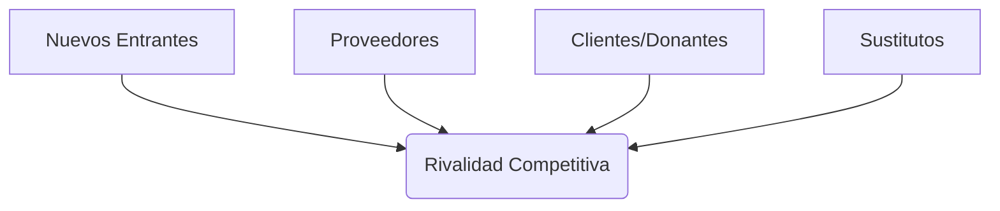

# Slide2_Herramientas_Medicion

> **Curso:** CD2001B - Diagnóstico para Líneas de Acción
> **Tecnológico de Monterrey - Campus Puebla**

---

# Administración Estratégica en ONGs
## Parte 2: Herramientas de Diagnóstico y Medición

    CD2001B - Semana 3 | Sesión 2 (2 Horas)

  Enfoque: Fundación Teletón

---

# 1. Contexto Histórico: Los Gigantes de la Estrategia
## ¿De dónde vienen estas herramientas?

---

# Harvard Business School: La Cuna de la Estrategia

### Michael Porter (1947-)
**"El Padre de la Estrategia Moderna"**
- Profesor en Harvard.
- En 1979 revolucionó el campo con las **5 Fuerzas**.
- Antes de él, la estrategia era "arte"; él le dio **rigor económico**.
- **Concepto Clave:** Ventaja Competitiva.

### Clayton Christensen (1952-2020)
**"El Dilema del Innovador" (1997)**
- Explicó por qué las grandes empresas fallan.
- **Disrupción:** Innovaciones baratas que al principio parecen "malas" (ej. Netflix vs Blockbuster).
- **Lección para Teletón:** ¿Quién podría "disrumpir" la caridad tradicional? (ej. GoFundMe).

---

# 2. Objetivos Estratégicos y KPIs
## Lo que no se mide, no se mejora

---

# ¿Qué son los Objetivos Estratégicos?

Son las metas de mediano y largo plazo que la organización busca alcanzar para cumplir su misión.

### Metodología SMART
Para que un objetivo sea útil, debe cumplir 5 criterios:

**S**pecific
(Específico)

**M**easurable
(Medible)

**A**chievable
(Alcanzable)

**R**elevant
(Relevante)

**T**ime-bound
(Temporal)

---

# Objetivos SMART en Teletón

### ❌ Objetivo Vago
"Ayudar a más niños."

¿Cuántos? ¿Con qué presupuesto? ¿Cuándo?

### ✅ Objetivo SMART (Basado en Reportes)
"Garantizar la rehabilitación de **menores de 18 años** destinando **$900 millones de pesos** para el ejercicio 2025, manteniendo la certificación de calidad." [1]

- **S**pecific: Rehabilitación menores 18 años
- **M**easurable: $900 millones
- **A**chievable: Respaldado por inversiones ($1.8MM en 2023)
- **R**elevant: Core del negocio
- **T**ime-bound: Ejercicio 2025

[1] Contralínea (2024). [Inversiones de Fundación Teletón para 2025](https://contralinea.com.mx/interno/semana/teleton-invierte-1-8-mil-millones-de-donaciones-en-instrumentos-financieros/).

---

# ¿Qué son los KPIs?

**Key Performance Indicators (Indicadores Clave de Desempeño)**

Son métricas cuantificables que nos dicen si estamos cumpliendo los objetivos.

### Características de un buen KPI
- **Cuantificable:** Número, %, $
- **Accionable:** Si cambia, sé qué hacer.
- **Simple:** Fácil de entender.

### Tus KPIs del Dashboard (Teletón)

| KPI | Definición | Valor Actual (Tu Dashboard) | Contexto Estratégico |
|-----|------------|---------------------------|-------------------|
| **NPS** | `% Promotores - % Detractores` | **+40** (Bueno) | Contrarresta la "fatiga del donante". |
| **Transparencia** | Percepción (1-10) | **79%** (Alto) | Clave para mantener estatus SAT. |
| **Índice Calidad** | Promedio Dimensiones | **73%** (Aceptable) | Evidencia contra críticas de "mal trato". |
| **Responsiveness** | Rapidez de respuesta | **3.60/5** (Bajo) | **¡Alerta Roja!** El punto débil a mejorar. |

**Insight del Dashboard:**
Aunque el NPS es positivo (+40), la dimensión de **Responsiveness** (3.60) es un "foco rojo". Sin tu dashboard, Teletón seguiría creyendo que todo es perfecto.

---

# 💡 ¿Por Qué SMART y KPIs Son Indispensables?

### Sin Medición = Sin Accountability (Rendición de Cuentas)
- Teletón maneja dinero de donantes. ¿Cómo demuestra que lo usa bien?
- **KPIs** son la evidencia objetiva.

**Ejemplo:**
Si el NPS bajó de 70 a 50, eso significa que **perdieron palanca para recaudar**. Sin el KPI, nadie lo sabría hasta que sea tarde.

### Objetivos SMART = Alineación
- Si el director de Marketing dice "vamos bien" pero el CFO dice "vamos mal", ¿quién tiene razón?
- Los **SMART** evitan esa ambigüedad.

---

---

---

# 3. Las 5 Fuerzas de Porter
## Análisis de la Industria (Michael Porter, 1979)

---

# ¿Qué son las 5 Fuerzas de Porter?

Es un modelo para analizar el nivel de **competencia** dentro de una industria y qué tan atractiva (rentable) es.

En el sector **No Lucrativo**, la "rentabilidad" se mide en **capacidad de captar fondos e impacto**.

---

# Porter Aplicado: ¿Quién compite con Teletón?

### 1. Rivalidad (Competencia)
**Alta.**
Cruz Roja, Cáritas, Fundaciones Corporativas.
**Dato:** Hay más de 9,000 donatarias en México compitiendo por el mismo dinero.

### 2. Nuevos Entrantes
**Media.**
Nuevas ONGs digitales (Crowdfunding) o movimientos sociales espontáneos (ej. sismos).

### 3. Sustitutos
**Muy Alta (Crítica ONU).**
**El Estado.**
Si el gobierno mejora el sistema de salud pública, Teletón pierde relevancia [2].

### 4. Proveedores
**Medio.**
Proveedores de tecnología médica especializada. Inflación médica es alta.

### 5. Clientes (Donantes)
**Muy Alto.**
Las empresas exigen recibos deducibles y reportes.
**Evidencia:** Tu dashboard muestra que las **Empresas** son el segmento MENOS satisfecho (**NPS +29** vs +40 promedio). Son exigentes y castigan la falta de atención.

[2] ONU (2014). [Observaciones finales sobre el informe inicial de México](https://tbinternet.ohchr.org/_layouts/15/treatybodyexternal/Download.aspx?symbolno=CRPD%2fC%2fMEX%2fCO%2f1&Lang=en).

---

# 💡 ¿Por Qué Analizar con Porter?

### Decisiones de Inversión
- Si la **Fuerza de Sustitutos** es alta (el Estado puede reemplazar a Teletón), ¿deberían seguir construyendo CRITs o buscar otro modelo?
- Porter ayuda a responder esa pregunta.

### Entender el "Juego"
- ¿Por qué Teletón gasta tanto en branding?
- Porque en una industria con **9,000 competidores** (donatarias), quien tiene la marca más fuerte gana.
- Porter explica el "por qué" detrás de las tácticas.

**Reflexión:** Porter no es "teoría". Es la forma en que McKinsey analiza industrias antes de recomendar qué hacer.

---

---

# 🔍 Perspectiva Crítica: ¿Cuándo Fallan los KPIs?
## La Ley de Goodhart

### "Cuando una medida se convierte en objetivo, deja de ser una buena medida."

**El Riesgo en Teletón:**
Si presionamos demasiado por subir el **NPS** (la calificación), los empleados podrían empezar a "rogar" por dieces en lugar de dar un buen servicio.

### El Antídoto: Balance
Por eso tu dashboard mide **Calidad (SERVQUAL)** y **Transparencia** al mismo tiempo.

- Un NPS alto con baja Calidad es sospechoso.
- Un NPS alto con alta Calidad es **real**.

# 4. Matriz BCG (Boston Consulting Group)
## Gestión de Portafolio (Bruce Henderson, 1970)

---

# Historia: ¿Por qué "Boston Consulting Group"?

### El Origen (1970)
- Creada por **Bruce Henderson**, fundador de BCG.
- En los 70s, los conglomerados tenían muchos negocios y no sabían a cuál darle dinero.
- **La Solución:** Una matriz simple de 2x2 para decidir dónde **invertir** y dónde **cortar**.

### ¿Qué hacen las Consultoras?
- Firmas como **BCG, McKinsey y Bain** cobran millones por responder una pregunta:
- **"¿En qué canasta pongo mis huevos?"**
- Esta matriz fue la primera herramienta visual para responderlo.

---

# Matriz BCG: Portafolio Teletón (Resumen)

**ESTRELLA 🌟 (CRITs)**
Alta Inversión / Alto Crecimiento.
*Estrategia: Mantener liderazgo.*

**INTERROGANTE ❓ (Autismo)**
Alta Demanda / Baja Participación.
*Dilema: ¿Apostar doble o salir?*

**VACA LECHERA 🐮 (Evento TV)**
Bajo Crecimiento / Alta Participación.
*Estrategia: "Ordeñar" fondos para los CRITs.*

**PERRO 🐶 (Proyectos Viejos)**
Bajo Crecimiento / Baja Participación.
*Estrategia: Eliminar.*

---

# Cierre: Tu Rol como Analista de Datos

Las herramientas estratégicas (FODA, PESTEL, Porter) **necesitan datos**.

Tu análisis de `teleton.xlsx` provee la **evidencia** para:

1. Validar Fortalezas (Satisfacción real).
2. Identificar Amenazas (Caída en donativos).
3. Medir Objetivos (KPIs).

### ¡El Dato es Estrategia!

---

# 📚 Evidencia: ¿Sirve Medir?
## La ciencia detrás de los KPIs

---

# El ROI de la Medición (Balanced Scorecard)

### Kaplan & Norton (Harvard)
Los creadores del **Balanced Scorecard** demostraron que medir solo finanzas es un error.

**Hallazgo:**
Las organizaciones que miden **activos intangibles** (como satisfacción del cliente/donante) tienen un desempeño superior a largo plazo.

### McKinsey Global Institute
**"Data-Driven Organizations"**

- **23x** más probabilidades de adquirir clientes (donantes).
- **6x** más probabilidades de retenerlos.
- **19x** más probabilidades de ser rentables.

**Tu Proyecto:**
Al medir NPS y Calidad, estás convirtiendo a Teletón en una "Data-Driven NGO".

---

# 💡 El Poder de los Datos en la Medición

### Sin Datos (La "Fe")
- "Yo siento que los donantes nos quieren."
- "Creo que los CRITs atienden bien."
- "Supongo que las empresas están felices."

### Con Datos (Tu Dashboard)
- "Sabemos que el **NPS es +40** (nos quieren, pero pueden mejorar)."
- "Sabemos que **Responsiveness es 3.60** (hay que atender más rápido)."
- "Sabemos que las **Empresas tienen NPS +29** (no están tan felices)."

**Tu dashboard es la diferencia entre administrar por "fe" y administrar con ESTRATEGIA.**

---

🎯 **Misión Cumplida:** Ahora entiendes que no eres solo un "analista de datos". Eres un **estratega con datos**.

---

# Lecturas Recomendadas (Open Access)

### Para Profundizar

1. 🔗 **SMART Goals in Nonprofits** - Global Alliance for Communities  
   [globalallianceforcommunities.org](https://globalallianceforcommunities.org) (Buscar: "SMART goals effectiveness")

2. 🔗 **Porter's 5 Forces for Nonprofits** - Wharton Global Youth Program  
   [globalyouth.wharton.upenn.edu](https://globalyouth.wharton.upenn.edu) (Lesson Plan: Nonprofit Strategy)

3. 🔗 **BCG Matrix in Social Sector** - Management Centre UK  
   [managementcentre.co.uk](https://www.managementcentre.co.uk) (Fundraising Portfolio Analysis)

4. 🔗 **The Balanced Scorecard for Public Sector** - Kaplan & Norton (HBR)  
   [hbr.org](https://hbr.org) (Classic Article)