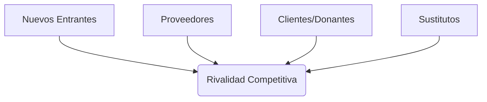

# Slide2_Herramientas_Medicion

> **Curso:** CD2001B - Diagnóstico para Líneas de Acción
> **Tecnológico de Monterrey - Campus Puebla**

---

# Administración Estratégica en ONGs
## Parte 2: Herramientas de Diagnóstico y Medición

    CD2001B - Semana 3 | Sesión 2 (2 Horas)

  Enfoque: Fundación Teletón

---

# 1. Objetivos Estratégicos y KPIs
## Lo que no se mide, no se mejora

---

# ¿Qué son los Objetivos Estratégicos?

Son las metas de mediano y largo plazo que la organización busca alcanzar para cumplir su misión.

### Metodología SMART
Para que un objetivo sea útil, debe cumplir 5 criterios:

**S**pecific
(Específico)

**M**easurable
(Medible)

**A**chievable
(Alcanzable)

**R**elevant
(Relevante)

**T**ime-bound
(Temporal)

---

# Objetivos SMART en Teletón

### ❌ Objetivo Vago
"Ayudar a más niños."

¿Cuántos? ¿Con qué presupuesto? ¿Cuándo?

### ✅ Objetivo SMART (Basado en Reportes)
"Garantizar la rehabilitación de **menores de 18 años** destinando **$900 millones de pesos** para el ejercicio 2025, manteniendo la certificación de calidad." [1]

- **S**pecific: Rehabilitación menores 18 años
- **M**easurable: $900 millones
- **A**chievable: Respaldado por inversiones ($1.8MM en 2023)
- **R**elevant: Core del negocio
- **T**ime-bound: Ejercicio 2025

[1] Contralínea (2024). [Inversiones de Fundación Teletón para 2025](https://contralinea.com.mx/interno/semana/teleton-invierte-1-8-mil-millones-de-donaciones-en-instrumentos-financieros/).

---

# ¿Qué son los KPIs?

**Key Performance Indicators (Indicadores Clave de Desempeño)**

Son métricas cuantificables que nos dicen si estamos cumpliendo los objetivos.

### Características de un buen KPI
- **Cuantificable:** Número, %, $
- **Accionable:** Si cambia, sé qué hacer.
- **Simple:** Fácil de entender.

### Tus KPIs del Dashboard (Teletón)

| KPI | Definición | Contexto Estratégico |
|-----|------------|-------------------|
| **NPS** | `% Promotores - % Detractores` | Contrarresta la "fatiga del donante". |
| **Transparencia** | Percepción (1-10) | Clave para mantener estatus SAT. |
| **Índice Calidad** | Promedio Dimensiones | Evidencia contra críticas de "mal trato". |
| **Antigüedad** | Años donando | Mide lealtad (Lifetime Value). |

---

# 💡 ¿Por Qué SMART y KPIs Son Indispensables?

### Sin Medición = Sin Accountability (Rendición de Cuentas)
- Teletón maneja dinero de donantes. ¿Cómo demuestra que lo usa bien?
- **KPIs** son la evidencia objetiva.

**Ejemplo:**
Si el NPS bajó de 70 a 50, eso significa que **perdieron palanca para recaudar**. Sin el KPI, nadie lo sabría hasta que sea tarde.

### Objetivos SMART = Alineación
- Si el director de Marketing dice "vamos bien" pero el CFO dice "vamos mal", ¿quién tiene razón?
- Los **SMART** evitan esa ambigüedad.

**Reflexión:** Tu dashboard con KPIs no es "decorativo". Es la forma en que Teletón **rinde cuentas** a 100,000+ donantes.

---

# 2. Las 5 Fuerzas de Porter
## Análisis de la Industria

---

# ¿Qué son las 5 Fuerzas de Porter?

Es un modelo para analizar el nivel de **competencia** dentro de una industria y qué tan atractiva (rentable) es.

En el sector **No Lucrativo**, la "rentabilidad" se mide en **capacidad de captar fondos e impacto**.

---

# Porter Aplicado: ¿Quién compite con Teletón?

### 1. Rivalidad (Competencia)
**Alta.**
Cruz Roja, Cáritas, Fundaciones Corporativas.
**Dato:** Hay más de 9,000 donatarias en México compitiendo por el mismo dinero.

### 2. Nuevos Entrantes
**Media.**
Nuevas ONGs digitales (Crowdfunding) o movimientos sociales espontáneos (ej. sismos).

### 3. Sustitutos
**Muy Alta (Crítica ONU).**
**El Estado.**
Si el gobierno mejora el sistema de salud pública, Teletón pierde relevancia [2].

### 4. Proveedores
**Medio.**
Proveedores de tecnología médica especializada. Inflación médica es alta.

### 5. Clientes (Donantes)
**Muy Alto.**
Las empresas exigen recibos deducibles y reportes.
**Tu dashboard** es la herramienta para satisfacer este poder.

[2] ONU (2014). [Observaciones finales sobre el informe inicial de México](https://tbinternet.ohchr.org/_layouts/15/treatybodyexternal/Download.aspx?symbolno=CRPD%2fC%2fMEX%2fCO%2f1&Lang=en).

---

# 💡 ¿Por Qué Analizar con Porter?

### Decisiones de Inversión
- Si la **Fuerza de Sustitutos** es alta (el Estado puede reemplazar a Teletón), ¿deberían seguir construyendo CRITs o buscar otro modelo?
- Porter ayuda a responder esa pregunta.

### Entender el "Juego"
- ¿Por qué Teletón gasta tanto en branding?
- Porque en una industria con **9,000 competidores** (donatarias), quien tiene la marca más fuerte gana.
- Porter explica el "por qué" detrás de las tácticas.

**Reflexión:** Porter no es "teoría". Es la forma en que McKinsey analiza industrias antes de recomendar qué hacer.

---

# 3. Matriz BCG (Boston Consulting Group)
## Análisis del Portafolio

---

# ¿Qué es la Matriz BCG?

Herramienta para analizar la cartera de productos/servicios de una organización en base a dos ejes:

1.  **Crecimiento del Mercado:** ¿Qué tanto crece la demanda?
2.  **Participación de Mercado:** ¿Qué tan fuertes somos nosotros?

**ESTRELLA 🌟**
Alto Crecimiento, Alta Participación.
(Invertir)

**INTERROGANTE ❓**
Alto Crecimiento, Baja Participación.
(¿Apostar o dejar?)

**VACA LECHERA 🐮**
Bajo Crecimiento, Alta Participación.
(Genera efectivo)

**PERRO 🐶**
Bajo Crecimiento, Baja Participación.
(Descartar)

---

# Matriz BCG: Portafolio Teletón

ESTRELLA 🌟

### CRITs (Rehabilitación)
- **Alta Demanda:** Listas de espera históricas.
- **Alto Impacto:** Modelo reconocido.
- **Estrategia:** Invertir para mantener calidad.

INTERROGANTE ❓

### Centro de Autismo
- **Alta Demanda:** Diagnósticos en aumento.
- **Baja Participación:** Pocos centros.
- **Estrategia:** ¿Expandir modelo? Requiere inversión.

VACA LECHERA 🐮

### Evento Teletón (Recaudación)
- **Bajo Crecimiento:** TV abierta pierde audiencia.
- **Alta Participación:** Fuente principal de cash ($1.8MM).
- **Estrategia:** Ordeñar para financiar la operación.

PERRO 🐶

### Proyectos Descontinuados
- Iniciativas sin impacto medible.
- **Estrategia:** Cerrar para cuidar recursos.

---

# Cierre: Tu Rol como Analista de Datos

Las herramientas estratégicas (FODA, PESTEL, Porter) **necesitan datos**.

Tu análisis de `teleton.xlsx` provee la **evidencia** para:

1. Validar Fortalezas (Satisfacción real).
2. Identificar Amenazas (Caída en donativos).
3. Medir Objetivos (KPIs).

### ¡El Dato es Estrategia!

---

# 💡 El "Por Qué" Final: Tu Rol Estratégico

### Datos Sin Estrategia = Desperdicio
- Puedes hacer el dashboard más bonito del mundo.
- Pero si no entiendes **por qué** el NPS importa (Porter), **qué hacer** si baja (FODA), o **dónde invertir** (BCG), el dashboard es inútil.

### Estrategia Sin Datos = Ficción
- Puedes tener el FODA más brillante.
- Pero sin datos de satisfacción (tu Excel), las "Fortalezas" son solo **opiniones**.

**La magia está en la intersección:**
**Estrategia + Datos = Decisiones que Salvan Vidas.**

🎯 **Misión Cumplida:** Ahora entiendes que no eres solo un "analista de datos". Eres un **estratega con datos**.