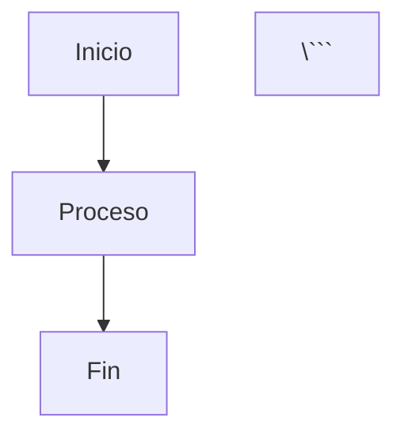

# 📊 Presentaciones Slidev - CD2001B

Material de apoyo visual para el curso **Diagnóstico para Líneas de Acción** usando [Slidev](https://sli.dev).

---

## 📚 Contenido Disponible

### **Semana 1: Estadística Básica**
- 📈 `semana1-medidas-descriptivas.md` - Medidas de Tendencia Central y Dispersión
- 📊 `semana1-pruebas-hipotesis.md` - Introducción a Pruebas de Hipótesis (t-test)

### **Semana 3: Análisis Estratégico**
- 🎯 `semana3-administracion-estrategica.md` - Conceptos de Administración Estratégica
- 💎 `semana3-diamante-porter-bcg.md` - Diamante de Porter y Matriz BCG
- 🗺️ `semana3-customer-journey-kpis.md` - Customer Journey Map y KPIs
- 🌍 `semana3-derechos-humanos-ods.md` - Derechos Humanos y ODS

### **Semana 4: Visualización de Datos**
- 📊 `semana4-fundamentos-visualizacion.md` - Principios de DataViz
- 🔧 `semana4-dataviz-en-pipeline.md` - DataViz en el Pipeline de Datos
- 🛠️ `semana4-herramientas-bi-ecosistema.md` - Herramientas de BI

### **Presentación General**
- 🎓 `slides.md` - Índice general del curso

---

## 🚀 Inicio Rápido

### **Opción 1: Si ya tienes Node.js instalado**

```bash
# 1. Navegar a la carpeta de slides
cd slides

# 2. Instalar dependencias (solo primera vez)
npm install

# 3. Iniciar servidor de desarrollo
npm run dev
```

Esto abrirá automáticamente tu navegador en `http://localhost:3030`

### **Opción 2: Si NO tienes Node.js**

Continúa a la sección de "Instalación Completa" abajo ⬇️

---

## 📋 Prerequisitos

Antes de comenzar, necesitas tener instalado:

1. **Node.js** (versión 16 o superior)
2. **npm** (viene incluido con Node.js)

### **¿Cómo verificar si ya los tienes?**

Abre tu terminal (CMD en Windows, Terminal en Mac/Linux) y ejecuta:

```bash
node --version
npm --version
```

**Si ves números de versión** (ej: `v18.17.0`), ya los tienes instalados. Salta a "Instalación de Slidev" ⬇️

**Si ves error "command not found"** o similar, continúa con la instalación de Node.js ⬇️

---

## 🔧 Instalación Completa (Primera Vez)

### **Paso 1: Instalar Node.js**

**Windows:**
1. Ve a [nodejs.org](https://nodejs.org/)
2. Descarga la versión **LTS** (Recommended)
3. Ejecuta el instalador (.msi)
4. Sigue el asistente (deja opciones por defecto)
5. Reinicia tu terminal/CMD

**Mac:**
```bash
# Usando Homebrew (recomendado)
brew install node

# O descarga desde nodejs.org
```

**Linux (Ubuntu/Debian):**
```bash
curl -fsSL https://deb.nodesource.com/setup_18.x | sudo -E bash -
sudo apt-get install -y nodejs
```

### **Paso 2: Verificar Instalación**

```bash
node --version   # Debería mostrar v16.x.x o superior
npm --version    # Debería mostrar 8.x.x o superior
```

### **Paso 3: Instalar Dependencias de Slidev**

```bash
# Navegar a la carpeta del repositorio
cd /ruta/a/diagnostico-lineas-accion/slides

# Instalar dependencias (puede tomar 2-3 minutos)
npm install
```

**Verás algo como:**
```
added 500 packages in 2m
```

### **Paso 4: Iniciar Slidev**

```bash
npm run dev
```

**Resultado esperado:**
```
  ➜  Local:   http://localhost:3030/
  ➜  Network: http://192.168.x.x:3030/

  ready in 1500ms
```

Tu navegador se abrirá automáticamente. Si no, abre manualmente: `http://localhost:3030`

---

## 🎯 Cómo Ver una Presentación Específica

Por defecto, `npm run dev` abre `slides.md`. Para ver una presentación diferente:

### **Método 1: Especificar archivo al iniciar**

```bash
# Ver presentación de Semana 1 - Medidas Descriptivas
npm run dev semana1-medidas-descriptivas.md

# Ver presentación de Semana 3 - Diamante de Porter
npm run dev semana3-diamante-porter-bcg.md

# Ver presentación de Semana 4 - DataViz
npm run dev semana4-fundamentos-visualizacion.md
```

### **Método 2: Cambiar temporalmente el archivo principal**

1. Edita `package.json`
2. En la línea `"dev": "slidev"`, cambia a:
   ```json
   "dev": "slidev semana1-medidas-descriptivas.md"
   ```
3. Guarda y ejecuta `npm run dev`

### **Método 3: Usar múltiples terminales**

Puedes tener varias presentaciones corriendo simultáneamente en diferentes puertos:

```bash
# Terminal 1
npx slidev semana1-medidas-descriptivas.md --port 3031

# Terminal 2
npx slidev semana3-diamante-porter-bcg.md --port 3032

# Terminal 3
npx slidev semana4-fundamentos-visualizacion.md --port 3033
```

Luego accede a:
- `http://localhost:3031` - Medidas Descriptivas
- `http://localhost:3032` - Diamante de Porter
- `http://localhost:3033` - DataViz

---

## 🎮 Navegación en Presentación

### **Controles Básicos:**

| Tecla | Acción |
|-------|--------|
| `→` / `Space` | Siguiente slide/animación |
| `←` | Slide anterior |
| `↑` / `↓` | Navegar animaciones en slide actual |
| `f` | Pantalla completa |
| `Esc` | Salir de pantalla completa |

### **Controles Avanzados:**

| Tecla | Acción |
|-------|--------|
| `o` | Vista general de todos los slides (Grid) |
| `d` | Activar modo dibujo (para anotar en slides) |
| `c` | Limpiar dibujos |
| `s` | Ver notas del presentador (solo si hay) |
| `g` | Ir a slide específico (escribe número) |

### **Modo Presentador:**

1. Presiona `p` o haz clic en "Presenter Mode"
2. Se abrirá una ventana nueva con:
   - Vista del slide actual
   - Siguiente slide (preview)
   - Notas del presentador
   - Timer

---

## 📦 Comandos Disponibles

### **Desarrollo (Modo Presentador):**
```bash
npm run dev
```
- Inicia servidor de desarrollo
- Hot-reload automático al editar archivos
- Abre en `http://localhost:3030`

### **Construir para Producción:**
```bash
npm run build
```
- Genera archivos estáticos en carpeta `dist/`
- Listo para subir a servidor web
- No requiere Node.js para visualizar

### **Exportar a PDF:**
```bash
npm run export
```
- Genera PDF de la presentación
- Útil para imprimir o compartir offline
- Archivo generado: `slides-export.pdf`

**Nota:** Para exportar a PDF necesitas tener instalado:
- [Playwright](https://playwright.dev/) (se instala automáticamente)
- O usa: `npm run export -- --with-clicks` para incluir todas las animaciones

---

## 🎨 Características de las Presentaciones

### **Tema Personalizado Tec**
- ✅ Colores oficiales Tec de Monterrey
  - Azul Reflex: `#0062A4`
  - Gris Tec: `#53565A`
- ✅ Tipografía legible y profesional
- ✅ Estilos en `styles/tec-theme.css`

### **Elementos Interactivos**

**Animaciones Progresivas:**
```markdown
<div v-click>
Este contenido aparece al hacer clic
</div>

<div v-click>
Este aparece después
</div>
```

**Diagramas Mermaid:**
```markdown


**Layouts Disponibles:**
- `cover` - Portada
- `section` - Separador de sección
- `two-cols` - Dos columnas
- `center` - Contenido centrado
- `default` - Layout estándar

**Cajas de Alerta:**
```markdown
<div class="alert-info">
ℹ️ Información importante
</div>

<div class="alert-warning">
⚠️ Advertencia
</div>

<div class="alert-success">
✅ Éxito o dato positivo
</div>
```

---

## 🗂️ Estructura de Archivos

```
slides/
├── README.md                              # Esta guía
├── package.json                           # Configuración npm/Slidev
├── package-lock.json                      # Versiones exactas de dependencias
│
├── slides.md                              # Presentación principal/índice
│
├── semana1-medidas-descriptivas.md        # Semana 1: Estadística
├── semana1-pruebas-hipotesis.md
│
├── semana3-administracion-estrategica.md  # Semana 3: Estrategia
├── semana3-diamante-porter-bcg.md
├── semana3-customer-journey-kpis.md
├── semana3-derechos-humanos-ods.md
│
├── semana4-fundamentos-visualizacion.md   # Semana 4: DataViz
├── semana4-dataviz-en-pipeline.md
├── semana4-herramientas-bi-ecosistema.md
│
├── styles/
│   └── tec-theme.css                      # Estilos personalizados
│
├── assets/                                # Imágenes y recursos
│   └── visualizations/                    # Gráficos SVG generados
│
├── public/                                # Recursos públicos
│   └── favicon.ico
│
└── setup/                                 # Configuración Slidev
    └── (archivos de configuración)
```

---

## 🆘 Solución de Problemas

### **Problema 1: "npm: command not found"**

**Causa:** Node.js/npm no está instalado o no está en PATH

**Solución:**
1. Instala Node.js desde [nodejs.org](https://nodejs.org/)
2. Reinicia tu terminal
3. Verifica con `node --version`

---

### **Problema 2: Error "EACCES permission denied"**

**Causa:** Permisos insuficientes en Linux/Mac

**Solución:**
```bash
# No uses sudo npm install (inseguro)
# En su lugar, configura npm para usar directorio de usuario
mkdir ~/.npm-global
npm config set prefix '~/.npm-global'
echo 'export PATH=~/.npm-global/bin:$PATH' >> ~/.bashrc
source ~/.bashrc
```

---

### **Problema 3: "Port 3030 already in use"**

**Causa:** Otra aplicación usa el puerto 3030

**Solución 1 - Usar otro puerto:**
```bash
npm run dev -- --port 3031
```

**Solución 2 - Cerrar proceso que usa el puerto:**

**Windows:**
```bash
netstat -ano | findstr :3030
taskkill /PID <PID> /F
```

**Mac/Linux:**
```bash
lsof -ti:3030 | xargs kill -9
```

---

### **Problema 4: Cambios no se reflejan automáticamente**

**Causa:** Hot-reload no funciona

**Solución:**
1. Guarda el archivo (Ctrl+S / Cmd+S)
2. Refresca el navegador (F5)
3. Si persiste, detén el servidor (Ctrl+C) y reinicia (`npm run dev`)

---

### **Problema 5: "Cannot find module 'slidev'"**

**Causa:** Dependencias no instaladas

**Solución:**
```bash
# Eliminar node_modules y reinstalar
rm -rf node_modules package-lock.json
npm install
```

---

### **Problema 6: Presentación se ve sin estilos**

**Causa:** Archivo CSS no cargado

**Solución:**
Verifica que al inicio del archivo .md esté:

```yaml
---
theme: default
css: unocss
---
```

O importa estilos manualmente:
```markdown
<style>
@import './styles/tec-theme.css';
</style>
```

---

## 📖 Guías Rápidas

### **Crear una Nueva Presentación:**

1. **Crea nuevo archivo .md en carpeta `slides/`:**
   ```bash
   touch semana5-nueva-presentacion.md
   ```

2. **Agrega el frontmatter al inicio:**
   ```yaml
   ---
   theme: default
   background: https://source.unsplash.com/collection/94734566/1920x1080
   class: text-center
   highlighter: shiki
   lineNumbers: false
   info: |
     ## Semana 5 - Nueva Presentación
     Descripción de la presentación
   drawings:
     persist: false
   transition: slide-left
   title: Nueva Presentación
   ---
   ```

3. **Agrega tu contenido:**
   ```markdown
   # Título de la Presentación

   Subtítulo o descripción

   ---

   # Slide 2

   Contenido del slide
   ```

4. **Visualiza:**
   ```bash
   npm run dev semana5-nueva-presentacion.md
   ```

---

### **Agregar Imágenes:**

**Opción 1: Desde carpeta local**
```markdown

```

**Opción 2: Desde URL**
```markdown

```

**Opción 3: Con tamaño personalizado**
```markdown

```

---

### **Agregar Videos:**

```markdown
<video controls style="width: 100%;">
  <source src="/assets/video.mp4" type="video/mp4">
</video>
```

O desde YouTube:
```markdown
<iframe
  width="100%"
  height="400"
  src="https://www.youtube.com/embed/VIDEO_ID"
  frameborder="0"
  allow="accelerometer; autoplay; encrypted-media; gyroscope; picture-in-picture"
  allowfullscreen>
</iframe>
```

---

## 🔗 Recursos Adicionales

### **Documentación Oficial:**
- [Slidev Documentation](https://sli.dev) - Guía completa
- [Markdown Syntax](https://sli.dev/guide/syntax) - Sintaxis específica de Slidev
- [Animations](https://sli.dev/guide/animations) - Guía de animaciones
- [Themes](https://sli.dev/themes/gallery) - Galería de temas

### **Tutoriales:**
- [Getting Started (Video)](https://www.youtube.com/watch?v=eW7v-2ZKZOU) - Tutorial en YouTube
- [Advanced Features](https://sli.dev/guide/) - Funciones avanzadas

### **Comunidad:**
- [GitHub Discussions](https://github.com/slidevjs/slidev/discussions)
- [Discord](https://chat.sli.dev)

---

## 💡 Tips Pro

1. **Modo Presentador en Clase:**
   - Presiona `p` para abrir modo presentador
   - Proyecta la ventana principal
   - Usa la ventana de presentador en tu laptop para ver:
     - Siguiente slide (prepararte)
     - Notas privadas
     - Timer

2. **Exportar PDFs para Estudiantes:**
   ```bash
   npm run export semana1-medidas-descriptivas.md
   ```
   Comparte el PDF con estudiantes que no pueden asistir.

3. **Hot Keys en Clase:**
   - `d` → Dibujar para explicar conceptos
   - `c` → Limpiar dibujos
   - `o` → Vista general para saltar entre temas
   - `f` → Pantalla completa para proyectar

4. **Editar en Vivo:**
   - Con el servidor corriendo (`npm run dev`)
   - Edita el archivo .md
   - Guarda (Ctrl+S)
   - Los cambios aparecen automáticamente en el navegador

5. **Atajos de Teclado Personalizados:**
   Agrega al frontmatter:
   ```yaml
   ---
   shortcuts:
     toggleDraw: 'd'
     next: 'ArrowRight'
     prev: 'ArrowLeft'
   ---
   ```

---

## ❓ FAQ

**P: ¿Puedo usar PowerPoint en lugar de Slidev?**
R: Sí, pero perderías: hot-reload, modo presentador avanzado, diagramas Mermaid, export a SPA, y versionado git eficiente.

**P: ¿Cómo comparto las presentaciones con estudiantes?**
R:
1. **GitHub:** Ya están en el repo, estudiantes pueden clonar
2. **PDF:** `npm run export` y comparte PDF
3. **Web:** `npm run build` y sube `dist/` a GitHub Pages

**P: ¿Puedo editar las presentaciones sin saber código?**
R: Sí, son archivos Markdown (`.md`) - texto plano. Usa cualquier editor de texto.

**P: ¿Funciona sin internet?**
R: Sí, una vez instaladas las dependencias (`npm install`), funciona 100% offline.

**P: ¿Cómo detengo el servidor?**
R: En la terminal donde ejecutaste `npm run dev`, presiona `Ctrl+C` (Windows/Linux) o `Cmd+C` (Mac).

---

**¡Listo para presentar!** 🎉

Si tienes problemas, revisa la sección de "Solución de Problemas" o consulta la [documentación oficial de Slidev](https://sli.dev).
