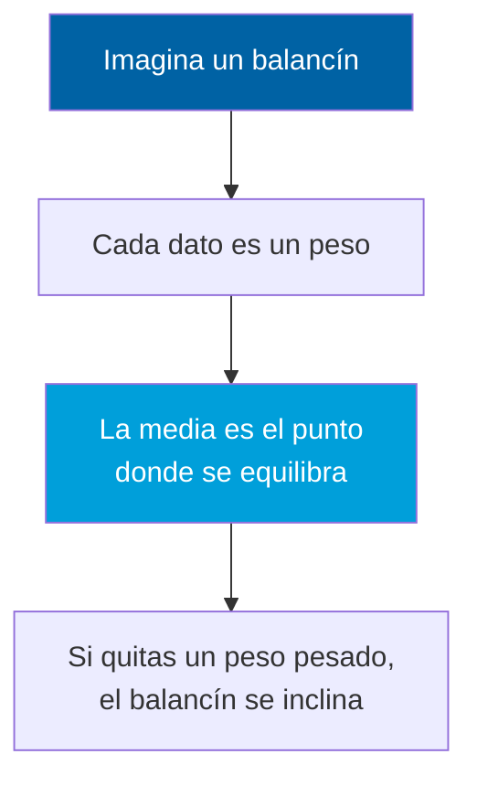
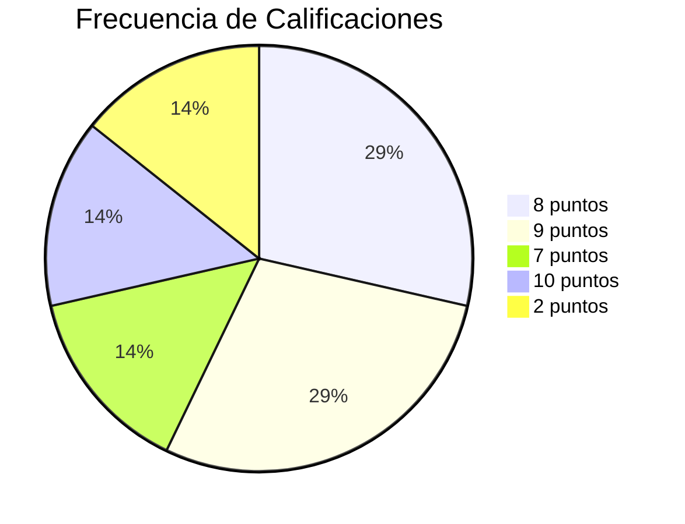
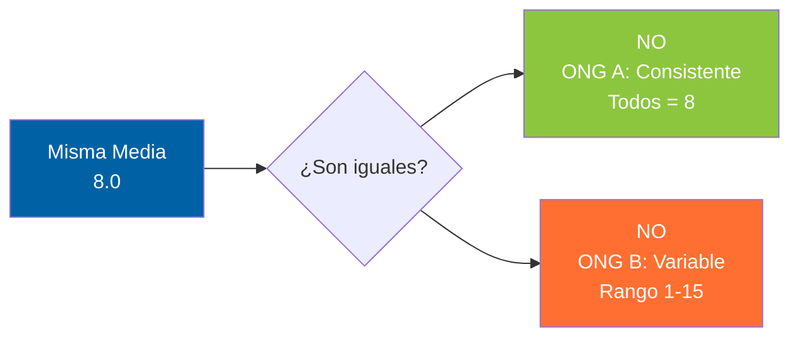
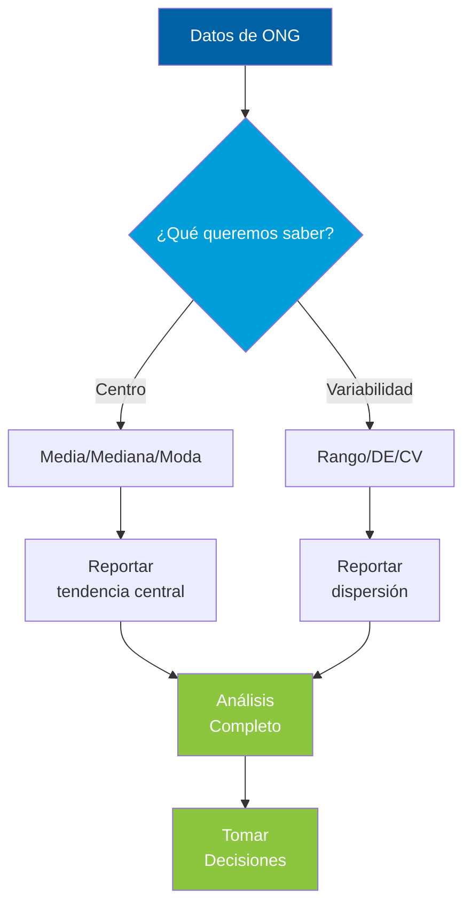

# Semana1 Medidas Descriptivas

> **Curso:** CD2001B - Diagnóstico para Líneas de Acción
> **Tecnológico de Monterrey - Campus Puebla**

---

# Medidas de Tendencia Central y Dispersión

## Entendiendo los Datos a Través de Números

    CD2001B - Diagnóstico para Líneas de Acción

  Semana 1 | Tec de Monterrey

---

# ¿Por Qué Necesitamos Estadística Descriptiva?

### 📊 Tenemos Datos
Una ONG tiene **200 encuestas** de satisfacción

**Pregunta:** ¿Cómo resumimos 200 números en algo útil?

### 🎯 Necesitamos Respuestas
- ¿Qué calificación es "típica"?
- ¿Los usuarios están contentos o no?
- ¿Las opiniones son consistentes?

Las medidas descriptivas transforman DATOS en INFORMACIÓN

---

# Medidas de Tendencia Central

## ¿Dónde está el "centro" de nuestros datos?

---

# Escenario Real: Satisfacción de una ONG

## Los Datos

Calificaciones de **7 usuarios** (escala 1-10):

8, 9, 8, 7, 9, 10, 2

### 🤔 Pregunta Clave
Si un donador pregunta:

**"¿Qué tan satisfechos están los usuarios?"**

¿Qué número le damos?

## Tres Respuestas Posibles

### Opción 1: MEDIA
**7.6** puntos promedio

*Suma todo / Cantidad de datos*

### Opción 2: MEDIANA
**8** puntos (valor del medio)

*Ordenar datos y tomar el central*

### Opción 3: MODA
**8** puntos (más frecuente)

*Valor que más se repite*

---

# 📐 La Media (Promedio)

## ¿Qué es?

El **"punto de balance"** de los datos

**Fórmula:**

μ = (Σ datos) / n

**Ejemplo:** Datos → 8, 9, 8, 7, 9, 10, 2

---

# 📐 La Media: Cálculo

(8 + 9 + 8 + 7 + 9 + 10 + 2) / 7 = 7.6

La media es **7.6** puntos

---

# 📐 Analogía: El Balancín



---

# 📐 Media: Problema con Outliers

⚠️ **La media es sensible a valores extremos**

En nuestro ejemplo: el **2** jala la media hacia abajo

**Resultado:** Media = 7.6 (no representa bien el grupo)

---

# 📊 La Mediana

## ¿Qué es?

El valor que **divide los datos a la mitad**

**Procedimiento:**
1. Ordenar datos de menor a mayor
2. Tomar el valor del medio

---

# 📊 Mediana: Ejemplo

**Datos ordenados:**

2, 7, 8, <strong style="color:#FF6F31">8**, 9, 9, 10

Mediana = **8** (el valor central)

---

# 📊 Mediana: Analogía

Imagina 7 personas ordenadas por altura:

```
👤 👤 👤 🧑‍🦱 👤 👤 👤
↓   ↓   ↓   ↓   ↓   ↓   ↓
1.50 1.60 1.65 1.70 1.75 1.80 1.85
            ⬆️
          MEDIANA
```

**La persona del medio** tiene altura mediana

---

# 📊 Mediana: Ventaja

✅ **NO le afectan los valores extremos**

Si la persona más alta midiera 2.50m, la mediana seguiría siendo 1.70m

En nuestro ejemplo: el "2" no cambia la mediana (sigue siendo 8)

---

# 🎯 La Moda

## ¿Qué es?

El valor que **aparece con mayor frecuencia**

---

# 🎯 Moda: Ejemplo

2(1×), 7(1×), <strong style="color:#8CC63F">8(2×)**, 9(2×), 10(1×)

Tenemos **dos modas**: 8 y 9

**Distribución Bimodal**

---

# 🎯 Moda: Analogía

**"¿Qué calificación es más popular?"**

La respuesta es la **moda**

Como en una votación: el candidato que más votos tiene

---

# 🎯 Moda: Frecuencias



---

# 🎯 Moda: Uso Típico

💡 **Variables categóricas**

**Ejemplo:** "¿Qué servicio prefieren?"
- Legal
- Trámites
- Salud

La moda te dice cuál es el más solicitado

---

# Media vs Mediana vs Moda

## ¿Cuándo usar cada una?

### 📐 MEDIA
**Cuándo usarla:**
- ✅ Datos simétricos
- ✅ Sin valores extremos
- ✅ Distribución "normal"

**Ejemplo:**
Edad promedio de usuarios (25, 28, 30, 32, 35)

### 📊 MEDIANA
**Cuándo usarla:**
- ✅ Datos con outliers
- ✅ Distribución asimétrica
- ✅ Queremos "valor típico"

**Ejemplo:**
Salarios (hay CEOs que ganan 100x más)

### 🎯 MODA
**Cuándo usarla:**
- ✅ Datos categóricos
- ✅ Queremos "lo más popular"
- ✅ Distribuciones multimodales

**Ejemplo:**
Preferencia de servicios (Legal, Trámites, Salud)

### 🚨 Caso Real: Salarios en Startup

5 empleados: $15k, $18k, $20k, $22k, $500k

- **Media:** $115,000 😱
- **Mediana:** $20,000 ✅

¿Cuál representa mejor el salario "típico"?

---

# ¿Las Medidas de Tendencia Central son Suficientes?

❌ NO

Dos datasets pueden tener la misma media

pero ser completamente diferentes

---

# El Problema: Dos ONGs con Media Idéntica

## ONG A

Satisfacción de 10 usuarios:

8, 8, 8, 8, 8, 8, 8, 8, 8, 8

**Media:** 8.0 ✅

**Observación:** Todos están **exactamente igual** de satisfechos

## ONG B

Satisfacción de 10 usuarios:

1, 2, 4, 6, 8, 8, 10, 12, 14, 15

**Media:** 8.0 ✅

**Observación:** Opiniones **muy divididas**

---

# ¿Misma Media = Mismos Datos?



🔑 **Necesitamos medir la DISPERSIÓN (variabilidad)**

---

# Medidas de Dispersión

## ¿Qué tan dispersos están los datos?

---

# 📏 El Rango

## ¿Qué es?

**Diferencia entre el valor más alto y el más bajo**

Rango = Máximo - Mínimo

---

# 📏 Rango: Ejemplo

**ONG A:**
- Máximo: 8, Mínimo: 8
- **Rango:** 0

**ONG B:**
- Máximo: 15, Mínimo: 1
- **Rango:** 14

---

# 📏 Rango: Analogía

**Ciudad A:**
- Temp. mínima: 20°C, máxima: 22°C
- **Rango:** 2°C (clima estable)

**Ciudad B:**
- Temp. mínima: 5°C, máxima: 35°C
- **Rango:** 30°C (clima variable)

---

# 📏 Rango: Limitación

⚠️ **Solo usa 2 datos** (max y min)

Ignora todo lo demás

No es una buena medida de dispersión

---

# 📊 Desviación Estándar

## ¿Qué mide?

**Qué tan "dispersos" están los datos respecto al promedio**

- **DE baja:** Datos concentrados
- **DE alta:** Datos dispersos

---

# 📊 DE: Comparación

**ONG A:**
- Media: 8.0, Todos = 8
- **DE:** 0 (sin variabilidad)

**ONG B:**
- Media: 8.0, Rango: 1-15
- **DE:** ~4.5 (muy variable)

---

# 📊 DE: Tiros al Blanco

**Jugador A (DE baja):**
```
    🎯
  🔴🔴🔴
  🔴🎯🔴
  🔴🔴🔴
```
Todos cerca del centro

---

# 📊 DE: Tiros Dispersos

**Jugador B (DE alta):**
```
🔴      🔴
    🎯
🔴      🔴
```
Tiros dispersos

---

# 📊 DE: Interpretación

✅ **DE baja = Consistencia**

✅ **DE alta = Variabilidad**

---

# 🧮 ¿Cómo se Calcula la Desviación Estándar?

## Paso a Paso (Intuición)

1. **Calcula la media**
2. **Resta la media a cada dato**

   *(qué tan lejos está cada uno)*
3. **Eleva al cuadrado** cada diferencia

   *(evitar negativos)*
4. **Promedia** esos cuadrados

   *(esto es la VARIANZA)*
5. **Saca raíz cuadrada**

   *(volver a unidades originales)*

**Fórmula:**

DE = √[Σ(x - μ)² / n]

## Ejemplo Numérico

Datos: **8, 9, 10** (Media = 9)

**Paso 2:** Diferencias
- 8 - 9 = -1
- 9 - 9 = 0
- 10 - 9 = 1

**Paso 3:** Cuadrados
- (-1)² = 1
- (0)² = 0
- (1)² = 1

**Paso 4:** Promedio
- (1 + 0 + 1) / 3 = 0.67

**Paso 5:** Raíz
- √0.67 = **0.82**

**DE = 0.82 puntos**

---

# 🎯 Interpretando la Desviación Estándar

## Regla Empírica (Distribución Normal)

**~68%** de los datos está a **±1 DE** de la media

**~95%** de los datos está a **±2 DE** de la media

**~99.7%** de los datos está a **±3 DE** de la media

### Ejemplo: Tiempo de Espera

**Media:** 20 minutos

**DE:** 5 minutos

**68%** de usuarios espera entre:

15 min (20-5) y 25 min (20+5)

**95%** de usuarios espera entre:

10 min (20-10) y 30 min (20+10)

### ¿Qué significa?

**Si DE es pequeña (ej: 2 min):**
- Servicio **predecible**
- Usuarios esperan tiempo similar
- ✅ **Bueno para la ONG**

**Si DE es grande (ej: 15 min):**
- Servicio **inconsistente**
- Algunos esperan mucho, otros poco
- ⚠️ **Problema a resolver**

---

# 🎯 Desviación Estándar: ¿Para Qué Sirve?

## Aplicaciones Prácticas en ONGs

- **Medir consistencia del servicio**
  - ¿Todos los usuarios tienen experiencia similar?

- **Comparar programas/departamentos**
  - Legal (DE=0.21) vs Trámites (DE=1.48)

- **Control de calidad**
  - Establecer rangos aceptables de variabilidad

- **Reportes a stakeholders**
  - "Satisfacción: 8.5 ± 0.2"

---

# 💼 Ejemplo Real: Tiempo de Espera

## Escenario A

**Tiempo de espera en atención:**

- **Media:** 20 minutos
- **DE:** 5 minutos

**Interpretación:**

- 68% espera entre 15-25 min
- Servicio **predecible**
- ✅ Experiencia consistente

## Escenario B

**Mismo tiempo promedio:**

- **Media:** 20 minutos
- **DE:** 15 minutos

**Interpretación:**

- 68% espera entre 5-35 min
- Servicio **impredecible**
- ⚠️ **Problema** a resolver

⚠️ **Cuándo NO usar DE:**
- Distribuciones multimodales (dos picos)
- Datos muy asimétricos (usar IQR)
- Outliers extremos sin justificación

---

# 🐍 Desviación Estándar en Python: NumPy

```python {all|1-2|4-5|7-8|10-11|all}
import numpy as np

# Datos de satisfacción
datos = [8.5, 9.0, 8.7, 9.2, 8.8, 9.1, 8.6, 9.0, 8.9, 8.7]

# Desviación estándar MUESTRAL (ddof=1) - LO MÁS COMÚN
de_muestra = np.std(datos, ddof=1)

# Desviación estándar POBLACIONAL (ddof=0)
de_poblacion = np.std(datos, ddof=0)

print(f"DE muestral: {de_muestra:.3f}")    # 0.213
print(f"DE poblacional: {de_poblacion:.3f}")  # 0.203
```

💡 **Importante:** Usa `ddof=1` para **muestras** (lo más común en análisis de ONGs)

📚 **Documentación:** [numpy.std()](https://numpy.org/doc/stable/reference/generated/numpy.std.html)

---

# 🐍 Desviación Estándar en Python: Pandas

```python {all|1-2|4-5|7-8|10-11|all}
import pandas as pd

# Cargar datos
df = pd.read_csv('satisfaccion_usuarios.csv')

# DE de una columna (por defecto usa ddof=1)
de = df['calificacion'].std()

# DE por grupo (agrupar por departamento)
de_por_depto = df.groupby('departamento')['calificacion'].std()

print(de_por_depto)
```

**Resultado:**
```text
departamento
Legal        0.213
Trámites     1.478
Salud        0.856
```

✅ **Pandas usa `ddof=1` por defecto** (diferente a NumPy)

📚 **Documentación:** [DataFrame.std()](https://pandas.pydata.org/docs/reference/api/pandas.DataFrame.std.html)

---

# 🤖 Prompt para IA: Estructura

## Cómo Pedir Ayuda a la IA

Un buen prompt tiene **4 secciones**:

1. **📋 Contexto del problema**
   - ¿Qué quieres lograr?
   - ¿Por qué lo necesitas?

2. **💾 Descripción del dataset**
   - Archivo, columnas, tamaño
   - Tipo de datos, rangos válidos

3. **🎯 Lo que necesitas**
   - Lista específica y numerada
   - Incluye visualizaciones

4. **⚠️ Supuestos a verificar**
   - Errores comunes a evitar
   - Validaciones de datos necesarias

---

# 🤖 Ejemplo: Prompt para Desviación Estándar

````markdown
```text
Tengo datos de satisfacción de usuarios de una ONG.
Necesito calcular DE para evaluar consistencia del servicio.

**Contexto:**
- Comparar 3 departamentos: Legal, Trámites, Salud
- Identificar áreas con servicio impredecible

**Dataset:**
- Archivo: 'satisfaccion_departamentos.csv'
- Columnas: 'departamento', 'calificacion' (1-10)
- ~300 registros (100 por departamento)
```
````

---

# 🤖 Ejemplo: Lo que Necesitas y Verificar

````markdown
```text
**Necesito:**
1. Calcular DE por departamento
2. Comparar consistencia entre áreas
3. Boxplot para visualizar
4. Interpretar: ¿DE > 2 es problemática?

**Verificar:**
- Usar DE muestral (ddof=1)
- Revisar outliers (valores fuera 1-10)
- Verificar NaN antes de calcular
- Al menos 30 registros por grupo
```
````

---

# 🤖 Por Qué Este Formato Funciona

### ✅ Específico, no vago
- "Calcular DE" → ❌ Vago
- "Calcular DE muestral por departamento con boxplot" → ✅ Específico

### ✅ Anticipa errores comunes
- IA podría usar ddof=0 (poblacional)
- Prompt lo especifica: ddof=1

### ✅ Da contexto de negocio
- No solo "calcula estadísticas"
- Sino "evaluar consistencia del servicio"

---

# 📐 Coeficiente de Variación (CV)

## ¿Por qué lo necesitamos?

**Problema:** No podemos comparar DE directamente si las escalas son diferentes

**Ejemplo:**

- **Variable A:** Satisfacción (1-10), DE = 2
- **Variable B:** Tiempo espera (minutos), DE = 15

¿Cuál es más variable?

💡 **Solución:** Coeficiente de Variación

CV = (DE / Media) × 100%

Expresa la DE como **porcentaje de la media**

## Aplicación

**Variable A: Satisfacción**
- Media: 8
- DE: 2
- **CV:** (2/8) × 100 = **25%**

**Variable B: Tiempo Espera**
- Media: 30 min
- DE: 15 min
- **CV:** (15/30) × 100 = **50%**

✅ **Interpretación:**

Tiempo de espera es **MÁS variable** (50% vs 25%)

Aunque DE es mayor (15 vs 2), el CV nos permite comparar

---

# Resumen: Medidas Descriptivas

## Tendencia Central

🎯 **¿Dónde está el centro?**

- **Media:** Balance matemático
- **Mediana:** Valor del medio
- **Moda:** Más frecuente

## Dispersión

📊 **¿Qué tan dispersos?**

- **Rango:** Max - Min
- **Desviación Estándar:** Dispersión promedio
- **CV:** DE relativa a la media

⚠️ **Nunca reportes solo la media - SIEMPRE incluye una medida de dispersión**

---

# Flujo de Análisis Estadístico



---

# Caso Práctico: Dos Departamentos de ONG

---

# Análisis Completo: Departamento Legal vs Trámites

## Departamento Legal

**Satisfacción (1-10):**

8.5, 9.0, 8.7, 9.2, 8.8, 9.1, 8.6, 9.0, 8.9, 8.7

**Análisis:**

- **Media:** 8.85
- **Mediana:** 8.85
- **Moda:** 9.0 y 8.7
- **DE:** 0.21
- **Rango:** 8.5 - 9.2 = 0.7

**Interpretación:** ✅ **MUY consistente**

## Departamento Trámites

**Satisfacción (1-10):**

6.0, 4.5, 7.2, 3.8, 8.1, 5.5, 6.8, 4.2, 7.5, 5.9

**Análisis:**

- **Media:** 5.95
- **Mediana:** 6.0
- **Moda:** (ninguna se repite)
- **DE:** 1.48
- **Rango:** 3.8 - 8.1 = 4.3

**Interpretación:** ⚠️ **MUY variable**

---

# Comparación y Líneas de Acción

## Observaciones

**Dept. Legal:**
- Alta satisfacción (8.85)
- Muy consistente (DE = 0.21)
- **Todos los usuarios contentos**

**Dept. Trámites:**
- Baja satisfacción (5.95)
- Muy inconsistente (DE = 1.48)
- **Experiencia impredecible**

## Líneas de Acción

✅ **Departamento Legal**

- Mantener prácticas actuales
- Documentar qué hacen bien
- Replicar en otros departamentos

⚠️ **Departamento Trámites**

- **Urgente:** Investigar causas de variabilidad
- Estandarizar procesos
- Capacitar personal
- Medir impacto de mejoras

**🔑 Sin medidas de dispersión, NO habríamos detectado el problema**

---

# Lecciones Clave

## 1️⃣ Contexto

**Ninguna medida es perfecta**

Usa la apropiada según tus datos

## 2️⃣ Ambas

**Centro + Dispersión**

Media sin DE es información incompleta

## 3️⃣ Interpretación

**Los números cuentan historias**

Traduce a implicaciones prácticas

La estadística descriptiva es el primer paso para entender tus datos

---

# ¡Gracias!

  📊

### Preguntas

  CD2001B | Tec de Monterrey Campus Puebla