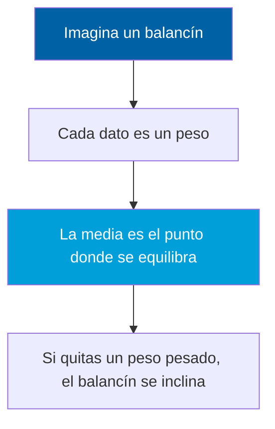
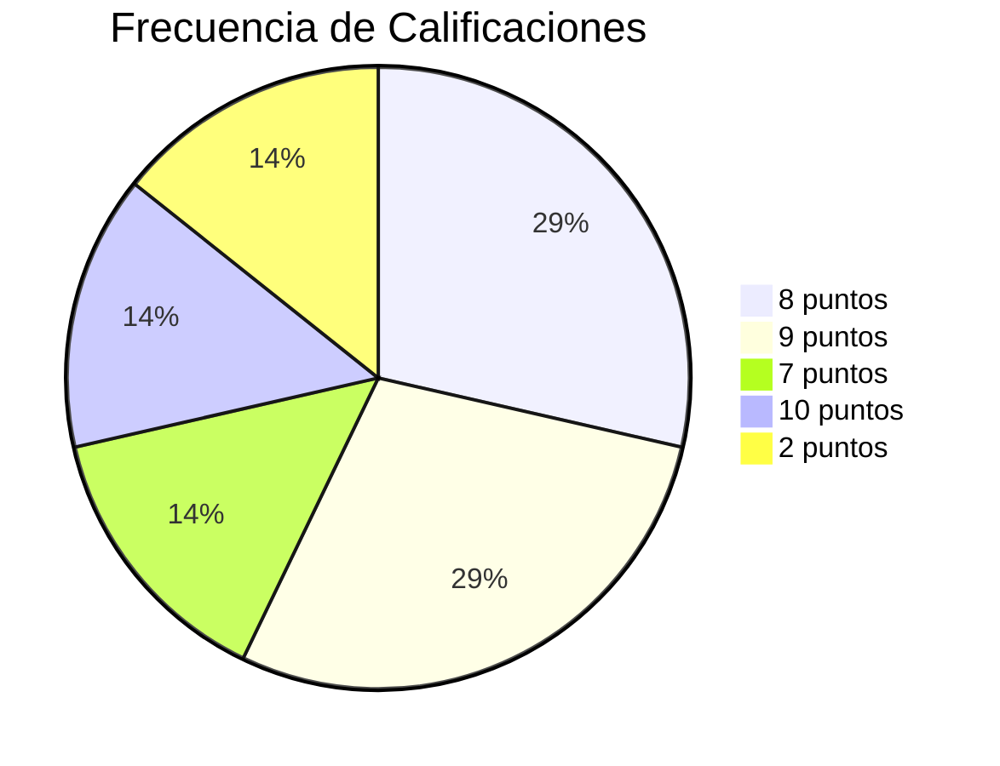
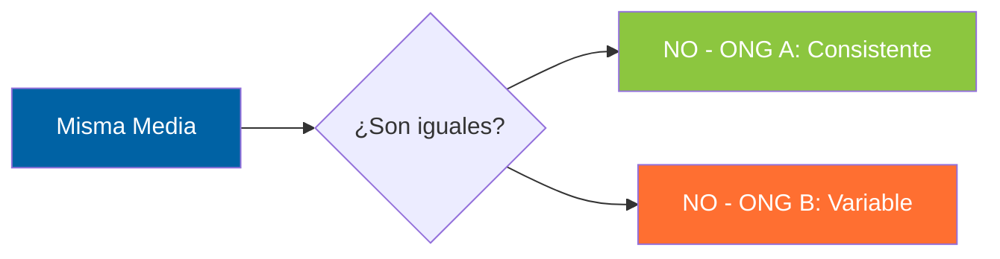
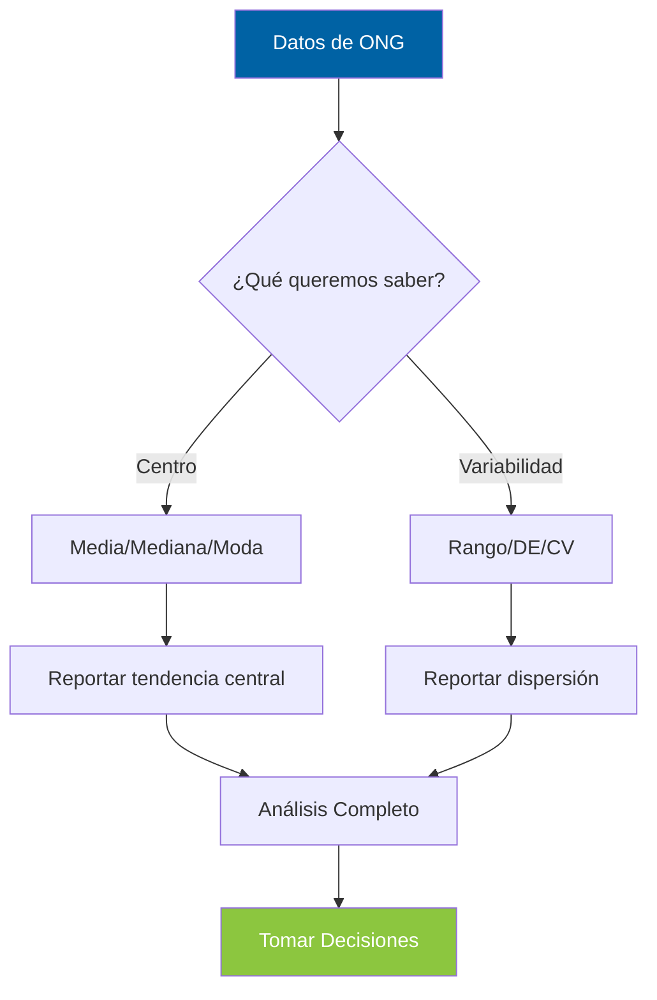

<style src="./styles/tec-theme.css"></style>

# Medidas de Tendencia Central y Dispersión

## Entendiendo los Datos a Través de Números

<div class="pt-12">
  <span class="px-2 py-1 rounded cursor-pointer" hover="bg-white bg-opacity-10">
    CD2001B - Diagnóstico para Líneas de Acción
  </span>
</div>

<div class="abs-br m-6 flex gap-2">
  <span class="text-sm opacity-50">Semana 1 | Tec de Monterrey</span>
</div>

---
layout: center
class: text-center
---

# ¿Por Qué Necesitamos Estadística Descriptiva?

<div class="grid grid-cols-2 gap-8 mt-12">
<div v-click>

### 📊 Tenemos Datos
Una ONG tiene **200 encuestas** de satisfacción

**Pregunta:** ¿Cómo resumimos 200 números en algo útil?

</div>
<div v-click>

### 🎯 Necesitamos Respuestas
- ¿Qué calificación es "típica"?
- ¿Los usuarios están contentos o no?
- ¿Las opiniones son consistentes?

</div>
</div>

<div v-click class="mt-12 text-2xl font-bold text-gradient">
Las medidas descriptivas transforman DATOS en INFORMACIÓN
</div>

---
layout: section
---

# Medidas de Tendencia Central

## ¿Dónde está el "centro" de nuestros datos?

---

# Escenario Real: Satisfacción de una ONG

<div class="grid grid-cols-2 gap-8">
<div>

## Los Datos

Calificaciones de **7 usuarios** (escala 1-10):

<div class="math-display">
8, 9, 8, 7, 9, 10, 2
</div>

<div v-click>

### 🤔 Pregunta Clave
Si un donador pregunta:<br>
**"¿Qué tan satisfechos están los usuarios?"**

¿Qué número le damos?

</div>

</div>
<div v-click>

## Tres Respuestas Posibles

<div v-click class="highlight-box">

### Opción 1: MEDIA
**7.6** puntos promedio

<small>Suma todo / Cantidad de datos</small>

</div>

<div v-click class="highlight-box">

### Opción 2: MEDIANA
**8** puntos (valor del medio)

<small>Ordenar datos y tomar el central</small>

</div>

<div v-click class="highlight-box">

### Opción 3: MODA
**8** puntos (más frecuente)

<small>Valor que más se repite</small>

</div>

</div>
</div>

---

# 📐 La Media (Promedio)

<div class="grid grid-cols-2 gap-8">
<div>

## ¿Qué es?

<v-clicks>

El **"punto de balance"** de los datos

**Fórmula:**

<div class="math-display">
μ = (Σ datos) / n
</div>

**En nuestro ejemplo:**

<div class="math-display">
(8+9+8+7+9+10+2) / 7 = 7.6
</div>

</v-clicks>

</div>
<div v-click>

## Analogía Visual: El Balancín



<div v-click class="alert alert-warning mt-4">

⚠️ **Problema:** La media es sensible a **valores extremos**

En nuestro caso: el **2** jala la media hacia abajo

</div>

</div>
</div>

---

# 📊 La Mediana (Valor Central)

<div class="grid grid-cols-2 gap-8">
<div>

## ¿Qué es?

<v-clicks>

El valor que **divide los datos a la mitad**

**Procedimiento:**

1. Ordenar datos de menor a mayor
2. Tomar el valor del medio

**En nuestro ejemplo:**

<div class="math-display">
2, 7, 8, <strong style="color:#FF6F31">8</strong>, 9, 9, 10
</div>

Mediana = **8**

</v-clicks>

</div>
<div v-click>

## Analogía: Fila de Personas

<div class="text-center">

Imagina 7 personas ordenadas por altura:

<v-clicks>

```
👤 👤 👤 🧑‍🦱 👤 👤 👤
↓   ↓   ↓   ↓   ↓   ↓   ↓
1.50 1.60 1.65 1.70 1.75 1.80 1.85
            ⬆️
          MEDIANA
```

**La persona del medio** tiene altura mediana

Ni siquiera importa si la más alta mide 1.85 o 2.50m

</v-clicks>

</div>

<div v-click class="alert alert-success mt-4">

✅ **Ventaja:** NO le afectan los valores extremos

El "2" no cambia la mediana

</div>

</div>
</div>

---

# 🎯 La Moda (Valor Más Común)

<div class="grid grid-cols-2 gap-8">
<div>

## ¿Qué es?

<v-clicks>

El valor que **aparece con mayor frecuencia**

**En nuestro ejemplo:**

<div class="math-display">
2(1×), 7(1×), <strong style="color:#8CC63F">8(2×)</strong>, 9(2×), 10(1×)
</div>

Tenemos **dos modas**: 8 y 9

**Bimodal**

</v-clicks>

</div>
<div v-click>

## Analogía: Elección Popular

<div class="text-center">

Si preguntamos:<br>
**"¿Qué calificación es más popular?"**

<v-clicks>

La respuesta es la **moda**

Como en una votación:<br>
El candidato que más votos tiene



</v-clicks>

</div>

<div v-click class="alert alert-info mt-4">

💡 **Uso típico:** Variables categóricas

Ejemplo: "¿Qué servicio prefieren?" (Legal, Trámites, Salud)

</div>

</div>
</div>

---
layout: two-cols
---

# Media vs Mediana vs Moda

## ¿Cuándo usar cada una?

<div v-click class="highlight-box">

### 📐 MEDIA
**Cuándo usarla:**
- ✅ Datos simétricos
- ✅ Sin valores extremos
- ✅ Distribución "normal"

**Ejemplo:**
Edad promedio de usuarios (25, 28, 30, 32, 35)

</div>

<div v-click class="highlight-box">

### 📊 MEDIANA
**Cuándo usarla:**
- ✅ Datos con outliers
- ✅ Distribución asimétrica
- ✅ Queremos "valor típico"

**Ejemplo:**
Salarios (hay CEOs que ganan 100x más)

</div>

::right::

<div v-click class="highlight-box mt-12">

### 🎯 MODA
**Cuándo usarla:**
- ✅ Datos categóricos
- ✅ Queremos "lo más popular"
- ✅ Distribuciones multimodales

**Ejemplo:**
Preferencia de servicios (Legal, Trámites, Salud)

</div>

<div v-click class="alert alert-warning mt-8">

### 🚨 Caso Real: Salarios en Startup

5 empleados: $15k, $18k, $20k, $22k, $500k

- **Media:** $115,000 😱
- **Mediana:** $20,000 ✅

¿Cuál representa mejor el salario "típico"?

</div>

---
layout: center
class: text-center
---

# ¿Las Medidas de Tendencia Central son Suficientes?

<div v-click class="text-6xl mt-12">
❌ NO
</div>

<div v-click class="mt-12 text-2xl">
Dos datasets pueden tener la misma media<br>
pero ser completamente diferentes
</div>

---

# El Problema: Dos ONGs con Media Idéntica

<div class="grid grid-cols-2 gap-8">
<div>

## ONG A

Satisfacción de 10 usuarios:

<div class="math-display">
8, 8, 8, 8, 8, 8, 8, 8, 8, 8
</div>

<v-clicks>

**Media:** 8.0 ✅

**Observación:** Todos están **exactamente igual** de satisfechos

</v-clicks>

</div>
<div v-click>

## ONG B

Satisfacción de 10 usuarios:

<div class="math-display">
1, 2, 4, 6, 8, 8, 10, 12, 14, 15
</div>

<v-clicks>

**Media:** 8.0 ✅

**Observación:** Opiniones **muy divididas**

</v-clicks>

</div>
</div>

<div v-click class="mt-8">



</div>

<div v-click class="alert alert-warning mt-4 text-center">

🔑 **Necesitamos medir la DISPERSIÓN (variabilidad)**

</div>

---
layout: section
---

# Medidas de Dispersión

## ¿Qué tan dispersos están los datos?

---

# 📏 El Rango (Simplest)

<div class="grid grid-cols-2 gap-8">
<div>

## ¿Qué es?

<v-clicks>

**Diferencia entre el valor más alto y el más bajo**

<div class="math-display">
Rango = Máximo - Mínimo
</div>

**ONG A:**
- Máximo: 8
- Mínimo: 8
- **Rango:** 0

**ONG B:**
- Máximo: 15
- Mínimo: 1
- **Rango:** 14

</v-clicks>

</div>
<div v-click>

## Analogía: Temperatura

<div class="text-center">

En **Ciudad A**:<br>
Temp. mínima: 20°C | máxima: 22°C<br>
**Rango:** 2°C (clima estable)

<v-click>

En **Ciudad B**:<br>
Temp. mínima: 5°C | máxima: 35°C<br>
**Rango:** 30°C (clima variable)

</v-click>

</div>

<div v-click class="alert alert-warning mt-4">

⚠️ **Limitación:**

Solo usa **2 datos** (max y min)

Ignora todo lo demás

</div>

</div>
</div>

---

# 📊 Desviación Estándar (Lo Más Importante)

<div class="grid grid-cols-2 gap-8">
<div>

## ¿Qué mide?

<v-clicks>

**Qué tan "dispersos" están los datos respecto al promedio**

- **DE baja:** Datos concentrados cerca de la media
- **DE alta:** Datos dispersos, alejados de la media

**ONG A:**
- Media: 8.0
- Todos los datos = 8
- **DE:** 0 (sin variabilidad)

**ONG B:**
- Media: 8.0
- Datos: 1 a 15
- **DE:** ~4.5 (muy variable)

</v-clicks>

</div>
<div v-click>

## Analogía: Tiros al Blanco

<div class="text-center">

<v-clicks>

**Jugador A (DE baja):**
```
    🎯
  🔴🔴🔴
  🔴🎯🔴
  🔴🔴🔴
```
Todos los tiros cerca del centro

**Jugador B (DE alta):**
```
🔴      🔴
    🎯
🔴      🔴
```
Tiros dispersos

</v-clicks>

</div>

<div v-click class="alert alert-success mt-4">

✅ **Interpretación:**

DE baja = **Consistencia**<br>
DE alta = **Variabilidad**

</div>

</div>
</div>

---

# 🧮 ¿Cómo se Calcula la Desviación Estándar?

<div class="grid grid-cols-2 gap-8">
<div>

## Paso a Paso (Intuición)

<v-clicks>

1. **Calcula la media**
2. **Resta la media a cada dato**<br>
   <small>(qué tan lejos está cada uno)</small>
3. **Eleva al cuadrado** cada diferencia<br>
   <small>(evitar negativos)</small>
4. **Promedia** esos cuadrados<br>
   <small>(esto es la VARIANZA)</small>
5. **Saca raíz cuadrada**<br>
   <small>(volver a unidades originales)</small>

**Fórmula:**

<div class="math-display">
DE = √[Σ(x - μ)² / n]
</div>

</v-clicks>

</div>
<div v-click>

## Ejemplo Numérico

Datos: **8, 9, 10** (Media = 9)

<v-clicks>

**Paso 2:** Diferencias
- 8 - 9 = -1
- 9 - 9 = 0
- 10 - 9 = 1

**Paso 3:** Cuadrados
- (-1)² = 1
- (0)² = 0
- (1)² = 1

**Paso 4:** Promedio
- (1 + 0 + 1) / 3 = 0.67

**Paso 5:** Raíz
- √0.67 = **0.82**

**DE = 0.82 puntos**

</v-clicks>

</div>
</div>

---

# 🎯 Interpretando la Desviación Estándar

<div class="highlight-box">

## Regla Empírica (Distribución Normal)

<v-clicks>

**~68%** de los datos está a **±1 DE** de la media

**~95%** de los datos está a **±2 DE** de la media

**~99.7%** de los datos está a **±3 DE** de la media

</v-clicks>

</div>

<div v-click class="grid grid-cols-2 gap-8 mt-8">
<div>

### Ejemplo: Tiempo de Espera

**Media:** 20 minutos<br>
**DE:** 5 minutos

<v-clicks>

**68%** de usuarios espera entre:<br>
15 min (20-5) y 25 min (20+5)

**95%** de usuarios espera entre:<br>
10 min (20-10) y 30 min (20+10)

</v-clicks>

</div>
<div v-click>

### ¿Qué significa?

<v-clicks>

**Si DE es pequeña (ej: 2 min):**
- Servicio **predecible**
- Usuarios esperan tiempo similar
- ✅ **Bueno para la ONG**

**Si DE es grande (ej: 15 min):**
- Servicio **inconsistente**
- Algunos esperan mucho, otros poco
- ⚠️ **Problema a resolver**

</v-clicks>

</div>
</div>

---

# 📐 Coeficiente de Variación (CV)

<div class="grid grid-cols-2 gap-8">
<div>

## ¿Por qué lo necesitamos?

<v-click>

**Problema:** No podemos comparar DE directamente si las escalas son diferentes

</v-click>

<v-click>

**Ejemplo:**

- **Variable A:** Satisfacción (1-10), DE = 2
- **Variable B:** Tiempo espera (minutos), DE = 15

¿Cuál es más variable?

</v-click>

<div v-click class="alert alert-info mt-4">

💡 **Solución:** Coeficiente de Variación

<div class="math-display">
CV = (DE / Media) × 100%
</div>

Expresa la DE como **porcentaje de la media**

</div>

</div>
<div v-click>

## Aplicación

**Variable A: Satisfacción**
- Media: 8
- DE: 2
- **CV:** (2/8) × 100 = **25%**

<v-click>

**Variable B: Tiempo Espera**
- Media: 30 min
- DE: 15 min
- **CV:** (15/30) × 100 = **50%**

</v-click>

<div v-click class="alert alert-success mt-4">

✅ **Interpretación:**

Tiempo de espera es **MÁS variable** (50% vs 25%)

Aunque DE es mayor (15 vs 2), el CV nos permite comparar

</div>

</div>
</div>

---
layout: two-cols
---

# Resumen Visual: Medidas Descriptivas

<div class="highlight-box">

## Tendencia Central

🎯 **¿Dónde está el centro?**

<v-clicks>

- **Media:** Balance matemático
- **Mediana:** Valor del medio
- **Moda:** Más frecuente

</v-clicks>

</div>

<div v-click class="highlight-box">

## Dispersión

📊 **¿Qué tan dispersos?**

<v-clicks>

- **Rango:** Max - Min
- **Desviación Estándar:** Dispersión promedio
- **CV:** DE relativa a la media

</v-clicks>

</div>

::right::

<div v-click class="mt-12">



</div>

<div v-click class="alert alert-warning mt-8">

⚠️ **Nunca reportes solo la media**

**Siempre** incluye una medida de dispersión

</div>

---
layout: center
class: text-center
---

# Caso Práctico: Dos Departamentos de ONG

---

# Análisis Completo: Departamento Legal vs Trámites

<div class="grid grid-cols-2 gap-8">
<div>

## Departamento Legal

**Satisfacción (1-10):**

<div class="math-display">
8.5, 9.0, 8.7, 9.2, 8.8, 9.1, 8.6, 9.0, 8.9, 8.7
</div>

<v-clicks>

**Análisis:**

- **Media:** 8.85
- **Mediana:** 8.85
- **Moda:** 9.0 y 8.7
- **DE:** 0.21
- **Rango:** 8.5 - 9.2 = 0.7

**Interpretación:** ✅ **MUY consistente**

</v-clicks>

</div>
<div v-click>

## Departamento Trámites

**Satisfacción (1-10):**

<div class="math-display">
6.0, 4.5, 7.2, 3.8, 8.1, 5.5, 6.8, 4.2, 7.5, 5.9
</div>

<v-clicks>

**Análisis:**

- **Media:** 5.95
- **Mediana:** 6.0
- **Moda:** (ninguna se repite)
- **DE:** 1.48
- **Rango:** 3.8 - 8.1 = 4.3

**Interpretación:** ⚠️ **MUY variable**

</v-clicks>

</div>
</div>

---

# Comparación y Líneas de Acción

<div class="grid grid-cols-2 gap-8">
<div>

## Observaciones

<v-clicks>

**Dept. Legal:**
- Alta satisfacción (8.85)
- Muy consistente (DE = 0.21)
- **Todos los usuarios contentos**

**Dept. Trámites:**
- Baja satisfacción (5.95)
- Muy inconsistente (DE = 1.48)
- **Experiencia impredecible**

</v-clicks>

</div>
<div v-click>

## Líneas de Acción

<div class="alert alert-success">

✅ **Departamento Legal**

- Mantener prácticas actuales
- Documentar qué hacen bien
- Replicar en otros departamentos

</div>

<div v-click class="alert alert-warning">

⚠️ **Departamento Trámites**

- **Urgente:** Investigar causas de variabilidad
- Estandarizar procesos
- Capacitar personal
- Medir impacto de mejoras

</div>

</div>
</div>

<div v-click class="highlight-box mt-8 text-center">

**🔑 Sin medidas de dispersión, NO habríamos detectado el problema**

</div>

---
layout: center
class: text-center
---

# Lecciones Clave

<div class="grid grid-cols-3 gap-8 mt-12">

<div v-click class="highlight-box">

## 1️⃣ Contexto

**Ninguna medida es perfecta**

Usa la apropiada según tus datos

</div>

<div v-click class="highlight-box">

## 2️⃣ Ambas

**Centro + Dispersión**

Media sin DE es información incompleta

</div>

<div v-click class="highlight-box">

## 3️⃣ Interpretación

**Los números cuentan historias**

Traduce a implicaciones prácticas

</div>

</div>

<div v-click class="mt-12 text-2xl font-bold text-gradient">
La estadística descriptiva es el primer paso para entender tus datos
</div>

---
layout: end
class: text-center
---

# ¡Gracias!

<div class="pt-12">
  <span class="text-6xl">📊</span>
</div>

### Preguntas

<div class="abs-br m-6 flex gap-2">
  <span class="text-sm opacity-50">CD2001B | Tec de Monterrey Campus Puebla</span>
</div>
