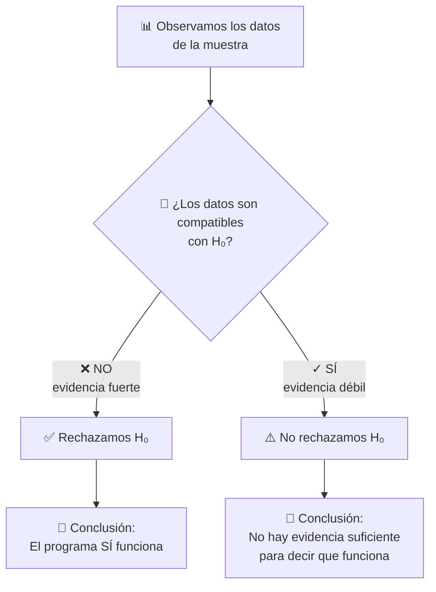
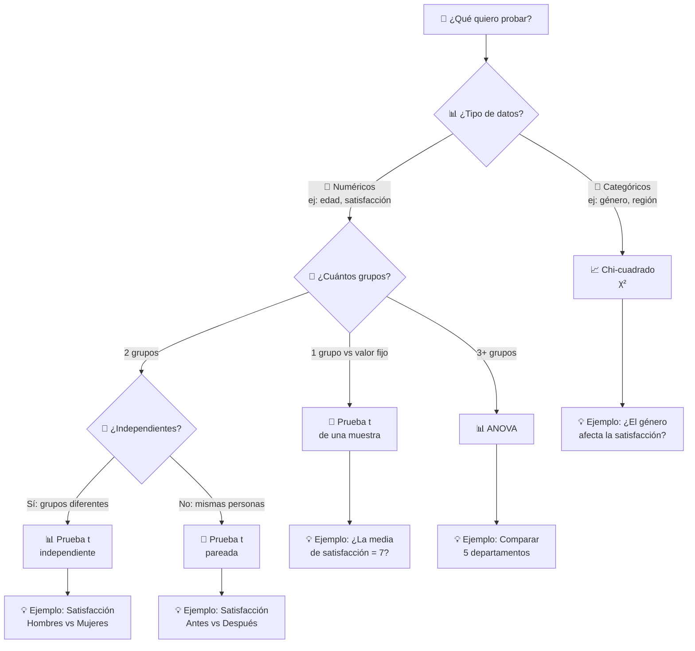
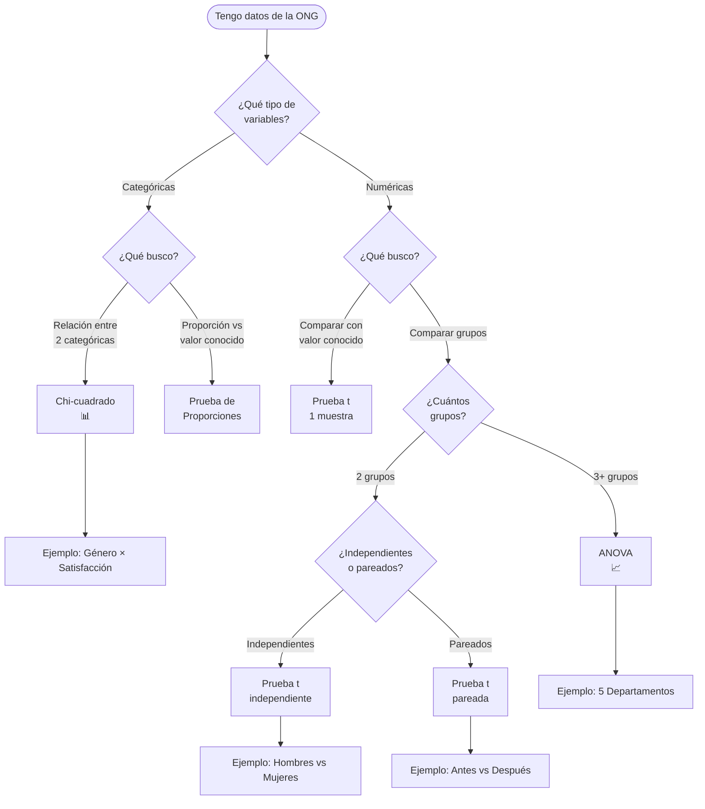

# Semana1 Pruebas Hipotesis

> **Curso:** CD2001B - Diagnóstico para Líneas de Acción
> **Tecnológico de Monterrey - Campus Puebla**

---

# Pruebas de Hipótesis

## Tomando Decisiones Basadas en Evidencia

    CD2001B - Diagnóstico para Líneas de Acción

  Semana 1 | Tec de Monterrey

---

# ¿Qué es una Hipótesis?

## 🤔 Empecemos con lo Básico

Una **hipótesis** es simplemente una **idea** o **suposición** sobre algo que queremos investigar.

### Ejemplos en la Vida Diaria:
- **"Creo que estudiar más horas me ayuda a tener mejores calificaciones"**
- **"Pienso que esta marca de café sabe mejor"**
- **"Esta ONG realmente está ayudando a la comunidad"**

💡 **Observa:** Todas estas son solo **ideas** o **creencias**. Aún no sabemos si son ciertas.

---

# ¿Qué es una Hipótesis Estadística?

## 📊 Hipótesis + Datos = Hipótesis Estadística

Es cuando tomamos una **idea** y la convertimos en algo que podemos **probar con números**.

### De Idea a Hipótesis Estadística:

**Idea vaga:** "Esta ONG es efectiva"

**Hipótesis estadística:** "El programa de la ONG redujo la desnutrición infantil de 35% a menos de 30%"

✅ **Lo importante:** Ahora tenemos **números específicos** que podemos medir y comparar

---

# El Propósito: ¿Por Qué Hacemos Esto?

### 🎯 No se Trata de "Tener Razón"

Cuando hacemos una prueba de hipótesis, **NO** estamos tratando de demostrar que nuestras ideas son correctas.

### 🔍 Se Trata de Evaluar la Evidencia

Queremos saber: **¿Los datos que tenemos apoyan nuestra idea, o no?**

⚠️ **Ojo:** A veces los datos nos dirán que nuestra idea original estaba equivocada. ¡Y eso está bien! Es parte del proceso científico.

---

# 💡 Analogía para Entender Mejor

## Imagina un Juicio Legal

Cuando un juez evalúa un caso, funciona de manera **muy similar** a una prueba de hipótesis.

Veamos cómo...

---

# ⚖️ En un Juicio Legal

### 1. Presunción de Inocencia

**"El acusado es inocente hasta que se pruebe lo contrario"**

### 2. Carga de la Prueba

El fiscal debe presentar **evidencia convincente** para cambiar el veredicto.

### 3. El Veredicto

- ✅ **Culpable** → Si hay evidencia suficiente
- ❌ **No culpable** → Si la evidencia NO es suficiente

💡 Observa que "No culpable" NO significa "Inocente". Solo significa: "No hay suficiente evidencia para condenar"

---

# 📊 En una Prueba de Hipótesis

### 1. H₀: Hipótesis Nula (Presunción de Inocencia)

**"No hay efecto / No hay diferencia"**

Es como decir: "Asumimos que nada cambió, hasta que los datos demuestren lo contrario"

### 2. H₁: Hipótesis Alternativa (La Acusación)

**"SÍ hay efecto / SÍ hay diferencia"**

Es la afirmación que queremos probar con nuestros datos.

⚠️ **Dato importante:** Al igual que en el juicio, empezamos asumiendo que H₀ es cierta (igual que la presunción de inocencia).

---

# 🎯 La Decisión Final

### Basándonos en la Evidencia (Datos)

**Si la evidencia es suficiente:**
- ✅ Rechazamos H₀
- Concluimos que **SÍ** hay efecto

**Si la evidencia NO es suficiente:**
- ❌ NO rechazamos H₀
- Concluimos que **NO tenemos evidencia** de un efecto

**MUY IMPORTANTE:** "No rechazar H₀" ≠ "Aceptar H₀"

Solo significa: **"No hay suficiente evidencia"**

(Igual que "No culpable" ≠ "Inocente")

---

# 📚 Ejemplo Práctico: ONG "Comedores Comunitarios"

## 📋 La Situación

Una ONG implementó un programa de comedores comunitarios para niños en una comunidad vulnerable.

### Lo que la ONG afirma:

**"Nuestro programa redujo la desnutrición infantil en la comunidad"**

💡 Pero necesitamos **evidencia numérica** para verificar esta afirmación.

---

# 📊 Los Datos del Programa

### Mediciones Realizadas:

**🔴 ANTES del programa:**
- Tasa de desnutrición infantil: **35%**

**🟢 DESPUÉS del programa:**
- Tasa de desnutrición infantil: **28%**
- Medido en una muestra de **150 niños**

**📉 Diferencia observada:** 35% - 28% = **7 puntos porcentuales**

---

# 🤔 La Pregunta Crítica

## ¿Esta reducción de 7% es REAL?

### Hay dos posibles explicaciones:

**1. 🎯 El programa realmente funciona**
- La reducción es un efecto genuino del programa

**2. 🎲 Es solo casualidad**
- La muestra aleatoriamente tuvo menos casos de desnutrición
- El programa en realidad no tuvo ningún efecto

**¡Aquí entra la Prueba de Hipótesis!**

Nos ayuda a decidir cuál de estas dos explicaciones es más probable, usando **rigor estadístico**.

---

# Paso 1: Plantear las Hipótesis

### Ahora vamos a formalizar las dos posibles explicaciones

### 🔵 H₀: Hipótesis Nula

**"El programa NO tuvo efecto"**

**¿Qué significa esto en números?**
- La tasa de desnutrición sigue siendo 35%
- La diferencia que vimos (7%) es solo casualidad de la muestra

💡 Esta es nuestra **"posición escéptica"** que intentaremos refutar con evidencia.

---

# Paso 1: Plantear las Hipótesis (continuación)

### 🟢 H₁: Hipótesis Alternativa

**"El programa SÍ redujo la desnutrición"**

**¿Qué significa esto en números?**
- La tasa de desnutrición es **realmente menor** a 35%
- La diferencia observada (7%) es un **efecto genuino** del programa

✅ Esta es la afirmación que queremos **demostrar con evidencia**.

---

# 🗺️ Proceso de Decisión



---

# 🎲 Analogía para Entender el Valor P

## El Caso de la Moneda

**Situación:**

Tu amigo lanza una moneda **100 veces** y obtiene **cara 70 veces**.

### 🤔 La Gran Pregunta:

**¿La moneda está cargada (trucada)?**

**¿O solo tuvo mucha suerte?**

---

# 🎲 Planteando las Hipótesis

### H₀: Hipótesis Nula

**"La moneda es justa (no está cargada)"**

Si esto es cierto, esperamos que salga cara aproximadamente **50 veces** de 100 lanzamientos.

### H₁: Hipótesis Alternativa

**"La moneda está cargada"**

Sale cara más frecuentemente de lo que debería por pura casualidad.

---

# 🧮 ¿Qué tan Raro es Obtener 70 Caras?

Si la moneda **fuera justa** (H₀ es cierta):
- Esperamos aproximadamente **50 caras**
- Podría variar un poco: 45-55 caras sería normal

Pero obtener **70 caras** sería:
- ✨ **Extremadamente raro**
- 📊 Probabilidad: ~0.0001 (solo 0.01% de probabilidad)

⚠️ **Valor P bajo:** Los datos observados son muy improbables si H₀ fuera cierta

---

# ✅ Conclusión del Experimento de la Moneda

### Razonamiento:

**SI** la moneda fuera justa (H₀), sería **casi imposible** obtener 70 caras.

### Decisión:

Por tanto: **Rechazamos H₀**

### Conclusión Final:

La moneda probablemente **está cargada**.

💡 Este es exactamente el mismo razonamiento que usamos con los datos de la ONG!

---

# 📘 Definición Formal del Valor P

**Valor P =**

Probabilidad de observar datos tan extremos (o más)

**SI** la hipótesis nula (H₀) fuera cierta

📌 **En palabras simples:**

¿Qué tan raro/improbable es lo que observamos, **asumiendo que H₀ es verdadera**?

---

# 📖 Cómo Leer la Notación Estadística

## Símbolos que Verás Frecuentemente

### 1. H₀ (se lee: "H sub-cero" o "H cero")

**Significa:** Hipótesis Nula

**Ejemplo:** "H₀: La media es 50" se lee como "La hipótesis nula dice que la media es 50"

### 2. H₁ (se lee: "H sub-uno" o "H uno")

**Significa:** Hipótesis Alternativa

**Ejemplo:** "H₁: La media es diferente de 50"

---

# 📖 Cómo Leer la Notación Estadística (cont.)

### 3. El símbolo < (se lee: "menor que")

**P < 0.05** se lee: "P es menor que cero punto cero cinco"

**Significa:** El valor P es más pequeño que 0.05

**Ejemplos:**
- P = 0.03 → 0.03 < 0.05 ✅ (Verdadero: 0.03 es menor que 0.05)
- P = 0.12 → 0.12 < 0.05 ❌ (Falso: 0.12 NO es menor que 0.05)

💡 **Tip:** Piensa en el símbolo < como una "boca abierta" que siempre apunta hacia el número más grande.

<code>3 < 5</code> (la boca se abre hacia el 5 porque es más grande)

---

# Interpretando el Valor P

## ¿Qué Significa Cada Rango?

| Valor P | Interpretación | Decisión Típica |
|---------|----------------|-----------------|
| **< 0.01** | Evidencia muy fuerte contra H₀ | Rechazar H₀ (muy seguro) |
| **0.01 - 0.05** | Evidencia fuerte contra H₀ | Rechazar H₀ (seguro) |
| **0.05 - 0.10** | Evidencia débil contra H₀ | Zona gris (depende del contexto) |
| **> 0.10** | Evidencia insuficiente contra H₀ | No rechazar H₀ |

---

# 🎯 El Umbral Estándar: α = 0.05

### ¿Qué es α (alfa)?

**α** (se lee "alfa") es el **nivel de significancia**: el umbral que usamos para decidir si rechazamos H₀.

### La Regla Más Común:

**α = 0.05** (5%)

**Si P < 0.05 → Rechazamos H₀**

**Si P ≥ 0.05 → NO rechazamos H₀**

⚠️ **¿Qué significa el 5%?**

Estamos aceptando un **5% de riesgo** de rechazar H₀ cuando en realidad es verdadera (Error Tipo I).

---

# ✅ Ejemplo: Volviendo a la ONG

### Resultado de la Prueba:

**P = 0.012** (1.2%)

### ¿Qué significa esto?

Hay solo **1.2% de probabilidad** de observar esta reducción (o mayor) si el programa **NO funcionara**.

### Decisión:

**P = 0.012 < 0.05** ✅

Por tanto: **Rechazamos H₀**

**Conclusión Final:**

Tenemos evidencia suficiente para decir que el programa de la ONG **SÍ es efectivo**.

---

# ❌ Ejemplo Alternativo: Evidencia Insuficiente

### Resultado de una Prueba Diferente:

**P = 0.18** (18%)

### ¿Qué significa esto?

Hay **18% de probabilidad** de observar esta diferencia por **pura casualidad**.

### Decisión:

**P = 0.18 > 0.05** ❌

Por tanto: **NO rechazamos H₀**

**Conclusión Final:**

NO tenemos evidencia suficiente para decir que el programa funciona.

(Esto NO significa que "no funciona", solo que no podemos estar seguros con estos datos)

---

# ⚠️ Los Dos Tipos de Error

### Incluso con pruebas estadísticas, podemos equivocarnos

Como en cualquier decisión basada en evidencia, hay **dos formas** de cometer errores.

Veamos esto con un ejemplo que usas todos los días...

---

# 📱 Ejemplo Gen Z: Filtro de Spam de Instagram

### La Situación:

Instagram tiene que decidir: **¿Este mensaje es spam o es legítimo?**

**H₀ (Hipótesis Nula):** El mensaje es legítimo (no es spam)

**H₁ (Hipótesis Alternativa):** El mensaje es spam

### Las Posibles Decisiones:

- **Rechazar H₀** → Marcar el mensaje como spam y bloquearlo
- **No rechazar H₀** → Dejar pasar el mensaje a tu bandeja principal

---

# 🚨 Error Tipo I: Falso Positivo

### ¿Qué es?

Rechazar H₀ cuando **en realidad es verdadera**

### 📱 En Instagram:

Un mensaje **legítimo** (como una oportunidad de trabajo real) es marcado como **spam** y lo pierdes.

**Consecuencia:** Perdiste algo importante 😢

### 📊 En la ONG:

Concluir que el programa **funciona** cuando en realidad **NO tuvo ningún efecto**.

**Consecuencia:** Invertir recursos en un programa inefectivo 💸

**Probabilidad del Error Tipo I:** α = 0.05 (5%)

---

# 😔 Error Tipo II: Falso Negativo

### ¿Qué es?

**NO** rechazar H₀ cuando **en realidad es falsa**

### 📱 En Instagram:

Un mensaje de **spam real** (estafa, phishing) pasa como legítimo y llega a tu bandeja.

**Consecuencia:** Podrías caer en una estafa 🚨

### 📊 En la ONG:

Concluir que el programa **NO funciona** cuando en realidad **SÍ es efectivo**.

**Consecuencia:** Cancelar un programa que realmente ayudaba 😞

**Probabilidad del Error Tipo II:** β (varía según el diseño del estudio)

---

# 📊 Resumen: Tabla de Decisiones

|  | **H₀ es Verdadera**
(No hay efecto real) | **H₀ es Falsa**
(Sí hay efecto real) |
|---|---|---|
| **Rechazamos H₀** | ❌ **Error Tipo I** (α = 5%)
Falso Positivo | ✅ **Decisión Correcta**
Detectamos el efecto |
| **No Rechazamos H₀** | ✅ **Decisión Correcta**
No hay efecto y no lo afirmamos | ❌ **Error Tipo II** (β)
Falso Negativo |

---

# 🎯 Analogía: Detector de Humo

### Error Tipo I: Falsa Alarma

- El detector **suena cuando NO hay fuego**
- Molesto e inconveniente, pero no peligroso
- Te despierta a las 3am por nada 😴

### Error Tipo II: No Detecta el Peligro

- El detector **NO suena cuando SÍ hay fuego** 🔥
- Extremadamente peligroso
- Podría ser fatal

⚠️ **¿Cuál error prefieres?** En este caso, preferimos Error Tipo I (falsas alarmas) sobre Error Tipo II (no detectar el fuego).

---

# 🏥 Analogía: Prueba Médica (COVID-19)

### Error Tipo I: Falso Positivo

- La prueba dice que **tienes COVID**, pero en realidad **estás sano**
- Consecuencia: Cuarentena innecesaria, ansiedad, más pruebas
- Molesto, pero no crítico

### Error Tipo II: Falso Negativo

- La prueba dice que **NO tienes COVID**, pero en realidad **SÍ estás infectado**
- Consecuencia: Sigues tu vida normal, contagias a otros
- Muy peligroso para ti y los demás

💡 Por eso algunas pruebas médicas son diseñadas para ser "sensibles" (prefieren Error Tipo I sobre Error Tipo II).

---

# ⚖️ El Balance (Trade-off)

### El Dilema:

No podemos eliminar **completamente** ambos tipos de error al mismo tiempo.

### Si somos MÁS estrictos (bajamos α):

- ✅ Reducimos Error Tipo I (menos falsos positivos)
- ❌ Aumentamos Error Tipo II (más falsos negativos)

### Si somos MENOS estrictos (subimos α):

- ❌ Aumentamos Error Tipo I (más falsos positivos)
- ✅ Reducimos Error Tipo II (menos falsos negativos)

**💡 La Solución:** Aumentar el tamaño de muestra (n) reduce AMBOS errores simultáneamente!

---

# 🗺️ Panorama: Tipos de Pruebas de Hipótesis

### Hay MUCHOS tipos de pruebas estadísticas...

Pero **NO te preocupes**: todas siguen la misma lógica que acabamos de aprender.

La pregunta clave es: **¿Qué tipo de datos tengo y qué quiero comparar?**

Veamos un mapa para ayudarte a decidir cuál usar...

---

# 🗺️ Diagrama de Decisión: ¿Qué Prueba Usar?

💡 Tip: Haz clic derecho en el diagrama y selecciona "Abrir imagen en nueva pestaña" para verlo más grande



📌 **No te aprendas esto de memoria!** Siempre puedes consultar este diagrama. Lo importante es entender LA LÓGICA detrás de cada prueba.

---

# 📏 Prueba t: ¿Qué es y Para Qué Sirve?

### En Palabras Simples:

La **prueba t** te ayuda a responder: **"¿Estos dos promedios son REALMENTE diferentes, o solo parece por casualidad?"**

### 📊 Ejemplo del Día a Día:

Tienes dos grupos de personas que usaron los servicios de la ONG:
- Grupo A (Hombres): Promedio de satisfacción = 7.2
- Grupo B (Mujeres): Promedio de satisfacción = 6.8

**Pregunta:** ¿Esta diferencia de 0.4 puntos es significativa, o podría ser solo variación aleatoria?

💡 La prueba t toma en cuenta NO SOLO la diferencia, sino también la VARIABILIDAD de los datos y el tamaño de las muestras.

---

# 📏 Los 3 Tipos de Prueba t

### 1️⃣ Prueba t de Una Muestra

**¿Cuándo?** Cuando quieres comparar el promedio de **un grupo** vs **un valor conocido/esperado**

**Ejemplo ONG:** "¿La satisfacción promedio de nuestros beneficiarios es diferente de 7.0?"

### 2️⃣ Prueba t de Dos Muestras Independientes

**¿Cuándo?** Cuando quieres comparar **dos grupos DIFERENTES** de personas

**Ejemplo ONG:** "¿La satisfacción de hombres es diferente a la de mujeres?"

### 3️⃣ Prueba t Pareada (Antes/Después)

**¿Cuándo?** Cuando mides a **las MISMAS personas** en dos momentos diferentes

**Ejemplo ONG:** "¿La satisfacción ANTES del programa es diferente a la satisfacción DESPUÉS?"

---

# 📊 Ejemplo Paso a Paso: Satisfacción por Género

### 📋 Los Datos de la ONG:

- **Hombres:** Media = 7.2, Desviación Estándar = 1.5, n = 80 personas
- **Mujeres:** Media = 6.8, Desviación Estándar = 1.3, n = 120 personas

### ❓ La Pregunta:

¿La satisfacción de hombres es **significativamente diferente** a la de mujeres?

### 📝 Planteamos las Hipótesis:

- **H₀:** No hay diferencia (las medias son iguales: μ₁ = μ₂)
- **H₁:** SÍ hay diferencia (las medias son diferentes: μ₁ ≠ μ₂)

---

# 🐍 Prueba t en Python (SciPy)

```python {all|1-2|4-7|9-10|12-13|15-18|all}
from scipy import stats
import numpy as np

# Datos (simulados para el ejemplo)
hombres = np.random.normal(7.2, 1.5, 80)  # Media=7.2, DE=1.5, n=80
mujeres = np.random.normal(6.8, 1.3, 120) # Media=6.8, DE=1.3, n=120

# Realizar prueba t de dos muestras independientes
t_statistic, p_value = stats.ttest_ind(hombres, mujeres)

# Mostrar resultados
print(f"Estadístico t: {t_statistic:.3f}")
print(f"Valor P: {p_value:.4f}")

# Decisión
if p_value < 0.05:
    print("✅ Rechazamos H₀: HAY diferencia significativa")
else:
    print("❌ No rechazamos H₀: NO hay evidencia de diferencia")
```

📚 **Documentación:** [scipy.stats.ttest_ind()](https://docs.scipy.org/doc/scipy/reference/generated/scipy.stats.ttest_ind.html)

---

# 📊 Interpretando los Resultados

### Resultado del Código:

```
Estadístico t: 2.05
Valor P: 0.042
```

### ✅ Decisión:

**P = 0.042 < 0.05** → Rechazamos H₀

### 💡 Conclusión en Lenguaje Simple:

Hay evidencia estadísticamente significativa de que la satisfacción de **hombres** es **mayor** que la de **mujeres**.

**🎯 Acción Recomendada para la ONG:**

Investigar POR QUÉ las mujeres tienen menor satisfacción y diseñar intervenciones específicas para mejorar su experiencia.

---

# 📐 Chi-Cuadrada (χ²): ¿Qué es?

### 🗣️ Cómo se Pronuncia:

**"Chi"** se pronuncia **"JI"** (como en "jitomate")

**Chi-cuadrada** = **"JI-cuadrada"**

Se escribe con el símbolo griego: **χ²**

### 🤔 ¿Por Qué se Llama "Chi-Cuadrada"?

- **Chi (χ)** es una letra del alfabeto griego
- **Cuadrada (²)** porque la fórmula matemática usa valores al cuadrado

### 💡 En Palabras Simples:

Es una prueba para ver si **dos variables categóricas** (como género y nivel de satisfacción) están **relacionadas** o son **independientes**.

---

# 📊 Chi-Cuadrada: ¿Cuándo Usarla?

### 🔍 Úsala cuando tus datos son **categorías** (no números)

### Ejemplos de Preguntas que Responde:

1. ¿El **género** afecta el **nivel de satisfacción** (Alta/Media/Baja)?
2. ¿La **zona geográfica** (Norte/Sur/Centro) afecta el **tipo de necesidad**?
3. ¿El **nivel educativo** se relaciona con el **conocimiento de la ONG** (Sí/No)?

💡 **Nota clave:** Chi-cuadrada NO compara promedios (eso es prueba t). Chi-cuadrada compara **frecuencias** y **proporciones**.

---

# 📊 Ejemplo ONG: ¿Género Afecta Satisfacción?

### 📋 Tabla de Contingencia: Satisfacción × Género

|  | Alta | Media | Baja | **Total** |
|---|------|-------|------|-------|
| **Hombres** | 45 | 25 | 10 | 80 |
| **Mujeres** | 50 | 50 | 20 | 120 |
| **Total** | 95 | 75 | 30 | 200 |

### ❓ La Pregunta:

¿Hay una **relación** entre género y nivel de satisfacción?

### 📝 Las Hipótesis:

- **H₀:** NO hay relación (género y satisfacción son independientes)
- **H₁:** SÍ hay relación (género afecta la satisfacción)

---

# 🧮 La Lógica de Chi-Cuadrada

### Si H₀ fuera cierta (NO hay relación):

Esperaríamos que la distribución de satisfacción sea **proporcional** en ambos géneros.

**Cálculo rápido:**
- De 200 personas, 95 tienen satisfacción Alta (47.5%)
- Si no hay relación, esperaríamos:
  - Hombres con Alta: 47.5% de 80 = **38 personas** (aprox)
  - Mujeres con Alta: 47.5% de 120 = **57 personas** (aprox)

**Pero observamos:**
- Hombres con Alta: **45** (más de lo esperado)
- Mujeres con Alta: **50** (menos de lo esperado)

⚠️ **Pregunta:** ¿Esta diferencia entre lo esperado y lo observado es significativa, o solo casualidad?

---

# 🐍 Chi-Cuadrada en Python (SciPy)

```python {all|1-2|4-9|11-12|14-15|17-20|all}
from scipy.stats import chi2_contingency
import numpy as np

# Tabla de contingencia
tabla = np.array([
    [45, 25, 10],  # Hombres: Alta, Media, Baja
    [50, 50, 20]   # Mujeres: Alta, Media, Baja
])

# Realizar prueba chi-cuadrada
chi2_stat, p_value, df, expected = chi2_contingency(tabla)

# Mostrar resultados
print(f"Chi-cuadrado (χ²): {chi2_stat:.2f}")
print(f"Valor P: {p_value:.4f}")
print(f"Grados de libertad: {df}")

# Decisión
if p_value < 0.05:
    print("✅ Rechazamos H₀: SÍ hay relación")
else:
    print("❌ No rechazamos H₀: NO hay evidencia de relación")
```

📚 **Documentación:** [scipy.stats.chi2_contingency()](https://docs.scipy.org/doc/scipy/reference/generated/scipy.stats.chi2_contingency.html)

---

# 📊 Interpretando los Resultados

### Resultado del Código:

```
Chi-cuadrado (χ²): 6.80
Valor P: 0.033
Grados de libertad: 2
```

### ✅ Decisión:

**P = 0.033 < 0.05** → Rechazamos H₀

### 💡 Conclusión:

SÍ hay una relación estadísticamente significativa entre **género** y **nivel de satisfacción**.

⚠️ **Limitación Importante:**

Chi-cuadrada te dice que HAY relación, pero NO te dice:
<ul class="mt-2">
<li>Qué tan fuerte es la relación</li>
<li>En qué dirección va (quién está más satisfecho)</li>
</ul>
Para eso, necesitas analizar la tabla visualmente o usar medidas adicionales.

---

# 📊 ANOVA: ¿Qué es?

### 🗣️ Cómo se Pronuncia:

**ANOVA** se dice **"A-NO-VA"** (se pronuncia cada letra)

### 📝 ¿Qué Significa?

**AN**alysis **O**f **VA**riance (Análisis de Varianza)

### 💡 En Palabras Muy Simples:

Es una prueba para comparar los **promedios** de **3 o más grupos** al mismo tiempo.

### Ejemplo:

¿La satisfacción es diferente entre los **5 departamentos** de la ONG? (Legal, Trámites, Atención Social, Psicología, Administración)

---

# 🤔 ¿Por Qué NO Hacer Múltiples Pruebas t?

### El Problema:

Imagina que quieres comparar **5 departamentos** de la ONG.

**Opción A: Hacer muchas pruebas t**
- Departamento 1 vs 2
- Departamento 1 vs 3
- Departamento 1 vs 4
- Departamento 1 vs 5
- Departamento 2 vs 3
- ...y así sucesivamente

**Total:** Necesitas hacer **10 pruebas t** diferentes!

---

# ⚠️ El Peligro de Múltiples Pruebas

### Recuerda:

Cada prueba t tiene α = 0.05 → 5% de probabilidad de **Error Tipo I** (falso positivo)

### Cuando haces 10 pruebas:

La probabilidad de cometer **AL MENOS UN** Error Tipo I aumenta drásticamente:

**1 - (0.95)^10 ≈ 0.40 = 40%**

⚠️ **Problema:** Con 10 pruebas, hay **40% de probabilidad** de encontrar una "diferencia significativa" que en realidad es solo casualidad!

**Analogía:** Es como lanzar una moneda 10 veces. Mientras más veces lances, más probable es que salga una racha rara (5 caras seguidas) solo por suerte.

---

# ✅ ANOVA: La Solución

### Una Sola Prueba para Todos

En lugar de hacer 10 pruebas t separadas, ANOVA hace **UNA SOLA** prueba que compara todos los grupos simultáneamente.

### Ventajas:

1. Mantiene α = 0.05 **global** (no se acumula el error)
2. Más eficiente estadísticamente
3. Respuesta clara: "¿Son todos iguales, o al menos uno es diferente?"

### 📝 Las Hipótesis:

- **H₀:** Todas las medias son iguales (los 5 departamentos tienen la misma satisfacción promedio)
- **H₁:** Al menos UNA media es diferente (al menos un departamento se destaca)

---

# 🧮 ¿Cómo Funciona ANOVA?

### La Lógica en Palabras Simples:

ANOVA compara **dos tipos de variabilidad**:

### 1️⃣ Variabilidad ENTRE Grupos

¿Qué tan diferentes son los promedios de cada departamento entre sí?

**Ejemplo:** Legal (8.85) vs Trámites (5.95) → Gran diferencia!

### 2️⃣ Variabilidad DENTRO de Cada Grupo

¿Qué tan dispersos están los datos dentro de cada departamento?

**Ejemplo:** En Legal, algunas personas dan 8.7, otras 9.0 → Poca dispersión

💡 **Si la variabilidad ENTRE grupos es MUCHO MAYOR que la variabilidad DENTRO de los grupos** → Rechazamos H₀ (las medias son diferentes).

---

# 📊 Ejemplo ANOVA: 5 Departamentos de la ONG

### Datos de Satisfacción por Departamento:

| Departamento | Media | Desviación Estándar | n (personas) |
|--------------|-------|---------------------|--------------|
| Legal | 8.85 | 0.21 | 40 |
| Trámites | 5.95 | 1.48 | 45 |
| Atención Social | 7.80 | 0.65 | 50 |
| Psicología | 8.10 | 0.45 | 35 |
| Administración | 6.20 | 1.20 | 30 |

### ❓ La Pregunta:

¿Hay diferencias significativas en la satisfacción entre estos 5 departamentos?

---

# 🐍 ANOVA en Python (SciPy)

```python {all|1-2|4-11|13-14|16-17|19-22|all}
from scipy import stats
import numpy as np

# Datos de cada departamento (simulados)
legal = np.random.normal(8.85, 0.21, 40)
tramites = np.random.normal(5.95, 1.48, 45)
atencion = np.random.normal(7.80, 0.65, 50)
psicologia = np.random.normal(8.10, 0.45, 35)
admin = np.random.normal(6.20, 1.20, 30)

# Realizar ANOVA de una vía (one-way ANOVA)
f_stat, p_value = stats.f_oneway(legal, tramites, atencion, psicologia, admin)

# Mostrar resultados
print(f"Estadístico F: {f_stat:.2f}")
print(f"Valor P: {p_value:.4f}")

# Decisión
if p_value < 0.05:
    print("✅ Rechazamos H₀: AL MENOS un departamento es diferente")
else:
    print("❌ No rechazamos H₀: Todos los departamentos son similares")
```

📚 **Documentación:** [scipy.stats.f_oneway()](https://docs.scipy.org/doc/scipy/reference/generated/scipy.stats.f_oneway.html)

---

# 📊 Interpretando el Resultado

### Resultado del Código:

```
Estadístico F: 45.3
Valor P: < 0.001
```

### ✅ Decisión:

**P < 0.001 < 0.05** → Rechazamos H₀

### 💡 Conclusión:

Hay evidencia MUY fuerte de que **AL MENOS un departamento** tiene una satisfacción significativamente diferente.

⚠️ **Limitación de ANOVA:**

ANOVA solo te dice que HAY diferencias, pero NO te dice **CUÁLES** departamentos son diferentes entre sí.

Para saber eso, necesitas hacer **pruebas post-hoc**.

---

# 🔍 Pruebas Post-Hoc: ¿Cuál es Diferente?

### ¿Qué son las Pruebas Post-Hoc?

Son pruebas **adicionales** que haces **DESPUÉS** de ANOVA para identificar exactamente **cuáles pares** de grupos son diferentes.

### La Más Común: Tukey HSD

**Tukey HSD** compara **todos los pares** de departamentos, pero ajusta el nivel α para controlar el Error Tipo I.

### Resultados Ejemplo (Tukey HSD):

- Legal vs Psicología: P = 0.42 → **NO** hay diferencia
- Trámites vs Administración: P = 0.68 → **NO** hay diferencia
- Legal vs Trámites: P < 0.001 → **SÍ** hay diferencia (2.9 puntos)
- Psicología vs Trámites: P < 0.001 → **SÍ** hay diferencia (2.15 puntos)

---

# 🎯 Conclusión Final e Implicaciones

### Lo que Encontramos:

1. **Legal** y **Psicología** tienen las satisfacciones más altas (~8.1-8.9)
2. **Trámites** tiene la satisfacción MÁS BAJA (5.95)
3. **Atención Social** está en el medio (7.80)
4. **Administración** también está bajo (6.20)

**🚨 Hallazgo Crítico:**

El departamento de **Trámites** tiene una satisfacción significativamente MENOR que todos los demás departamentos.

**Diferencia de 2.9 puntos** vs Legal (el mejor evaluado).

**💡 Acción Recomendada:**

Investigar urgentemente QUÉ está pasando en Trámites y diseñar intervenciones específicas para mejorar la experiencia de los usuarios en ese departamento.

---

# Árbol de Decisión: ¿Qué Prueba Usar?



---

# 📚 Caso Práctico Completo: ONG "Manos Unidas"

### 📋 El Contexto

La ONG implementó un **programa de capacitación en habilidades digitales** para adultos mayores.

### ❓ Objetivo del Diagnóstico:

¿El programa mejoró significativamente las habilidades digitales de los participantes?

💡 Vamos a resolver este caso paso a paso, aplicando todo lo que hemos aprendido.

---

# 📊 Paso 1: Los Datos Recolectados

### Diseño del Estudio:

**Tipo:** Antes-Después con el mismo grupo de personas
- **n = 60** adultos mayores
- Prueba de habilidades digitales (escala 0-100 puntos)

### Resultados Observados:

- **ANTES del programa:** Media = 42.5, Desviación Estándar = 12.3
- **DESPUÉS del programa:** Media = 58.2, Desviación Estándar = 14.1
- **Diferencia promedio:** +15.7 puntos

✅ Parece que hay una mejora de casi 16 puntos. Pero, ¿es esto estadísticamente significativo?

---

# 🧮 Paso 2: Identificar la Prueba Apropiada

### Hagamos las Preguntas Clave:

**1. ¿Tipo de datos?**
- Numéricos (puntaje 0-100) ✓

**2. ¿Cuántos grupos?**
- 2 mediciones: antes y después

**3. ¿Grupos independientes o pareados?**
- **Pareados** → Son las MISMAS 60 personas medidas 2 veces ✓

**✅ Prueba Apropiada: Prueba t Pareada**

---

# 📝 Paso 3: Plantear las Hipótesis

### H₀: Hipótesis Nula

**"El programa NO tuvo efecto"**

Matemáticamente: μ_después = μ_antes

La diferencia que observamos es solo variación aleatoria.

### H₁: Hipótesis Alternativa

**"El programa SÍ mejoró las habilidades"**

Matemáticamente: μ_después > μ_antes

La diferencia es un efecto real del programa.

### Nivel de Significancia:

α = 0.05 (5%)

---

# 📈 Paso 4: Resultados Estadísticos

### Prueba t Pareada:

```
t = 6.84
gl (grados de libertad) = 59
P < 0.001
```

### Intervalo de Confianza 95%:

- Diferencia promedio: 15.7 puntos
- Margen de error: ± 4.6
- **IC 95%: [11.1, 20.3]**

💡 El intervalo de confianza nos dice: "Estamos 95% seguros de que la mejora real está entre 11.1 y 20.3 puntos"

---

# ✅ Paso 5: Decisión e Interpretación

### La Decisión:

**P < 0.001** es MUY inferior a 0.05

→ **Rechazamos H₀** con altísima confianza

### Conclusión Estadística:

Hay evidencia **muy fuerte** de que el programa mejoró las habilidades digitales de los adultos mayores.

### Tamaño de la Mejora:

- Mejora promedio: **15.7 puntos**
- Mejora relativa: **37%** (de 42.5 a 58.2)
- IC 95%: [11.1, 20.3]

---

# 💡 Interpretación Práctica para la ONG

### ✅ Lo que SÍ Podemos Afirmar:

1. El programa produjo una mejora **estadísticamente significativa**
2. La mejora promedio fue de ~16 puntos (escala 0-100)
3. El efecto es **consistente** (IC no incluye cero)
4. La magnitud de la mejora es **sustancial** (37%)

### ⚠️ Lo que NO Podemos Afirmar:

1. Que la mejora se mantendrá a **largo plazo** (necesitamos seguimiento)
2. Que sea el **único factor** responsable (no hay grupo control)
3. Que funcione **igual** en otras poblaciones o contextos

---

# 🎯 Recomendaciones para la ONG

### ✅ Acciones Inmediatas:

1. **Continuar el programa** → Hay evidencia sólida de efectividad
2. **Expandir a más beneficiarios** → El efecto es sustancial

### 📊 Para Fortalecer la Evidencia:

3. **Seguimiento a 6 meses** → Verificar si la mejora se mantiene
4. **Grupo control en siguiente iteración** → Descartar factores externos
5. **Replicar en otras comunidades** → Verificar generalización

**Veredicto Final:** El programa es efectivo. Se recomienda continuarlo y escalarlo.

---

# ⚠️ Errores Comunes al Interpretar

Antes de terminar, es importante conocer los **errores más comunes** que se cometen al interpretar las pruebas de hipótesis.

Evita estos errores y tus conclusiones serán mucho más precisas.

---

# ❌ Error 1: Malinterpretar el Valor P

### ❌ Interpretación INCORRECTA:

**"P = 0.04 significa que hay 4% de probabilidad de que H₀ sea cierta"**

**ESTO ESTÁ MAL.**

### ✅ Interpretación CORRECTA:

El valor P es la probabilidad de **observar los datos** (o más extremos) **DADO QUE H₀ es cierta**.

NO es la probabilidad de que H₀ sea cierta.

**Correcto:**

"Si el programa NO tuviera efecto (H₀), habría solo 4% de probabilidad de observar una mejora tan grande como la que vimos en nuestra muestra."

---

# ❌ Error 2: Confundir "No Rechazar" con "Aceptar"

### ❌ Interpretación INCORRECTA:

**"No rechazar H₀ significa que H₀ es verdadera"**

**ESTO ESTÁ MAL.**

### ✅ Interpretación CORRECTA:

"No rechazar H₀" solo significa que **no tenemos suficiente evidencia** para rechazarla.

NO significa que H₀ sea verdadera.

**Correcto:**

"No encontramos evidencia suficiente de que el programa tenga efecto. Esto puede deberse a:
<ul class="mt-2">
<li>Que realmente NO funciona, O</li>
<li>Que nuestra muestra es muy pequeña para detectar el efecto</li>
</ul>

---

# ❌ Error 3: Confundir P-value con Tamaño del Efecto

### ❌ Interpretación INCORRECTA:

**"P = 0.001 significa un efecto más grande que P = 0.04"**

**ESTO ESTÁ MAL.**

### ✅ Interpretación CORRECTA:

El valor P mide la **fuerza de la evidencia**, NO el **tamaño del efecto**.

### Ejemplo Ilustrativo:

**Caso A:** Mejora de 2 puntos, n=1000 → **P < 0.001** (evidencia muy fuerte)

**Caso B:** Mejora de 20 puntos, n=10 → **P = 0.08** (evidencia débil)

💡 El efecto en Caso B (20 puntos) es MUCHO mayor que en Caso A (2 puntos), pero la evidencia estadística es más débil porque la muestra es pequeña.

---

# 📊 Significancia Estadística vs Práctica

### ¿Son lo Mismo?

**NO.** Son dos cosas diferentes, y ambas son importantes.

---

# 📊 Significancia Estadística

### La Pregunta que Responde:

**¿Es poco probable que la diferencia observada sea solo casualidad?**

### Cómo se Mide:

**Valor P**

Si P < 0.05 → Estadísticamente significativo

### Qué la Afecta:

1. **Tamaño del efecto** (qué tan grande es la diferencia)
2. **Tamaño de la muestra** (n)
3. **Variabilidad de los datos** (DE)

⚠️ **Importante:** Con una muestra MUY GRANDE, incluso diferencias **minúsculas** pueden ser estadísticamente significativas.

---

# 💼 Significancia Práctica

### La Pregunta que Responde:

**¿Es la diferencia lo suficientemente GRANDE como para importar en la vida real?**

### Cómo se Evalúa:

**Contexto y juicio profesional**

NO hay una fórmula. Debes considerar el contexto.

### Qué la Afecta:

1. **Costo de implementación** (¿Vale la pena la inversión?)
2. **Impacto en beneficiarios** (¿Cambiará sus vidas?)
3. **Viabilidad operativa** (¿Es factible?)

💡 Una diferencia puede ser estadísticamente significativa pero **irrelevante en la práctica**.

---

# 📌 Ejemplo: Método de Enseñanza

### El Caso:

Se probó un nuevo método de enseñanza con **10,000 estudiantes**.

### Resultado Estadístico:

- Mejora promedio: **0.5 puntos** (escala 0-100)
- **P < 0.001** → ¡Altamente significativo!

### Análisis Práctico:

**Costos:**
- Implementar el nuevo método: **$500,000**
- Entrenar a 200 profesores: **6 meses**

**Beneficio:**
- Mejora de **0.5 puntos** → Imperceptible para estudiantes y padres

---

# 🎯 Decisión Final del Ejemplo

### A Pesar de P < 0.001...

**Decisión:** **NO implementar** el nuevo método.

### ¿Por Qué?

La mejora es **estadísticamente significativa** pero **prácticamente irrelevante**.

- 0.5 puntos no hacen diferencia real
- El costo es muy alto
- El esfuerzo no justifica el mínimo beneficio

**Lección Clave:**

SIEMPRE evalúa TANTO la significancia estadística COMO la significancia práctica antes de tomar decisiones.

---

# 📏 Tamaño del Efecto: Complemento Esencial

### ¿Qué es el Tamaño del Efecto?

Es una medida de **qué tan grande** es la diferencia, independientemente de si es estadísticamente significativa.

### ¿Por Qué es Importante?

El valor P te dice si hay evidencia de una diferencia, pero NO te dice qué tan grande es esa diferencia.

---

# 📊 d de Cohen: La Medida Más Común

### Para Pruebas t:

**Fórmula:**

d = (Media₁ - Media₂) / Desviación Estándar Combinada

### Interpretación de los Valores:

- **d = 0.2** → Efecto **pequeño**
- **d = 0.5** → Efecto **mediano**
- **d = 0.8** → Efecto **grande**
- **d > 1.0** → Efecto **muy grande**

💡 Mientras mayor sea d, mayor es la diferencia práctica entre los grupos.

---

# 📊 Ejemplo: Programa de Capacitación

### Recordemos los Datos:

- **Media ANTES:** 42.5 (DE = 12.3)
- **Media DESPUÉS:** 58.2 (DE = 14.1)
- **Diferencia:** 15.7 puntos

### Cálculo de d de Cohen:

```
d = 15.7 / 13.2 = 1.19
```

(13.2 es la DE combinada de antes y después)

### Interpretación:

**d = 1.19** → Efecto **MUY GRANDE**

---

# 💡 Interpretación Completa

### ¿Qué Significa d = 1.19?

1. La mejora es de **más de 1 desviación estándar**
2. Es una diferencia **muy sustancial** en términos prácticos
3. NO solo es estadísticamente significativa (P < 0.001)
4. También es **prácticamente importante** (d > 1.0)

**✅ Decisión:**

Fuerte evidencia de efectividad REAL. El programa tiene un impacto grande y significativo.

---

# 📋 Buena Práctica: Reporte Completo

### Siempre Reporta AMBOS:

1. **Significancia estadística** (valor P)
2. **Tamaño del efecto** (d de Cohen, IC, etc.)

### Ejemplo de Reporte Completo:

"El programa mejoró significativamente las habilidades digitales (**t = 6.84, P < 0.001, d = 1.19**), con una mejora promedio de **15.7 puntos [IC 95%: 11.1-20.3]**. El tamaño del efecto es **grande**, indicando no solo significancia estadística sino también **relevancia práctica**."

💡 Este reporte completo le da al lector TODA la información necesaria para evaluar tanto la evidencia estadística como la importancia práctica del resultado.

---

# Resumen: Lecciones Clave

### 1️⃣ Las pruebas de hipótesis evalúan **evidencia**, no prueban "verdades absolutas"

### 2️⃣ Valor P pequeño (< 0.05) → Evidencia fuerte contra H₀

### 3️⃣ Hay dos tipos de error: condenar a un inocente (Tipo I) vs absolver a un culpable (Tipo II)

### 4️⃣ Elegir la prueba correcta depende del tipo de datos y diseño del estudio

### 5️⃣ Significancia estadística ≠ Significancia práctica

### 6️⃣ Reportar siempre: valor P + tamaño del efecto + intervalo de confianza

---

# Checklist para Tu Diagnóstico

### ✅ Antes de Recolectar Datos

- [ ] ¿Qué pregunta específica quiero responder?
- [ ] ¿Cuál es mi H₀ y H₁?
- [ ] ¿Qué tipo de datos necesito? (numéricos/categóricos)
- [ ] ¿Cuál es mi nivel de significancia? (α)
- [ ] ¿Qué tamaño de muestra necesito?

### ✅ Durante el Análisis

- [ ] ¿Qué prueba es apropiada para mis datos?
- [ ] ¿Se cumplen los supuestos de la prueba?
- [ ] ¿Cuál es el valor P?
- [ ] ¿Cuál es el tamaño del efecto?
- [ ] ¿Cuál es el intervalo de confianza?

### ✅ Al Interpretar Resultados

- [ ] ¿Rechazo o no rechazo H₀?
- [ ] ¿Qué significa esto en términos prácticos?
- [ ] ¿El efecto es grande o pequeño?
- [ ] ¿Es relevante para la ONG?
- [ ] ¿Qué limitaciones tiene mi análisis?

### ✅ Al Reportar a la ONG

- [ ] Explicar en lenguaje sencillo
- [ ] Incluir tanto resultados estadísticos como interpretación práctica
- [ ] Mencionar limitaciones y supuestos
- [ ] Dar recomendaciones accionables
- [ ] Sugerir pasos siguientes

**Recuerda:** El objetivo no es solo hacer cálculos correctos, sino **generar insights útiles** para que la ONG tome mejores decisiones

---

# Para Tu Workshop

### 📊 Aplicarás estos conceptos con datos reales de ONGs

### 🔍 Identificarás qué prueba usar en cada caso

### 📈 Interpretarás resultados de Python (pandas, scipy)

### 💡 Generarás recomendaciones basadas en evidencia

**Recuerda:** La estadística es una herramienta para tomar **mejores decisiones**, no un fin en sí misma

Tu objetivo es ayudar a las ONGs a entender si sus programas funcionan y cómo mejorarlos

---

# ¡Gracias!

  📊

### Preguntas

  CD2001B | Tec de Monterrey Campus Puebla