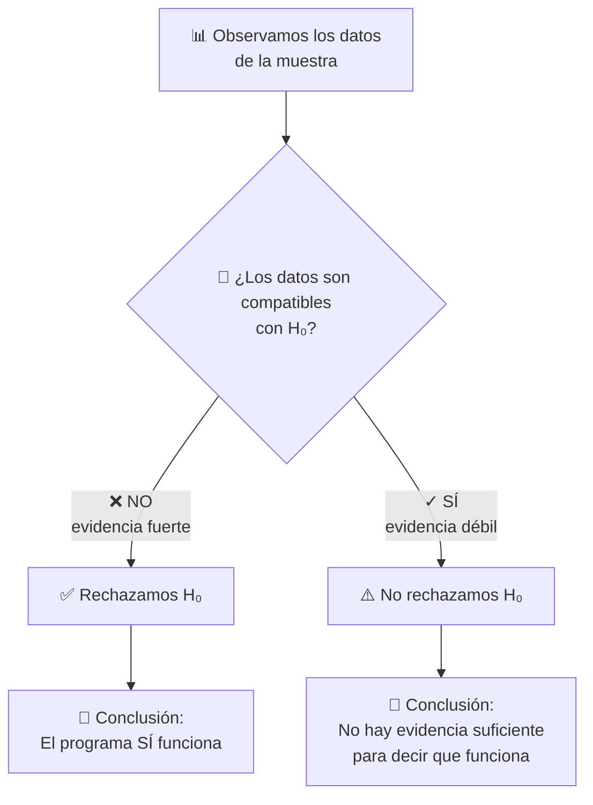
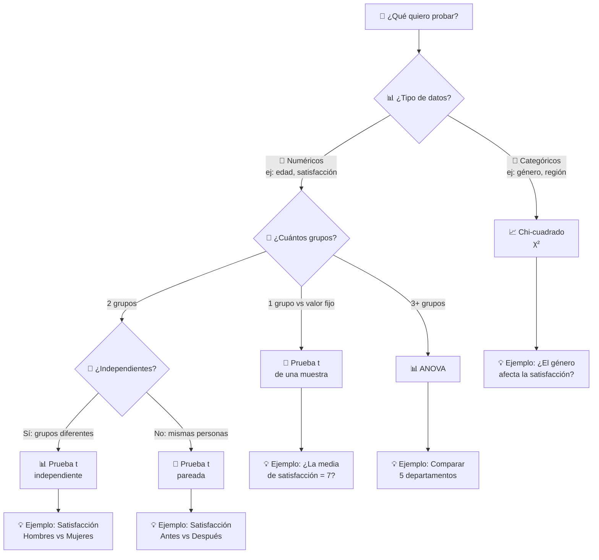

<style src="./styles/tec-theme.css"></style>

# Pruebas de Hipótesis

## Tomando Decisiones Basadas en Evidencia

<div class="pt-12">
  <span class="px-2 py-1 rounded cursor-pointer" hover="bg-white bg-opacity-10">
    CD2001B - Diagnóstico para Líneas de Acción
  </span>
</div>

<div class="abs-br m-6 flex gap-2">
  <span class="text-sm opacity-50">Semana 1 | Tec de Monterrey</span>
</div>

---
layout: center
class: text-center
---

# ¿Qué es una Hipótesis?

<div v-click class="mt-8">

## 🤔 Empecemos con lo Básico

Una **hipótesis** es simplemente una **idea** o **suposición** sobre algo que queremos investigar.

</div>

<div v-click class="mt-8">

### Ejemplos en la Vida Diaria:
- **"Creo que estudiar más horas me ayuda a tener mejores calificaciones"**
- **"Pienso que esta marca de café sabe mejor"**
- **"Esta ONG realmente está ayudando a la comunidad"**

</div>

<div v-click class="mt-8">
<div class="alert alert-info">
💡 <strong>Observa:</strong> Todas estas son solo <strong>ideas</strong> o <strong>creencias</strong>. Aún no sabemos si son ciertas.
</div>
</div>

---

# ¿Qué es una Hipótesis Estadística?

<div v-click class="mt-8">

## 📊 Hipótesis + Datos = Hipótesis Estadística

Es cuando tomamos una **idea** y la convertimos en algo que podemos **probar con números**.

</div>

<div v-click class="mt-8">

### De Idea a Hipótesis Estadística:

**Idea vaga:** "Esta ONG es efectiva"

**Hipótesis estadística:** "El programa de la ONG redujo la desnutrición infantil de 35% a menos de 30%"

</div>

<div v-click class="mt-8">
<div class="alert alert-success">
✅ <strong>Lo importante:</strong> Ahora tenemos <strong>números específicos</strong> que podemos medir y comparar
</div>
</div>

---

# El Propósito: ¿Por Qué Hacemos Esto?

<div v-click class="mt-8">

### 🎯 No se Trata de "Tener Razón"

Cuando hacemos una prueba de hipótesis, **NO** estamos tratando de demostrar que nuestras ideas son correctas.

</div>

<div v-click class="mt-8">

### 🔍 Se Trata de Evaluar la Evidencia

Queremos saber: **¿Los datos que tenemos apoyan nuestra idea, o no?**

</div>

<div v-click class="mt-12">
<div class="alert alert-warning">
⚠️ <strong>Ojo:</strong> A veces los datos nos dirán que nuestra idea original estaba equivocada. ¡Y eso está bien! Es parte del proceso científico.
</div>
</div>

---

# 💡 Analogía para Entender Mejor

## Imagina un Juicio Legal

<div v-click class="mt-8">

Cuando un juez evalúa un caso, funciona de manera **muy similar** a una prueba de hipótesis.

Veamos cómo...

</div>

---

# ⚖️ En un Juicio Legal

<div v-click class="mt-8">

### 1. Presunción de Inocencia

**"El acusado es inocente hasta que se pruebe lo contrario"**

</div>

<div v-click class="mt-8">

### 2. Carga de la Prueba

El fiscal debe presentar **evidencia convincente** para cambiar el veredicto.

</div>

<div v-click class="mt-8">

### 3. El Veredicto

- ✅ **Culpable** → Si hay evidencia suficiente
- ❌ **No culpable** → Si la evidencia NO es suficiente

</div>

<div v-click class="mt-8">
<div class="alert alert-info">
💡 Observa que "No culpable" NO significa "Inocente". Solo significa: "No hay suficiente evidencia para condenar"
</div>
</div>

---

# 📊 En una Prueba de Hipótesis

<div v-click class="mt-8">

### 1. H₀: Hipótesis Nula (Presunción de Inocencia)

**"No hay efecto / No hay diferencia"**

Es como decir: "Asumimos que nada cambió, hasta que los datos demuestren lo contrario"

</div>

<div v-click class="mt-8">

### 2. H₁: Hipótesis Alternativa (La Acusación)

**"SÍ hay efecto / SÍ hay diferencia"**

Es la afirmación que queremos probar con nuestros datos.

</div>

<div v-click class="mt-8">
<div class="alert alert-warning">
⚠️ <strong>Dato importante:</strong> Al igual que en el juicio, empezamos asumiendo que H₀ es cierta (igual que la presunción de inocencia).
</div>
</div>

---

# 🎯 La Decisión Final

<div class="mt-8">

### Basándonos en la Evidencia (Datos)

<div v-click class="mt-8">

**Si la evidencia es suficiente:**
- ✅ Rechazamos H₀
- Concluimos que **SÍ** hay efecto

</div>

<div v-click class="mt-8">

**Si la evidencia NO es suficiente:**
- ❌ NO rechazamos H₀
- Concluimos que **NO tenemos evidencia** de un efecto

</div>

</div>

<div v-click class="mt-12">
<div class="alert alert-danger text-center">
<strong>MUY IMPORTANTE:</strong> "No rechazar H₀" ≠ "Aceptar H₀"
<br><br>
Solo significa: <strong>"No hay suficiente evidencia"</strong>
<br>
(Igual que "No culpable" ≠ "Inocente")
</div>
</div>

---
layout: center
---

# 📚 Ejemplo Práctico: ONG "Comedores Comunitarios"

<div v-click class="mt-8">

## 📋 La Situación

Una ONG implementó un programa de comedores comunitarios para niños en una comunidad vulnerable.

</div>

<div v-click class="mt-8">

### Lo que la ONG afirma:

**"Nuestro programa redujo la desnutrición infantil en la comunidad"**

</div>

<div v-click class="mt-8">
<div class="alert alert-info">
💡 Pero necesitamos **evidencia numérica** para verificar esta afirmación.
</div>
</div>

---

# 📊 Los Datos del Programa

<div class="mt-8">

### Mediciones Realizadas:

<div v-click class="mt-8">

**🔴 ANTES del programa:**
- Tasa de desnutrición infantil: **35%**

</div>

<div v-click class="mt-8">

**🟢 DESPUÉS del programa:**
- Tasa de desnutrición infantil: **28%**
- Medido en una muestra de **150 niños**

</div>

<div v-click class="mt-8">

**📉 Diferencia observada:** 35% - 28% = **7 puntos porcentuales**

</div>

</div>

---

# 🤔 La Pregunta Crítica

<div v-click class="mt-8">

## ¿Esta reducción de 7% es REAL?

</div>

<div v-click class="mt-8">

### Hay dos posibles explicaciones:

</div>

<div v-click class="mt-8">

**1. 🎯 El programa realmente funciona**
- La reducción es un efecto genuino del programa

</div>

<div v-click class="mt-8">

**2. 🎲 Es solo casualidad**
- La muestra aleatoriamente tuvo menos casos de desnutrición
- El programa en realidad no tuvo ningún efecto

</div>

<div v-click class="mt-12">
<div class="alert alert-success text-center">
<strong>¡Aquí entra la Prueba de Hipótesis!</strong>
<br><br>
Nos ayuda a decidir cuál de estas dos explicaciones es más probable, usando <strong>rigor estadístico</strong>.
</div>
</div>

---
layout: default
---

# Paso 1: Plantear las Hipótesis

<div class="mt-8">

### Ahora vamos a formalizar las dos posibles explicaciones

</div>

<div v-click class="mt-12">

### 🔵 H₀: Hipótesis Nula

**"El programa NO tuvo efecto"**

</div>

<div v-click class="mt-8">

**¿Qué significa esto en números?**
- La tasa de desnutrición sigue siendo 35%
- La diferencia que vimos (7%) es solo casualidad de la muestra

</div>

<div v-click class="mt-8">
<div class="alert alert-info">
💡 Esta es nuestra <strong>"posición escéptica"</strong> que intentaremos refutar con evidencia.
</div>
</div>

---

# Paso 1: Plantear las Hipótesis (continuación)

<div v-click class="mt-8">

### 🟢 H₁: Hipótesis Alternativa

**"El programa SÍ redujo la desnutrición"**

</div>

<div v-click class="mt-8">

**¿Qué significa esto en números?**
- La tasa de desnutrición es **realmente menor** a 35%
- La diferencia observada (7%) es un **efecto genuino** del programa

</div>

<div v-click class="mt-8">
<div class="alert alert-success">
✅ Esta es la afirmación que queremos <strong>demostrar con evidencia</strong>.
</div>
</div>

---
layout: center
---

# 🗺️ Proceso de Decisión

<div class="mt-8">



</div>

---
layout: center
---

# 🎲 Analogía para Entender el Valor P

## El Caso de la Moneda

<div v-click class="mt-12">

**Situación:**

Tu amigo lanza una moneda **100 veces** y obtiene **cara 70 veces**.

</div>

<div v-click class="mt-12">

### 🤔 La Gran Pregunta:

**¿La moneda está cargada (trucada)?**

**¿O solo tuvo mucha suerte?**

</div>

---

# 🎲 Planteando las Hipótesis

<div class="mt-8">

<div v-click>

### H₀: Hipótesis Nula

**"La moneda es justa (no está cargada)"**

Si esto es cierto, esperamos que salga cara aproximadamente **50 veces** de 100 lanzamientos.

</div>

<div v-click class="mt-12">

### H₁: Hipótesis Alternativa

**"La moneda está cargada"**

Sale cara más frecuentemente de lo que debería por pura casualidad.

</div>

</div>

---

# 🧮 ¿Qué tan Raro es Obtener 70 Caras?

<div v-click class="mt-8">

Si la moneda **fuera justa** (H₀ es cierta):
- Esperamos aproximadamente **50 caras**
- Podría variar un poco: 45-55 caras sería normal

</div>

<div v-click class="mt-12">

Pero obtener **70 caras** sería:
- ✨ **Extremadamente raro**
- 📊 Probabilidad: ~0.0001 (solo 0.01% de probabilidad)

</div>

<div v-click class="mt-12">
<div class="alert alert-warning text-center">
⚠️ <strong>Valor P bajo:</strong> Los datos observados son muy improbables si H₀ fuera cierta
</div>
</div>

---

# ✅ Conclusión del Experimento de la Moneda

<div v-click class="mt-8">

### Razonamiento:

**SI** la moneda fuera justa (H₀), sería **casi imposible** obtener 70 caras.

</div>

<div v-click class="mt-12">

### Decisión:

Por tanto: **Rechazamos H₀**

</div>

<div v-click class="mt-12">

### Conclusión Final:

La moneda probablemente **está cargada**.

</div>

<div v-click class="mt-12">
<div class="alert alert-success">
💡 Este es exactamente el mismo razonamiento que usamos con los datos de la ONG!
</div>
</div>

---

# 📘 Definición Formal del Valor P

<div class="mt-12">

<div class="math-display text-center">
<strong>Valor P =</strong>
<br><br>
Probabilidad de observar datos tan extremos (o más)
<br>
<strong>SI</strong> la hipótesis nula (H₀) fuera cierta
</div>

</div>

<div v-click class="mt-12">
<div class="alert alert-info">
📌 <strong>En palabras simples:</strong>
<br><br>
¿Qué tan raro/improbable es lo que observamos, <strong>asumiendo que H₀ es verdadera</strong>?
</div>
</div>

---

# 📖 Cómo Leer la Notación Estadística

## Símbolos que Verás Frecuentemente

<div v-click class="mt-8">

### 1. H₀ (se lee: "H sub-cero" o "H cero")

**Significa:** Hipótesis Nula

**Ejemplo:** "H₀: La media es 50" se lee como "La hipótesis nula dice que la media es 50"

</div>

<div v-click class="mt-8">

### 2. H₁ (se lee: "H sub-uno" o "H uno")

**Significa:** Hipótesis Alternativa

**Ejemplo:** "H₁: La media es diferente de 50"

</div>

---

# 📖 Cómo Leer la Notación Estadística (cont.)

<div class="mt-8">

### 3. El símbolo < (se lee: "menor que")

<div v-click class="mt-8">

**P < 0.05** se lee: "P es menor que cero punto cero cinco"

**Significa:** El valor P es más pequeño que 0.05

</div>

<div v-click class="mt-12">

**Ejemplos:**
- P = 0.03 → 0.03 < 0.05 ✅ (Verdadero: 0.03 es menor que 0.05)
- P = 0.12 → 0.12 < 0.05 ❌ (Falso: 0.12 NO es menor que 0.05)

</div>

</div>

<div v-click class="mt-12">
<div class="alert alert-info">
💡 <strong>Tip:</strong> Piensa en el símbolo < como una "boca abierta" que siempre apunta hacia el número más grande.
<br><br>
<code>3 < 5</code> (la boca se abre hacia el 5 porque es más grande)
</div>
</div>

---

# Interpretando el Valor P

## ¿Qué Significa Cada Rango?

<div class="mt-8">

| Valor P | Interpretación | Decisión Típica |
|---------|----------------|-----------------|
| **< 0.01** | Evidencia muy fuerte contra H₀ | Rechazar H₀ (muy seguro) |
| **0.01 - 0.05** | Evidencia fuerte contra H₀ | Rechazar H₀ (seguro) |
| **0.05 - 0.10** | Evidencia débil contra H₀ | Zona gris (depende del contexto) |
| **> 0.10** | Evidencia insuficiente contra H₀ | No rechazar H₀ |

</div>

---

# 🎯 El Umbral Estándar: α = 0.05

<div v-click class="mt-8">

### ¿Qué es α (alfa)?

**α** (se lee "alfa") es el **nivel de significancia**: el umbral que usamos para decidir si rechazamos H₀.

</div>

<div v-click class="mt-12">

### La Regla Más Común:

**α = 0.05** (5%)

**Si P < 0.05 → Rechazamos H₀**

**Si P ≥ 0.05 → NO rechazamos H₀**

</div>

<div v-click class="mt-12">
<div class="alert alert-warning">
⚠️ <strong>¿Qué significa el 5%?</strong>
<br><br>
Estamos aceptando un <strong>5% de riesgo</strong> de rechazar H₀ cuando en realidad es verdadera (Error Tipo I).
</div>
</div>

---

# ✅ Ejemplo: Volviendo a la ONG

<div class="mt-8">

### Resultado de la Prueba:

**P = 0.012** (1.2%)

</div>

<div v-click class="mt-12">

### ¿Qué significa esto?

Hay solo **1.2% de probabilidad** de observar esta reducción (o mayor) si el programa **NO funcionara**.

</div>

<div v-click class="mt-12">

### Decisión:

**P = 0.012 < 0.05** ✅

Por tanto: **Rechazamos H₀**

</div>

<div v-click class="mt-12">
<div class="alert alert-success text-center">
<strong>Conclusión Final:</strong>
<br><br>
Tenemos evidencia suficiente para decir que el programa de la ONG <strong>SÍ es efectivo</strong>.
</div>
</div>

---

# ❌ Ejemplo Alternativo: Evidencia Insuficiente

<div class="mt-8">

### Resultado de una Prueba Diferente:

**P = 0.18** (18%)

</div>

<div v-click class="mt-12">

### ¿Qué significa esto?

Hay **18% de probabilidad** de observar esta diferencia por **pura casualidad**.

</div>

<div v-click class="mt-12">

### Decisión:

**P = 0.18 > 0.05** ❌

Por tanto: **NO rechazamos H₀**

</div>

<div v-click class="mt-12">
<div class="alert alert-danger text-center">
<strong>Conclusión Final:</strong>
<br><br>
NO tenemos evidencia suficiente para decir que el programa funciona.
<br>
(Esto NO significa que "no funciona", solo que no podemos estar seguros con estos datos)
</div>
</div>

---
layout: center
---

# ⚠️ Los Dos Tipos de Error

<div class="mt-8">

### Incluso con pruebas estadísticas, podemos equivocarnos

Como en cualquier decisión basada en evidencia, hay **dos formas** de cometer errores.

</div>

<div v-click class="mt-12">

Veamos esto con un ejemplo que usas todos los días...

</div>

---

# 📱 Ejemplo Gen Z: Filtro de Spam de Instagram

<div class="mt-8">

### La Situación:

Instagram tiene que decidir: **¿Este mensaje es spam o es legítimo?**

</div>

<div v-click class="mt-12">

**H₀ (Hipótesis Nula):** El mensaje es legítimo (no es spam)

**H₁ (Hipótesis Alternativa):** El mensaje es spam

</div>

<div v-click class="mt-12">

### Las Posibles Decisiones:

- **Rechazar H₀** → Marcar el mensaje como spam y bloquearlo
- **No rechazar H₀** → Dejar pasar el mensaje a tu bandeja principal

</div>

---

# 🚨 Error Tipo I: Falso Positivo

<div class="mt-8">

### ¿Qué es?

Rechazar H₀ cuando **en realidad es verdadera**

</div>

<div v-click class="mt-12">

### 📱 En Instagram:

Un mensaje **legítimo** (como una oportunidad de trabajo real) es marcado como **spam** y lo pierdes.

**Consecuencia:** Perdiste algo importante 😢

</div>

<div v-click class="mt-12">

### 📊 En la ONG:

Concluir que el programa **funciona** cuando en realidad **NO tuvo ningún efecto**.

**Consecuencia:** Invertir recursos en un programa inefectivo 💸

</div>

<div v-click class="mt-8">
<div class="alert alert-warning text-center">
<strong>Probabilidad del Error Tipo I:</strong> α = 0.05 (5%)
</div>
</div>

---

# 😔 Error Tipo II: Falso Negativo

<div class="mt-8">

### ¿Qué es?

**NO** rechazar H₀ cuando **en realidad es falsa**

</div>

<div v-click class="mt-12">

### 📱 En Instagram:

Un mensaje de **spam real** (estafa, phishing) pasa como legítimo y llega a tu bandeja.

**Consecuencia:** Podrías caer en una estafa 🚨

</div>

<div v-click class="mt-12">

### 📊 En la ONG:

Concluir que el programa **NO funciona** cuando en realidad **SÍ es efectivo**.

**Consecuencia:** Cancelar un programa que realmente ayudaba 😞

</div>

<div v-click class="mt-8">
<div class="alert alert-info text-center">
<strong>Probabilidad del Error Tipo II:</strong> β (varía según el diseño del estudio)
</div>
</div>

---
layout: default
---

# 📊 Resumen: Tabla de Decisiones

<div class="mt-8">

|  | **H₀ es Verdadera**<br>(No hay efecto real) | **H₀ es Falsa**<br>(Sí hay efecto real) |
|---|---|---|
| **Rechazamos H₀** | ❌ **Error Tipo I** (α = 5%)<br>Falso Positivo | ✅ **Decisión Correcta**<br>Detectamos el efecto |
| **No Rechazamos H₀** | ✅ **Decisión Correcta**<br>No hay efecto y no lo afirmamos | ❌ **Error Tipo II** (β)<br>Falso Negativo |

</div>

---

# 🎯 Analogía: Detector de Humo

<div class="mt-8">

<div v-click>

### Error Tipo I: Falsa Alarma

- El detector **suena cuando NO hay fuego**
- Molesto e inconveniente, pero no peligroso
- Te despierta a las 3am por nada 😴

</div>

<div v-click class="mt-12">

### Error Tipo II: No Detecta el Peligro

- El detector **NO suena cuando SÍ hay fuego** 🔥
- Extremadamente peligroso
- Podría ser fatal

</div>

</div>

<div v-click class="mt-12">
<div class="alert alert-danger">
⚠️ <strong>¿Cuál error prefieres?</strong> En este caso, preferimos Error Tipo I (falsas alarmas) sobre Error Tipo II (no detectar el fuego).
</div>
</div>

---

# 🏥 Analogía: Prueba Médica (COVID-19)

<div class="mt-8">

<div v-click>

### Error Tipo I: Falso Positivo

- La prueba dice que **tienes COVID**, pero en realidad **estás sano**
- Consecuencia: Cuarentena innecesaria, ansiedad, más pruebas
- Molesto, pero no crítico

</div>

<div v-click class="mt-12">

### Error Tipo II: Falso Negativo

- La prueba dice que **NO tienes COVID**, pero en realidad **SÍ estás infectado**
- Consecuencia: Sigues tu vida normal, contagias a otros
- Muy peligroso para ti y los demás

</div>

</div>

<div v-click class="mt-12">
<div class="alert alert-warning">
💡 Por eso algunas pruebas médicas son diseñadas para ser "sensibles" (prefieren Error Tipo I sobre Error Tipo II).
</div>
</div>

---

# ⚖️ El Balance (Trade-off)

<div v-click class="mt-8">

### El Dilema:

No podemos eliminar **completamente** ambos tipos de error al mismo tiempo.

</div>

<div v-click class="mt-12">

### Si somos MÁS estrictos (bajamos α):

- ✅ Reducimos Error Tipo I (menos falsos positivos)
- ❌ Aumentamos Error Tipo II (más falsos negativos)

</div>

<div v-click class="mt-12">

### Si somos MENOS estrictos (subimos α):

- ❌ Aumentamos Error Tipo I (más falsos positivos)
- ✅ Reducimos Error Tipo II (menos falsos negativos)

</div>

<div v-click class="mt-12">
<div class="alert alert-success text-center">
<strong>💡 La Solución:</strong> Aumentar el tamaño de muestra (n) reduce AMBOS errores simultáneamente!
</div>
</div>

---

# 🗺️ Panorama: Tipos de Pruebas de Hipótesis

<div class="mt-8">

### Hay MUCHOS tipos de pruebas estadísticas...

</div>

<div v-click class="mt-8">

Pero **NO te preocupes**: todas siguen la misma lógica que acabamos de aprender.

</div>

<div v-click class="mt-12">

La pregunta clave es: **¿Qué tipo de datos tengo y qué quiero comparar?**

</div>

<div v-click class="mt-12">

Veamos un mapa para ayudarte a decidir cuál usar...

</div>

---
layout: center
---

# 🗺️ Diagrama de Decisión: ¿Qué Prueba Usar?

<div class="text-sm mb-4 opacity-75">
💡 Tip: Haz clic derecho en el diagrama y selecciona "Abrir imagen en nueva pestaña" para verlo más grande
</div>



<div v-click class="mt-8">
<div class="alert alert-info text-sm">
📌 <strong>No te aprendas esto de memoria!</strong> Siempre puedes consultar este diagrama. Lo importante es entender LA LÓGICA detrás de cada prueba.
</div>
</div>

---

# 📏 Prueba t: ¿Qué es y Para Qué Sirve?

<div v-click class="mt-8">

### En Palabras Simples:

La **prueba t** te ayuda a responder: **"¿Estos dos promedios son REALMENTE diferentes, o solo parece por casualidad?"**

</div>

<div v-click class="mt-12">

### 📊 Ejemplo del Día a Día:

Tienes dos grupos de personas que usaron los servicios de la ONG:
- Grupo A (Hombres): Promedio de satisfacción = 7.2
- Grupo B (Mujeres): Promedio de satisfacción = 6.8

</div>

<div v-click class="mt-12">

**Pregunta:** ¿Esta diferencia de 0.4 puntos es significativa, o podría ser solo variación aleatoria?

</div>

<div v-click class="mt-12">
<div class="alert alert-info">
💡 La prueba t toma en cuenta NO SOLO la diferencia, sino también la VARIABILIDAD de los datos y el tamaño de las muestras.
</div>
</div>

---

# 📏 Los 3 Tipos de Prueba t

<div class="mt-8">

<div v-click>

### 1️⃣ Prueba t de Una Muestra

**¿Cuándo?** Cuando quieres comparar el promedio de **un grupo** vs **un valor conocido/esperado**

**Ejemplo ONG:** "¿La satisfacción promedio de nuestros beneficiarios es diferente de 7.0?"

</div>

<div v-click class="mt-8">

### 2️⃣ Prueba t de Dos Muestras Independientes

**¿Cuándo?** Cuando quieres comparar **dos grupos DIFERENTES** de personas

**Ejemplo ONG:** "¿La satisfacción de hombres es diferente a la de mujeres?"

</div>

<div v-click class="mt-8">

### 3️⃣ Prueba t Pareada (Antes/Después)

**¿Cuándo?** Cuando mides a **las MISMAS personas** en dos momentos diferentes

**Ejemplo ONG:** "¿La satisfacción ANTES del programa es diferente a la satisfacción DESPUÉS?"

</div>

</div>

---

# 📊 Ejemplo Paso a Paso: Satisfacción por Género

<div class="mt-8">

### 📋 Los Datos de la ONG:

<div v-click>

- **Hombres:** Media = 7.2, Desviación Estándar = 1.5, n = 80 personas
- **Mujeres:** Media = 6.8, Desviación Estándar = 1.3, n = 120 personas

</div>

</div>

<div v-click class="mt-12">

### ❓ La Pregunta:

¿La satisfacción de hombres es **significativamente diferente** a la de mujeres?

</div>

<div v-click class="mt-12">

### 📝 Planteamos las Hipótesis:

- **H₀:** No hay diferencia (las medias son iguales: μ₁ = μ₂)
- **H₁:** SÍ hay diferencia (las medias son diferentes: μ₁ ≠ μ₂)

</div>

---

# 🐍 Prueba t en Python (SciPy)

```python {all|1-2|4-7|9-10|12-13|15-18|all}
from scipy import stats
import numpy as np

# Datos (simulados para el ejemplo)
hombres = np.random.normal(7.2, 1.5, 80)  # Media=7.2, DE=1.5, n=80
mujeres = np.random.normal(6.8, 1.3, 120) # Media=6.8, DE=1.3, n=120

# Realizar prueba t de dos muestras independientes
t_statistic, p_value = stats.ttest_ind(hombres, mujeres)

# Mostrar resultados
print(f"Estadístico t: {t_statistic:.3f}")
print(f"Valor P: {p_value:.4f}")

# Decisión
if p_value < 0.05:
    print("✅ Rechazamos H₀: HAY diferencia significativa")
else:
    print("❌ No rechazamos H₀: NO hay evidencia de diferencia")
```

<div v-click class="mt-4">
<div class="alert alert-info text-sm">
📚 <strong>Documentación:</strong> <a href="https://docs.scipy.org/doc/scipy/reference/generated/scipy.stats.ttest_ind.html" target="_blank">scipy.stats.ttest_ind()</a>
</div>
</div>

---

# 📊 Interpretando los Resultados

<div class="mt-8">

### Resultado del Código:

<div v-click>

```
Estadístico t: 2.05
Valor P: 0.042
```

</div>

</div>

<div v-click class="mt-12">

### ✅ Decisión:

**P = 0.042 < 0.05** → Rechazamos H₀

</div>

<div v-click class="mt-12">

### 💡 Conclusión en Lenguaje Simple:

Hay evidencia estadísticamente significativa de que la satisfacción de **hombres** es **mayor** que la de **mujeres**.

</div>

<div v-click class="mt-12">
<div class="alert alert-success">
<strong>🎯 Acción Recomendada para la ONG:</strong>
<br><br>
Investigar POR QUÉ las mujeres tienen menor satisfacción y diseñar intervenciones específicas para mejorar su experiencia.
</div>
</div>

---

# 📋 Resumen: Conceptos Clave

<div class="mt-8">

| Concepto | Definición | Aplicación |
|----------|------------|------------|
| **H₀** | Hipótesis nula: "No hay efecto" | Punto de partida escéptico |
| **H₁** | Hipótesis alternativa: "SÍ hay efecto" | Lo que queremos probar |
| **p-value** | Probabilidad de los datos si H₀ fuera cierta | Si p < 0.05 → rechazamos H₀ |
| **α** | Nivel de significancia (usualmente 0.05) | Umbral para decisión |
| **Error Tipo I** | Rechazar H₀ cuando es verdadera (falso positivo) | α = 5% de riesgo |
| **Error Tipo II** | No rechazar H₀ cuando es falsa (falso negativo) | β (varía) |

</div>

---

# 🛠️ Las 3 Pruebas t que Aprendiste

<div class="mt-8">

| Tipo | Cuándo Usarla | Función Python | Ejemplo ONG |
|------|---------------|----------------|-------------|
| **t de 1 muestra** | 1 grupo vs valor conocido | `ttest_1samp(datos, valor)` | ¿Satisfacción = 7.0? |
| **t independiente** | 2 grupos diferentes | `ttest_ind(grupo1, grupo2)` | Hombres vs Mujeres |
| **t pareada** | Mismas personas, 2 momentos | `ttest_rel(antes, despues)` | Antes vs Después |

</div>

<div v-click class="mt-12">
<div class="alert alert-success">
✅ Con estas 3 pruebas puedes responder la mayoría de las preguntas sobre **comparación de promedios** en el contexto de ONGs
</div>
</div>

---

# ✅ Checklist de Comprensión

<div class="mt-8">

Antes de ir al Workshop, verifica que puedas:

<div v-click class="mt-8">

### Conceptos:
- [ ] Explicar qué es H₀ y H₁
- [ ] Interpretar correctamente un p-value
- [ ] Distinguir entre "rechazar" y "no rechazar" H₀
- [ ] Explicar Error Tipo I y Tipo II con ejemplos

</div>

<div v-click class="mt-8">

### Aplicación:
- [ ] Decidir qué tipo de prueba t usar según el escenario
- [ ] Plantear hipótesis correctamente
- [ ] Leer e interpretar resultados de Python
- [ ] Conectar resultados estadísticos con acciones para la ONG

</div>

</div>

---
layout: center
class: text-center
---

# 🎯 Próximos Pasos

<div class="mt-12">

<div v-click>

## 1️⃣ Practica con el Ejercicio

Aplica estos conceptos con el dataset de prueba antes del Workshop 1

</div>

<div v-click class="mt-8">

## 2️⃣ Workshop 1

Usa pruebas t con datos reales de ONGs

</div>

<div v-click class="mt-8">

## 3️⃣ Semana 2: Más Herramientas

Aprenderás Chi-Cuadrada, ANOVA, y Regresión para casos más complejos

</div>

</div>

<div v-click class="mt-12">
<div class="text-2xl font-bold text-gradient">
¡Ahora tienes las bases para analizar datos con rigor estadístico! 📊
</div>
</div>

---
layout: end
class: text-center
---

# ¡Gracias!

<div class="pt-12">
  <span class="text-6xl">📊</span>
</div>

### Preguntas

<div class="abs-br m-6 flex gap-2">
  <span class="text-sm opacity-50">CD2001B | Tec de Monterrey Campus Puebla</span>
</div>
