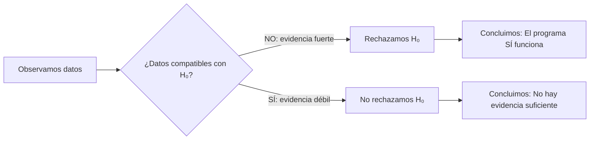
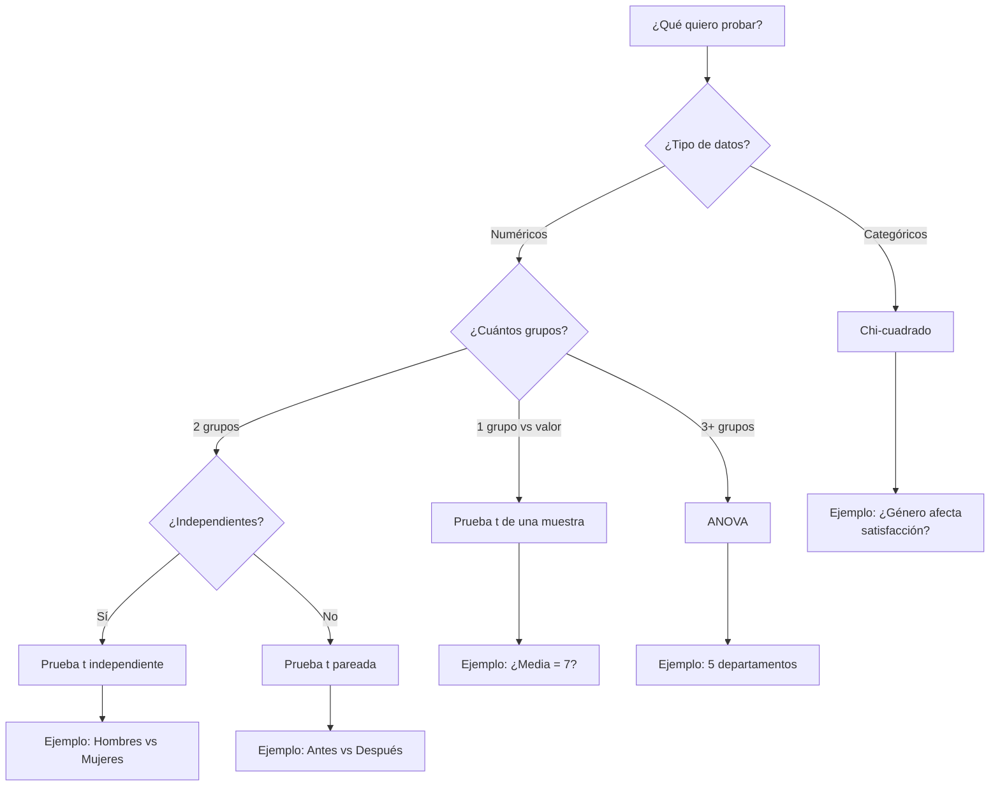
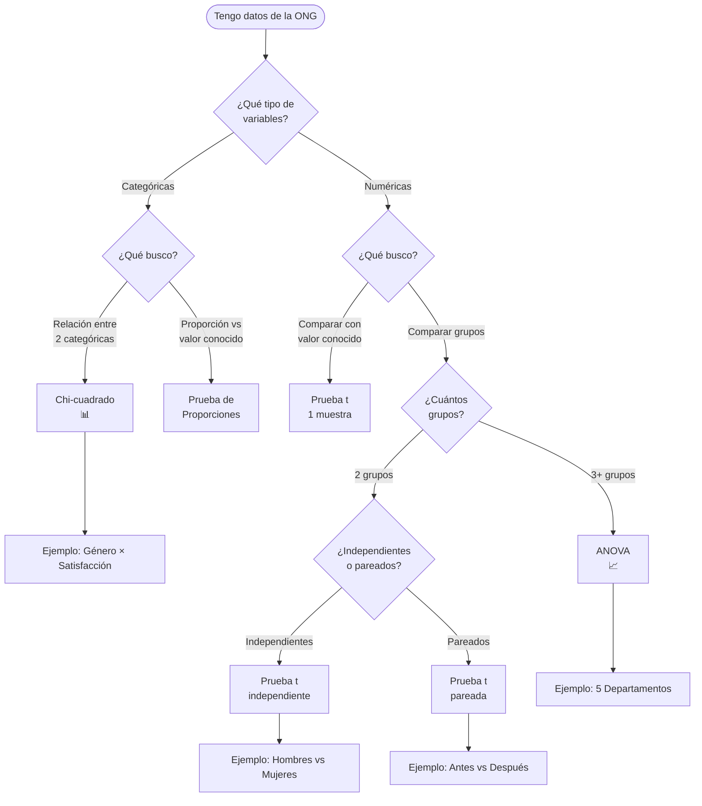

# Pruebas de Hipótesis

## Tomando Decisiones Basadas en Evidencia

  
    CD2001B - Diagnóstico para Líneas de Acción
  

  Semana 1 | Tec de Monterrey

---
layout: center
class: text-center
---

# ¿Qué es una Hipótesis Estadística?

### 🤔 En la Vida Diaria
**"Creo que esta ONG es efectiva"**

**"Pienso que el programa mejoró la situación"**

### 📊 En Estadística
Una **afirmación específica** sobre un parámetro poblacional que podemos **poner a prueba** con datos

<strong>Clave:</strong> No se trata de "probar que tenemos razón", sino de <strong>evaluar la evidencia</strong>

---
layout: two-cols
---

# Analogía: El Juicio Legal

### ⚖️ Sistema de Justicia

**Presunción de inocencia**
- "El acusado es inocente hasta que se pruebe lo contrario"

**Carga de la prueba**
- El fiscal debe presentar evidencia convincente

**Veredicto**
- Culpable (evidencia suficiente)
- No culpable (evidencia insuficiente)

::right::

### 📊 Prueba de Hipótesis

**H₀: Hipótesis Nula**
- "No hay efecto / No hay diferencia"

**H₁: Hipótesis Alternativa**
- La afirmación que queremos probar

**Decisión**
- Rechazar H₀ (evidencia suficiente)
- No rechazar H₀ (evidencia insuficiente)

<strong>Importante:</strong> "No rechazar H₀" ≠ "Aceptar H₀"
 
Solo significa "no hay suficiente evidencia"

---
layout: center
---

# Caso de la ONG: "Comedores Comunitarios"

### 📋 Situación

La ONG afirma:
**"Nuestro programa redujo la desnutrición infantil en la comunidad"**

**Antes del programa:**
- Desnutrición infantil: 35%

**Después del programa:**
- Desnutrición infantil: 28%
- (Medido en muestra de 150 niños)

### 🤔 Pregunta Crítica

**¿Esta diferencia de 7% es real?**

¿O podría ser solo casualidad debido a la variabilidad aleatoria de la muestra?

<strong>Aquí entra la prueba de hipótesis:</strong> 
Nos ayuda a responder con rigor estadístico

---
layout: default
---

# Paso 1: Plantear las Hipótesis

### H₀: Hipótesis Nula
**"El programa NO tuvo efecto"**

Matemáticamente:
- La tasa de desnutrición sigue siendo 35%
- La diferencia observada es pura casualidad

Esta es nuestra <strong>"posición escéptica"</strong> que intentaremos refutar con evidencia

### H₁: Hipótesis Alternativa
**"El programa SÍ redujo la desnutrición"**

Matemáticamente:
- La tasa de desnutrición es menor a 35%
- La diferencia observada es real

Esta es la afirmación que queremos <strong>demostrar con evidencia</strong>

---
layout: center
---

# El Valor P: ¿Qué tan Rara es Esta Evidencia?

### 🎲 Analogía de las Monedas

**Situación:** Tu amigo lanza una moneda 100 veces y sale **cara 70 veces**

**Pregunta:** ¿La moneda está cargada, o fue suerte?

### Con Moneda Justa
- Esperamos ~50 caras
- 70 caras sería **extremadamente raro**
- Probabilidad: ~0.0001 (0.01%)

<strong>Valor P bajo:</strong> Los datos son muy improbables bajo H₀

### Conclusión
Si la moneda fuera justa (H₀), sería casi imposible obtener 70 caras

Por tanto: **Rechazamos H₀**

Concluimos: La moneda probablemente está cargada

<strong>Valor P =</strong> Probabilidad de observar datos tan extremos (o más)  
<strong>SI</strong> la hipótesis nula fuera cierta

---
layout: default
---

# Interpretando el Valor P

| Valor P | Interpretación | Decisión Típica |
|---------|----------------|-----------------|
| **< 0.01** | Evidencia muy fuerte contra H₀ | Rechazar H₀ (muy seguro) |
| **0.01 - 0.05** | Evidencia fuerte contra H₀ | Rechazar H₀ (seguro) |
| **0.05 - 0.10** | Evidencia débil contra H₀ | Zona gris (depende del contexto) |
| **> 0.10** | Evidencia insuficiente contra H₀ | No rechazar H₀ |

<strong>Nivel de significancia α = 0.05</strong>
 
Es el umbral más común: si <strong>P < 0.05</strong>, rechazamos H₀
 
Significa que aceptamos un <strong>5% de riesgo</strong> de equivocarnos

### ✅ Volviendo a la ONG
**P = 0.012** (1.2%)

Conclusión: Solo hay 1.2% de probabilidad de ver esta reducción si el programa NO funcionara

**Decisión:** Rechazar H₀ → El programa SÍ es efectivo

### ❌ Ejemplo Alternativo
**P = 0.18** (18%)

Conclusión: Hay 18% de probabilidad de ver esta reducción por pura casualidad

**Decisión:** No rechazar H₀ → Evidencia insuficiente

---
layout: center
---

# Los Dos Tipos de Error

### ⚖️ Volviendo al Juicio Legal

### 🚨 Error Tipo I (Falso Positivo)
**Condenar a un inocente**

En estadística:
- Rechazar H₀ cuando es verdadera
- Concluir que hay efecto cuando NO lo hay

**Probabilidad:** α = 0.05 (5%)

<strong>Ejemplo ONG:</strong> Decir que el programa funciona cuando en realidad no tuvo efecto

### 😔 Error Tipo II (Falso Negativo)
**Absolver a un culpable**

En estadística:
- No rechazar H₀ cuando es falsa
- Concluir que NO hay efecto cuando SÍ lo hay

**Probabilidad:** β (varía según diseño)

<strong>Ejemplo ONG:</strong> Decir que el programa NO funciona cuando en realidad sí tuvo efecto

---
layout: default
---

# Tabla de Decisiones y Errores

|  | **H₀ es Verdadera** (No hay efecto real) | **H₀ es Falsa** (Sí hay efecto real) |
|---|---|---|
| **Rechazamos H₀** | ❌ **Error Tipo I** (α = 5%)   Falso Positivo | ✅ **Decisión Correcta**   Detectamos el efecto |
| **No Rechazamos H₀** | ✅ **Decisión Correcta**   No hay efecto y no lo afirmamos | ❌ **Error Tipo II** (β)   Falso Negativo |

### 🎯 Analogía: Detector de Humo
**Error Tipo I:** Falsa alarma
- Suena cuando NO hay fuego
- Molesto, pero preferible a lo contrario

**Error Tipo II:** No detecta fuego real
- NO suena cuando SÍ hay fuego
- Peligroso

### 🏥 Analogía: Prueba Médica
**Error Tipo I:** Falso positivo
- Diagnóstico de enfermedad cuando estás sano
- Genera ansiedad, pruebas innecesarias

**Error Tipo II:** Falso negativo
- NO diagnostica enfermedad cuando la tienes
- Muy peligroso, retrasa tratamiento

<strong>Trade-off:</strong> Reducir α (ser más estricto) aumenta β (más difícil detectar efectos reales)
 
<strong>Solución:</strong> Aumentar tamaño de muestra reduce AMBOS errores

---
layout: center
---

# Tipos de Pruebas de Hipótesis

---
layout: two-cols
---

# Prueba t: Comparar Medias

### 🔍 ¿Cuándo usar?
Comparar promedios de datos numéricos

**Tipos:**

1️⃣ **Una muestra**
- Comparar promedio vs valor conocido
- Ejemplo: ¿Media de satisfacción = 7?

2️⃣ **Dos muestras independientes**
- Comparar dos grupos diferentes
- Ejemplo: Hombres vs Mujeres

3️⃣ **Muestras pareadas**
- Comparar antes/después en mismas personas
- Ejemplo: Pre-programa vs Post-programa

::right::

### 📊 Ejemplo: Satisfacción por Género

**Datos de la ONG:**
- **Hombres:** Media = 7.2, DE = 1.5, n = 80
- **Mujeres:** Media = 6.8, DE = 1.3, n = 120

**Hipótesis:**
- H₀: No hay diferencia (μ₁ = μ₂)
- H₁: Sí hay diferencia (μ₁ ≠ μ₂)

**Resultado:**
- Prueba t independiente
- **P = 0.042**

**Conclusión:**
✅ Rechazamos H₀ (P < 0.05)
Hay evidencia de diferencia significativa

<strong>Interpretación práctica:</strong>
La satisfacción de hombres es significativamente mayor que la de mujeres
 
<strong>Acción:</strong> Investigar por qué y mejorar servicios para mujeres

---
layout: two-cols
---

# Chi-cuadrado: Datos Categóricos

### 🔍 ¿Cuándo usar?
Cuando trabajas con **frecuencias** o **proporciones**

**Ejemplos de uso:**
- ¿El género afecta la satisfacción (Alta/Media/Baja)?
- ¿La zona geográfica afecta el tipo de necesidad?
- ¿El nivel educativo se relaciona con conocimiento de la ONG?

### 📊 Tabla de Contingencia

**Satisfacción × Género**

|  | Alta | Media | Baja | Total |
|---|------|-------|------|-------|
| **Hombres** | 45 | 25 | 10 | 80 |
| **Mujeres** | 50 | 50 | 20 | 120 |

::right::

### 🧮 La Lógica
**Si no hubiera relación (H₀):**
- Esperaríamos distribución proporcional
- Hombres: 56.25% Alta (igual que mujeres)

**Observamos:**
- Hombres: 56.25% Alta ✓
- Mujeres: 41.67% Alta ✗

**Pregunta:**
¿Esta diferencia es significativa o casualidad?

### 📈 Resultado

**Chi-cuadrado = 6.8**
- **P = 0.033**
- gl = 2 (grados de libertad)

**Conclusión:**
✅ Rechazamos H₀ (P < 0.05)
Sí hay relación entre género y satisfacción

<strong>Limitación:</strong> Chi-cuadrado dice que HAY relación, pero no qué tan fuerte ni en qué dirección

---
layout: center
---

# ANOVA: Comparar Múltiples Grupos

### 🔍 ¿Cuándo usar?
Comparar medias de **3 o más grupos** simultáneamente

### 🚫 ¿Por qué NO hacer múltiples pruebas t?

**Problema:** Si comparas 5 departamentos de 2 en 2:
- Necesitas 10 pruebas t
- Con α = 0.05 cada una
- Probabilidad de Error Tipo I acumulado: **40%**

Mientras más pruebas hagas, más probabilidad de encontrar "diferencias" por pura casualidad

### ✅ ANOVA al Rescate

**Solución:** Una sola prueba que compara todos los grupos a la vez

**Hipótesis:**
- H₀: Todas las medias son iguales
- H₁: Al menos una media es diferente

**Ventaja:**
- Mantiene α = 0.05 global
- Más eficiente estadísticamente

---
layout: default
---

# Ejemplo ANOVA: Satisfacción por Departamento

**5 Departamentos de la ONG evaluados:**

| Departamento | Media | Desviación | n |
|--------------|-------|------------|---|
| Legal | 8.85 | 0.21 | 40 |
| Trámites | 5.95 | 1.48 | 45 |
| Atención Social | 7.80 | 0.65 | 50 |
| Psicología | 8.10 | 0.45 | 35 |
| Administración | 6.20 | 1.20 | 30 |

### 📊 Resultado ANOVA

**F = 45.3**
**P < 0.001**

**Conclusión:**
✅ Rechazamos H₀
Al menos un departamento tiene media significativamente diferente

### 🤔 ¿Y ahora qué?

ANOVA solo dice que **HAY diferencias**, no **DÓNDE** están

**Siguiente paso:**
Pruebas post-hoc (ej: Tukey)
- Comparan todos los pares
- Ajustan α para controlar error

<strong>Hallazgos post-hoc (Tukey):</strong>
<ul>
<li>Legal y Psicología: estadísticamente iguales (P = 0.42)</li>
<li>Trámites y Administración: estadísticamente iguales (P = 0.68)</li>
<li>Legal vs Trámites: <strong>diferencia significativa</strong> (P < 0.001) → 2.9 puntos de diferencia</li>
</ul>
<strong>Implicación:</strong> Trámites necesita intervención urgente

---
layout: center
---

# Árbol de Decisión: ¿Qué Prueba Usar?

---
layout: default
---

# Caso Práctico Completo: ONG "Manos Unidas"

### 📋 Contexto
La ONG implementó un **programa de capacitación en habilidades digitales** para adultos mayores

**Objetivo del diagnóstico:**
¿El programa mejoró significativamente las habilidades digitales?

### 📊 Datos Recolectados

**Diseño:** Antes-Después con mismo grupo
- n = 60 adultos mayores
- Prueba de habilidades digitales (0-100)

**Resultados:**
- **Antes:** Media = 42.5, DE = 12.3
- **Después:** Media = 58.2, DE = 14.1
- **Diferencia promedio:** +15.7 puntos

### 🧮 Análisis

**1. Identificar prueba apropiada:**
- Datos numéricos ✓
- Mismo grupo medido 2 veces ✓
- **→ Prueba t pareada**

**2. Plantear hipótesis:**
- H₀: No hay cambio (μ_después = μ_antes)
- H₁: Hay mejora (μ_después > μ_antes)

**3. Nivel de significancia:**
- α = 0.05

---
layout: default
---

# Caso Práctico: Resultados e Interpretación

### 📈 Resultados Estadísticos

**Prueba t pareada:**
- t = 6.84
- gl = 59
- **P < 0.001**

**Intervalo de confianza 95%:**
- Diferencia: 15.7 ± 4.6
- IC: [11.1, 20.3]

### ✅ Decisión

**P < 0.001** (muy inferior a 0.05)

**Conclusión estadística:**
Rechazamos H₀ con alta confianza

Hay evidencia muy fuerte de que el programa mejoró las habilidades digitales

**Tamaño del efecto:**
+15.7 puntos (26% de mejora relativa)

### 💡 Interpretación Práctica para la ONG

**Lo que SÍ podemos afirmar:**
- El programa produjo una mejora estadísticamente significativa
- La mejora promedio fue de ~16 puntos en la escala 0-100
- El efecto es consistente (intervalo de confianza no incluye cero)

**Lo que NO podemos afirmar:**
- Que la mejora se mantendrá a largo plazo (necesitamos seguimiento)
- Que sea el único factor (no hay grupo control sin intervención)
- Que funcione igual en otras poblaciones

**Recomendación:**
✅ Continuar y expandir el programa
✅ Hacer seguimiento a 6 meses
✅ Considerar grupo control en siguiente iteración

---
layout: default
---

# Errores Comunes al Interpretar Pruebas de Hipótesis

### ❌ Error 1: "P = 0.04 significa que hay 4% de probabilidad de que H₀ sea cierta"

**Incorrecto.** El valor P es la probabilidad de los datos **dado que H₀ es cierta**, no la probabilidad de que H₀ sea cierta.

<strong>Correcto:</strong> "Si el programa no tuviera efecto (H₀), habría solo 4% de probabilidad de observar una mejora tan grande como la que vimos"

### ❌ Error 2: "No rechazar H₀ significa que H₀ es verdadera"

**Incorrecto.** Solo significa que no tenemos suficiente evidencia para rechazarla.

<strong>Correcto:</strong> "No encontramos evidencia suficiente de que el programa tenga efecto. Esto puede deberse a que realmente no funciona, o a que nuestra muestra es muy pequeña para detectarlo"

### ❌ Error 3: "P = 0.001 significa un efecto más grande que P = 0.04"

**Incorrecto.** El valor P mide la **fuerza de la evidencia**, no el **tamaño del efecto**.

<strong>Ejemplo:</strong> Una mejora de 2 puntos con n=1000 puede dar P < 0.001 (evidencia fuerte), mientras que una mejora de 20 puntos con n=10 puede dar P = 0.08 (evidencia débil). El efecto de 20 puntos es mucho mayor, pero menos confiable estadísticamente.

---
layout: default
---

# Significancia Estadística vs Significancia Práctica

### 📊 Significancia Estadística

**Pregunta:** ¿Es poco probable que la diferencia sea casualidad?

**Respuesta:** Valor P

**Factores que la afectan:**
- Tamaño del efecto
- Tamaño de la muestra
- Variabilidad de los datos

Con <strong>muestra muy grande</strong>, incluso diferencias minúsculas pueden ser estadísticamente significativas

### 💼 Significancia Práctica

**Pregunta:** ¿Es la diferencia lo suficientemente grande como para importar en la práctica?

**Respuesta:** Contexto y juicio profesional

**Factores que la afectan:**
- Costo de implementación
- Impacto en beneficiarios
- Viabilidad operativa

Una diferencia puede ser estadísticamente significativa pero <strong>irrelevante en la práctica</strong>

### 📌 Ejemplo Ilustrativo

**Caso:** Prueba de nuevo método de enseñanza en 10,000 estudiantes

**Resultado estadístico:**
- Mejora promedio: 0.5 puntos (en escala 0-100)
- **P < 0.001** (altamente significativo)

**Análisis práctico:**
- Implementar nuevo método cuesta $500,000
- Mejora de 0.5 puntos es imperceptible
- Entrenar a 200 profesores requiere 6 meses

**Decisión:** A pesar de P < 0.001, **NO implementar** porque la mejora es trivial en la práctica

---
layout: default
---

# Tamaño del Efecto: Complemento Esencial

### 🔍 Medidas de Tamaño del Efecto

**d de Cohen (para pruebas t):**

d = (Media₁ - Media₂) / Desviación Estándar Combinada

**Interpretación:**
- d = 0.2 → Efecto pequeño
- d = 0.5 → Efecto mediano
- d = 0.8 → Efecto grande

### 📊 Ejemplo: Programa de Capacitación

**Datos:**
- Media antes: 42.5 (DE = 12.3)
- Media después: 58.2 (DE = 14.1)
- Diferencia: 15.7 puntos

**Cálculo:**
- d = 15.7 / 13.2 = **1.19**

### 💡 Interpretación

**d = 1.19 → Efecto MUY GRANDE**

Esto significa:
- La mejora es de más de 1 desviación estándar
- Es tanto estadísticamente significativa (P < 0.001)
- **COMO** prácticamente importante

**Decisión:** ✅ Fuerte evidencia de efectividad real

<strong>Buena práctica:</strong> Reportar SIEMPRE tanto el valor P (significancia estadística) como el tamaño del efecto (significancia práctica)
  
<strong>Ejemplo de reporte completo:</strong>
"El programa mejoró significativamente las habilidades digitales (t = 6.84, P < 0.001, d = 1.19), con una mejora promedio de 15.7 puntos [IC 95%: 11.1-20.3]. El tamaño del efecto es grande, indicando no solo significancia estadística sino también relevancia práctica."

---
layout: center
class: text-center
---

# Resumen: Lecciones Clave

### 1️⃣ Las pruebas de hipótesis evalúan **evidencia**, no prueban "verdades absolutas"

### 2️⃣ Valor P pequeño (< 0.05) → Evidencia fuerte contra H₀

### 3️⃣ Hay dos tipos de error: condenar a un inocente (Tipo I) vs absolver a un culpable (Tipo II)

### 4️⃣ Elegir la prueba correcta depende del tipo de datos y diseño del estudio

### 5️⃣ Significancia estadística ≠ Significancia práctica

### 6️⃣ Reportar siempre: valor P + tamaño del efecto + intervalo de confianza

---
layout: two-cols
---

# Checklist para Tu Diagnóstico

### ✅ Antes de Recolectar Datos

- [ ] ¿Qué pregunta específica quiero responder?
- [ ] ¿Cuál es mi H₀ y H₁?
- [ ] ¿Qué tipo de datos necesito? (numéricos/categóricos)
- [ ] ¿Cuál es mi nivel de significancia? (α)
- [ ] ¿Qué tamaño de muestra necesito?

### ✅ Durante el Análisis

- [ ] ¿Qué prueba es apropiada para mis datos?
- [ ] ¿Se cumplen los supuestos de la prueba?
- [ ] ¿Cuál es el valor P?
- [ ] ¿Cuál es el tamaño del efecto?
- [ ] ¿Cuál es el intervalo de confianza?

::right::

### ✅ Al Interpretar Resultados

- [ ] ¿Rechazo o no rechazo H₀?
- [ ] ¿Qué significa esto en términos prácticos?
- [ ] ¿El efecto es grande o pequeño?
- [ ] ¿Es relevante para la ONG?
- [ ] ¿Qué limitaciones tiene mi análisis?

### ✅ Al Reportar a la ONG

- [ ] Explicar en lenguaje sencillo
- [ ] Incluir tanto resultados estadísticos como interpretación práctica
- [ ] Mencionar limitaciones y supuestos
- [ ] Dar recomendaciones accionables
- [ ] Sugerir pasos siguientes

<strong>Recuerda:</strong> El objetivo no es solo hacer cálculos correctos, sino <strong>generar insights útiles</strong> para que la ONG tome mejores decisiones

---
layout: center
class: text-center
---

# Para Tu Workshop

### 📊 Aplicarás estos conceptos con datos reales de ONGs

### 🔍 Identificarás qué prueba usar en cada caso

### 📈 Interpretarás resultados de Python (pandas, scipy)

### 💡 Generarás recomendaciones basadas en evidencia

<strong>Recuerda:</strong> La estadística es una herramienta para tomar <strong>mejores decisiones</strong>, no un fin en sí misma
  
Tu objetivo es ayudar a las ONGs a entender si sus programas funcionan y cómo mejorarlos

---
layout: end
class: text-center
---

# ¡Gracias!

  📊

### Preguntas

  CD2001B | Tec de Monterrey Campus Puebla

