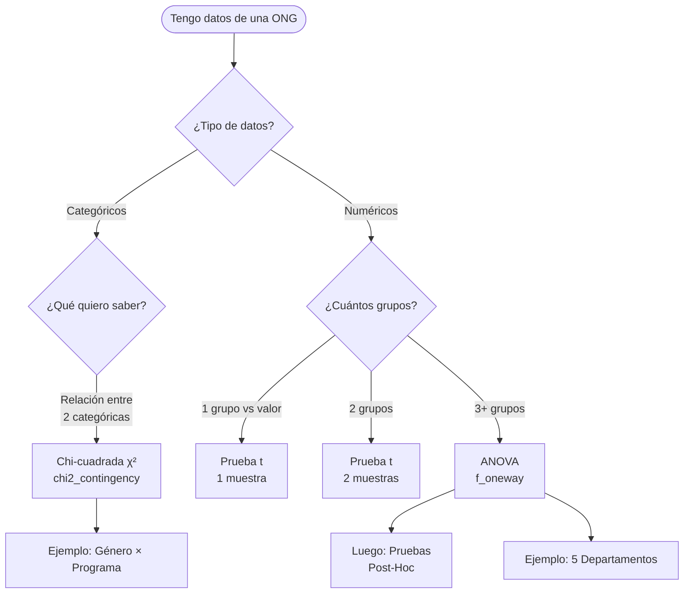

# Semana2 Chi Cuadrada Anova

> **Curso:** CD2001B - Diagnóstico para Líneas de Acción
> **Tecnológico de Monterrey - Campus Puebla**

---

# Chi-Cuadrada (χ²) y ANOVA

## Comparando Grupos y Categorías

    CD2001B - Diagnóstico para Líneas de Acción

  Semana 2 | Tec de Monterrey

---

# ¿Por Qué Necesitamos Más Pruebas Estadísticas?

## 🤔 El Problema

**Semana 1:** Aprendimos prueba t para comparar promedios
- ✅ Un grupo vs. un valor
- ✅ Dos grupos

## 🚧 Pero... ¿Qué pasa cuando?

- 📊 Tengo **3+ grupos** que comparar (no solo 2)
- 🏷️ Mis datos son **categorías**, no números

Necesitamos nuevas herramientas: Chi-Cuadrada y ANOVA

---

# Chi-Cuadrada (χ²)

## Para Variables Categóricas

---

# 🗣️ Primero: ¿Cómo se Pronuncia?

## Chi = "JI"

Como en "**JI**tomate" 🍅

Se escribe: **χ²** (letra griega chi al cuadrado)

## Se dice:

**"Ji-cuadrada"** o **"Chi-cuadrada"**

💡 No te estreses por el símbolo. Python lo calcula por ti. Lo importante es saber **cuándo y cómo usarlo**.

---

# ¿Qué es Chi-Cuadrada?

## En Palabras Simples:

Una prueba para saber si **dos variables categóricas** están relacionadas.

## Variables Categóricas = Etiquetas/Grupos

**Ejemplos:**
- Género: Masculino, Femenino, No binario
- Región: Norte, Sur, Centro
- Satisfacción: Alta, Media, Baja
- Tipo de programa: Educación, Salud, Vivienda

⚠️ **NO** para números (edad, peso, satisfacción en escala 1-10). Para esos usa prueba t o ANOVA.

---

# 🎯 Ejemplo Real: ONG "Manos Unidas"

## La Pregunta:

Una ONG quiere saber: **¿El género de los beneficiarios está relacionado con el tipo de programa que eligen?**

**Variables:**
- **Género:** Masculino, Femenino
- **Programa:** Educación, Salud, Vivienda

## Las Hipótesis:

- **H₀:** NO hay relación (género y programa son independientes)
- **H₁:** SÍ hay relación (ciertos géneros prefieren ciertos programas)

---

# 📊 Los Datos: Tabla de Contingencia

|  | Educación | Salud | Vivienda | **Total** |
|---|---|---|---|---|
| **Masculino** | 45 | 30 | 25 | 100 |
| **Femenino** | 25 | 55 | 20 | 100 |
| **Total** | 70 | 85 | 45 | 200 |

## 🤔 Observación Rápida:

- **Mujeres:** Prefieren Salud (55 vs 30)
- **Hombres:** Prefieren Educación (45 vs 25)

**Pero... ¿es esta diferencia significativa o solo casualidad?**

---

# 🧮 ¿Cómo Funciona Chi-Cuadrada?

## La Lógica:

### 1️⃣ Calcular Frecuencias Esperadas

**Si NO hubiera relación** (H₀ es cierta), ¿qué frecuencias esperaríamos?

**Fórmula:**
```
Esperado = (Total fila × Total columna) / Gran total
```

**Ejemplo:** Masculino + Educación
```
Esperado = (100 × 70) / 200 = 35
```

**Observado:** 45

### 2️⃣ Comparar Observado vs Esperado

Si la diferencia entre lo observado y lo esperado es **grande** → probablemente hay relación

---

# 🐍 Chi-Cuadrada en Python

```python {all|1-2|4-8|10-11|13-16|all}
from scipy.stats import chi2_contingency
import numpy as np

# Tabla de contingencia
tabla = np.array([
    [45, 30, 25],  # Masculino: Educ, Salud, Vivienda
    [25, 55, 20]   # Femenino: Educ, Salud, Vivienda
])

# Realizar prueba chi-cuadrada
chi2, p_value, df, expected = chi2_contingency(tabla)

# Mostrar resultados
print(f"Chi-cuadrado (χ²): {chi2:.2f}")
print(f"p-value: {p_value:.4f}")
print(f"Grados de libertad: {df}")
```

**Resultado:**
```
Chi-cuadrado (χ²): 18.62
p-value: 0.0001
Grados de libertad: 2
```

---

# 📊 Visualización con Seaborn

```python {all|1-2|4-9|11-17|all}
import seaborn as sns
import matplotlib.pyplot as plt

# Crear DataFrame para visualizar
import pandas as pd
df_tabla = pd.DataFrame(tabla,
                        columns=['Educación', 'Salud', 'Vivienda'],
                        index=['Masculino', 'Femenino'])

# Heatmap con seaborn
plt.figure(figsize=(8, 5))
sns.heatmap(df_tabla, annot=True, fmt='d', cmap='YlOrRd',
            linewidths=0.5, cbar_kws={'label': 'Frecuencia'})
plt.title('Distribución: Género × Programa')
plt.xlabel('Programa')
plt.ylabel('Género')
plt.show()
```

✅ El heatmap revela visualmente las diferencias: colores más intensos donde hay más personas

---

# ✅ Interpretación del Resultado

**Resultados:**
- χ² = 18.62
- **p-value = 0.0001** (< 0.05)

## Decisión:

**p < 0.05** → Rechazamos H₀

## 💡 Conclusión:

**SÍ hay una relación significativa** entre género y elección de programa.

**Observaciones específicas:**
- Las mujeres tienden a elegir programas de **Salud** (55 vs 30)
- Los hombres tienden a elegir programas de **Educación** (45 vs 25)

---

# 🧠 Check Your Understanding

## Pregunta 1

Una ONG analizó la relación entre **zona geográfica** (Urbana, Rural) y **acceso a internet** (Sí, No).

Obtuvieron: **χ² = 2.15, p-value = 0.14**

**¿Cuál es la conclusión CORRECTA?**

a) Hay relación significativa entre zona y acceso a internet

b) No hay evidencia suficiente de relación entre zona y acceso

c) Las zonas rurales tienen significativamente menos acceso

d) El 14% de las personas no tienen internet

---

# ✅ Respuesta: Pregunta 1

**Respuesta correcta: b)**

**No hay evidencia suficiente de relación entre zona y acceso**

**Por qué:**
- p-value = 0.14 > 0.05 → **NO rechazamos H₀**
- Esto significa: no hay evidencia estadística de que zona y acceso estén relacionados

**Errores comunes:**
- **a)** Incorrecto: p > 0.05, así que NO hay relación significativa
- **c)** Incorrecto: No podemos concluir direcciones específicas sin rechazar H₀
- **d)** Incorrecto: p-value ≠ porcentaje de personas sin internet

---

# ⚠️ Limitación de Chi-Cuadrada

## Lo que SÍ te dice:

✅ **"Hay una relación"** entre las variables

## Lo que NO te dice:

❌ **Qué tan fuerte** es la relación

❌ **En qué dirección** va (quién prefiere qué)

❌ **Causalidad** (A causa B)

💡 Para entender la dirección y magnitud, necesitas **analizar la tabla visualmente** (el heatmap ayuda) o usar medidas adicionales como **Cramér's V**.

---

# ANOVA

## Análisis de Varianza

---

# 🗣️ ¿Qué es ANOVA?

## Pronunciación:

**"A-NO-VA"** (se deletrea)

## Significado:

**AN**alysis **O**f **VA**riance (Análisis de Varianza)

## En Palabras Simples:

Una prueba para comparar los **promedios** de **3 o más grupos** al mismo tiempo.

---

# 🤔 ¿Por Qué NO Hacer Múltiples Pruebas t?

## El Problema:

Imagina que quieres comparar **5 departamentos** de una ONG.

**Con pruebas t necesitarías:**
- Depto 1 vs 2
- Depto 1 vs 3
- Depto 1 vs 4
- Depto 1 vs 5
- Depto 2 vs 3
- ... (y así sucesivamente)

**Total: 10 pruebas t diferentes** 😵

---

# ⚠️ El Peligro de Múltiples Pruebas

## Recuerda:

Cada prueba t tiene **α = 0.05** → 5% de riesgo de Error Tipo I (falso positivo)

## Con 10 pruebas:

Probabilidad de **AL MENOS UN** falso positivo:

**1 - (0.95)^10 ≈ 0.40 = 40%** 😱

🚨 **Problema:** Con 10 pruebas, hay 40% de probabilidad de encontrar una "diferencia significativa" que en realidad es casualidad!

✅ **Solución:** ANOVA hace **UNA SOLA prueba** para todos los grupos → mantiene α = 0.05 global

---

# 🎯 Ejemplo: ONG "Fundación Esperanza"

## La Situación:

Una ONG tiene **5 departamentos** y quiere saber si la satisfacción de los beneficiarios difiere entre ellos.

| Departamento | Media | Desv. Est. | n |
|--------------|-------|------------|---|
| Legal | 8.85 | 0.21 | 40 |
| Trámites | 5.95 | 1.48 | 45 |
| Atención Social | 7.80 | 0.65 | 50 |
| Psicología | 8.10 | 0.45 | 35 |
| Administración | 6.20 | 1.20 | 30 |

## ❓ Pregunta:

¿Hay diferencias significativas en satisfacción entre estos 5 departamentos?

---

# 📝 Las Hipótesis en ANOVA

## H₀: Hipótesis Nula

**"Todas las medias son iguales"**

μ₁ = μ₂ = μ₃ = μ₄ = μ₅

Los 5 departamentos tienen la misma satisfacción promedio.

## H₁: Hipótesis Alternativa

**"Al menos UNA media es diferente"**

No todos los departamentos tienen la misma satisfacción.

💡 Nota: ANOVA solo te dice "hay diferencias", NO te dice **cuáles** departamentos son diferentes entre sí.

---

# 🧮 ¿Cómo Funciona ANOVA?

## La Lógica:

ANOVA compara **dos tipos de variabilidad**:

### 1️⃣ Variabilidad ENTRE Grupos

¿Qué tan diferentes son los promedios de cada departamento entre sí?

**Ejemplo:** Legal (8.85) vs Trámites (5.95) → ¡Gran diferencia!

### 2️⃣ Variabilidad DENTRO de Cada Grupo

¿Qué tan dispersos están los datos dentro de cada departamento?

**Ejemplo:** En Legal, algunas personas dan 8.7, otras 9.0 → Poca dispersión (DE = 0.21)

---

# 📊 Visualización: Boxplot con Seaborn

```python {all|1-2|4-9|11-15|all}
import seaborn as sns
import matplotlib.pyplot as plt

# Datos de ejemplo (simulados)
df = pd.DataFrame({
    'departamento': ['Legal']*40 + ['Trámites']*45 + ['Atención Social']*50,
    'satisfaccion': [8.85]*40 + [5.95]*45 + [7.80]*50  # Simplificado
})

# Boxplot comparativo
plt.figure(figsize=(10, 6))
sns.boxplot(data=df, x='departamento', y='satisfaccion', palette='Set2')
plt.axhline(y=df['satisfaccion'].mean(), color='red', linestyle='--',
            linewidth=2, label='Media General')
plt.title('Satisfacción por Departamento')
plt.ylabel('Satisfacción (1-10)')
plt.legend()
plt.xticks(rotation=45)
plt.tight_layout()
plt.show()
```

---

# 🐍 ANOVA en Python

```python {all|1-2|4-9|11-12|14-17|all}
from scipy import stats
import numpy as np

# Datos de cada departamento (simulados para el ejemplo)
legal = np.random.normal(8.85, 0.21, 40)
tramites = np.random.normal(5.95, 1.48, 45)
atencion = np.random.normal(7.80, 0.65, 50)
psicologia = np.random.normal(8.10, 0.45, 35)
admin = np.random.normal(6.20, 1.20, 30)

# Realizar ANOVA de una vía (one-way ANOVA)
f_stat, p_value = stats.f_oneway(legal, tramites, atencion, psicologia, admin)

# Mostrar resultados
print(f"Estadístico F: {f_stat:.2f}")
print(f"p-value: {p_value:.6f}")
```

**Resultado:**
```
Estadístico F: 245.67
p-value: < 0.000001
```

---

# ✅ Interpretación del Resultado

**Resultados:**
- F = 245.67
- **p-value < 0.001** (< 0.05)

## Decisión:

**p < 0.05** → Rechazamos H₀

## 💡 Conclusión:

Hay evidencia MUY fuerte de que **AL MENOS un departamento** tiene una satisfacción significativamente diferente.

⚠️ **Pero espera...** ANOVA solo nos dice "hay diferencias". NO nos dice **CUÁLES** departamentos son diferentes entre sí.

---

# 🧠 Check Your Understanding

## Pregunta 2

Una ONG realizó un ANOVA para comparar el tiempo de espera en **4 sucursales** diferentes.

Resultado: **F = 1.85, p-value = 0.15**

**¿Qué significa esto?**

a) La sucursal 1 tiene significativamente mayor tiempo de espera

b) No hay evidencia de diferencias en tiempo de espera entre sucursales

c) Hay diferencias, pero no sabemos cuáles sucursales difieren

d) El tiempo de espera es 15% mayor en algunas sucursales

---

# ✅ Respuesta: Pregunta 2

**Respuesta correcta: b)**

**No hay evidencia de diferencias en tiempo de espera entre sucursales**

**Por qué:**
- p-value = 0.15 > 0.05 → **NO rechazamos H₀**
- Conclusión: No hay evidencia suficiente de que las 4 sucursales tengan tiempos diferentes

**Errores comunes:**
- **a)** Incorrecto: ANOVA no dice cuál es diferente (y además p > 0.05)
- **c)** Incorrecto: Como p > 0.05, NO rechazamos H₀, no hay evidencia de diferencias
- **d)** Incorrecto: p-value ≠ porcentaje de diferencia

---

# 🔍 Pruebas Post-Hoc: ¿Cuál es Diferente?

## El Problema:

ANOVA nos dijo: **"Hay diferencias"**

Pero NO nos dijo: **"CUÁLES departamentos son diferentes entre sí"**

## La Solución: Pruebas Post-Hoc

Son pruebas **adicionales** que haces **DESPUÉS** de ANOVA para identificar exactamente **cuáles pares** de grupos son diferentes.

## La Más Común: Tukey HSD

**Tukey HSD** (Honestly Significant Difference) compara **todos los pares** de departamentos, pero ajusta α para controlar el Error Tipo I.

---

# 📊 Ejemplo de Resultados Post-Hoc

Después de ANOVA (que fue significativo), realizamos **Tukey HSD**:

| Comparación | Diferencia de Medias | p-value | ¿Significativo? |
|-------------|---------------------|---------|-----------------|
| Legal vs Psicología | 0.75 | 0.42 | ❌ NO |
| Legal vs Trámites | 2.90 | < 0.001 | ✅ SÍ |
| Legal vs Atención Social | 1.05 | 0.08 | ❌ NO |
| Trámites vs Administración | -0.25 | 0.95 | ❌ NO |
| Psicología vs Trámites | 2.15 | < 0.001 | ✅ SÍ |

## 💡 Conclusión Final:

**Trámites** tiene satisfacción significativamente **MENOR** que Legal y Psicología.

Los demás departamentos no difieren significativamente entre sí.

---

# 🎯 Recomendación para la ONG

## 📊 Hallazgos:

1. **Legal** y **Psicología**: Satisfacción más alta (~8.1-8.9)
2. **Trámites**: Satisfacción MÁS BAJA (5.95) ⚠️
3. **Atención Social**: Intermedia (7.80)
4. **Administración**: Baja (6.20)

## 🚨 Hallazgo Crítico:

**Trámites** tiene satisfacción significativamente MENOR que todos los demás.

**Diferencia:** 2.9 puntos vs Legal (el mejor evaluado)

**Acción Urgente:** Investigar QUÉ está pasando en el departamento de Trámites y diseñar intervenciones específicas para mejorar la experiencia de los usuarios.

---

# 🔀 Gen Z Moment: ANOVA Edition 😅

## Cuando haces 10 pruebas t en lugar de ANOVA:

🤡

"Error Tipo I entrando al chat"

## Cuando el p-value de ANOVA es < 0.001:

✨📊✨

"Las diferencias están más claras que el agua"

---

# 🧠 Check Your Understanding

## Pregunta 3

Una ONG hizo ANOVA comparando 3 programas y obtuvo **p < 0.01** (significativo).

**¿Cuál es el SIGUIENTE paso apropiado?**

a) Concluir que el Programa 1 es el mejor

b) No hacer nada más, ANOVA ya nos dio toda la información

c) Realizar pruebas post-hoc (como Tukey) para identificar qué programas difieren

d) Hacer una prueba t entre cada par de programas

---

# ✅ Respuesta: Pregunta 3

**Respuesta correcta: c)**

**Realizar pruebas post-hoc (como Tukey) para identificar qué programas difieren**

**Por qué:**
- ANOVA solo nos dice "hay diferencias" pero NO cuáles grupos difieren
- Las pruebas post-hoc (Tukey HSD) identifican específicamente qué pares son diferentes

**Errores comunes:**
- **a)** Incorrecto: ANOVA no dice cuál es "el mejor"
- **b)** Incorrecto: ANOVA es solo el primer paso
- **d)** Incorrecto: NO hagas múltiples t-tests (problema de Error Tipo I). Usa post-hoc que ajusta α

---

# 📋 Resumen: Chi-Cuadrada vs ANOVA

| Aspecto | Chi-Cuadrada (χ²) | ANOVA |
|---------|-------------------|-------|
| **Tipo de datos** | Categóricos | Numéricos |
| **Pregunta** | ¿Hay relación entre 2 variables categóricas? | ¿Los promedios de 3+ grupos son diferentes? |
| **Ejemplo** | Género × Programa elegido | Satisfacción en 5 departamentos |
| **H₀** | Variables son independientes | Todas las medias son iguales |
| **H₁** | Variables están relacionadas | Al menos una media es diferente |
| **Visualización** | Heatmap (tabla de contingencia) | Boxplot |
| **Función Python** | `chi2_contingency(tabla)` | `f_oneway(grupo1, grupo2, ...)` |
| **Siguiente paso** | Analizar tabla visualmente | Pruebas post-hoc (Tukey) |

---

# 🎯 Árbol de Decisión



---

# 🛠️ Código Completo: Chi-Cuadrada

```python
import pandas as pd
import numpy as np
from scipy.stats import chi2_contingency
import seaborn as sns
import matplotlib.pyplot as plt

# 1. Crear tabla de contingencia
tabla = np.array([
    [45, 30, 25],  # Masculino
    [25, 55, 20]   # Femenino
])

# 2. Realizar prueba
chi2, p_value, df, expected = chi2_contingency(tabla)
print(f"χ² = {chi2:.2f}, p-value = {p_value:.4f}")

# 3. Visualizar
df_tabla = pd.DataFrame(tabla,
                        columns=['Educación', 'Salud', 'Vivienda'],
                        index=['Masculino', 'Femenino'])
sns.heatmap(df_tabla, annot=True, fmt='d', cmap='YlOrRd')
plt.title('Género × Programa')
plt.show()

# 4. Decisión
if p_value < 0.05:
    print("✅ Hay relación significativa")
else:
    print("❌ No hay evidencia de relación")
```

---

# 🛠️ Código Completo: ANOVA

```python
import pandas as pd
import numpy as np
from scipy import stats
import seaborn as sns
import matplotlib.pyplot as plt

# 1. Preparar datos (ejemplo con DataFrame)
df = pd.read_csv('datos_ong.csv')

# 2. Estadísticas descriptivas por grupo
print(df.groupby('departamento')['satisfaccion'].agg(['mean', 'std', 'count']))

# 3. Visualizar
sns.boxplot(data=df, x='departamento', y='satisfaccion', palette='Set2')
plt.xticks(rotation=45)
plt.show()

# 4. Realizar ANOVA
grupos = [df[df['departamento'] == d]['satisfaccion'].values
          for d in df['departamento'].unique()]
f_stat, p_value = stats.f_oneway(*grupos)
print(f"F = {f_stat:.2f}, p-value = {p_value:.6f}")

# 5. Decisión
if p_value < 0.05:
    print("✅ Hay diferencias significativas entre grupos")
    print("⚠️ Recomendación: Realizar pruebas post-hoc (Tukey)")
else:
    print("❌ No hay evidencia de diferencias")
```

---

# 🎓 Conceptos Clave para Workshop 2

## ✅ Lo que Necesitas Recordar:

### Chi-Cuadrada (χ²):
- Para **variables categóricas**
- Pregunta: ¿Hay **relación**?
- Tabla de contingencia → heatmap
- `chi2_contingency(tabla)`

### ANOVA:
- Para **3+ grupos** con datos numéricos
- Pregunta: ¿Los promedios son **diferentes**?
- Boxplot para visualizar
- `f_oneway(grupo1, grupo2, ...)`
- Si significativo → Hacer **post-hoc** (Tukey)

💡 En Workshop 2 aplicarás estos conceptos con datos reales de ONGs

---

# 🎯 Próximos Pasos

## 1️⃣ Practica con el Dataset de Workshop 2

Aplica Chi-Cuadrada y ANOVA con datos reales

## 2️⃣ Siguiente Tema: Regresión y Correlación

Aprenderemos a **predecir** y medir **relaciones lineales**

¡Prepárate para el siguiente nivel! 🚀

---

# ¡Gracias!

  📊✨

### ¿Preguntas?

  CD2001B | Tec de Monterrey Campus Puebla