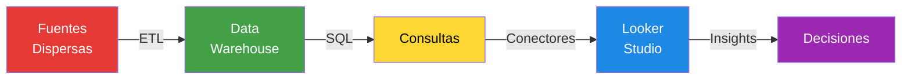
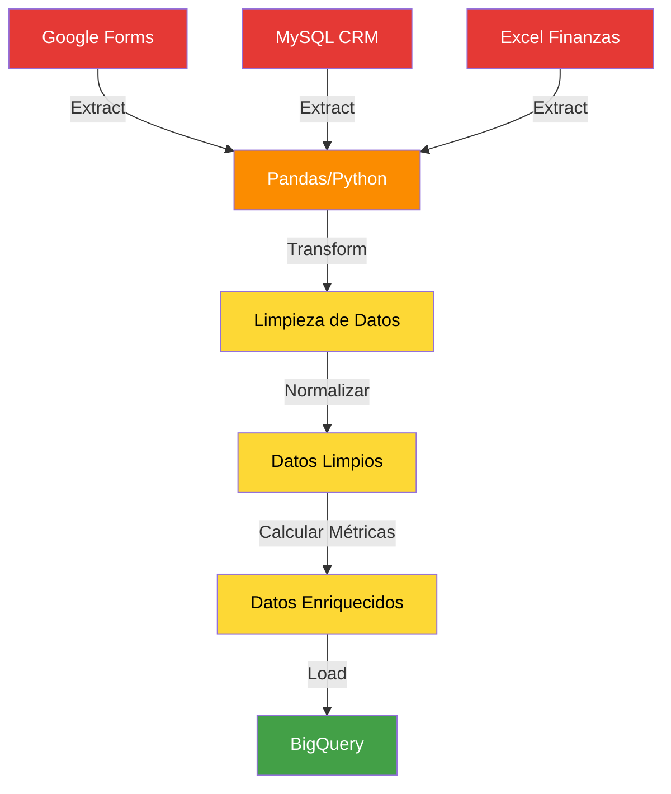
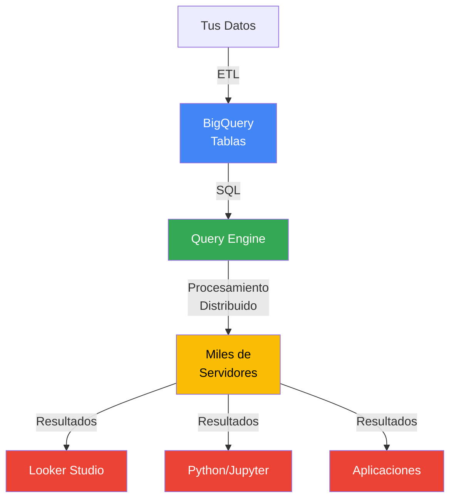
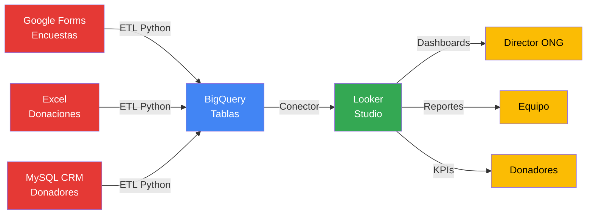
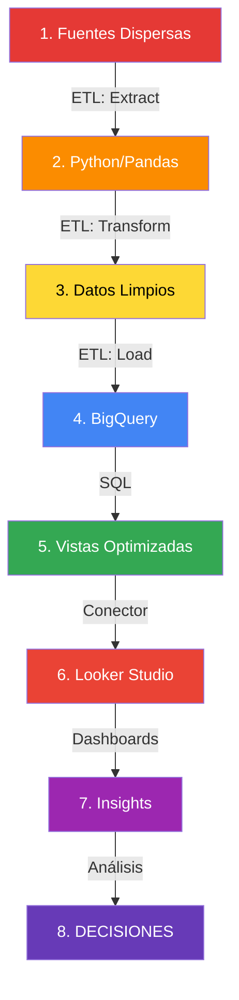

# Semana 3.1: Infraestructura de Datos y Visualización

> **Curso:** CD2001B - Diagnóstico para Líneas de Acción
> **Tecnológico de Monterrey - Campus Puebla**

---

# ETL, SQL, Cloud y Visualización

## Del Dato Crudo a Insights Visuales

    CD2001B - Semana 3.1 | Tec de Monterrey

---

# ¿Por Qué Necesitamos Infraestructura de Datos?

### 📊 El Desafío Real

Una ONG tiene datos en:
- ✉️ Formularios Google Forms
- 📱 App móvil (SQLite)
- 📑 Excel de donaciones
- 🗄️ Sistema CRM antiguo

### 🎯 La Meta

**Dashboard en Looker Studio** que responda:
- ¿Cuántos donadores activos tenemos?
- ¿Qué programas tienen mayor impacto?
- ¿Dónde optimizar recursos?

### ❓ El Problema

**¿Cómo conectamos fuentes dispersas → Dashboard unificado?**

La respuesta: **Pipeline de Datos** (ETL + Almacenamiento + Visualización)

---

# El Pipeline Completo de Datos

## De la Fuente a la Decisión



**Hoy aprenderás cada eslabón de esta cadena**

---

# Parte 1: ¿Qué es ETL?

## Extract, Transform, Load

---

# ETL: Las Tres Letras Más Importantes

### 🔤 Definición

**ETL = Extract, Transform, Load**

Proceso de mover datos desde fuentes originales → sistema centralizado

---

# E de Extract (Extraer)

## Obtener Datos de Fuentes Diversas

### ¿De Dónde Extraemos?

| Fuente | Ejemplo |
|--------|---------|
| 📊 **Archivos** | CSV, Excel, JSON |
| 🗄️ **Bases de Datos** | MySQL, PostgreSQL, MongoDB |
| 🌐 **APIs** | Google Forms, Stripe, Facebook Ads |
| 📁 **Cloud Storage** | Google Drive, AWS S3 |

### 💡 Ejemplo Real: ONG

```python
# Extraer donaciones de Google Forms
import pandas as pd
from google.oauth2 import service_account

# Conectar a Google Sheets API
donaciones = pd.read_csv('google_forms_responses.csv')

# Extraer datos del CRM (MySQL)
import mysql.connector
conn = mysql.connector.connect(host='crm.ong.com')
usuarios = pd.read_sql('SELECT * FROM usuarios', conn)
```

---

# T de Transform (Transformar)

## Limpiar y Preparar los Datos

### 🧹 ¿Qué Transformamos?

**Problemas comunes:**
- ❌ Fechas en formatos diferentes ("01/12/2023" vs "2023-12-01")
- ❌ Nombres duplicados ("María García" vs "Maria Garcia")
- ❌ Valores nulos o inválidos (edad = -5)
- ❌ Categorías inconsistentes ("Mex", "México", "MX")

### ✅ Soluciones

```python
# Limpiar fechas
df['fecha'] = pd.to_datetime(df['fecha'], format='%d/%m/%Y')

# Normalizar nombres
df['nombre'] = df['nombre'].str.strip().str.title()

# Eliminar duplicados
df = df.drop_duplicates(subset=['email'])

# Imputar valores nulos
df['edad'].fillna(df['edad'].median(), inplace=True)

# Crear nuevas columnas calculadas
df['monto_anual'] = df['monto_mensual'] * 12
df['categoria_donador'] = df['monto_anual'].apply(lambda x:
    'Platino' if x > 10000 else 'Oro' if x > 5000 else 'Plata'
)
```

---

# L de Load (Cargar)

## Almacenar en Destino Final

### 🎯 ¿A Dónde Cargamos?

| Destino | Uso |
|---------|-----|
| 🗄️ **Data Warehouse** | BigQuery, Snowflake, Redshift |
| 📊 **Data Lake** | AWS S3, Google Cloud Storage |
| 🔄 **Base de Datos** | PostgreSQL, MySQL |

### 💡 Ejemplo: Cargar a BigQuery

```python
from google.cloud import bigquery

# Crear cliente BigQuery
client = bigquery.Client()

# Cargar DataFrame a BigQuery
table_id = 'proyecto-ong.datos.donaciones'

job = client.load_table_from_dataframe(
    df,
    table_id,
    job_config=bigquery.LoadJobConfig(
        write_disposition='WRITE_TRUNCATE'  # Sobrescribir tabla
    )
)

job.result()  # Esperar a que termine
print(f"Cargados {len(df)} registros a BigQuery")
```

---

# ETL: Diagrama Visual Completo



---

# Parte 2: SQL - El Lenguaje de los Datos

## Structured Query Language

---

# ¿Qué es SQL?

### 📖 Definición

**SQL = Structured Query Language**

Lenguaje estándar para **consultar y manipular bases de datos**

### 🎯 ¿Para Qué Sirve?

- ✅ **Consultar** datos: "Muéstrame donadores de Puebla"
- ✅ **Filtrar** información: "Solo donaciones > $1,000"
- ✅ **Agregar** métricas: "Total de donaciones por mes"
- ✅ **Unir** tablas: "Combina donadores con sus donaciones"

### 💡 Analogía

SQL es como **Google para bases de datos**

En lugar de buscar en internet → buscas en tablas de datos

---

# SQL: Comandos Básicos

## Los 4 Comandos Que Usarás Todo el Tiempo

### 1️⃣ SELECT - Seleccionar Columnas

```sql
-- Obtener todas las columnas
SELECT * FROM donadores;

-- Obtener columnas específicas
SELECT nombre, email, ciudad FROM donadores;
```

### 2️⃣ WHERE - Filtrar Filas

```sql
-- Donadores de Puebla
SELECT * FROM donadores
WHERE ciudad = 'Puebla';

-- Donaciones mayores a $1,000
SELECT * FROM donaciones
WHERE monto > 1000;
```

---

# SQL: Comandos Básicos (2)

### 3️⃣ GROUP BY - Agrupar y Agregar

```sql
-- Total de donaciones por ciudad
SELECT ciudad, SUM(monto) as total
FROM donaciones
GROUP BY ciudad;

-- Promedio de satisfacción por programa
SELECT programa, AVG(satisfaccion) as promedio
FROM encuestas
GROUP BY programa;
```

### 4️⃣ JOIN - Unir Tablas

```sql
-- Combinar donadores con sus donaciones
SELECT
    d.nombre,
    d.email,
    don.monto,
    don.fecha
FROM donadores d
JOIN donaciones don ON d.id = don.donador_id;
```

---

# SQL: Ejemplo Real para ONG

### 🎯 Pregunta de Negocio

**"¿Cuáles son los 10 donadores más generosos de 2024?"**

### 💻 Consulta SQL

```sql
SELECT
    donadores.nombre,
    donadores.email,
    donadores.ciudad,
    SUM(donaciones.monto) as total_donado,
    COUNT(donaciones.id) as num_donaciones
FROM donadores
JOIN donaciones ON donadores.id = donaciones.donador_id
WHERE EXTRACT(YEAR FROM donaciones.fecha) = 2024
GROUP BY donadores.id, donadores.nombre, donadores.email, donadores.ciudad
ORDER BY total_donado DESC
LIMIT 10;
```

### ✅ Resultado

| Nombre | Email | Ciudad | Total Donado | # Donaciones |
|--------|-------|--------|--------------|--------------|
| Juan Pérez | juan@example.com | Puebla | $15,000 | 12 |
| María López | maria@example.com | CDMX | $12,500 | 8 |

---

# Parte 3: Tipos de Bases de Datos

## Relacionales vs No Relacionales

---

# Bases de Datos Relacionales (SQL)

### 🗄️ ¿Qué Son?

Datos organizados en **tablas** con filas y columnas

**Relaciones** entre tablas mediante llaves (claves foráneas)

### 📊 Características

| Característica | Descripción |
|----------------|-------------|
| **Estructura** | Tablas con esquema fijo |
| **Lenguaje** | SQL |
| **Ventaja** | Integridad de datos, consistencia |
| **Uso típico** | Sistemas transaccionales (CRM, ERP) |

### 💡 Ejemplos

- MySQL
- PostgreSQL
- SQL Server
- Oracle Database

---

# Bases de Datos Relacionales: Ejemplo

### 📋 Tabla: `donadores`

| id | nombre | email | ciudad |
|----|--------|-------|--------|
| 1 | Juan Pérez | juan@email.com | Puebla |
| 2 | María López | maria@email.com | CDMX |

### 💰 Tabla: `donaciones`

| id | donador_id | monto | fecha |
|----|------------|-------|-------|
| 101 | 1 | 500 | 2024-01-15 |
| 102 | 1 | 1000 | 2024-02-20 |
| 103 | 2 | 750 | 2024-01-10 |

**Relación:** `donaciones.donador_id` → `donadores.id`

---

# Bases de Datos No Relacionales (NoSQL)

### 🔄 ¿Qué Son?

Datos en formatos **flexibles** (documentos JSON, grafos, clave-valor)

**Sin esquema fijo** → mayor flexibilidad

### 📊 Características

| Característica | Descripción |
|----------------|-------------|
| **Estructura** | Documentos, grafos, clave-valor |
| **Lenguaje** | Específico de cada DB (no SQL estándar) |
| **Ventaja** | Escalabilidad, velocidad, flexibilidad |
| **Uso típico** | Big Data, tiempo real, datos no estructurados |

### 💡 Ejemplos

- MongoDB (documentos JSON)
- Firebase (tiempo real)
- Redis (clave-valor)
- Neo4j (grafos)

---

# SQL vs NoSQL: ¿Cuándo Usar Cada Una?

### ✅ Usa SQL (Relacional) cuando...

- Necesitas **integridad de datos** estricta
- Datos con **relaciones complejas** (donadores → donaciones → programas)
- Transacciones financieras (no puedes perder un solo registro)
- Reportes y análisis complejos con JOINs

**Ejemplo ONG:** Base de donaciones, CRM de donadores

---

### ✅ Usa NoSQL cuando...

- Datos **no estructurados** o esquema cambiante
- Necesitas **escalar horizontalmente** (millones de usuarios)
- Prioridad en **velocidad** sobre consistencia absoluta
- Datos en tiempo real (logs, IoT)

**Ejemplo ONG:** Logs de app móvil, perfiles de usuarios en app

---

# Parte 4: ¿Qué es BigQuery?

## El Data Warehouse de Google Cloud

---

# BigQuery: Definición

### 🔷 ¿Qué es?

**Data Warehouse serverless** de Google Cloud

Almacén de datos diseñado para **análisis rápido de grandes volúmenes**

### 🎯 Características Clave

| Característica | Beneficio |
|----------------|-----------|
| **Serverless** | No administras servidores (Google lo hace) |
| **Escalable** | Maneja desde MBs hasta PBs de datos |
| **Rápido** | Consultas sobre millones de filas en segundos |
| **SQL estándar** | Usas SQL que ya conoces |
| **Integrado** | Se conecta con Looker Studio, Python, R |

---

# BigQuery: ¿Por Qué Usarlo?

### 💡 Escenario Sin BigQuery

```python
# Análisis local con Pandas
import pandas as pd

# Cargar 5 GB de datos → ❌ Tu laptop se congela
df = pd.read_csv('donaciones_10_años.csv')  # 10 millones de filas

# Filtrar y agrupar → ❌ Toma 30 minutos
resultado = df.groupby('programa').agg({'monto': 'sum'})
```

### ✅ Escenario Con BigQuery

```sql
-- Consulta sobre 10 millones de filas → ✅ Respuesta en 3 segundos
SELECT
    programa,
    SUM(monto) as total
FROM `proyecto-ong.datos.donaciones`
GROUP BY programa;
```

**BigQuery procesa los datos en la nube → no necesitas computadora potente**

---

# BigQuery: Arquitectura



---

# BigQuery: Ejemplo Práctico

### 🎯 Caso de Uso: Análisis de Donaciones

**1️⃣ Crear Tabla**

```sql
CREATE TABLE `proyecto-ong.datos.donaciones` (
    id INT64,
    donador_id INT64,
    programa STRING,
    monto FLOAT64,
    fecha DATE,
    ciudad STRING
);
```

**2️⃣ Cargar Datos** (desde CSV, Python, Google Sheets)

**3️⃣ Consultar**

```sql
-- ¿Qué programa generó más donaciones en Puebla?
SELECT
    programa,
    COUNT(*) as num_donaciones,
    SUM(monto) as total_monto
FROM `proyecto-ong.datos.donaciones`
WHERE ciudad = 'Puebla'
GROUP BY programa
ORDER BY total_monto DESC;
```

---

# Parte 5: ¿Qué es la Cloud (Nube)?

## Computación Sin Infraestructura Propia

---

# La Cloud: Definición

### ☁️ ¿Qué es?

**Servidores, almacenamiento y servicios** alojados en centros de datos remotos

**Acceso bajo demanda** vía internet

### 🏢 Analogía

| Antes (On-Premise) | Ahora (Cloud) |
|-------------------|---------------|
| 🏠 Comprar casa | 🏨 Rentar hotel |
| 💾 Comprar servidores físicos | ☁️ Rentar capacidad en la nube |
| 👨‍🔧 Contratar equipo técnico | 🤖 Google/AWS lo administra |
| 💰 Inversión inicial alta | 💵 Pago por uso (como electricidad) |

---

# Proveedores de Cloud

### 🌐 Los 3 Grandes

| Proveedor | Logo | Servicios Clave |
|-----------|------|-----------------|
| **Google Cloud Platform (GCP)** | 🔷 | BigQuery, Looker Studio, Cloud Storage |
| **Amazon Web Services (AWS)** | 🟧 | Redshift, S3, QuickSight |
| **Microsoft Azure** | 🔵 | Synapse, Power BI, Blob Storage |

**En este curso usamos:** Google Cloud (BigQuery + Looker Studio)

---

# Ventajas de la Cloud

### ✅ Beneficios Clave

| Ventaja | Descripción | Ejemplo ONG |
|---------|-------------|-------------|
| **💰 Costo** | Pago por uso (sin inversión inicial) | Solo pagas cuando consultas BigQuery |
| **📈 Escalabilidad** | Crece con tu necesidad | Empiezas con 1 GB → creces a 100 GB sin cambiar nada |
| **🔒 Seguridad** | Google/AWS invierten millones en seguridad | Backup automático, encriptación |
| **🌍 Acceso Global** | Trabaja desde cualquier lugar | Equipo en Puebla + voluntarios remotos |
| **⚙️ Mantenimiento** | Google actualiza servidores | No necesitas equipo técnico interno |
| **🚀 Velocidad** | Infraestructura de clase mundial | Consultas sobre millones de filas en segundos |

---

# Cloud: Caso de Uso ONG

### 📊 Antes (Sin Cloud)

```
❌ Problemas:
- Servidor físico en oficina de ONG ($5,000 USD iniciales)
- Base de datos MySQL local (limitado a capacidad del servidor)
- Solo accesible desde oficina (VPN complicada)
- Respaldos manuales (riesgo de perder datos)
- Consultas lentas sobre 1M+ registros
```

### ☁️ Después (Con Cloud)

```
✅ Soluciones:
- BigQuery en Google Cloud ($0 USD iniciales, pago por consulta)
- Almacenamiento ilimitado (crece con tu ONG)
- Acceso desde cualquier lugar (solo necesitas internet)
- Respaldos automáticos (Google lo hace)
- Consultas en segundos (infraestructura distribuida)
```

---

# Parte 6: Conectando Todo con Looker Studio

## De BigQuery a Visualizaciones Interactivas

---

# El Flujo Completo: ETL → BigQuery → Looker Studio



---

# ¿Por Qué BigQuery + Looker Studio?

### 🔗 Integración Nativa

| Sin BigQuery | Con BigQuery |
|--------------|--------------|
| ❌ Subes CSV a Looker cada semana | ✅ Conexión en tiempo real |
| ❌ Límite de 100 MB por archivo | ✅ Sin límite (procesa GBs/TBs) |
| ❌ Datos estáticos (no se actualizan) | ✅ Datos frescos (refresco automático) |
| ❌ Consultas lentas (Looker las hace) | ✅ Consultas rápidas (BigQuery optimizado) |

### 💡 Ventaja Clave

**BigQuery hace el trabajo pesado (SQL)**
**Looker Studio hace la visualización bonita (gráficos)**

---

# Looker Studio: Fuentes de Datos

### 📊 ¿Qué Puedes Conectar?

| Fuente | Recomendación |
|--------|---------------|
| ☁️ **BigQuery** | ⭐⭐⭐⭐⭐ Mejor para grandes volúmenes |
| 📊 **Google Sheets** | ⭐⭐⭐ OK para < 10,000 filas |
| 📁 **CSV Upload** | ⭐⭐ Solo para datos estáticos pequeños |
| 🗄️ **MySQL/PostgreSQL** | ⭐⭐⭐⭐ Bueno con conector |
| 📈 **Google Analytics** | ⭐⭐⭐⭐⭐ Para datos de web/app |

**Para este curso:** BigQuery + Google Sheets

---

# Ejemplo Real: Dashboard de ONG

### 🎯 Objetivo

**Crear dashboard que muestre:**
1. Total de donaciones por mes (gráfico de línea)
2. Top 10 programas por impacto (gráfico de barras)
3. Mapa de donadores por estado (geo map)
4. KPI: Tasa de retención de donadores

### 🔧 Proceso

**Paso 1:** ETL → Limpiar datos con Python
**Paso 2:** Load → Cargar a BigQuery
**Paso 3:** SQL → Crear vistas optimizadas
**Paso 4:** Looker Studio → Conectar BigQuery
**Paso 5:** Visualizar → Crear gráficos

---

# Ejemplo SQL para Looker Studio

### 📊 Vista Optimizada en BigQuery

```sql
CREATE OR REPLACE VIEW `proyecto-ong.vistas.kpis_dashboard` AS
SELECT
    DATE_TRUNC(fecha, MONTH) as mes,
    programa,
    ciudad,
    estado,
    COUNT(DISTINCT donador_id) as num_donadores,
    COUNT(*) as num_donaciones,
    SUM(monto) as total_monto,
    AVG(monto) as monto_promedio
FROM `proyecto-ong.datos.donaciones`
WHERE fecha >= DATE_SUB(CURRENT_DATE(), INTERVAL 2 YEAR)
GROUP BY mes, programa, ciudad, estado;
```

**En Looker Studio:**
- Conectas a esta vista
- Arrastras `mes` al eje X
- Arrastras `total_monto` al eje Y
- ¡Dashboard listo! 📈

---

# Looker Studio + BigQuery: Ventajas

### ✅ Beneficios de la Integración

| Funcionalidad | Descripción |
|---------------|-------------|
| **🔄 Datos en Tiempo Real** | Cambios en BigQuery se reflejan automáticamente |
| **🚀 Velocidad** | BigQuery procesa consultas → Looker solo grafica |
| **📊 Campos Calculados** | Puedes crear métricas sin SQL (ej: tasa de conversión) |
| **🔒 Control de Acceso** | Permisos de BigQuery se heredan en Looker |
| **💰 Costo Eficiente** | Solo pagas por datos consultados, no por visualizaciones |
| **🧮 Pre-Agregación** | BigQuery pre-calcula → Looker no repite cálculos |

---

# Resumen: El Pipeline Completo

### 🔄 De Datos Crudos a Decisiones



---

# Tabla Comparativa: Tecnologías

| Tecnología | ¿Qué es? | ¿Para qué sirve? | Ejemplo |
|------------|----------|------------------|---------|
| **ETL** | Proceso de datos | Extraer, limpiar, cargar | Python limpia CSV → BigQuery |
| **SQL** | Lenguaje de consulta | Consultar bases de datos | "Muéstrame donaciones de 2024" |
| **BigQuery** | Data Warehouse | Almacenar y consultar grandes datos | Consultas sobre 10M registros en segundos |
| **Cloud** | Infraestructura remota | Evitar comprar servidores | Google administra todo |
| **Looker Studio** | Herramienta BI | Visualizar datos | Crear dashboards interactivos |

---

# Ventajas del Stack Completo

### 🎯 Por Qué Este Enfoque es Profesional

| Ventaja | Descripción |
|---------|-------------|
| **📈 Escalable** | Funciona para 1,000 o 1,000,000 registros |
| **💰 Económico** | Pago por uso (no inversión inicial) |
| **🔄 Automatizable** | ETL con scripts Python → sin trabajo manual |
| **🌍 Accesible** | Equipo remoto puede acceder a dashboards |
| **🔒 Seguro** | Permisos granulares, backup automático |
| **🚀 Rápido** | Consultas optimizadas, infraestructura distribuida |
| **📊 Profesional** | Mismo stack que usan empresas Fortune 500 |

---

# Caso de Uso Real: Dashboard Teletón

### 🎯 Proyecto Final del Curso

**Reto:** Crear dashboard para Teletón México

**Pipeline:**

1. **Extract:** Datos de beneficiarios, terapias, donaciones
2. **Transform:** Limpiar inconsistencias, calcular KPIs
3. **Load:** Cargar a BigQuery
4. **SQL:** Crear vistas para:
   - Beneficiarios atendidos por mes
   - Tasa de adherencia a terapias
   - Distribución geográfica
5. **Looker Studio:** Dashboard con 5-7 gráficos clave
6. **Insights:** Recomendaciones basadas en datos

---

# ¿Qué Aprenderás en Este Módulo?

### 📚 Habilidades Técnicas

✅ Escribir scripts ETL en Python
✅ Usar SQL para consultas complejas (JOINs, GROUP BY)
✅ Cargar datos a BigQuery
✅ Crear vistas optimizadas en BigQuery
✅ Conectar BigQuery con Looker Studio
✅ Diseñar dashboards profesionales

### 🎓 Competencias Profesionales

✅ Entender arquitectura de datos end-to-end
✅ Optimizar pipelines para velocidad y costo
✅ Comunicar insights con visualizaciones

---

# Recursos y Próximos Pasos

### 📖 Documentación Oficial

- [BigQuery Docs](https://cloud.google.com/bigquery/docs)
- [Looker Studio Tutorials](https://support.google.com/looker-studio)
- [SQL Tutorial (W3Schools)](https://www.w3schools.com/sql/)

### 🛠️ Herramientas Necesarias

- Cuenta Google Cloud (capa gratuita: 1 TB de consultas/mes)
- Python 3.8+ con pandas, google-cloud-bigquery
- Looker Studio (gratis con cuenta Google)

### 📅 Esta Semana

- **Clase 3.1:** ETL práctico con Python
- **Clase 3.2:** SQL avanzado + BigQuery hands-on
- **Clase 3.3:** Crear primer dashboard en Looker Studio
- **Workshop 3:** Pipeline completo para datos Teletón

---

# Preguntas Clave para Reflexionar

### 🤔 Piensa en tu Proyecto Final

1. **¿Qué fuentes de datos tendrás?** (CSV, Excel, API, Base de datos)
2. **¿Qué transformaciones necesitas?** (limpiar fechas, calcular KPIs)
3. **¿Qué preguntas debe responder tu dashboard?** (ej: ¿Qué programa tiene mayor impacto?)
4. **¿Quién usará el dashboard?** (Director ONG, Equipo, Donadores)

**Estas preguntas guiarán tu diseño de pipeline ETL → BigQuery → Looker Studio**

---

# Resumen Final

### 🎯 Conceptos Clave

1. **ETL** = Proceso de mover y limpiar datos
2. **SQL** = Lenguaje para consultar bases de datos
3. **BigQuery** = Data Warehouse en la nube (rápido y escalable)
4. **Cloud** = Infraestructura remota (sin servidores propios)
5. **Looker Studio** = Herramienta de visualización
6. **Pipeline** = ETL → BigQuery → Looker Studio → Decisiones

### 💡 Lección Más Importante

**Los datos sin infraestructura son inútiles**
**La infraestructura sin visualización no genera decisiones**
**Necesitas TODO el pipeline para crear impacto real**

---

# ¡A Practicar!

### 🚀 Próximos Labs

- **Lab 1:** Escribir script ETL para limpiar dataset Teletón
- **Lab 2:** Cargar datos a BigQuery y hacer consultas SQL
- **Lab 3:** Conectar BigQuery con Looker Studio
- **Lab 4:** Crear dashboard interactivo completo

### 📊 Resultado Final

**Dashboard profesional** que demuestra:
- ✅ Dominio técnico del pipeline completo
- ✅ Capacidad de traducir datos a insights
- ✅ Habilidad de comunicar con visualizaciones

---

# Gracias

### 📧 Contacto

**¿Preguntas?** Escribe en el foro del curso

**Recursos:** Revisa notebooks en Canvas

**Office Hours:** Martes y jueves 4-5 PM

---

**¡Vamos a construir infraestructura de datos profesional!** 🚀☁️📊
