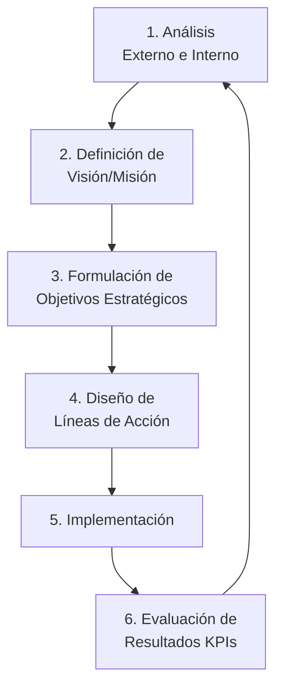
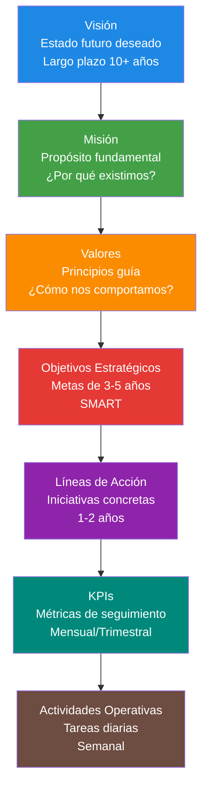

# Administración Estratégica

## Diagnóstico y Planeación en Organizaciones Sociales

  
    CD2001B - Semana 3 | Módulo 2
  

  Tec de Monterrey Campus Puebla

---
layout: center
class: text-center
---

# ¿Por Qué Estrategia en ONGs?

### 💰 Recursos Limitados
ONGs operan con presupuestos restringidos

**Necesidad:** Priorizar y optimizar

### 📈 Impacto Medible
Donantes exigen evidencia de resultados

**Necesidad:** KPIs y seguimiento

### 🎯 Enfoque Claro
Evitar dispersión de esfuerzos

**Necesidad:** Misión bien definida

### 🔄 Adaptabilidad
Entornos cambiantes (políticas, economía)

**Necesidad:** Análisis continuo

---
layout: section
---

# Parte 1: Fundamentos de Estrategia

## ¿Qué es Administración Estratégica?

---

# Proceso de Administración Estratégica

## Definición

**Administración Estratégica:** Proceso de formular, implementar y evaluar decisiones que permitan a una organización lograr sus objetivos

### Componentes Clave

1. **Análisis** (¿Dónde estamos?)
2. **Formulación** (¿A dónde vamos?)
3. **Implementación** (¿Cómo llegamos?)
4. **Evaluación** (¿Llegamos?)

## Ciclo Estratégico

Este proceso es cíclico y continuo

---

# Niveles de Estrategia

### 🏢 Corporativa

**Pregunta:** ¿En qué negocios/programas participamos?

**Ejemplo ONG:**
- Cruz Roja: Emergencias + Salud + Capacitación
- Decisión: ¿Agregar programa de vivienda?

**Herramienta:** Matriz BCG

### 🎯 Negocio/Programa

**Pregunta:** ¿Cómo competimos en cada programa?

**Ejemplo:**
- Programa de alimentación infantil
- Decisión: ¿Enfoque en calidad nutricional o cobertura?

**Herramienta:** Porter, FODA

### ⚙️ Funcional

**Pregunta:** ¿Cómo optimizamos cada área?

**Ejemplo:**
- Logística de distribución
- Comunicación con donantes
- Gestión de voluntarios

**Herramienta:** KPIs específicos

### 🔍 Para tu Diagnóstico

Trabajarás principalmente en los niveles **Corporativo** (portafolio de programas) y **Negocio/Programa** (análisis de servicios específicos)

---
layout: section
---

# Parte 2: Visión, Misión y Valores

## Los Cimientos de la Estrategia

---

# Visión, Misión y Valores

### 🔭 Visión

**¿Qué queremos ser?**

Estado futuro deseado

#### Características
- ✅ Aspiracional
- ✅ Inspiradora
- ✅ Largo plazo (5-10 años)
- ✅ Clara y memorable

#### Ejemplo: UNICEF
> "Un mundo donde se respeten y protejan los derechos de cada niño"

### 🎯 Misión

**¿Para qué existimos?**

Propósito fundamental

#### Características
- ✅ Específica
- ✅ Accionable
- ✅ Define beneficiarios
- ✅ Responde: ¿Qué? ¿Para quién? ¿Cómo?

#### Ejemplo: Techo México
> "Trabajamos por un México justo y sin pobreza, donde todas las personas tengan las oportunidades para desarrollar sus capacidades"

### 💎 Valores

**¿Cómo nos comportamos?**

Principios guía

#### Características
- ✅ No negociables
- ✅ Definen cultura
- ✅ Guían decisiones
- ✅ 3-5 valores principales

#### Ejemplo: Cruz Roja
- Humanidad
- Imparcialidad
- Neutralidad
- Independencia
- Voluntariado

---

# Ejercicio: Analiza la Misión de una ONG

## Caso: Banco de Alimentos

### Misión Actual:
> "Contribuir a la seguridad alimentaria rescatando y distribuyendo comida nutritiva"

### Análisis Crítico

**¿Responde las preguntas clave?**

- **¿Qué hacemos?** ✅ Rescatar y distribuir comida
- **¿Para quién?** ❌ No especifica beneficiarios
- **¿Cómo?** ⚠️ Parcial (no detalla método)
- **¿Por qué?** ✅ Seguridad alimentaria

## Propuesta Mejorada

### Misión Rediseñada:
> "Combatir el hambre y la malnutrición en Puebla **rescatando alimentos de la industria y distribuyéndolos** a familias en situación de vulnerabilidad **mediante alianzas con organizaciones comunitarias**, promoviendo una cultura de no desperdicio alimentario"

### Mejoras:
- ✅ **Qué:** Combatir hambre y malnutrición
- ✅ **Para quién:** Familias vulnerables en Puebla
- ✅ **Cómo:** Rescate + Distribución mediante alianzas
- ✅ **Valor agregado:** Cultura de no desperdicio

**Para tu diagnóstico:** Revisa si la misión de tu ONG es clara y completa. Si no lo es, puedes sugerir mejoras en tu reporte.

---
layout: section
---

# Parte 3: Análisis del Entorno

## PESTEL - Evaluación Externa

---

# Análisis PESTEL

## Marco de Análisis

**PESTEL:** Herramienta para analizar factores externos que afectan a la organización

- **P**olítico
- **E**conómico
- **S**ocial
- **T**ecnológico
- **E**cológico (Ambiental)
- **L**egal

## ¿Por Qué es Útil?

### Identificar:
1. **Oportunidades**
   - Nuevas políticas favorables
   - Tendencias sociales

2. **Amenazas**
   - Recortes presupuestales
   - Cambios regulatorios

3. **Contexto**
   - Justificar tu diagnóstico
   - Contextualizar recomendaciones

**PESTEL + Datos = Diagnóstico Contextualizado**

No analices la ONG en el vacío. Entiende su entorno.

---

# PESTEL Aplicado a ONGs

### **P**olítico

**Factores:**
- Políticas públicas del sector
- Relación con gobiernos locales
- Estabilidad política

**Ejemplo: Banco de Alimentos**
- ✅ Oportunidad: Programa federal contra hambre
- ⚠️ Amenaza: Cambio de administración puede reducir apoyos

### **E**conómico

**Factores:**
- Inflación
- Desempleo
- Poder adquisitivo

**Ejemplo:**
- ✅ Oportunidad: Empresas buscan donar por beneficios fiscales
- ⚠️ Amenaza: Inflación reduce donaciones individuales

### **S**ocial

**Factores:**
- Demografía
- Cultura de donación
- Problemática social

**Ejemplo:**
- ✅ Oportunidad: Mayor conciencia sobre desperdicio alimentario
- ⚠️ Amenaza: Estigma hacia beneficiarios limita acceso

### **T**ecnológico

**Factores:**
- Digitalización
- Sistemas de gestión
- Acceso a tecnología

**Ejemplo:**
- ✅ Oportunidad: Apps para conectar donantes-beneficiarios
- ⚠️ Amenaza: Brecha digital en beneficiarios rurales

### **E**cológico

**Factores:**
- Cambio climático
- Sostenibilidad
- Economía circular

**Ejemplo:**
- ✅ Oportunidad: Tendencia hacia economía circular
- ⚠️ Amenaza: Desastres naturales afectan cadena de suministro

### **L**egal

**Factores:**
- Regulaciones del sector
- Leyes fiscales
- Normativas sanitarias

**Ejemplo:**
- ✅ Oportunidad: Ley de Donatarias Autorizadas
- ⚠️ Amenaza: Normativas sanitarias más estrictas

---

# Plantilla PESTEL para tu Diagnóstico

| Factor | Oportunidades | Amenazas | Implicación para la ONG |
|--------|---------------|----------|-------------------------|
| **Político** | [Lista 2-3] | [Lista 2-3] | [Cómo afecta operación] |
| **Económico** | [Lista 2-3] | [Lista 2-3] | [Impacto en financiamiento] |
| **Social** | [Lista 2-3] | [Lista 2-3] | [Efecto en demanda/percepción] |
| **Tecnológico** | [Lista 2-3] | [Lista 2-3] | [Capacidad de adopción] |
| **Ecológico** | [Lista 2-3] | [Lista 2-3] | [Riesgos/oportunidades ambientales] |
| **Legal** | [Lista 2-3] | [Lista 2-3] | [Cumplimiento/beneficios] |

### 📝 Recomendación

No necesitas llenar todas las celdas. **Enfócate en los 3-5 factores más relevantes** para tu ONG específica.

---
layout: section
---

# Parte 4: Análisis Interno

## Fortalezas y Debilidades

---

# Análisis Interno: Recursos y Capacidades

## Marco de Análisis

Evaluar **qué tiene** la ONG para lograr su misión

### Categorías

**1. Recursos Tangibles**
- Infraestructura física
- Tecnología
- Finanzas

**2. Recursos Intangibles**
- Reputación
- Marca
- Conocimiento

**3. Capacidades Organizacionales**
- Procesos
- Gestión
- Cultura

## Ejemplo: Cruz Roja Mexicana

### ✅ Fortalezas

**Tangibles:**
- Red de 500+ unidades en México
- Flota de ambulancias

**Intangibles:**
- **Marca reconocida** (99% conocimiento)
- Confianza ciudadana

**Capacidades:**
- Respuesta rápida a emergencias
- Capacitación de voluntarios

### ⚠️ Debilidades

**Tangibles:**
- Equipo médico obsoleto en algunas sedes

**Intangibles:**
- Percepción de burocracia

**Capacidades:**
- Digitalización limitada
- Alta rotación de voluntarios

---

# Matriz FODA (SWOT)

## Herramienta Integradora

**FODA:** Combina análisis interno (F/D) con análisis externo (O/A)

|  | **Interno** | **Externo** |
|---|-------------|-------------|
| **Positivo** | Fortalezas | Oportunidades |
| **Negativo** | Debilidades | Amenazas |

### Objetivo

Generar estrategias que:
- **FO:** Aprovechen fortalezas para capturar oportunidades
- **FA:** Usen fortalezas para mitigar amenazas
- **DO:** Superen debilidades para aprovechar oportunidades
- **DA:** Minimicen debilidades y eviten amenazas

## Ejemplo: Banco de Alimentos

|  | **Fortalezas (F)** | **Debilidades (D)** |
|---|-------------|-------------|
| **Oportunidades (O)** | **FO:** Nueva ley de donativos + Alianzas empresariales = Aumentar donaciones corporativas | **DO:** Tendencia de apps + Falta de tecnología = Implementar plataforma digital |
| **Amenazas (A)** | **FA:** Marca consolidada + Recorte de subsidios = Campaña de fundraising ciudadano | **DA:** Procesos manuales + Inflación = Riesgo de ineficiencia operativa (PRIORIDAD) |

**Insight:** Las estrategias **DA** son las más urgentes porque combinan vulnerabilidades internas con presiones externas.

---

# Construcción de FODA para tu Diagnóstico

## Paso 1: Recopila Información

### Fuentes Internas
- Entrevista con directivos de la ONG
- Documentos institucionales
- Observación de procesos
- Datos operativos

### Fuentes Externas
- Noticias del sector
- Informes gubernamentales
- Encuestas a beneficiarios
- Análisis de ONGs similares

## Paso 2: Clasifica los Hallazgos

### Fortalezas (Internas Positivas)
- ¿En qué es buena la ONG?
- ¿Qué recursos únicos tiene?
- ¿Qué hacen mejor que otras?

### Debilidades (Internas Negativas)
- ¿Qué necesita mejorar?
- ¿Qué recursos faltan?
- ¿Qué procesos son ineficientes?

### Oportunidades (Externas Positivas)
- ¿Qué tendencias favorecen a la ONG?
- ¿Qué gaps puede llenar?

### Amenazas (Externas Negativas)
- ¿Qué cambios perjudican?
- ¿Qué competencia existe?

**Tip:** Sé específico. En lugar de "Falta de recursos" escribe "Presupuesto limitado para marketing: $5,000 MXN/año vs $50,000 promedio del sector"

---
layout: section
---

# Parte 5: De Análisis a Acción

## Objetivos Estratégicos y KPIs

---

# Objetivos Estratégicos

## Definición

**Objetivo Estratégico:** Meta de mediano-largo plazo derivada de la misión que guía las acciones de la organización

### Características (Método SMART)

- **S**pecific (Específico)
- **M**easurable (Medible)
- **A**chievable (Alcanzable)
- **R**elevant (Relevante)
- **T**ime-bound (Temporal)

### Niveles de Objetivos

1. **Estratégicos** (3-5 años)
   - Ejemplo: Duplicar impacto social
2. **Tácticos** (1 año)
   - Ejemplo: Abrir 2 centros nuevos
3. **Operativos** (mensual/trimestral)
   - Ejemplo: Atender 500 beneficiarios/mes

## Ejemplo: Banco de Alimentos

### ❌ Objetivo Vago

> "Ayudar a más personas con hambre"

**Problemas:**
- No es medible
- No tiene plazo
- No es específico

### ✅ Objetivo SMART

> "Incrementar en 30% el número de familias atendidas (de 15,000 a 19,500) en los próximos 18 meses mediante la apertura de 3 centros de distribución en zonas de alta marginación"

**Beneficios:**
- ✅ Específico: Familias atendidas
- ✅ Medible: 30% (4,500 familias)
- ✅ Alcanzable: Con 3 centros nuevos
- ✅ Relevante: Alineado a misión
- ✅ Temporal: 18 meses

---

# De Objetivos a KPIs

## ¿Qué son los KPIs?

**Key Performance Indicators (Indicadores Clave de Desempeño)**

Métricas cuantificables que miden el progreso hacia objetivos estratégicos

### Tipos de KPIs en ONGs

**1. KPIs de Impacto**
- Beneficiarios alcanzados
- Cambio en calidad de vida

**2. KPIs de Calidad**
- Satisfacción del beneficiario ← **Tu reto**
- Efectividad del servicio

**3. KPIs de Eficiencia**
- Costo por beneficiario
- Tiempo de atención

**4. KPIs de Sostenibilidad**
- Tasa de retención de donantes
- Diversificación de ingresos

## Ejemplo: Del Objetivo al KPI

### Objetivo Estratégico
> "Incrementar en 30% el número de familias atendidas en 18 meses"

### KPIs Asociados

| KPI | Meta | Frecuencia | Responsable |
|-----|------|------------|-------------|
| **Familias atendidas/mes** | 1,083 (19,500/18) | Mensual | Operaciones |
| **Nuevos centros abiertos** | 3 | Cada 6 meses | Expansión |
| **Satisfacción beneficiarios** | ≥ 8.5/10 | Trimestral | Calidad |
| **Costo por familia** | ≤ $250 MXN | Mensual | Finanzas |

**Nota:** Un objetivo puede tener **múltiples KPIs** que lo miden desde diferentes ángulos (alcance, calidad, eficiencia).

---

# Pirámide Estratégica

**Todo debe estar alineado:** Desde las tareas diarias hasta la visión de largo plazo

---
layout: section
---

# Parte 6: Aplicación al Reto Final

## Actividad #1 (Parte 2) - Diagnóstico Estratégico

---

# Estructura de la Actividad #1 (Parte 2)

## Contenido Requerido

### 1. Identidad Estratégica
- Visión de la ONG
- Misión
- Valores
- Análisis crítico (si es necesario)

### 2. Objetivos Estratégicos
- 2-3 objetivos principales
- Verificar que sean SMART
- Alineación con misión

### 3. Análisis Externo
- PESTEL resumido
- Principales oportunidades y amenazas

### 4. Análisis Interno
- Recursos y capacidades
- Fortalezas y debilidades clave

### 5. Matriz FODA
- Tabla completa
- Identificación de 2-3 estrategias prioritarias

### 6. KPIs Estratégicos
- 3-5 KPIs principales
- Definición operacional
- Relación con objetivos

**Formato:** Documento Word/PDF con diagramas

**Extensión:** 5-8 páginas

**Valor:** 6.25% de la calificación final

---

# Checklist: Diagnóstico Estratégico

## Análisis Estratégico

- [ ] **Visión y Misión documentadas**
  - Cita textual de la ONG
  - Análisis crítico si es vaga

- [ ] **Valores identificados**
  - 3-5 valores principales
  - Evidencia en acciones de la ONG

- [ ] **PESTEL realizado**
  - Al menos 3 factores por categoría
  - Clasificados en O/A

- [ ] **Fortalezas y Debilidades**
  - Recursos tangibles e intangibles
  - Capacidades organizacionales
  - Evidencia específica

## Herramientas Estratégicas

- [ ] **Matriz FODA completa**
  - Las 4 celdas llenas
  - Estrategias derivadas (FO, FA, DO, DA)

- [ ] **Objetivos Estratégicos**
  - 2-3 objetivos SMART
  - Alineados con misión

- [ ] **KPIs identificados**
  - 3-5 KPIs principales
  - Definición operacional clara
  - Frecuencia de medición
  - Meta cuantitativa

- [ ] **Diagramas incluidos**
  - PESTEL visual
  - Matriz FODA
  - Pirámide estratégica (opcional)

**Próximas clases:** Herramientas avanzadas (Porter, BCG, Customer Journey) + Identificación de KPIs de calidad

---
layout: center
class: text-center
---

# Resumen: Administración Estratégica

### 🎯 Fundamentos
- Proceso estratégico
- Visión, Misión, Valores
- Objetivos SMART

### 🔍 Análisis
- PESTEL (externo)
- Recursos y capacidades (interno)
- Matriz FODA

### 📊 Medición
- KPIs estratégicos
- Alineación piramidal
- Seguimiento continuo

La estrategia sin medición es wishful thinking. 
La medición sin estrategia es data sin propósito.

---
layout: end
class: text-center
---

# ¡Gracias!

## Próxima Clase: Herramientas Estratégicas Avanzadas
### Diamante de Porter y Matriz BCG

CD2001B - Semana 3 
Tec de Monterrey Campus Puebla

