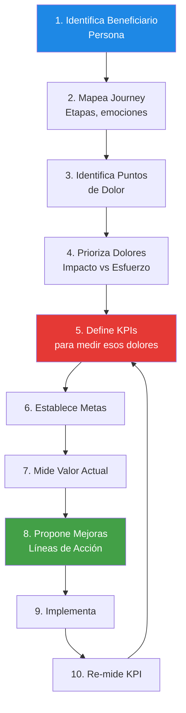

<style src="./styles/tec-theme.css"></style>

# Customer Journey Map y KPIs

## Experiencia del Beneficiario e Indicadores de Desempeño

<div class="pt-12">
  <span class="px-2 py-1 rounded cursor-pointer" hover="bg-white bg-opacity-10">
    CD2001B - Semana 3 | Módulo 2
  </span>
</div>

<div class="abs-br m-6 flex gap-2">
  <span class="text-sm opacity-50">Tec de Monterrey Campus Puebla</span>
</div>

---
layout: center
class: text-center
---

# Dos Perspectivas Complementarias

<div class="grid grid-cols-2 gap-8 mt-12">
<div v-click>

### 🗺️ Customer Journey Map

**Perspectiva Cualitativa**

"¿Cómo viven los beneficiarios su experiencia con la ONG?"

- Emociones
- Puntos de dolor
- Oportunidades de mejora

</div>
<div v-click>

### 📊 KPIs

**Perspectiva Cuantitativa**

"¿Cómo medimos la calidad de esa experiencia?"

- Métricas
- Objetivos
- Seguimiento

</div>
</div>

<div v-click class="mt-12 text-xl font-bold text-gradient">
Journey Map identifica QUÉ mejorar → KPIs miden SI mejoramos
</div>

---
layout: section
---

# Parte 1: Customer Journey Map

## Mapeando la Experiencia del Beneficiario

---

# ¿Qué es un Customer Journey Map?

<div class="grid grid-cols-2 gap-8">
<div>

## Definición

**Customer Journey Map (Mapa del Viaje del Cliente):**

Representación visual de las **etapas**, **interacciones**, **emociones** y **puntos de contacto** que una persona experimenta al interactuar con una organización

<div v-click class="mt-6">

### Origen

- Sector privado: Entender experiencia del cliente
- Objetivo: Mejorar satisfacción y ventas

### Adaptación a ONGs

- **"Cliente"** → **Beneficiario**
- Objetivo: Mejorar **calidad del servicio** e **impacto social**

</div>

</div>
<div v-click>

## Componentes del Mapa

### 1. Etapas (Fases)
- Descubrimiento
- Primer contacto
- Uso del servicio
- Seguimiento

### 2. Acciones del Beneficiario
- ¿Qué hace en cada etapa?

### 3. Puntos de Contacto
- ¿Dónde interactúa con la ONG?

### 4. Emociones
- ¿Cómo se siente? (frustra

ción, alivio, etc.)

### 5. Puntos de Dolor
- ¿Qué dificulta la experiencia?

### 6. Oportunidades
- ¿Dónde podemos mejorar?

</div>
</div>

---

# Ejemplo: Journey Map de un Banco de Alimentos

<div class="text-xs">

| Etapa | Acciones | Punto de Contacto | Emociones | Puntos de Dolor | Oportunidades |
|-------|----------|-------------------|-----------|-----------------|---------------|
| **1. Descubrimiento** | Busca ayuda alimentaria en Google / Pregunta a vecinos | Sitio web / Redes sociales / Volantes | 😟 Ansiedad, vergüenza | Información desactualizada en web / No sabe si califica | ✅ Actualizar web con FAQ / Chatbot |
| **2. Primer Contacto** | Llama por teléfono / Visita oficina | Teléfono / Recepción | 😰 Nerviosismo, esperanza | Línea ocupada / Espera de 30 min en recepción | ✅ Sistema de citas en línea / Ampliar horarios |
| **3. Registro** | Llena formulario / Presenta documentos | Oficina presencial | 😤 Frustración (formulario largo) | Papeleo excesivo / Requiere documentos difíciles de obtener | ✅ Digitalizar formulario / Reducir requisitos |
| **4. Primera Entrega** | Recibe despensa | Centro de distribución | 😊 Alivio, gratitud | Cola de 45 min / Despensa no cumple expectativas | ✅ Turnos digitales / Encuesta de preferencias |
| **5. Entregas Subsecuentes** | Recoge despensa mensualmente | Centro de distribución | 😌 Familiaridad, pero... | Horarios limitados (solo miércoles 9-12) / No puede ajustar contenido | ✅ Múltiples horarios / Opciones personalizables |
| **6. Seguimiento** | Ninguno (no hay contacto) | N/A | 🤔 Desconexión | No sabe si puede pedir apoyo adicional / No hay retroalimentación | ✅ Llamadas de seguimiento / Encuestas de satisfacción |

</div>

<div v-click class="mt-6 p-6 bg-blue-500 bg-opacity-10 rounded">

### Insights Clave

**Principales Puntos de Dolor:**
1. **Tiempos de espera largos** (30 min recepción + 45 min cola)
2. **Falta de flexibilidad** (horarios, contenido)
3. **No hay seguimiento** post-servicio

**Oportunidades de Mejora Rápida (Quick Wins):**
- Sistema de turnos digitales (reduce espera)
- Ampliar horarios de distribución (aumenta accesibilidad)

</div>

---

# Construcción de tu Customer Journey Map

<div class="grid grid-cols-2 gap-8">
<div>

## Paso 1: Define al Beneficiario

**Persona (Arquetipo):**

- Nombre ficticio: "María, 42 años"
- Contexto: Madre soltera, 3 hijos, trabajo informal
- Necesidad: Alimentación para su familia
- Barreras: Tiempo limitado, transporte público

<div v-click class="mt-6">

### ¿Por Qué?

Evita generalizar. **Ponle cara** a tu beneficiario.

**Tip:** Si la ONG tiene múltiples perfiles, crea **2-3 Personas** diferentes (ej: adulto mayor solo, familia numerosa, madre soltera)

</div>

</div>
<div v-click>

## Paso 2: Identifica las Etapas

**Etapas Comunes en ONGs:**

1. **Pre-servicio**
   - Descubrimiento (¿Cómo se entera?)
   - Evaluación (¿Decide acercarse?)

2. **Acceso**
   - Primer contacto
   - Registro/Evaluación de elegibilidad

3. **Servicio**
   - Primera experiencia
   - Experiencias subsecuentes

4. **Post-servicio**
   - Seguimiento
   - Egreso/Cierre

<div v-click class="mt-6 text-sm">

**Nota:** No todas las ONGs tienen todas las etapas. Adapta a tu caso.

</div>

</div>
</div>

---

# Paso 3: Recopila Información

<div class="grid grid-cols-2 gap-8">
<div>

## Fuentes de Datos

### 1. Entrevistas a Beneficiarios
- **Pregunta:** "Cuéntame cómo fue tu primera vez viniendo aquí"
- **Objetivo:** Entender emociones y experiencia real

### 2. Observación Directa
- Visita las instalaciones
- Observa interacciones
- Cronometra tiempos de espera

### 3. Entrevistas a Personal
- ¿Qué quejas escuchan frecuentemente?
- ¿Qué parte del proceso es más caótica?

### 4. Datos Operacionales
- Tiempos promedio de atención
- Tasa de abandono (cuántos no regresan)
- Encuestas de satisfacción (si existen)

</div>
<div v-click>

## Preguntas Clave por Etapa

### Descubrimiento
- ¿Cómo se enteró de la ONG?
- ¿Qué información buscaba?
- ¿Encontró fácilmente esa información?

### Primer Contacto
- ¿Cuánto tiempo esperó para ser atendido?
- ¿El personal fue amable?
- ¿Entendió el proceso?

### Servicio
- ¿El servicio cumplió sus expectativas?
- ¿Qué fue lo más difícil?
- ¿Qué le gustó más?

### Seguimiento
- ¿Alguien le dio seguimiento?
- ¿Sabía cómo pedir ayuda adicional?
- ¿Recomendaría la ONG a otros?

</div>
</div>

---

# Identificación de Puntos de Dolor

<div class="grid grid-cols-2 gap-8">
<div>

## ¿Qué son?

**Puntos de Dolor:** Momentos de frustración, confusión o barrera en la experiencia del beneficiario

<div v-click class="mt-6">

### Tipos Comunes

**1. Barreras de Acceso**
- Ubicación difícil de llegar
- Horarios incompatibles
- Requisitos excesivos

**2. Fricciones Operativas**
- Tiempos de espera largos
- Procesos confusos
- Falta de información

**3. Emocionales**
- Vergüenza/estigma
- Trato despersonalizado
- Sensación de "caridad" vs apoyo

</div>

</div>
<div v-click>

## Priorización de Puntos de Dolor

No todos los puntos de dolor son igualmente importantes

### Matriz de Impacto vs Esfuerzo

| Punto de Dolor | Impacto en Beneficiario | Esfuerzo para Resolver | Prioridad |
|----------------|------------------------|------------------------|-----------|
| Espera de 45 min | **Alto** (afecta a todos) | **Bajo** (sistema de turnos) | 🔴 **ALTA** |
| Formulario largo | Medio | Medio | 🟡 MEDIA |
| Ubicación lejana | Alto | **Alto** (requiere sede nueva) | 🟠 BAJA |

<div v-click class="mt-6 p-4 bg-green-500 bg-opacity-10 rounded text-sm">

**Quick Wins:** Prioriza puntos de **Alto Impacto + Bajo Esfuerzo**

</div>

</div>
</div>

---

# Oportunidades de Mejora

<div class="grid grid-cols-2 gap-8">
<div>

## De Dolor a Solución

Cada punto de dolor es una **oportunidad de mejora**

### Ejemplo 1: Tiempos de Espera

**Punto de Dolor:**
- 45 minutos en cola para recoger despensa

**Oportunidad:**
- ✅ Sistema de turnos vía WhatsApp
- ✅ Múltiples horarios de atención
- ✅ Pre-empaque de despensas

**Impacto Esperado:**
- Reducir espera a 15 minutos
- Aumentar satisfacción de 6.5 a 8.5/10

</div>
<div v-click>

### Ejemplo 2: Falta de Seguimiento

**Punto de Dolor:**
- Beneficiarios no saben si pueden pedir ayuda adicional
- 40% abandona el servicio sin aviso

**Oportunidad:**
- ✅ Llamada de seguimiento mensual
- ✅ Encuesta de satisfacción trimestral
- ✅ Grupo de WhatsApp para comunicación

**Impacto Esperado:**
- Reducir abandono de 40% a 20%
- Identificar necesidades emergentes

<div v-click class="mt-6 p-4 bg-yellow-500 bg-opacity-10 rounded text-sm">

**Nota:** Estas oportunidades se convertirán en **líneas de acción** en tu reto final (Semana 5)

</div>

</div>
</div>

---

# Plantilla Visual de Customer Journey Map

<div class="text-xs">

```
┌─────────────────────────────────────────────────────────────────────────────┐
│                  CUSTOMER JOURNEY MAP: [Nombre de la ONG]                   │
│                 Persona: [Nombre del arquetipo de beneficiario]             │
└─────────────────────────────────────────────────────────────────────────────┘

┌────────────────┬────────────────┬────────────────┬────────────────┬─────────────────┐
│  ETAPA         │ DESCUBRIMIENTO │ PRIMER CONTACTO│ SERVICIO       │ SEGUIMIENTO     │
├────────────────┼────────────────┼────────────────┼────────────────┼─────────────────┤
│ Acciones       │ • Busca ayuda  │ • Llama/visita │ • Recibe       │ • Ninguno       │
│                │   en Google    │ • Llena        │   servicio     │                 │
│                │                │   formulario   │ • Regresa      │                 │
├────────────────┼────────────────┼────────────────┼────────────────┼─────────────────┤
│ Puntos de      │ • Sitio web    │ • Teléfono     │ • Centro de    │ • N/A           │
│ Contacto       │ • Redes        │ • Recepción    │   distribución │                 │
│                │   sociales     │                │                │                 │
├────────────────┼────────────────┼────────────────┼────────────────┼─────────────────┤
│ Emociones      │ 😟 Ansiedad   │ 😰 Nervios    │ 😊 Alivio     │ 🤔 Desconexión │
│ (Curva)        │                │ 😤 Frustración│                │                 │
├────────────────┼────────────────┼────────────────┼────────────────┼─────────────────┤
│ Puntos de      │ • Info         │ • Espera 30min │ • Cola 45 min  │ • No hay        │
│ Dolor          │   desactualiz. │ • Formulario   │ • Horarios     │   contacto      │
│                │                │   largo        │   limitados    │                 │
├────────────────┼────────────────┼────────────────┼────────────────┼─────────────────┤
│ Oportunidades  │ ✅ Actualizar │ ✅ Sistema de │ ✅ Turnos      │ ✅ Llamadas de │
│                │   web + FAQ    │   citas        │   digitales    │   seguimiento   │
│                │                │                │ ✅ Más horarios│ ✅ Encuestas   │
└────────────────┴────────────────┴────────────────┴────────────────┴─────────────────┘

INSIGHTS CLAVE:
1. Mayor dolor: Tiempos de espera (acumulados: 75 min por visita)
2. Quick Win: Sistema de turnos WhatsApp (reduce 60% del tiempo)
3. Gap crítico: Falta de seguimiento (40% abandona sin saber por qué)
```

</div>

---
layout: section
---

# Parte 2: KPIs (Key Performance Indicators)

## Indicadores Clave de Desempeño

---

# ¿Qué son los KPIs?

<div class="grid grid-cols-2 gap-8">
<div>

## Definición

**KPI (Key Performance Indicator):**

Métrica cuantificable que mide el progreso hacia un objetivo estratégico

<div v-click class="mt-6">

### Características de un Buen KPI

**S.M.A.R.T:**
- **S**pecific (Específico)
- **M**easurable (Medible)
- **A**chievable (Alcanzable)
- **R**elevant (Relevante)
- **T**ime-bound (Temporal)

</div>

<div v-click class="mt-6">

### KPI vs Métrica

**Métrica:** Cualquier número
- Ejemplo: "Atendimos 500 personas"

**KPI:** Métrica ligada a objetivo estratégico
- Ejemplo: "Satisfacción promedio: 8.5/10 (meta: ≥8)"

</div>

</div>
<div v-click>

## Tipos de KPIs en ONGs

### 1. KPIs de Impacto
- Beneficiarios alcanzados
- Vidas mejoradas

### 2. KPIs de Calidad ← **Tu reto**
- Satisfacción del beneficiario
- Efectividad del servicio

### 3. KPIs de Eficiencia
- Costo por beneficiario
- Tiempo de atención

### 4. KPIs de Sostenibilidad
- Diversificación de ingresos
- Retención de voluntarios

</div>
</div>

<div v-click class="mt-8 p-6 bg-purple-500 bg-opacity-10 rounded text-center">

**Para tu diagnóstico:** Te enfocarás en **KPIs de Calidad del Servicio**

</div>

---

# KPIs de Calidad del Servicio

<div class="grid grid-cols-2 gap-8 text-sm">
<div>

## Dimensiones de Calidad

### 1. Satisfacción
- **Qué mide:** Percepción global del beneficiario
- **Cómo:** Encuesta escala 1-10
- **Meta típica:** ≥ 8.0/10

### 2. Eficiencia (Tiempo)
- **Qué mide:** Velocidad del servicio
- **Cómo:** Tiempo promedio de atención
- **Meta típica:** ≤ 20 minutos

### 3. Efectividad
- **Qué mide:** Resolución de la necesidad
- **Cómo:** % de casos resueltos satisfactoriamente
- **Meta típica:** ≥ 85%

### 4. Accesibilidad
- **Qué mide:** Facilidad de acceso
- **Cómo:** % de beneficiarios que logran completar el proceso
- **Meta típica:** ≥ 90%

</div>
<div v-click>

### 5. Continuidad
- **Qué mide:** Retención de beneficiarios
- **Cómo:** % que regresa/continúa el servicio
- **Meta típica:** ≥ 75%

### 6. Personalización
- **Qué mide:** Adaptación a necesidades individuales
- **Cómo:** Encuesta: "¿El servicio se ajustó a mis necesidades?" (Sí/No)
- **Meta típica:** ≥ 80% responde "Sí"

### 7. Trato Humano
- **Qué mide:** Calidez y respeto en la interacción
- **Cómo:** Encuesta: "¿Me sentí tratado(a) con dignidad y respeto?"
- **Meta típica:** 100% responde "Sí"

### 8. Comunicación
- **Qué mide:** Claridad de la información
- **Cómo:** "¿Entendiste claramente el proceso?"
- **Meta típica:** ≥ 90% responde "Sí"

</div>
</div>

---

# Identificación de KPIs para tu ONG

<div class="grid grid-cols-2 gap-8">
<div>

## Paso 1: Alinea con Objetivos

**Pregunta:** ¿Qué quiere lograr la ONG?

### Ejemplo: Banco de Alimentos

**Objetivo Estratégico:**
> "Combatir inseguridad alimentaria proporcionando alimentos nutritivos a 15,000 familias con un servicio eficiente y digno"

<div v-click class="mt-6">

### Extrae Palabras Clave

- "alimentos **nutritivos**" → KPI de calidad nutricional
- "**eficiente**" → KPI de tiempo de atención
- "**digno**" → KPI de satisfacción/trato

</div>

</div>
<div v-click>

## Paso 2: Usa Customer Journey

Los **puntos de dolor** revelan qué medir

### Ejemplo:

**Punto de Dolor:** "Espera de 45 min"
→ **KPI:** Tiempo promedio de espera (meta: ≤15 min)

**Punto de Dolor:** "No sabe si puede pedir ayuda"
→ **KPI:** % de beneficiarios que reciben seguimiento (meta: 100%)

**Punto de Dolor:** "Horarios limitados"
→ **KPI:** % de beneficiarios satisfechos con horarios (meta: ≥80%)

<div v-click class="mt-6 p-4 bg-green-500 bg-opacity-10 rounded text-sm">

**Conexión:** Customer Journey Map (cualitativo) → KPIs (cuantitativo)

</div>

</div>
</div>

---

# Ficha Técnica de un KPI

<div class="grid grid-cols-2 gap-8 text-sm">
<div>

## Plantilla

| Campo | Descripción |
|-------|-------------|
| **Nombre del KPI** | Título descriptivo |
| **Definición Operacional** | ¿Qué mide exactamente? |
| **Fórmula de Cálculo** | Cómo se calcula |
| **Fuente de Datos** | De dónde viene la info |
| **Frecuencia de Medición** | Diaria, semanal, mensual, etc. |
| **Responsable** | Quién mide |
| **Valor Actual** | Dato de hoy |
| **Meta** | Objetivo a alcanzar |
| **Semáforo** | Verde/Amarillo/Rojo |

</div>
<div v-click>

## Ejemplo: Satisfacción del Beneficiario

| Campo | Detalle |
|-------|---------|
| **Nombre** | Satisfacción Promedio del Beneficiario |
| **Definición** | Calificación promedio que beneficiarios dan al servicio recibido |
| **Fórmula** | Σ(calificaciones) / N de encuestas |
| **Fuente** | Encuesta de satisfacción (1 pregunta, escala 1-10) |
| **Frecuencia** | Mensual |
| **Responsable** | Coordinador de Calidad |
| **Valor Actual** | 7.2 / 10 |
| **Meta** | ≥ 8.5 / 10 |
| **Semáforo** | 🔴 Rojo (< 8.0) |

<div v-click class="mt-6 p-4 bg-blue-500 bg-opacity-10 rounded">

**Acción:** Implementar mejoras del Customer Journey Map para subir de 7.2 a 8.5

</div>

</div>
</div>

---

# Dashboard de KPIs: Ejemplo

<div class="text-xs">

| # | KPI | Valor Actual | Meta | Cumplimiento | Tendencia | Prioridad | Responsable |
|---|-----|--------------|------|--------------|-----------|-----------|-------------|
| 1 | **Satisfacción Promedio** | 7.2 / 10 | ≥ 8.5 | 84.7% 🔴 | ⬇️ (era 7.5) | 🔴 ALTA | Calidad |
| 2 | **Tiempo Promedio de Espera** | 38 min | ≤ 20 min | 52.6% 🔴 | ⬆️ (era 35) | 🔴 ALTA | Operaciones |
| 3 | **% Satisfechos con Horarios** | 62% | ≥ 80% | 77.5% 🟡 | ➡️ | 🟡 MEDIA | Logística |
| 4 | **% Beneficiarios con Seguimiento** | 15% | 100% | 15.0% 🔴 | ➡️ | 🟡 MEDIA | Trabajo Social |
| 5 | **Tasa de Retención** | 68% | ≥ 75% | 90.7% 🟡 | ⬇️ (era 72%) | 🟡 MEDIA | Dirección |
| 6 | **Costo por Beneficiario** | $285 MXN | ≤ $250 | 87.7% 🟡 | ⬆️ | 🟢 BAJA | Finanzas |

</div>

<div v-click class="mt-6 grid grid-cols-2 gap-8 text-sm">

<div>

### Insights del Dashboard

**Problemas Críticos (Rojos):**
1. Satisfacción baja (7.2) y en descenso
2. Tiempos de espera largos (38 min) y empeorando
3. Casi nadie recibe seguimiento (15%)

**Hipótesis:** El tiempo de espera largo está **causando** baja satisfacción

</div>

<div v-click>

### Líneas de Acción Sugeridas

**Quick Win:**
- Implementar sistema de turnos → Reducir espera a 15 min
- **Impacto esperado:** Satisfacción sube a 8.0+

**Mediano Plazo:**
- Contratar 1 trabajador social para seguimiento
- **Impacto:** % con seguimiento sube a 80%

<div class="mt-4 p-4 bg-purple-500 bg-opacity-10 rounded">

**Nota:** Esto anticipa el trabajo de Semana 5 (generación de líneas de acción)

</div>

</div>

</div>

---

# Criterios de Selección de KPIs

<div class="grid grid-cols-2 gap-8">
<div>

## ¿Cuántos KPIs?

### Regla de Oro: 3-5 KPIs Principales

<div v-click class="mt-6">

**¿Por qué no más?**
- Sobrecarga de medición
- Pérdida de foco
- Dilución de recursos

**¿Por qué no menos?**
- Visión incompleta
- Riesgo de optimizar una métrica a costa de otras

</div>

<div v-click class="mt-6">

### Composición Sugerida

- **2 KPIs de Calidad** (satisfacción, tiempo)
- **1 KPI de Impacto** (beneficiarios atendidos)
- **1 KPI de Eficiencia** (costo/beneficiario)
- **1 KPI de Sostenibilidad** (retención, diversificación)

</div>

</div>
<div v-click>

## Criterios de Selección

### 1. Alineación Estratégica
¿Conecta directamente con la misión de la ONG?

### 2. Factibilidad de Medición
¿Tenemos (o podemos obtener) los datos?

### 3. Accionabilidad
¿Podemos hacer algo si el KPI es malo?

### 4. Relevancia para Stakeholders
¿Importa a donantes, beneficiarios, directivos?

### 5. Balanceado
¿Cubre diferentes dimensiones? (calidad, cantidad, eficiencia)

<div v-click class="mt-6 p-4 bg-yellow-500 bg-opacity-10 rounded text-sm">

**Evita:** KPIs vanidosos (que solo se ven bien pero no importan)

**Ejemplo:** "Seguidores en redes sociales" → ¿Impacta directamente en la misión? Probablemente no.

</div>

</div>
</div>

---

# Integración: Journey Map + KPIs

<div class="grid grid-cols-2 gap-8 text-sm">
<div>

## Flujo de Trabajo



</div>
<div v-click>

## Ejemplo Integrado

### Customer Journey Revela:
- **Dolor:** Espera de 45 min (frustración alta)
- **Dolor:** Horarios limitados (afecta a madres trabajadoras)

### KPIs Definidos:
1. **Tiempo de Espera Promedio**
   - Actual: 45 min
   - Meta: ≤ 15 min

2. **Satisfacción con Horarios**
   - Actual: 62%
   - Meta: ≥ 80%

### Líneas de Acción:
- **Para KPI 1:** Sistema de turnos WhatsApp
- **Para KPI 2:** Abrir sábados 8-12pm

### Medición Post-Implementación:
- KPI 1: 45 min → 12 min ✅
- KPI 2: 62% → 85% ✅

**Resultado:** Satisfacción global sube de 7.2 a 8.6/10

</div>
</div>

---
layout: section
---

# Parte 3: Aplicación al Reto Final

## Integración en tu Diagnóstico

---

# Estructura del Diagnóstico Estratégico

<div class="grid grid-cols-2 gap-8 text-sm">
<div>

## Sección 4: Customer Journey Map

**Contenido:**

1. **Perfil del Beneficiario (Persona)**
   - Nombre ficticio
   - Contexto (edad, ocupación, necesidad)
   - Barreras que enfrenta

2. **Mapa del Viaje**
   - Tabla o diagrama visual
   - 4-6 etapas principales
   - Emociones en cada etapa

3. **Puntos de Dolor Identificados**
   - Lista priorizada (top 5)
   - Evidencia (encuestas, observación)

4. **Oportunidades de Mejora**
   - 3-5 oportunidades concretas
   - Clasificadas por impacto/esfuerzo

</div>
<div v-click>

## Sección 5: KPIs de Calidad

**Contenido:**

1. **Tabla de KPIs Principales**
   - 3-5 KPIs de calidad del servicio
   - Definición operacional de cada uno
   - Fuente de datos y frecuencia

2. **Valores Actuales y Metas**
   - Dato baseline (actual)
   - Meta propuesta (justificada)
   - Brecha a cerrar

3. **Dashboard Visual**
   - Gráfico de cumplimiento
   - Semáforo (verde/amarillo/rojo)

4. **Conexión con Objetivos Estratégicos**
   - ¿Cómo cada KPI contribuye a la misión?

</div>
</div>

<div v-click class="mt-8 p-6 bg-blue-500 bg-opacity-10 rounded text-center">

**Nota:** Estas secciones son parte de la **Actividad #1 (Parte 2)** junto con Porter, BCG y FODA

</div>

---

# Checklist: Customer Journey y KPIs

<div class="grid grid-cols-2 gap-6 text-xs">
<div>

## Customer Journey Map

- [ ] **Persona definida**
  - Nombre ficticio y contexto
  - Necesidades y barreras
  - Basada en datos reales (no inventada)

- [ ] **Etapas mapeadas**
  - 4-6 etapas principales
  - Acciones del beneficiario en cada una
  - Puntos de contacto identificados

- [ ] **Emociones documentadas**
  - Por etapa o continuo
  - Evidencia (citas de entrevistas)

- [ ] **Puntos de dolor priorizados**
  - Top 5 dolores
  - Clasificados por impacto/esfuerzo
  - Con evidencia cuantitativa si es posible

- [ ] **Oportunidades de mejora**
  - 3-5 oportunidades concretas
  - Conectadas a puntos de dolor

</div>
<div v-click>

## KPIs

- [ ] **KPIs seleccionados (3-5)**
  - Enfocados en calidad del servicio
  - Alineados con objetivos estratégicos
  - Factibles de medir

- [ ] **Fichas técnicas completas**
  - Definición operacional
  - Fórmula de cálculo
  - Fuente de datos
  - Frecuencia de medición
  - Responsable

- [ ] **Valores actuales**
  - Baseline establecido
  - Fuente documentada

- [ ] **Metas definidas**
  - SMART (específicas, medibles, etc.)
  - Justificadas (benchmark, aspiración)

- [ ] **Dashboard incluido**
  - Visual (tabla o gráfico)
  - Semáforo de cumplimiento

</div>
</div>

---

# Ejemplo de Página de Reporte

<div class="text-xs">

### SECCIÓN 5: CUSTOMER JOURNEY MAP Y KPIS

#### 5.1 Perfil del Beneficiario

**Persona:** María González, 42 años, madre soltera de 3 hijos (8, 12, 15 años). Trabaja en comercio informal (venta de alimentos). Ingreso mensual: $3,500 MXN. Vive en San Pablo Xochimehuacan, Puebla. Depende de transporte público.

**Necesidad:** Complementar alimentación familiar con productos nutritivos. Busca servicio rápido (tiempo limitado por trabajo) y accesible (transporte caro).

---

#### 5.2 Mapa del Viaje del Beneficiario

[Tabla del Customer Journey Map - ver slide anterior]

**Principales Puntos de Dolor:**
1. **Tiempo de espera acumulado: 75 minutos** (30 min recepción + 45 min cola distribución)
2. Horarios limitados (solo miércoles 9am-12pm) - incompatibles con trabajo
3. Falta de seguimiento post-servicio

---

#### 5.3 KPIs de Calidad del Servicio

| KPI | Definición | Valor Actual | Meta | Cumplimiento |
|-----|------------|--------------|------|--------------|
| Satisfacción Promedio | Calificación 1-10 en encuesta | 7.2 | ≥ 8.5 | 84.7% 🔴 |
| Tiempo de Espera | Minutos desde llegada hasta salida | 75 min | ≤ 30 min | 40.0% 🔴 |
| % Satisfechos con Horarios | % que responde "Sí" a pregunta de accesibilidad | 62% | ≥ 80% | 77.5% 🟡 |

**Fuente:** Encuesta a 120 beneficiarios (octubre 2024) + Registro de tiempos de atención

</div>

---
layout: center
class: text-center
---

# Resumen: Customer Journey y KPIs

<div class="grid grid-cols-2 gap-8 mt-12">

<div v-click>

### 🗺️ Customer Journey Map
- **Objetivo:** Entender experiencia cualitativa
- **Componentes:** Etapas, emociones, puntos de dolor
- **Resultado:** Oportunidades de mejora priorizadas

</div>

<div v-click>

### 📊 KPIs
- **Objetivo:** Medir calidad cuantitativamente
- **Componentes:** Definición, valor actual, meta
- **Resultado:** Métricas para seguimiento y mejora continua

</div>

</div>

<div v-click class="mt-16 text-2xl font-bold text-gradient">
Journey Map + KPIs = Diagnóstico integral y accionable
</div>

---
layout: end
class: text-center
---

# ¡Gracias!

## Próxima Semana: Visualización de Datos con Python y Looker Studio

### Actividad #1 (Parte 2) - Diagnóstico Estratégico
**Entregable:** Documento con Porter, BCG, FODA, Customer Journey y KPIs

<div class="mt-8 opacity-75">
CD2001B - Semana 3<br>
Tec de Monterrey Campus Puebla
</div>
