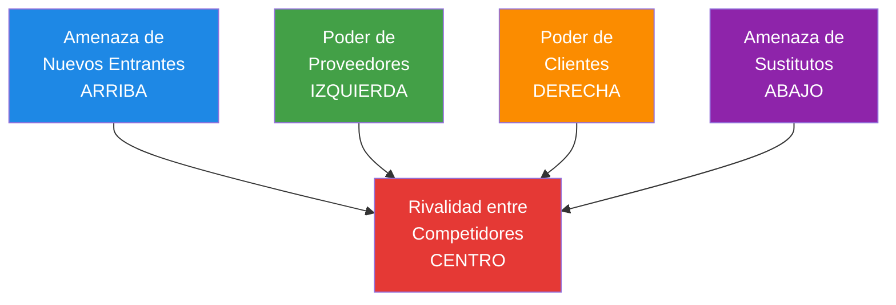

# Herramientas Estratégicas Avanzadas

## Diamante de Porter y Matriz BCG Aplicados a ONGs

  
    CD2001B - Semana 3 | Módulo 2
  

  Tec de Monterrey Campus Puebla

---
layout: center
class: text-center
---

# ¿Por Qué Usar Herramientas Empresariales en ONGs?

### 🤝 Competencia ≠ Rivalidad

ONGs no "compiten" como empresas, pero sí:

- Compiten por **donantes**
- Compiten por **voluntarios**
- Compiten por **beneficiarios** (atención limitada)
- Compiten por **visibilidad mediática**

### 📊 Recursos Limitados

Al igual que empresas, las ONGs deben:

- **Priorizar** programas
- **Optimizar** recursos
- **Diferenciarse** de otras organizaciones
- **Medir** su posición competitiva

Las herramientas son las mismas, pero la interpretación debe adaptarse al sector social

---
layout: section
---

# Parte 1: Diamante de Porter

## Las 5 Fuerzas Competitivas Adaptadas a ONGs

---

# El Modelo Original de Porter (1979)

## Contexto Empresarial

**Michael E. Porter** desarrolló este modelo para analizar la **intensidad competitiva** y el **atractivo de una industria**

### Las 5 Fuerzas

1. **Rivalidad entre competidores**
2. **Amenaza de nuevos entrantes**
3. **Poder de negociación de proveedores**
4. **Poder de negociación de clientes**
5. **Amenaza de productos/servicios sustitutos**

**Objetivo:** Determinar rentabilidad potencial

**En ONGs:** Determinar **sostenibilidad** y **capacidad de impacto**

## Diagrama Clásico

**Interpretación:** Mientras más fuertes sean las 5 fuerzas, más difícil es operar en la industria (o sector, en el caso de ONGs)

---

# Adaptación a ONGs: Renombrando las Fuerzas

## Modelo Empresarial

1. **Rivalidad** entre competidores
2. **Amenaza** de nuevos entrantes
3. **Poder de proveedores**
4. **Poder de clientes**
5. **Amenaza de sustitutos**

En empresas: "Clientes" pagan por servicios

## Modelo para ONGs

1. **Competencia** por recursos y visibilidad
2. **Facilidad de entrada** de nuevas ONGs
3. **Poder de donantes/financiadores**
4. **Poder de beneficiarios** (usuarios del servicio)
5. **Alternativas** de servicios sociales

**Clave:** En ONGs hay una **dualidad**:
- **Beneficiarios:** Reciben el servicio (no pagan)
- **Donantes:** Financian el servicio (no lo usan)

¡Ambos tienen poder de negociación!

---

# Fuerza 1: Competencia por Recursos y Visibilidad

## ¿Qué Mide?

Intensidad de la competencia entre ONGs que atienden problemáticas **similares** en la **misma región**

### Indicadores de Alta Rivalidad

- ✅ Muchas ONGs en el mismo sector
- ✅ Problemática popular (ej: cáncer infantil)
- ✅ Financiamiento limitado
- ✅ Beneficiarios tienen múltiples opciones

### Indicadores de Baja Rivalidad

- ✅ Nicho específico (ej: discapacidad auditiva)
- ✅ Pocos actores en la región
- ✅ Problemática invisible o estigmatizada

## Ejemplo: Bancos de Alimentos en Puebla

### Análisis

**Competencia:** Alta
- Cáritas Diocesana
- DIF Municipal
- Cruz Roja (distribución de despensas)
- 10+ organizaciones comunitarias

**Implicaciones:**

**Amenaza:**
- Saturación de donantes empresariales
- Sobreposición de beneficiarios

**Oportunidad:**
- Diferenciación por **calidad** (nutrición balanceada)
- Diferenciación por **eficiencia** (menor costo/beneficiario)
- Alianzas estratégicas vs competencia

**Estrategia:** Especializarse en **rescate de alimentos de hoteles** (nicho no atendido)

---

# Fuerza 2: Facilidad de Entrada de Nuevas ONGs

## ¿Qué Mide?

Qué tan fácil es para una **nueva organización** entrar al sector y competir

### Barreras de Entrada BAJAS

- ✅ No requiere infraestructura costosa
- ✅ Voluntarios abundantes
- ✅ Problemática visible y popular
- ✅ Legislación permisiva

**Resultado:** Muchas ONGs nuevas → Mayor competencia

### Barreras de Entrada ALTAS

- ✅ Requiere expertise técnico (ej: salud mental)
- ✅ Infraestructura costosa (ej: albergues)
- ✅ Certificaciones obligatorias
- ✅ Marca y confianza consolidada

**Resultado:** Menos entradas → Posición protegida

## Ejemplo: Educación vs Salud Especializada

### Educación Extraescolar

**Barreras:** BAJAS

- No requiere instalaciones
- Voluntarios universitarios
- Problemática universal

**Amenaza:** ⚠️ ALTA

Fácil que aparezcan nuevas ONGs educativas

**Estrategia de Defensa:**
- Construir **relaciones fuertes** con escuelas
- Desarrollar **metodología propia**
- Evidenciar **impacto medible**

### Cirugías Pediátricas Especializadas

**Barreras:** ALTAS

- Requiere hospital + equipo médico
- Cirujanos especializados
- Certificación sanitaria

**Amenaza:** ✅ BAJA

Difícil que aparezcan competidores

**Implicación:**
- Posición más segura
- Dependencia de fundraising especializado

**Para tu diagnóstico:** Identifica las barreras de entrada en el sector de tu ONG. ¿Es fácil o difícil que aparezcan competidores?

---

# Fuerza 3: Poder de Donantes y Financiadores

## ¿Qué Mide?

Capacidad de donantes/financiadores para **influir** en la estrategia y operación de la ONG

### Donantes Tienen ALTO Poder Cuando:

- ✅ Financian gran % del presupuesto (concentración)
- ✅ Hay muchas ONGs compitiendo por fondos
- ✅ Pueden cambiar fácilmente de beneficiario
- ✅ Exigen transparencia y resultados

### Donantes Tienen BAJO Poder Cuando:

- ✅ ONG tiene múltiples fuentes de ingreso (diversificación)
- ✅ Donantes son individuales (no institucionales)
- ✅ ONG tiene marca fuerte (ej: Cruz Roja)
- ✅ Problemática es única

## Estructura de Ingresos de una ONG

| Fuente de Ingreso | % Presupuesto | Poder de Negociación |
|-------------------|---------------|----------------------|
| Gobierno (1 convenio grande) | 60% | ⚠️ **ALTO** (dependencia) |
| Fundación internacional | 25% | ⚠️ **MEDIO-ALTO** |
| Donativos individuales (200 personas) | 10% | ✅ **BAJO** (diversificado) |
| Eventos de fundraising | 5% | ✅ **BAJO** |

### Análisis

**Riesgo:** 85% del presupuesto depende de **2 fuentes**

**Implicaciones:**
- Gobierno puede imponer condiciones estrictas
- Pérdida de 1 fuente = crisis financiera

**Recomendación:**
- Diversificar hacia donativos individuales
- Desarrollar ingresos propios (venta de productos/servicios)

**Caso real:** ONG pierde 70% de su presupuesto cuando cambió el gobierno. No sobrevivió.

---

# Fuerza 4: Poder de Beneficiarios

## ¿Qué Mide?

Capacidad de **beneficiarios** para influir en la calidad y tipo de servicio

**Nota:** Aunque no pagan, sí tienen poder

### Beneficiarios Tienen ALTO Poder Cuando:

- ✅ Hay muchas ONGs ofreciendo servicios similares (opciones)
- ✅ Servicio no es urgente/crítico
- ✅ Beneficiarios están organizados (voz colectiva)
- ✅ Redes sociales dan visibilidad a quejas

### Beneficiarios Tienen BAJO Poder Cuando:

- ✅ Servicio es único en la región
- ✅ Necesidad es crítica (ej: emergencia médica)
- ✅ Beneficiarios están dispersos
- ✅ Alta vulnerabilidad (pobreza extrema)

## Ejemplo: Albergue vs Centro Comunitario

### Albergue para Mujeres Víctimas de Violencia

**Poder de Beneficiarias:** BAJO

**Razones:**
- Necesidad crítica (seguridad)
- Servicio único en la ciudad
- Alta vulnerabilidad

**Riesgo:**
- Puede descuidar calidad del servicio
- Beneficiarias no tienen alternativa

**Responsabilidad Ética:**
- ⚠️ ONG debe **autorregularse**
- Comités de ética
- Evaluaciones externas

### Centro Comunitario Deportivo

**Poder de Beneficiarios:** ALTO

**Razones:**
- 5 centros deportivos en la zona
- Servicio no crítico (recreación)
- Beneficiarios pueden irse

**Implicación:**
- Debe ofrecer **calidad superior**
- Escuchar preferencias de usuarios
- Innovar constantemente

**Oportunidad:**
- Encuestas de satisfacción
- Co-diseño de programas

**Para tu diagnóstico:** El **KPI de satisfacción** es más crítico cuando beneficiarios tienen ALTO poder (pueden elegir)

---

# Fuerza 5: Alternativas de Servicios Sociales

## ¿Qué Mide?

Facilidad con la que beneficiarios pueden **sustituir** el servicio de la ONG por una **alternativa** (no necesariamente otra ONG)

### Tipos de Sustitutos

**1. Otras ONGs** (competencia directa)
- Ejemplo: Cruz Roja vs Cáritas (despensas)

**2. Servicios Gubernamentales**
- Ejemplo: DIF vs ONG de asistencia social

**3. Sector Privado**
- Ejemplo: Consulta psicológica gratis en ONG vs pagar $500 en consultorio

**4. Soluciones Informales**
- Ejemplo: Apoyo de familiares/vecinos vs ONG

**5. No Hacer Nada**
- Ejemplo: No buscar apoyo (resignación)

## Ejemplo: Banco de Alimentos

### Análisis de Sustitutos

| Sustituto | Amenaza | Razón |
|-----------|---------|-------|
| **DIF municipal** (despensas) | MEDIA | Limitado a padrón oficial |
| **Comprar alimentos** | BAJA | Beneficiarios no tienen recursos |
| **Cáritas** (despensas religiosas) | ALTA | Amplia cobertura |
| **Programas federales** (transferencias) | MEDIA | Burocracia, demora |
| **Redes familiares** | MEDIA | No sostenible largo plazo |

### Estrategia de Diferenciación

Para reducir amenaza de sustitutos:

- ✅ **Calidad superior:** Alimentos frescos + nutritivos
- ✅ **Servicio complementario:** Talleres de nutrición
- ✅ **Accesibilidad:** 10 puntos de distribución (vs 2 de Cáritas)
- ✅ **Sin requisitos religiosos/políticos:** Neutralidad

---

# Ejercicio: Diamante de Porter para una ONG

## Caso: "Fundación Educando"

**Misión:** Clases de regularización extraescolar a niños de comunidades rurales

**Ubicación:** 3 comunidades en Puebla

**Financiamiento:**
- 70% donativo de empresa textil local
- 20% gobierno estatal
- 10% eventos

**Competencia:**
- Programa gubernamental "Aprende en Casa"
- 2 ONGs educativas regionales

## Tu Análisis (Completa)

### 1. Competencia por Recursos
- **Intensidad:** [ ALTA / MEDIA / BAJA ]
- **Justificación:**

### 2. Facilidad de Entrada
- **Barreras:** [ ALTAS / MEDIAS / BAJAS ]
- **Amenaza:**

### 3. Poder de Donantes
- **Nivel:** [ ALTO / MEDIO / BAJO ]
- **Riesgo:** Concentración en 1 empresa (70%)

### 4. Poder de Beneficiarios
- **Nivel:** [ ALTO / MEDIO / BAJO ]
- **Razón:**

### 5. Amenaza de Sustitutos
- **Nivel:** [ ALTO / MEDIO / BAJO ]
- **Principales sustitutos:**

**Discusión:** ¿Cuál es la fuerza más fuerte? ¿Qué estrategia recomendarías?

---

# Síntesis: Diamante de Porter para ONGs

## Plantilla de Análisis

| Fuerza | Nivel (Alto/Medio/Bajo) | Evidencia | Implicación Estratégica |
|--------|------------------------|-----------|-------------------------|
| **1. Competencia** | | # de ONGs similares, saturación del sector | Diferenciación, alianzas |
| **2. Entrada** | | Barreras (expertise, infraestructura) | Protección de posición |
| **3. Donantes** | | % de concentración de ingresos | Diversificación |
| **4. Beneficiarios** | | Alternativas disponibles, criticidad | Calidad del servicio |
| **5. Sustitutos** | | Servicios gubernamentales, privados | Valor agregado |

## Interpretación

### Si las 5 fuerzas son ALTAS:
- ⚠️ Sector muy competitivo
- Difícil sostenibilidad
- Requiere **diferenciación fuerte**

### Si las 5 fuerzas son BAJAS:
- ✅ Posición favorable
- Facilidad de operación
- Riesgo de **complacencia**

### Si es MIXTO (lo más común):
- Identificar **fuerza dominante**
- Priorizar estrategias

**Para tu diagnóstico:** El análisis de Porter te ayuda a entender el **contexto competitivo** de la ONG y a generar **recomendaciones estratégicas** contextualizadas

---
layout: section
---

# Parte 2: Matriz BCG

## Gestión del Portafolio de Programas

---

# La Matriz BCG (Boston Consulting Group)

## Origen (1970)

Desarrollada por **Boston Consulting Group** para analizar **unidades de negocio** de empresas diversificadas

### Dos Dimensiones

**Eje X: Participación de Mercado**
- En empresas: Market share
- En ONGs: **Tamaño relativo** del programa

**Eje Y: Crecimiento del Mercado**
- En empresas: Crecimiento de la industria
- En ONGs: **Demanda/impacto** del programa

## La Matriz 2x2

**⭐ ESTRELLAS**

Alta Demanda 
Gran Tamaño

**❓ DILEMAS**

Alta Demanda 
Pequeño Tamaño

**💰 VACAS**

Baja Demanda 
Gran Tamaño

**⚰️ PERROS**

Baja Demanda 
Pequeño Tamaño

### Objetivo

**Optimizar asignación de recursos** entre programas según su posición en la matriz

---

# Adaptación de BCG a ONGs

## En Empresas

### Eje X: Market Share
- % de mercado vs competidor principal
- Medida: Ventas relativas

### Eje Y: Crecimiento del Mercado
- Tasa de crecimiento de la industria
- Medida: % anual

### Objetivo
- Maximizar **rentabilidad**
- Equilibrar flujo de caja

## En ONGs

### Eje X: Tamaño/Madurez del Programa
- Beneficiarios atendidos
- Presupuesto asignado
- Años de operación

**Alto:** Programa consolidado 
**Bajo:** Programa piloto/pequeño

### Eje Y: Demanda/Impacto Social
- Urgencia de la problemática
- Alineación con ODS
- Impacto medible

**Alto:** Problemática creciente/crítica 
**Bajo:** Problemática estable/decreciente

### Objetivo
- Maximizar **impacto social**
- Equilibrar recursos limitados

---

# Los 4 Cuadrantes de BCG para ONGs

### ⭐ ESTRELLAS

**Características:**
- Alta demanda social
- Programa grande/consolidado

**Ejemplo:**
- Banco de alimentos en pandemia
- Alta demanda + Operación robusta

**Estrategia:**
- ✅ **INVERTIR** para mantener liderazgo
- ✅ Buscar financiamiento adicional
- ✅ Innovar para mantener relevancia

**Riesgo:**
- Requiere recursos constantes
- No genera "excedente" para otros programas

### ❓ DILEMAS (Interrogantes)

**Características:**
- Alta demanda social
- Programa pequeño/nuevo

**Ejemplo:**
- Programa piloto de salud mental
- Problemática urgente pero operación incipiente

**Estrategia:**
- ❓ **DECIDIR:** ¿Invertir o desinvertir?
- ✅ Si tiene potencial → **CRECER** (convertir en Estrella)
- ❌ Si no es viable → **DESCONTINUAR**

**Pregunta Clave:**
- ¿Tenemos recursos para escalarlo?
- ¿El impacto justifica la inversión?

### 💰 VACAS LECHERAS

**Características:**
- Baja demanda social (problemática estable)
- Programa grande/consolidado

**Ejemplo:**
- Programa de becas tradicional
- Operación eficiente, demanda predecible

**Estrategia:**
- 💰 **ORDEÑAR:** Operar eficientemente
- ✅ Usar excedentes para financiar **Estrellas** y **Dilemas**
- ⚠️ No sobre-invertir

**Valor:**
- Genera estabilidad financiera
- Subsidia innovación

### ⚰️ PERROS

**Características:**
- Baja demanda social
- Programa pequeño

**Ejemplo:**
- Taller de oficios obsoletos
- Poca demanda + Impacto limitado

**Estrategia:**
- ⚰️ **DESINVERTIR** o **ELIMINAR**
- ✅ Liberar recursos para programas de mayor impacto
- ⚠️ Consideración ética: ¿Hay beneficiarios dependientes?

**Excepción:**
- Si es simbólico/histórico de la ONG
- Si tiene defensores poderosos (donante específico)

---

# Ejemplo: Matriz BCG de "Cruz Roja Puebla"

## Portafolio de Programas

1. **Atención de Emergencias**
   - 60% del presupuesto
   - Demanda alta (desastres frecuentes)

2. **Banco de Sangre**
   - 20% del presupuesto
   - Demanda constante

3. **Cursos de Primeros Auxilios**
   - 10% del presupuesto
   - Demanda baja pero estable

4. **Programa Piloto de Telemedicina**
   - 5% del presupuesto
   - Demanda creciente post-COVID

5. **Biblioteca Comunitaria**
   - 5% del presupuesto
   - Demanda decreciente

## Clasificación en la Matriz

**⭐ ESTRELLAS**

1. Atención de Emergencias
   - Alta demanda
   - Gran presupuesto

**❓ DILEMAS**

4. Telemedicina
   - Alta demanda
   - Presupuesto pequeño
   - **Decisión:** ¿Escalar?

**💰 VACAS**

2. Banco de Sangre
   - Demanda estable
   - Operación eficiente
   - **Rol:** Genera recursos

**⚰️ PERROS**

5. Biblioteca
   - Baja demanda
   - Presupuesto pequeño
   - **Decisión:** Descontinuar

### Recomendación Estratégica

- ✅ **Mantener** Atención de Emergencias (Estrella)
- ✅ **Escalar** Telemedicina con recursos de Banco de Sangre (Vaca)
- ❌ **Descontinuar** Biblioteca, reasignar 5% a Telemedicina

**Resultado:** Portafolio más enfocado en impacto

---

# Construcción de tu Matriz BCG

## Paso 1: Lista de Programas

Identifica todos los programas de la ONG

| Programa | Presupuesto | Beneficiarios | Años Operando |
|----------|-------------|---------------|---------------|
| A | $500K | 1,000 | 10 años |
| B | $200K | 300 | 2 años |
| C | $100K | 150 | 5 años |

## Paso 2: Evalúa Dimensiones

### Eje X: Tamaño Relativo
- Grande: > 30% del presupuesto
- Pequeño: < 30%

### Eje Y: Demanda/Impacto
- Alto: Problemática creciente, alta urgencia
- Bajo: Problemática estable o decreciente

**Fuentes:**
- Entrevistas con directivos
- Análisis de tendencias
- Datos de beneficiarios atendidos

## Paso 3: Grafica la Matriz

⭐ [Programa A]

❓ [Programa B]

💰 [Programa C]

⚰️ [Programa D]

---

# Decisiones Estratégicas por Cuadrante

### ⭐ ESTRELLAS

**Acciones:**
- ✅ Buscar financiamiento externo
- ✅ Innovar para mantener liderazgo
- ✅ Documentar mejores prácticas
- ✅ Medir impacto rigurosamente

**Presupuesto:** Aumentar o mantener

**Ejemplo:**
> "Incrementar presupuesto del programa de emergencias en 20% para adquirir ambulancia adicional"

### ❓ DILEMAS

**Acciones:**
- ❓ **Opción A - Invertir:** Buscar alianzas, escalar
- ❓ **Opción B - Desinvertir:** Cerrar el programa
- ⚠️ Establecer criterios de decisión claros
- ⏱️ Dar plazo (ej: 1 año) para demostrar viabilidad

**Presupuesto:** Decisión crítica

**Ejemplo:**
> "Evaluar en 6 meses si Telemedicina alcanza 500 consultas/mes. Si no, descontinuar."

### 💰 VACAS LECHERAS

**Acciones:**
- ✅ Optimizar eficiencia operativa
- ✅ Reducir costos sin afectar calidad
- ✅ Usar excedentes para otros programas
- ⚠️ No descuidar (pueden decaer a Perros)

**Presupuesto:** Mantener o reducir ligeramente

**Ejemplo:**
> "Automatizar banco de sangre para liberar $50K anuales, reasignar a programa de salud mental"

### ⚰️ PERROS

**Acciones:**
- ❌ Descontinuar el programa
- ↔️ Transferir a otra organización
- 🔄 Transformar radicalmente
- ⚠️ Considerar impacto en beneficiarios actuales

**Presupuesto:** Eliminar

**Ejemplo:**
> "Cerrar biblioteca física, donar libros a escuelas. Liberar 5% del presupuesto para programas de mayor impacto."

---

# Consideraciones Éticas en BCG para ONGs

## Diferencias con Empresas

En empresas, descontinuar un producto no afecta moralmente

En ONGs, cerrar un programa puede:
- Dejar beneficiarios sin servicio
- Afectar poblaciones vulnerables
- Romper compromisos

### Criterios Adicionales

**Antes de cerrar un "Perro":**

1. **¿Hay alternativas?**
   - ¿Otra ONG puede atender a los beneficiarios?

2. **¿Es crítico para algunos?**
   - Aunque sea pequeño, ¿es vital para ciertos usuarios?

3. **Transición gradual**
   - Dar tiempo para buscar alternativas (6-12 meses)

4. **Transparencia**
   - Comunicar razones a beneficiarios y donantes

## Ejemplo: Decisión Ética

### Caso: "Perro" = Apoyo a 10 Adultos Mayores

**Análisis Frío:**
- Baja demanda (solo 10 personas)
- Alto costo ($2,000 MXN/persona/mes)
- Podría atender a 100 niños con esos recursos

**Análisis Ético:**
- Los 10 adultos NO tienen familia
- NO hay otra ONG que los atienda
- Dependencia total del servicio

### Decisión Balanceada

❌ No cerrar abruptamente

✅ **Alternativas:**
- Buscar alianza con asilo/DIF para transferir beneficiarios
- Dar periodo de transición de 1 año
- Involucrar a los propios adultos en la decisión
- Documentar el proceso para aprendizaje

**Lección:** BCG es una herramienta, pero las **decisiones finales deben considerar dignidad humana y contexto**

---

# Integración: Porter + BCG

## Dos Lentes Complementarias

**Diamante de Porter:**
- Análisis **externo** (entorno competitivo)
- Nivel: ONG completa

**Matriz BCG:**
- Análisis **interno** (portafolio)
- Nivel: Programas individuales

### Usarlos Juntos

1. **Porter** → Identifica presiones externas
2. **BCG** → Decide cómo ajustar portafolio
3. **Resultado** → Estrategia coherente

## Ejemplo Integrado

### Porter Revela:
- Alta competencia por donantes empresariales
- Bajo poder de beneficiarios (servicio único)
- Amenaza: Nuevas ONGs digitales

### BCG Revela:
- Estrella: Programa presencial (mayor demanda)
- Dilema: Programa digital (pequeño, alto potencial)
- Vaca: Programa de despensas (eficiente)
- Perro: Programa de talleres (baja asistencia)

### Estrategia Resultante:

1. **Invertir en Dilema** (digital) para responder a amenaza de nuevas ONGs
2. **Financiar con Vaca** (despensas)
3. **Cerrar Perro** (talleres) para liberar recursos
4. **Mantener Estrella** pero diferenciándola (calidad)

---
layout: section
---

# Parte 3: Aplicación al Reto Final

## Integración de Porter y BCG en tu Diagnóstico

---

# Estructura para tu Reporte

## Sección: Análisis Estratégico

### 1. Diamante de Porter

**Contenido:**

- Tabla de las 5 fuerzas
- Calificación (Alto/Medio/Bajo)
- Evidencia específica
- Implicaciones estratégicas

**Ejemplo de Tabla:**

| Fuerza | Nivel | Evidencia | Implicación |
|--------|-------|-----------|-------------|
| Competencia | Alta | 8 ONGs en Puebla | Necesidad de diferenciación |
| Entrada | Baja | Requiere certificación sanitaria | Posición protegida |
| Donantes | Alta | 70% de 1 empresa | Riesgo de dependencia |
| Beneficiarios | Medio | 3 alternativas en la ciudad | Calidad es importante |
| Sustitutos | Alto | DIF + Cáritas | Valor agregado crítico |

### 2. Matriz BCG

**Contenido:**

- Lista de programas de la ONG
- Clasificación en los 4 cuadrantes
- Gráfico visual de la matriz
- Recomendaciones por programa

**Ejemplo de Gráfico:**

**⭐ ESTRELLAS**

- Programa A (40% presupuesto)

**Recomendación:** Mantener

**❓ DILEMAS**

- Programa B (5% presupuesto)

**Recomendación:** Escalar o cerrar

**💰 VACAS**

- Programa C (35% presupuesto)

**Recomendación:** Optimizar

**⚰️ PERROS**

- Programa D (20% presupuesto)

**Recomendación:** Desinvertir

### 3. Síntesis Integrada

- ¿Qué revela Porter sobre el entorno?
- ¿Cómo debe ajustarse el portafolio (BCG) para responder?
- 2-3 recomendaciones estratégicas clave

---

# Checklist: Porter y BCG

## Diamante de Porter

- [ ] **5 fuerzas identificadas**
  - Competencia
  - Facilidad de entrada
  - Poder de donantes
  - Poder de beneficiarios
  - Amenaza de sustitutos

- [ ] **Cada fuerza tiene:**
  - Calificación (Alto/Medio/Bajo)
  - Evidencia cuantitativa
  - Implicación estratégica

- [ ] **Fuente de información documentada**
  - Entrevistas
  - Datos secundarios
  - Observación

## Matriz BCG

- [ ] **Portafolio completo listado**
  - Todos los programas/servicios
  - % de presupuesto de cada uno

- [ ] **Dimensiones evaluadas**
  - Eje X: Tamaño relativo
  - Eje Y: Demanda/Impacto

- [ ] **Gráfico visual incluido**
  - Los 4 cuadrantes claramente etiquetados
  - Programas ubicados correctamente

- [ ] **Recomendaciones por cuadrante**
  - Específicas y accionables
  - Consideraciones éticas

- [ ] **Integración con Porter**
  - Estrategia coherente

**Nota:** Estas herramientas son **parte** de la Actividad #1 (Parte 2). También incluirás Customer Journey y KPIs (próxima clase).

---
layout: center
class: text-center
---

# Resumen: Porter y BCG

### 🔷 Diamante de Porter
- **Objetivo:** Entender entorno competitivo
- **5 Fuerzas:** Competencia, Entrada, Donantes, Beneficiarios, Sustitutos
- **Resultado:** Identificar oportunidades y amenazas externas

### 🔶 Matriz BCG
- **Objetivo:** Optimizar portafolio de programas
- **4 Cuadrantes:** Estrellas, Dilemas, Vacas, Perros
- **Resultado:** Priorizar recursos para maximizar impacto

Herramientas empresariales + Adaptación al sector social = Diagnóstico estratégico robusto

---
layout: end
class: text-center
---

# ¡Gracias!

## Próxima Clase: Customer Journey Map y KPIs

CD2001B - Semana 3 
Tec de Monterrey Campus Puebla

