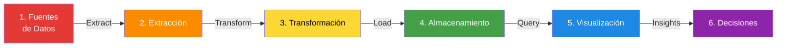
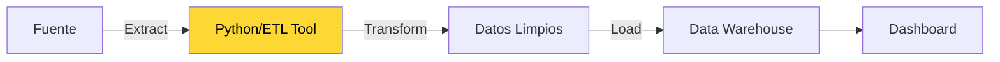
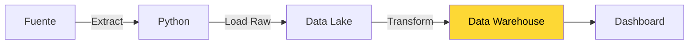
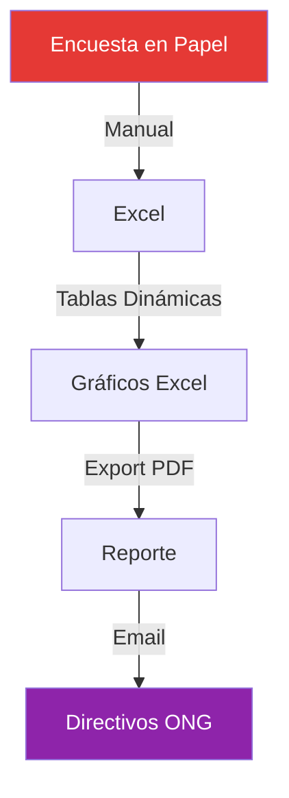
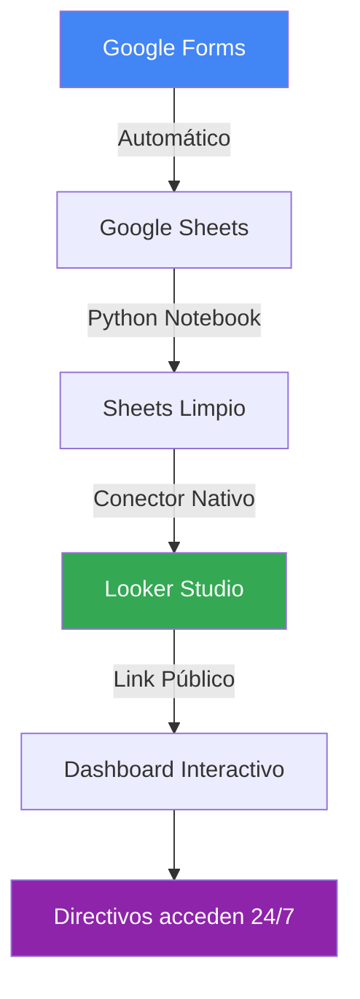
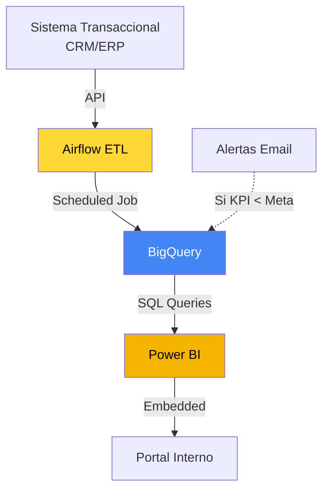
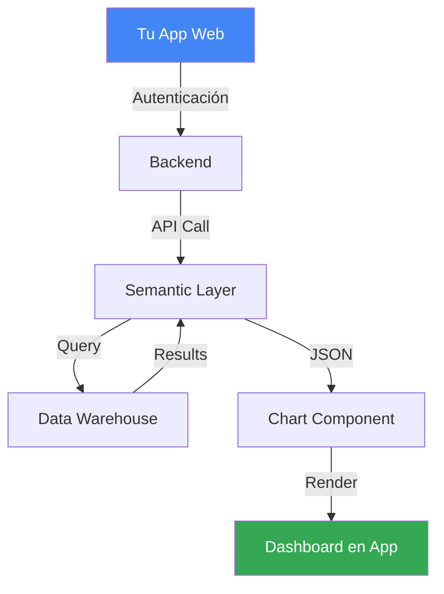

<style src="./styles/tec-theme.css"></style>

# Visualización en el Pipeline de Datos

## Del Dato Crudo a la Decisión: Arquitectura Completa

<div class="pt-12">
  <span class="px-2 py-1 rounded cursor-pointer" hover="bg-white bg-opacity-10">
    CD2001B - Semana 4 | Módulo 2
  </span>
</div>

<div class="abs-br m-6 flex gap-2">
  <span class="text-sm opacity-50">Tec de Monterrey Campus Puebla</span>
</div>

---
layout: center
class: text-center
---

# ¿Por Qué Importa el Pipeline Completo?

<div class="grid grid-cols-2 gap-8 mt-12">
<div v-click>

### ❌ Visión Aislada

"Solo necesito hacer un dashboard en Looker Studio"

**Problema:**
- No entiendes de dónde vienen los datos
- No sabes si están limpios
- No puedes explicar limitaciones
- Dashboard = "caja negra"

</div>
<div v-click>

### ✅ Visión Holística

"Necesito un **pipeline** que vaya desde la encuesta hasta las decisiones"

**Beneficio:**
- ✅ Entiendes cada etapa
- ✅ Identificas dónde optimizar
- ✅ Explicas limitaciones con datos
- ✅ Dashboard = parte de un sistema

</div>
</div>

<div v-click class="mt-12 text-xl font-bold text-gradient">
Los buenos analistas de datos entienden TODO el pipeline, no solo la visualización final
</div>

---
layout: section
---

# Parte 1: Anatomía de un Pipeline de Datos

## Las 6 Etapas Desde el Origen Hasta la Decisión

---

# Pipeline de Datos: Vista Completa



<div v-click class="mt-8 grid grid-cols-6 gap-2 text-xs">

<div class="p-3 bg-red-500 bg-opacity-20 rounded">

**1. Fuentes**
- APIs
- Bases de datos
- Archivos CSV
- Formularios
- Web scraping

</div>

<div class="p-3 bg-orange-500 bg-opacity-20 rounded">

**2. Extracción**
- Conectores
- Scripts Python
- Scheduled jobs
- Real-time streams

</div>

<div class="p-3 bg-yellow-500 bg-opacity-20 rounded">

**3. Transformación**
- Limpieza
- Validación
- Agregación
- Join de tablas

</div>

<div class="p-3 bg-green-500 bg-opacity-20 rounded">

**4. Almacenamiento**
- Data warehouse
- Data lake
- Google Sheets
- BigQuery

</div>

<div class="p-3 bg-blue-500 bg-opacity-20 rounded">

**5. Visualización**
- Looker Studio
- Power BI
- Tableau
- Streamlit

</div>

<div class="p-3 bg-purple-500 bg-opacity-20 rounded">

**6. Decisiones**
- Líneas de acción
- Reportes ejecutivos
- Alertas
- KPIs

</div>

</div>

---

# Etapa 1 y 2: Fuentes y Extracción

<div class="grid grid-cols-2 gap-8">
<div>

## Tipos de Fuentes de Datos

### 1. **Datos Estructurados**
- Bases de datos (MySQL, PostgreSQL)
- Archivos CSV/Excel
- APIs con JSON estructurado
- Google Sheets

**Características:**
- ✅ Fácil de procesar
- ✅ Esquema definido
- Ejemplo: Registro de beneficiarios

### 2. **Datos Semi-estructurados**
- JSON, XML
- Logs de aplicaciones
- Emails

**Características:**
- ⚠️ Requiere parsing
- Esquema flexible

</div>
<div v-click>

### 3. **Datos No Estructurados**
- Texto libre (comentarios)
- Imágenes
- Audio/Video
- PDFs

**Características:**
- ❌ Difícil de procesar directamente
- Requiere NLP/Computer Vision

## Métodos de Extracción

### **Batch (Lotes)**
- Extracción periódica (diaria, semanal)
- Ejemplo: Exportar datos de formulario a CSV cada noche

### **Streaming (Tiempo Real)**
- Datos fluyen continuamente
- Ejemplo: Transacciones financieras, IoT sensors

### **Manual**
- Descarga manual de archivos
- Solo para prototipos

</div>
</div>

---

# Etapa 3: Transformación (La Más Crítica)

<div class="grid grid-cols-2 gap-8">
<div>

## ¿Por Qué Transformar?

**Datos crudos ≠ Datos listos para análisis**

### Problemas Comunes en Datos Crudos

1. **Valores Faltantes**
   - Celdas vacías
   - "N/A", "NULL", "-"

2. **Formatos Inconsistentes**
   - Fechas: "2024-01-15" vs "15/01/2024"
   - Nombres: "María López" vs "LOPEZ, MARIA"

3. **Outliers/Errores**
   - Edad: 150 años
   - Satisfacción: 15/10

4. **Duplicados**
   - Mismo beneficiario registrado 2 veces

</div>
<div v-click>

## Operaciones de Transformación

### **Limpieza**
```python
# Eliminar duplicados
df.drop_duplicates(subset=['beneficiario_id'])

# Rellenar faltantes
df['satisfaccion'].fillna(df['satisfaccion'].median())

# Corregir outliers
df = df[df['edad'] < 120]
```

### **Estandarización**
```python
# Fechas uniformes
df['fecha'] = pd.to_datetime(df['fecha'])

# Nombres en mayúsculas
df['nombre'] = df['nombre'].str.upper()
```

### **Enriquecimiento**
```python
# Calcular edad desde fecha de nacimiento
df['edad'] = (datetime.now() - df['fecha_nac']).dt.years

# Categorizar
df['grupo_edad'] = pd.cut(df['edad'],
                           bins=[0,18,30,60,100],
                           labels=['Menor','Joven','Adulto','Mayor'])
```

</div>
</div>

---

# ETL vs ELT: Dos Filosofías de Pipeline

<div class="grid grid-cols-2 gap-8">
<div>

## ETL (Extract, Transform, Load)

**Filosofía:** Transforma ANTES de guardar



### Ventajas
- ✅ Solo guardas datos limpios
- ✅ Queries más rápidos en dashboard
- ✅ Menor costo de almacenamiento

### Desventajas
- ❌ Si cambias transformación, debes re-procesar
- ❌ Pierdes datos crudos originales (difícil debugging)

</div>
<div v-click>

## ELT (Extract, Load, Transform)

**Filosofía:** Guarda TODO, transforma DESPUÉS



### Ventajas
- ✅ Guardas datos originales (auditoría)
- ✅ Puedes cambiar transformaciones sin re-extraer
- ✅ Flexibilidad para diferentes análisis

### Desventajas
- ❌ Más costoso (almacenas crudo + limpio)
- ❌ Transformación en cada query (más lento)

<div v-click class="mt-6 p-4 bg-blue-500 bg-opacity-10 rounded text-sm">

**Tendencia moderna (2024):** **ELT** domina por flexibilidad y poder de cómputo barato en la nube

</div>

</div>
</div>

---

# Etapa 4: Almacenamiento - Opciones Según Escala

<div class="text-xs">

| Tipo | Ejemplos | Capacidad | Costo | Velocidad Query | Cuándo Usar |
|------|----------|-----------|-------|----------------|-------------|
| **Hoja de Cálculo** | Google Sheets, Excel | <1M filas | 🟢 Gratis | 🔴 Lenta (>10K filas) | **Prototipos, ONGs pequeñas, estudiantes** |
| **Base de Datos Relacional** | MySQL, PostgreSQL, SQL Server | 1M - 100M filas | 🟡 $50-500/mes | 🟡 Media | Aplicaciones transaccionales, ONGs medianas |
| **Data Warehouse** | BigQuery, Snowflake, Redshift | 100M - Billones filas | 🟡 Pay-per-query | 🟢 Rápida | **Empresas, análisis a escala** |
| **Data Lake** | S3 + Athena, Azure Data Lake | Petabytes | 🟢 Storage barato | 🔴 Lenta (full scans) | Almacenar TODO (logs, raw files) |
| **Data Lakehouse** | Databricks, Snowflake | Billones filas | 🔴 $1000+/mes | 🟢 Muy rápida | **Empresas grandes, ML + BI** |

</div>

<div v-click class="mt-6 grid grid-cols-3 gap-6 text-sm">

<div class="p-4 bg-green-500 bg-opacity-10 rounded">

### Para tu Proyecto ONG

**Usa:** Google Sheets
- ✅ Gratis
- ✅ Fácil
- ✅ <100K filas (suficiente)
- ✅ Integra directo con Looker Studio

**Pipeline:**
```
Encuesta → Python (limpieza)
→ Google Sheets → Looker Studio
```

</div>

<div v-click class="p-4 bg-blue-500 bg-opacity-10 rounded">

### Para Empresa Mediana

**Usa:** BigQuery (Google) o Snowflake
- ✅ Escalable (TB de datos)
- ✅ SQL familiar
- ⚠️ $100-1000/mes

**Pipeline:**
```
Múltiples fuentes → ETL (Airflow)
→ BigQuery → Looker Studio/Tableau
```

</div>

<div v-click class="p-4 bg-purple-500 bg-opacity-10 rounded">

### Para Empresa Grande

**Usa:** Data Lakehouse
- ✅ BI + Machine Learning
- ✅ Petabytes
- ❌ $5K-50K/mes

**Pipeline:**
```
Cientos de fuentes → Streaming
→ Data Lake (S3) → Databricks
→ Power BI/Tableau
```

</div>

</div>

---

# Etapa 5: Visualización - Elección de Herramienta

<div class="grid grid-cols-2 gap-8">
<div>

## Matriz de Decisión

```
         Alta Complejidad
              │
              │  Tableau
              │     ●
  Código ─────┼─────────── No-Code
  Required    │  Power BI
              │     ●
       Python │       ● Looker Studio
    (Streamlit)│
              │
         Baja Complejidad
```

### Factores de Decisión

**1. Audiencia**
- Ejecutivos: Looker/Power BI (simple)
- Analistas: Tableau (explorable)
- Técnicos: Python dashboards (customizable)

**2. Frecuencia de Actualización**
- Tiempo real: Streamlit, BI tools con DirectQuery
- Diaria: Cualquier tool
- Mensual: Hasta Excel sirve

</div>
<div v-click>

**3. Interactividad Requerida**
- Alta (drill-down, filtros múltiples): Tableau, Power BI
- Media (filtros básicos): Looker Studio
- Baja (estática): PDF con gráficos Python

**4. Budget**
- $0: Looker Studio, Streamlit (self-hosted)
- <$500/mes: Power BI
- >$1000/mes: Tableau, Looker (empresarial)

<div v-click class="mt-6 p-4 bg-yellow-500 bg-opacity-10 rounded text-sm">

## Tu Proyecto ONG: Análisis

- **Audiencia:** Directivos ONG (no técnicos)
- **Frecuencia:** Semanal/Mensual
- **Interactividad:** Media (filtros por área/programa)
- **Budget:** $0
- **Datos:** <100K filas

**→ Looker Studio es ideal**

**Alternativa Python:** Streamlit (si quieres más control)

</div>

</div>
</div>

---
layout: section
---

# Parte 2: Actividad Práctica

## Diseña 3 Pipelines Diferentes para tu Proyecto ONG

---

# Actividad: Diagramar tu Pipeline

<div class="text-sm">

**Objetivo:** Entender que hay múltiples caminos para llegar al mismo resultado (dashboard)

**Instrucciones:**
1. Individualmente o en equipos de 2
2. Dibuja 3 pipelines diferentes en papel/Miro/Excalidraw
3. Identifica ventajas y desventajas de cada uno
4. Decide cuál implementarás en tu proyecto

---

## Plantilla de Diagrama

Para cada pipeline, responde:

| Etapa | Herramienta | Justificación |
|-------|-------------|---------------|
| 1. Fuente de datos | [Google Forms / Excel / Sistema] | ¿Por qué esta fuente? |
| 2. Extracción | [Manual / Python script / Conector] | ¿Automático o manual? |
| 3. Transformación | [Excel / Python / SQL] | ¿Dónde limpias los datos? |
| 4. Almacenamiento | [Excel local / Google Sheets / BigQuery] | ¿Cuántos datos tienes? |
| 5. Visualización | [Looker Studio / Power BI / Streamlit] | ¿Audiencia? ¿Budget? |
| 6. Entrega | [Link dashboard / PDF / Email] | ¿Cómo acceden los stakeholders? |

**Ventajas:** [Lista 2-3]
**Desventajas:** [Lista 2-3]
**Costo estimado:** [$0 / $X/mes]
**Tiempo de setup:** [Horas/días]

</div>

---

# Pipeline 1: Opción Minimalista (Excel-Only)

<div class="grid grid-cols-2 gap-8">
<div>

## Diagrama



## Descripción

| Etapa | Herramienta |
|-------|-------------|
| Fuente | Encuestas en papel |
| Extracción | Captura manual en Excel |
| Transformación | Funciones Excel (PROMEDIO, CONTAR.SI) |
| Almacenamiento | Archivo .xlsx local |
| Visualización | Gráficos Excel |
| Entrega | PDF por email |

</div>
<div v-click>

## Análisis

### ✅ Ventajas
- **Cero curva de aprendizaje** (todos saben Excel)
- **Cero costo**
- **Funciona sin internet**
- **Control total** (archivo local)

### ❌ Desventajas
- **No escalable** (lento con >1000 filas)
- **Propenso a errores** (captura manual)
- **No colaborativo** (archivo local)
- **No interactivo** (PDF estático)
- **Tedioso actualizar** (copiar-pegar cada vez)

### 💰 Costo: $0

### ⏱️ Tiempo Setup: 1 hora

<div v-click class="mt-4 p-4 bg-red-500 bg-opacity-10 rounded text-sm">

**Veredicto:** Solo usar si ONG no tiene internet o presupuesto CERO y datos <500 filas

</div>

</div>
</div>

---

# Pipeline 2: Opción Cloud Moderna (Recomendada)

<div class="grid grid-cols-2 gap-8">
<div>

## Diagrama



## Descripción

| Etapa | Herramienta |
|-------|-------------|
| Fuente | Google Forms (encuesta online) |
| Extracción | Automática a Google Sheets |
| Transformación | Python (Colab) o Apps Script |
| Almacenamiento | Google Sheets (cloud) |
| Visualización | Looker Studio |
| Entrega | Link compartido (actualiza solo) |

</div>
<div v-click>

## Análisis

### ✅ Ventajas
- **100% automático** (Forms → Sheets)
- **Gratis** (todo en Google)
- **Colaborativo** (múltiples editores)
- **Actualización en tiempo real**
- **Dashboard interactivo** (filtros)
- **Accesible desde cualquier lugar**
- **Fácil de aprender** (1 semana)

### ❌ Desventajas
- **Límite de 100K filas** en Sheets
- **Requiere internet**
- **Menos potente** que Power BI para cálculos complejos

### 💰 Costo: $0

### ⏱️ Tiempo Setup: 4-6 horas (primera vez)

<div v-click class="mt-4 p-4 bg-green-500 bg-opacity-10 rounded text-sm">

**Veredicto:** **IDEAL para este curso y ONGs pequeñas-medianas**

</div>

</div>
</div>

---

# Pipeline 3: Opción Empresarial (Escalable)

<div class="grid grid-cols-2 gap-8 text-sm">
<div>

## Diagrama



## Descripción

| Etapa | Herramienta |
|-------|-------------|
| Fuente | Base de datos empresarial (MySQL) |
| Extracción | Apache Airflow (orquestación) |
| Transformación | SQL en BigQuery (ELT) |
| Almacenamiento | BigQuery (data warehouse) |
| Visualización | Power BI / Tableau |
| Entrega | Portal empresarial + Alertas |

</div>
<div v-click>

## Análisis

### ✅ Ventajas
- **Escala a millones de filas**
- **Automatización completa** (scheduled jobs)
- **Alertas proactivas** (KPI cae → email)
- **Gobernanza empresarial** (permisos, roles)
- **Auditoría completa** (logs de todo)
- **Múltiples fuentes** integradas

### ❌ Desventajas
- **Costo alto** ($500-5000/mes)
- **Requiere equipo de Data Engineering**
- **Complejidad alta** (3-6 meses setup)
- **Overkill para ONGs pequeñas**

### 💰 Costo: $500-5000/mes

### ⏱️ Tiempo Setup: 1-3 meses

<div v-click class="mt-4 p-4 bg-blue-500 bg-opacity-10 rounded text-sm">

**Veredicto:** Solo para **grandes ONGs** (ej: Cruz Roja, UNICEF) o **empresas** con presupuesto

</div>

</div>
</div>

---

# Comparación de los 3 Pipelines

<div class="text-xs">

| Característica | Pipeline 1: Excel-Only | Pipeline 2: Cloud Moderna ⭐ | Pipeline 3: Empresarial |
|----------------|------------------------|------------------------------|-------------------------|
| **Costo** | 🟢 $0 | 🟢 $0 | 🔴 $500-5000/mes |
| **Setup Time** | 🟢 1 hora | 🟡 4-6 horas | 🔴 1-3 meses |
| **Escalabilidad** | 🔴 <1K filas | 🟡 <100K filas | 🟢 Millones+ |
| **Automatización** | 🔴 Manual | 🟢 Automático | 🟢 Completamente automatizado |
| **Colaboración** | 🔴 Archivo local | 🟢 Cloud colaborativo | 🟢 Portal empresarial |
| **Interactividad** | 🔴 PDF estático | 🟢 Dashboard interactivo | 🟢 Dashboard avanzado + alertas |
| **Actualización** | 🔴 Manual cada vez | 🟢 Tiempo real | 🟢 Scheduled (diario/horario) |
| **Curva aprendizaje** | 🟢 Baja (Excel conocido) | 🟡 Media (1-2 semanas) | 🔴 Alta (meses) |
| **Acceso** | 🔴 Solo quien tiene archivo | 🟢 Link (cualquiera) | 🟢 Portal con SSO |
| **Gobernanza** | 🔴 Ninguna | 🟡 Básica (permisos Google) | 🟢 Completa (roles, auditoría) |

</div>

<div v-click class="mt-6 p-6 bg-yellow-500 bg-opacity-10 rounded text-center">

**Recomendación para tu Proyecto:**

**Pipeline 2 (Cloud Moderna)** es el punto óptimo: suficientemente potente, 100% gratis, y profesional

</div>

---
layout: section
---

# Parte 3: Alternativas Modernas

## Más Allá de Looker Studio: Streamlit, Retool y el Futuro

---

# Python Dashboards: Streamlit, Dash, Panel

<div class="grid grid-cols-3 gap-6 text-sm">

<div>

### Streamlit

**Filosofía:** Dashboard en minutos con Python

```python
import streamlit as st
import pandas as pd

st.title("Dashboard ONG")

df = pd.read_csv('datos.csv')
st.dataframe(df)

satisfaccion = df['satisfaccion'].mean()
st.metric("Satisfacción", f"{satisfaccion:.1f}/10")

st.bar_chart(df.groupby('area')['beneficiarios'].sum())
```

**Ventajas:**
- ✅ Código = Control total
- ✅ Integra con ML models
- ✅ Hosting gratis (streamlit.io)

**Desventajas:**
- ❌ Requiere Python
- ❌ Menos "drag & drop"

</div>

<div v-click>

### Plotly Dash

**Filosofía:** Dashboards profesionales con React bajo el capó

```python
from dash import Dash, dcc, html

app = Dash(__name__)

app.layout = html.Div([
    html.H1("Dashboard"),
    dcc.Graph(
        figure={
            'data': [{'x': [...], 'y': [...]}]
        }
    )
])
```

**Ventajas:**
- ✅ Más customizable que Streamlit
- ✅ Callbacks complejos

**Desventajas:**
- ❌ Más código requerido
- ❌ Curva de aprendizaje mayor

</div>

<div v-click>

### Panel

**Filosofía:** Parte del ecosistema HoloViz

```python
import panel as pn
import hvplot.pandas

pn.extension()

df.hvplot.bar(x='area', y='beneficiarios')
```

**Ventajas:**
- ✅ Integración con notebooks
- ✅ Widgets interactivos

**Desventajas:**
- ❌ Menos popular (menos recursos)

</div>

</div>

<div v-click class="mt-8 p-6 bg-purple-500 bg-opacity-10 rounded text-center">

**Cuándo usar Python dashboards:**
- Necesitas lógica compleja (ML predictions, optimización)
- Quieres control total del diseño
- Tu audiencia es técnica
- Dashboard embebido en aplicación más grande

</div>

---

# Low-Code Alternatives: Retool, Bubble

<div class="grid grid-cols-2 gap-8">
<div>

## Retool

**Qué es:** Plataforma para construir **internal tools** sin frontend

### Use Cases
- Admin panels
- Dashboards operacionales
- CRUDs rápidos
- Workflows internos

### Características
- **Drag & drop** componentes (tablas, forms, charts)
- **Conectores** a 50+ bases de datos
- **Lógica con JavaScript** (si necesitas)
- **Colaboración** en equipo

### Pricing
- Gratis para individuos
- $10/user/mes (equipos)

</div>
<div v-click>

### Ventajas
- ✅ **Mucho más rápido** que programar desde cero
- ✅ **Funcionalidad compleja** (CRUD, permisos, workflows)
- ✅ **Profesional** desde día 1

### Desventajas
- ❌ **No es para dashboards públicos** (es para internal tools)
- ❌ **Vendor lock-in** (dependes de Retool)
- ❌ **Costo escala** con usuarios

<div v-click class="mt-6 p-4 bg-blue-500 bg-opacity-10 rounded">

**Cuándo usar Retool:**
- Dashboard **interno** (empleados de ONG)
- Necesitas operaciones CRUD (editar datos)
- Múltiples bases de datos conectadas
- Quieres velocidad de desarrollo

**NO usar para:**
- Dashboard público/externo
- Reportes estáticos

</div>

</div>
</div>

---

# El Futuro: Zero-ETL y AI-Driven Insights

<div class="grid grid-cols-2 gap-8">
<div>

## Zero-ETL (2024-2025)

**Concepto:** Eliminar el "middleware" ETL/ELT

### Arquitectura Tradicional
```
Source DB → ETL Tool (Airflow) → Data Warehouse → BI
```
**Problema:** Complejidad, latencia, costo

### Arquitectura Zero-ETL
```
Source DB ─────────────────────→ BI
         (sincronización nativa)
```

**Ejemplos:**
- **AWS Zero-ETL** (Aurora → Redshift)
- **BigQuery Omni** (query datos en S3/Azure sin moverlos)
- **Snowflake External Tables**

### Ventajas
- ✅ Menos infraestructura
- ✅ Datos más frescos (near real-time)
- ✅ Menos costo

</div>
<div v-click>

## AI-Driven Insights

**Concepto:** BI que "habla" y "piensa"

### Features Emergentes (2024-2025)

**1. Natural Language to SQL**
- Usuario: "¿Cuál área tiene menor satisfacción?"
- BI: *Ejecuta query automáticamente*
- Respuesta: "Sur con 6.8/10"

**2. Automated Insights**
- BI detecta: "Satisfacción en Norte bajó 15% este mes"
- Alert automático al gerente

**3. Predictive Dashboards**
- "Basado en tendencia, llegarás a tu meta en 3 meses"

### Herramientas
- **ThoughtSpot:** NL search desde 2012
- **Power BI Copilot:** GPT integration (2023)
- **Tableau Pulse:** AI insights (2024)

<div v-click class="mt-4 p-4 bg-green-500 bg-opacity-10 rounded text-sm">

**Implicación para ONGs:** En 3-5 años, directivos sin conocimiento técnico podrán "conversar" con los datos

</div>

</div>
</div>

---

# Embedded Analytics: Dashboard Dentro de tu Producto

<div class="grid grid-cols-2 gap-8">
<div>

## ¿Qué es Embedded Analytics?

**Dashboard integrado dentro de tu aplicación/sitio web**

### Ejemplo: SaaS de Gestión de ONGs

Tu producto web tiene:
- Login de usuarios
- Gestión de beneficiarios
- **Dashboard embebido** (cada ONG ve sus métricas)

```html
<iframe src="https://lookerstudio.google.com/embed/...">
</iframe>
```

### Herramientas Especializadas

- **Looker (Google):** Líder en embedded BI
- **Metabase:** Open-source
- **Apache Superset:** Open-source
- **Cube.js:** Semantic layer para devs

</div>
<div v-click>

## Arquitectura Típica



### Consideraciones

**Seguridad:**
- Row-level security (cada cliente solo ve sus datos)
- Token authentication

**Performance:**
- Cache de queries frecuentes
- Paginación de resultados

<div v-click class="mt-4 p-4 bg-yellow-500 bg-opacity-10 rounded text-sm">

**Para tu proyecto:** NO necesitas embedded analytics (dashboard standalone es suficiente)

</div>

</div>
</div>

---
layout: center
class: text-center
---

# Resumen: Visualización en Pipeline

<div class="grid grid-cols-3 gap-6 mt-12 text-sm">

<div v-click>

### 🔄 Pipeline Completo
1. Fuentes
2. Extracción
3. **Transformación** (crítica)
4. Almacenamiento
5. **Visualización**
6. Decisiones

</div>

<div v-click>

### 🎯 Tu Proyecto
**Pipeline Cloud Moderna:**
- Google Forms
- Google Sheets
- Python (limpieza)
- Looker Studio
- **Costo: $0**

</div>

<div v-click>

### 🚀 Futuro
- Zero-ETL
- AI-driven insights
- Natural language queries
- Real-time dashboards

</div>

</div>

<div v-click class="mt-16 text-xl font-bold text-gradient">
Entender el pipeline completo te hace un analista más valioso que solo saber hacer dashboards bonitos
</div>

---
layout: end
class: text-center
---

# ¡Gracias!

## Próxima Clase: Streamlit - Dashboard con Python

### Actividad: Dibuja tu pipeline end-to-end y tráelo a la siguiente clase

<div class="mt-8 opacity-75">
CD2001B - Semana 4<br>
Tec de Monterrey Campus Puebla
</div>
