<style src="./styles/tec-theme.css"></style>

# Fundamentos de Visualización de Datos

## Diseño Efectivo para Comunicar Insights

<div class="pt-12">
  <span class="px-2 py-1 rounded cursor-pointer" hover="bg-white bg-opacity-10">
    CD2001B - Semana 4 | Módulo 2
  </span>
</div>

<div class="abs-br m-6 flex gap-2">
  <span class="text-sm opacity-50">Tec de Monterrey Campus Puebla</span>
</div>

---
layout: center
class: text-center
---

# ¿Por Qué Visualizar Datos?

<div class="grid grid-cols-2 gap-8 mt-12">
<div v-click>

### 📊 El Cerebro Procesa Imágenes 60,000x Más Rápido que Texto

**Tabla de datos:**
```
Año  Beneficiarios
2020  1,200
2021  1,450
2022  2,100
2023  2,850
```

¿Ves el patrón fácilmente? 🤔

</div>
<div v-click>

### 📈 Gráfico de Línea

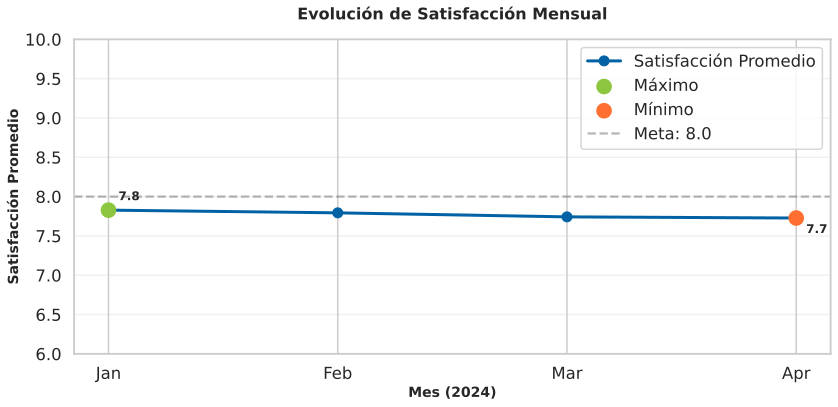

**Insight instantáneo:**
- Tendencia clara al primer vistazo
- Patrones y anomalías visibles
- Punto de inflexión identificable

**Resultado:** Decisiones más rápidas y acertadas

</div>
</div>

<div v-click class="mt-12 text-xl font-bold text-gradient">
"Una imagen vale más que mil números" - Visualización efectiva
</div>

---
layout: section
---

# Parte 1: Principios de Diseño Visual

## Los Fundamentos de una Buena Visualización

---

# Principio 1: Jerarquía Visual

<div class="grid grid-cols-2 gap-8">
<div>

## ¿Qué es?

**Jerarquía Visual:** Organizar elementos por orden de importancia para guiar la atención del lector

<div v-click class="mt-6">

### Técnicas

**1. Tamaño**
- Números grandes para KPIs principales
- Gráficos pequeños para datos secundarios

**2. Posición**
- Arriba-Izquierda = Más importante (patrón de lectura)
- Abajo-Derecha = Menos importante

**3. Color**
- Colores brillantes = Llaman atención
- Grises = Contexto de fondo

**4. Contraste**
- Negrita para destacar
- Fino para texto secundario

</div>

</div>
<div v-click>

## Ejemplo: Dashboard de ONG

### ❌ Sin Jerarquía

```
┌────────────────────────────────┐
│ Beneficiarios: 1,500           │ (tamaño normal)
│ Satisfacción: 8.2/10           │ (tamaño normal)
│ Costo/beneficiario: $250       │ (tamaño normal)
│ Voluntarios activos: 45        │ (tamaño normal)
└────────────────────────────────┘
```
Todo parece igual → ¿Qué es importante?

### ✅ Con Jerarquía

```
┌────────────────────────────────┐
│    SATISFACCIÓN                │
│       8.2/10                   │ (GRANDE, arriba)
│    Meta: 8.5 (falta 0.3)       │
├────────────────────────────────┤
│ Beneficiarios  │ Voluntarios  │ (pequeños, abajo)
│   1,500        │    45         │
└────────────────────────────────┘
```
Clara prioridad → Satisfacción es el KPI principal

</div>
</div>

---

# Principio 2: Menos es Más (Minimalismo)

<div class="grid grid-cols-2 gap-8">
<div>

## Concepto

**Ley de Simplicidad:** Elimina todo lo que no aporta información

<div v-click class="mt-6">

### Elementos a Eliminar

- ❌ Bordes innecesarios
- ❌ Fondos con textura/gradientes
- ❌ Efectos 3D (distorsionan datos)
- ❌ Líneas de cuadrícula excesivas
- ❌ Etiquetas redundantes
- ❌ Colores decorativos

</div>

<div v-click class="mt-6">

### Regla del Data-Ink Ratio

**Data-Ink Ratio =** (Tinta usada para datos) / (Tinta total)

**Objetivo:** Maximizar este ratio (≥ 0.7)

</div>

</div>
<div v-click>

## Ejemplo: Gráfico de Barras

### ❌ Sobrecargado

```
┌─────────────────────────────────┐
│ 📊 SATISFACCIÓN POR ÁREA 📊     │ (título redundante)
├─────────────────────────────────┤
│ (Fondo con gradiente azul)      │
│                                  │
│   🟦 Norte    ███████ 8.5       │ (3D, emojis, sombras)
│   🟩 Sur      ██████  7.8       │
│   🟨 Este     ████████ 9.1      │
│   🟥 Oeste    █████   7.2       │
│                                  │
│ Grid: ─ ─ ─ ─ ─ ─ ─ ─ ─ ─      │ (cuadrícula excesiva)
└─────────────────────────────────┘
```

### ✅ Minimalista

```
Satisfacción por Área (sobre 10)

Norte  ███████████████ 8.5
Sur    █████████████   7.8
Este   ████████████████9.1 ⭐
Oeste  ███████████     7.2

       0    2    4    6    8   10
```

</div>
</div>

---

# Principio 3: Color Intencional

<div class="grid grid-cols-2 gap-8">
<div>

## Tipos de Paletas

### 1. Secuencial
**Uso:** Mostrar progresión (baja → alta)

**Ejemplo:** Satisfacción de 1 a 10
- Claro (1) → Oscuro (10)
- Rojo claro → Rojo oscuro

### 2. Divergente
**Uso:** Dos extremos con punto medio

**Ejemplo:** Variación vs promedio
- Rojo (abajo del promedio) ← Blanco (promedio) → Verde (arriba)

### 3. Categórica
**Uso:** Distinguir categorías (sin orden)

**Ejemplo:** Programas de la ONG
- Alimentación (Azul), Salud (Verde), Educación (Naranja)

</div>
<div v-click>

## Mejores Prácticas

### ✅ Hacer

- Usar **2-5 colores** máximo
- Asignar significado consistente
  - Rojo = Problema/Urgente
  - Verde = Bueno/Meta alcanzada
  - Amarillo/Naranja = Advertencia
  - Azul/Gris = Neutral/Información
- Considerar **daltonismo** (8% población masculina)
- Usar herramientas: [ColorBrewer](https://colorbrewer2.org/)

### ❌ Evitar

- Colores al azar (sin significado)
- Depender solo del color (agregar texturas/patrones)
- Rojo-Verde exclusivamente (daltónicos no distinguen)
- Colores muy brillantes/saturados (cansa la vista)

</div>
</div>

<div v-click class="mt-8 p-6 bg-blue-500 bg-opacity-10 rounded text-center">

**Paleta Tec de Monterrey:**
🔵 Azul Reflex (#0062A4) | 🔷 Azul Oscuro (#003E7E) | 🟢 Verde (#8CC63F) | 🟠 Naranja (#FF6F31)

</div>

---

# Principio 4: Etiquetas Claras y Directas

<div class="grid grid-cols-2 gap-8">
<div>

## Componentes de Etiquetado

### 1. Título
- ✅ Descriptivo y específico
- ✅ Responde: "¿Qué muestra este gráfico?"

**Ejemplo:**
- ❌ "Datos 2023"
- ✅ "Satisfacción del Beneficiario por Trimestre (2023)"

### 2. Ejes
- ✅ Etiqueta del eje + Unidad
- ✅ Rango apropiado (no truncado)

**Ejemplo:**
- ❌ Eje Y sin etiqueta
- ✅ "Número de Beneficiarios (Miles)"

### 3. Leyenda
- ✅ Solo si es necesaria
- ✅ Cerca de los datos

</div>
<div v-click>

### 4. Anotaciones
- ✅ Resalta puntos clave
- ✅ Explica anomalías

**Ejemplo:**
```
Beneficiarios Atendidos (2020-2024)

  4,000│                      ●  (Enero 2024)
       │                    ╱
  3,000│                  ╱
       │                ╱     "Apertura de
  2,000│              ●       3 nuevos centros"
       │            ╱         ↑
  1,000│    ●─────●           (Mar 2022)
       │
       └─────────────────────────────────
        2020  2021  2022  2023  2024
```

### 5. Unidades
- ✅ Siempre especificar
- ✅ Consistentes en todo el dashboard

**Ejemplos:**
- Dinero: $1,250 MXN (no solo "$1,250")
- Porcentaje: 85% (no "0.85")
- Tiempo: 25 minutos (no "25 min" y luego "30 minutos")

</div>
</div>

---
layout: section
---

# Parte 2: Tipos de Gráficos

## Elegir el Gráfico Correcto para tus Datos

---

# El Catálogo de Gráficos

<div class="grid grid-cols-2 gap-8 text-sm">
<div>

## Por Propósito

### 📊 Comparación
- Barras / Columnas
- Barras apiladas
- Bullet chart

### 📈 Tendencias
- Líneas
- Áreas
- Slope chart

### 📉 Distribución
- Histograma
- Box plot
- Violin plot

</div>
<div>

### 🔗 Relación
- Scatter plot
- Heatmap (matriz de correlación)
- Bubble chart

### 🥧 Composición/Proporción
- Pie chart (limitado)
- Donut chart
- Treemap

### 🌍 Geográfico
- Mapas de calor
- Mapas de coropletas
- Mapas de puntos

</div>
</div>

<div v-click class="mt-8 p-6 bg-purple-500 bg-opacity-10 rounded text-center">

**Regla de Oro:** El tipo de gráfico depende de tu **pregunta de negocio**, no de tus preferencias estéticas

</div>

---

# 1. Gráficos de Barras / Columnas

<div class="grid grid-cols-2 gap-8">
<div>

## Cuándo Usar

**Pregunta:** ¿Cómo se comparan las categorías?

**Casos de Uso:**
- Comparar satisfacción entre áreas
- Comparar número de beneficiarios por programa
- Rankings

<div v-click class="mt-6">

### Mejores Prácticas

✅ **Barras horizontales** cuando:
- Nombres de categorías son largos
- Comparación de 5+ categorías

✅ **Columnas verticales** cuando:
- Nombres cortos
- Enfatizar progresión temporal

✅ **Ordenar** por valor (descendente) para rankings

</div>

</div>
<div v-click>

## Ejemplo

### Satisfacción por Área


**Insight:** El área Norte supera la meta (8.0), mientras que Oeste requiere atención inmediata.

### Variante: Barras Agrupadas por Género

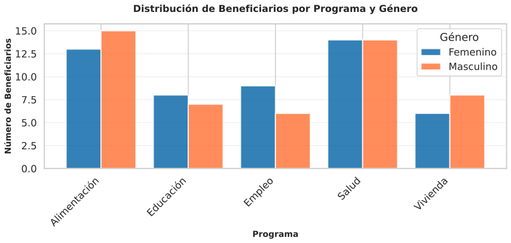

**Uso:** Comparar dos grupos (género, años, etc.) lado a lado por categoría.

</div>
</div>

---

# 2. Gráficos de Líneas

<div class="grid grid-cols-2 gap-8">
<div>

## Cuándo Usar

**Pregunta:** ¿Cómo cambia esto con el tiempo?

**Casos de Uso:**
- Tendencias temporales (mensual, anual)
- Comparar múltiples series temporales
- Identificar estacionalidad

<div v-click class="mt-6">

### Mejores Prácticas

✅ Eje X siempre es **tiempo** (izquierda → derecha)

✅ Máximo **4-5 líneas** (más = confuso)

✅ Línea más importante en **color más oscuro**

✅ Etiqueta **directa** en la línea (no solo leyenda)

✅ Resalta **puntos clave** (máximos, mínimos, cambios)

</div>

</div>
<div v-click>

## Ejemplo

### Satisfacción Mensual (2024)


**Insight:** Mejora sostenida de Enero a Marzo, con ligera baja en Abril. Los puntos críticos están resaltados.

### Con Múltiples Líneas: Comparación por Área

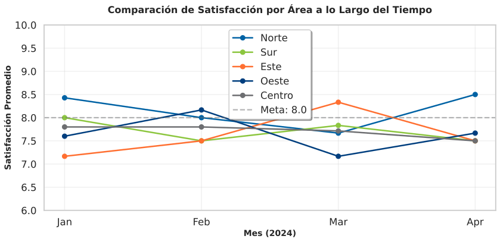

**Insight:** Norte consistentemente supera otras áreas. Este muestra crecimiento notable.

</div>
</div>

---

# 3. Pie Charts (Gráficos Circulares)

<div class="grid grid-cols-2 gap-8">
<div>

## Cuándo Usar (con PRECAUCIÓN)

**Pregunta:** ¿Qué porcentaje representa cada categoría del total?

**Casos de Uso LIMITADOS:**
- Máximo **3-5 categorías**
- Cuando una categoría es dominante (>50%)

<div v-click class="mt-6">

### ⚠️ Problemas

❌ Difícil comparar rebanadas similares

❌ No funciona con muchas categorías

❌ 3D hace impossible interpretación

❌ Exploded pie charts son decorativos, no informativos

</div>

<div v-click class="mt-6">

### ✅ Alternativa Mejor: Barras

Para mostrar proporciones, **barras horizontales apiladas al 100%** son más claras

</div>

</div>
<div v-click>

## Ejemplo: Pie vs Barras


**Comparación Visual:**
- **Izquierda (❌ Pie):** ¿Cuál programa tiene más beneficiarios? Difícil comparar.
- **Derecha (✅ Barras):** Orden y diferencias claras al instante.

### ✅ Alternativa Mejor: Barra Apilada 100%

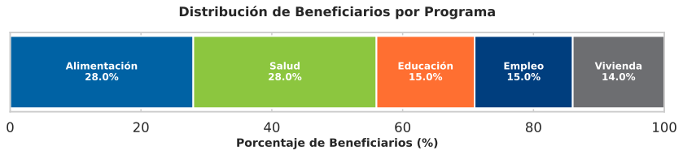

**Uso:** Cuando necesitas mostrar proporción del total, barras apiladas son más claras que pie charts.

</div>
</div>

---

# 4. Histogramas y Box Plots

<div class="grid grid-cols-2 gap-8">
<div>

## Histograma

**Pregunta:** ¿Cómo se distribuyen los datos?

**Casos de Uso:**
- Distribución de edades de beneficiarios
- Distribución de tiempos de atención
- Identificar normalidad, asimetría, outliers

### Ejemplo: Tiempos de Atención

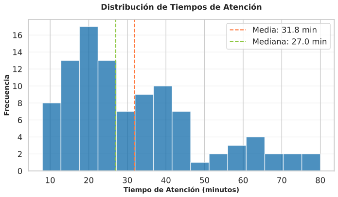

**Insight:**
- Mayoría de atenciones: 10-30 minutos
- Distribución ligeramente asimétrica hacia derecha
- Hay casos de 60+ minutos (outliers)

</div>
<div v-click>

## Box Plot

**Pregunta:** ¿Dónde está el centro y cuánta variación hay?

**Componentes:**
- Caja: 50% central de datos (Q1 a Q3)
- Línea central: Mediana
- Bigotes: Rango (excluyendo outliers)
- Puntos: Outliers

### Ejemplo: Satisfacción por Programa

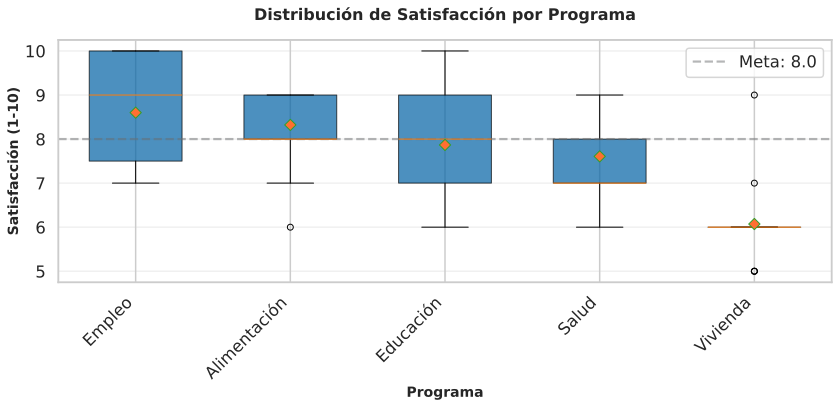

**Insight:**
- Empleo tiene mayor variabilidad (rango más amplio)
- Educación muestra consistencia (caja estrecha)
- Outliers visibles como puntos individuales

**Ventaja:** Compara múltiples grupos fácilmente

</div>
</div>

---

# 5. Scatter Plots (Diagramas de Dispersión)

<div class="grid grid-cols-2 gap-8">
<div>

## Cuándo Usar

**Pregunta:** ¿Existe relación entre dos variables numéricas?

**Casos de Uso:**
- Correlación: Tiempo de servicio vs Satisfacción
- Segmentación: Impacto vs Esfuerzo (matriz)
- Outliers: Identificar casos atípicos

<div v-click class="mt-6">

### Mejores Prácticas

✅ Agregar **línea de tendencia** para visualizar correlación

✅ Usar **color** para tercera dimensión (categoría)

✅ Etiquetar **puntos importantes**

✅ Agregar **líneas de referencia** (ej: promedio)

</div>

</div>
<div v-click>

## Ejemplo: Tiempo vs Satisfacción

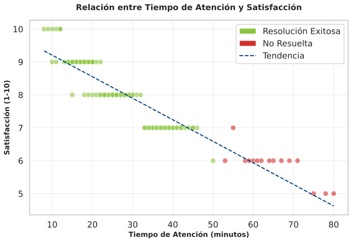

**Insight:**
- **Correlación negativa leve**: Más tiempo no garantiza más satisfacción
- **Verde**: Casos resueltos exitosamente
- **Rojo**: Casos no resueltos (generalmente menor satisfacción)
- **Línea de tendencia**: Muestra relación general entre variables

</div>
</div>

---

# 6. Heatmaps (Mapas de Calor)

<div class="grid grid-cols-2 gap-8">
<div>

## Cuándo Usar

**Pregunta:** ¿Cómo se comparan muchas combinaciones de dos variables?

**Casos de Uso:**
- Matriz de correlación entre variables
- Satisfacción por mes × área
- Volumen de atención por día × hora

<div v-click class="mt-6">

### Mejores Prácticas

✅ Usar escala de color **secuencial** o **divergente**

✅ Incluir **escala de colores** (leyenda)

✅ Alinear categorías de forma lógica

✅ Resaltar **valores extremos** con anotaciones

</div>

</div>
<div v-click>

## Ejemplo: Satisfacción por Área × Mes

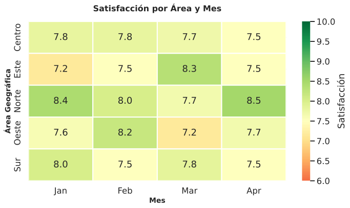

**Insight:**
- **Norte**: Consistentemente alto (verde oscuro)
- **Este**: Muestra mejora progresiva de Ene a Abr
- **Centro**: Estable alrededor del promedio
- **Rojo**: Áreas bajo meta que requieren atención

**Uso:** Identificar patrones en dos dimensiones simultáneamente

</div>
</div>

---

# Matriz de Decisión: Tipo de Gráfico

<div class="text-xs">

| Pregunta de Negocio | Tipo de Datos | Gráfico Recomendado | Alternativas |
|---------------------|---------------|---------------------|--------------|
| ¿Cómo se comparan A, B, C? | Categórica → Numérica | **Barras** | Columnas, Tabla |
| ¿Cómo cambia con el tiempo? | Temporal → Numérica | **Líneas** | Áreas, Columnas |
| ¿Qué % representa cada categoría? | Categórica (≤5) → % | **Barra apilada 100%** | Pie (solo si <4 categorías) |
| ¿Cómo se distribuyen los datos? | Numérica continua | **Histograma** | Box plot, Violín |
| ¿Existe correlación entre X e Y? | Numérica × Numérica | **Scatter plot** | Líneas, Heatmap |
| ¿Cuál es el rango y mediana? | Numérica por grupos | **Box plot** | Violin plot |
| ¿Cómo se comparan muchas combinaciones? | Categórica × Categórica → Numérica | **Heatmap** | Tabla pivote |
| ¿Dónde están geográficamente? | Coordenadas/Regiones | **Mapa de puntos/calor** | Tabla por región |
| ¿Cuánto progresé hacia la meta? | Métrica única + Meta | **Bullet chart / KPI card** | Gauge (velocímetro) |

</div>

<div v-click class="mt-8 p-6 bg-yellow-500 bg-opacity-10 rounded text-center">

**Regla:** Prueba 2-3 tipos de gráficos y elige el que comunica el insight **más rápido y claramente**

</div>

---
layout: section
---

# Parte 3: Anti-Patterns (Errores Comunes)

## Qué NO Hacer en Visualización

---

# Anti-Pattern 1: Gráficos 3D

<div class="grid grid-cols-2 gap-8">
<div>

## El Problema

**3D distorsiona la percepción de valores**

### Ejemplo: Barras 3D

```
      Valor aparente   Valor real
A:    Parece 45%       Realmente 35%
B:    Parece 30%       Realmente 40%
C:    Parece 25%       Realmente 25%
```

<div v-click class="mt-6">

### ¿Por Qué la Gente Usa 3D?

- Parece "más profesional" ❌
- Software lo ofrece por defecto ❌
- Llena espacio vacío ❌

### La Realidad

- **Nunca** agrega información útil
- **Siempre** dificulta lectura
- Es **decorativo**, no informativo

</div>

</div>
<div v-click>

## Solución: Siempre 2D

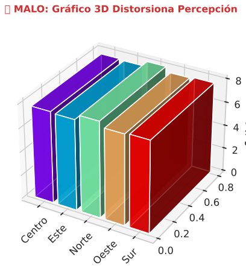

**Problema:** La perspectiva 3D distorsiona la percepción visual. Barras en primer plano parecen más grandes.

**Solución:** Usa siempre gráficos 2D para comparaciones precisas.

<div v-click class="mt-6 p-4 bg-red-500 bg-opacity-10 rounded text-sm">

**Regla Absoluta:** NUNCA uses 3D. Punto.

</div>

</div>
</div>

---

# Anti-Pattern 2: Ejes Y Truncados/Manipulados

<div class="grid grid-cols-2 gap-8">
<div>

## Comparación Visual

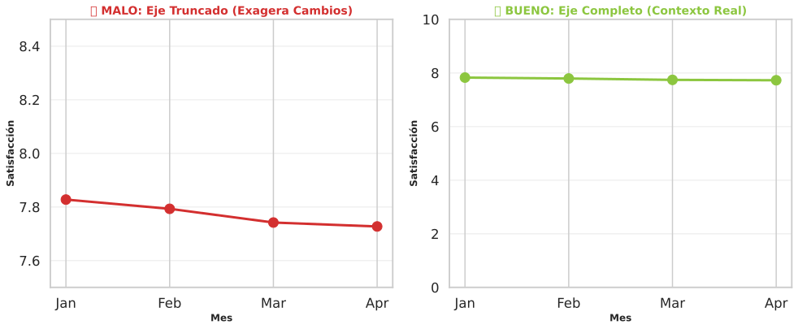

**Problema:**
- **Izquierda (❌):** Eje truncado (7.5-8.5) exagera cambios
- **Derecha (✅):** Eje completo (0-10) muestra contexto real

**Insight:** La "enorme mejora" en realidad es solo 6% (de 8.0 a 8.5)

</div>
<div v-click>

## Excepciones Válidas

### Cuando SÍ puedes truncar:

**1. Datos con rango estrecho**
- Temperatura (15°C - 25°C)
- Tipos de cambio (19.80 - 20.20)

**2. Cambios porcentuales pequeños pero importantes**
- Tasas de interés (7.25% - 7.75%)

### Regla de Oro:

✅ **SI truncas, SIEMPRE indícalo claramente**

```
Temperatura (°C)
25│      ●        ⚠️ Eje no inicia en 0
   │   ●    ●
20│ ●          ●
   │
15│ [Eje truncado]
   └──────────────────────
```

<div v-click class="mt-4 p-4 bg-yellow-500 bg-opacity-10 rounded text-sm">

**Advertencia:** Políticos y marketers usan ejes truncados para **manipular**. No seas uno de ellos.

</div>

</div>
</div>

---

# Anti-Pattern 3: Demasiados Colores

<div class="grid grid-cols-2 gap-8">
<div>

## Comparación Visual

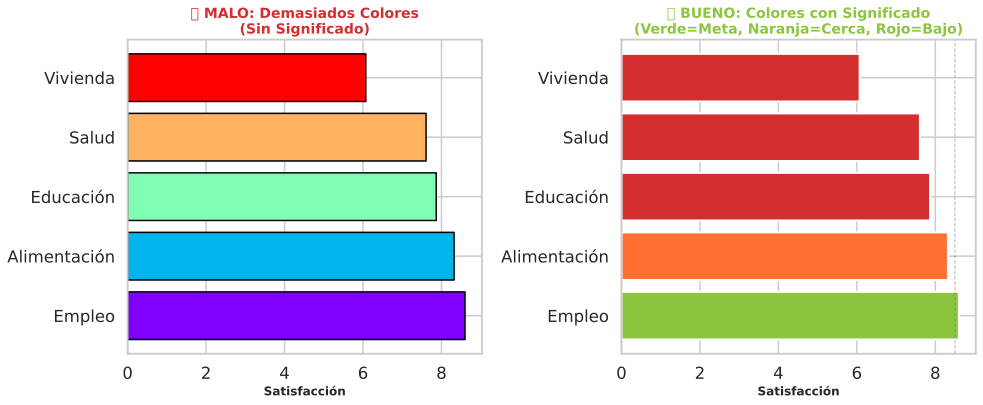

**Problema (Izquierda ❌):**
- Paleta arcoíris sin significado
- Difícil recordar qué significa cada color
- No hay jerarquía visual clara

**Solución (Derecha ✅):**
- 3 colores con significado: 🟢 Verde (meta alcanzada), 🟠 Naranja (cerca), 🔴 Rojo (bajo meta)
- Prioridad inmediata: atender programas rojos primero
- Interpretación instantánea sin revisar leyenda

### Regla: Máximo 5 Colores Distintos

</div>
</div>

---

# Anti-Pattern 4: Pie Charts con Muchas Categorías

<div class="grid grid-cols-2 gap-8">
<div>

## El Problema

**Más de 5 rebanadas = ilegible**

### ❌ Pie con 10 Categorías

```
     ╱──────────────╲
    │1│2│3│4│5│6│7 │
    │  │  │  │  │  │
    │10│9│8│  │  │  │
     ╲──────────────╱

Categorías:
1. Alimentación (15%)
2. Salud (12%)
3. Educación (11%)
4. Vivienda (10%)
5. Empleo (9%)
6. Legal (8%)
7. Psicológico (7%)
8. Deportes (6%)
9. Cultura (5%)
10. Otros (17%)
```

**Imposible** comparar rebanadas pequeñas

</div>
<div v-click>

## Soluciones

### ✅ Opción 1: Barras Ordenadas

```
Alimentación    ███████████████ 15%
Otros           █████████████████ 17%
Salud           ████████████ 12%
Educación       ███████████ 11%
Vivienda        ██████████ 10%
Empleo          █████████ 9%
Legal           ████████ 8%
Psicológico     ███████ 7%
Deportes        ██████ 6%
Cultura         █████ 5%
```

### ✅ Opción 2: Agrupar Categorías Pequeñas

```
     ╱──────────────╲
    │  Otros  │ 43%  │  (Suma de < 10%)
    │  (7 cat)│      │
    │  Alim   │      │  Alimentación: 15%
    │  15%    │      │  Salud: 12%
    │    Salud│      │  Educación: 11%
     ╲─12%  11%────╱   Vivienda: 10%
```

</div>
</div>

---

# Anti-Pattern 5: Doble Eje Y

<div class="grid grid-cols-2 gap-8">
<div>

## El Problema: Doble Eje Y

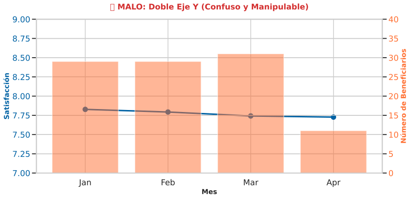

**Problemas:**
- **Escalas independientes**: Fácil manipular para forzar correlación visual
- **Confusión de lectura**: ¿Qué eje corresponde a qué línea?
- **Interpretación ambigua**: Los ejes pueden ajustarse para mostrar cualquier relación

</div>
<div v-click>

## Soluciones

### ✅ Opción 1: Dos Gráficos Separados

```
Beneficiarios (personas)
3,000│        ●
     │    ●     ●
2,000│●             ●
1,000│                  ●
     └──────────────────────
      E F M A M J J

Satisfacción (escala 1-10)
10│
 8│  ●─────●────●
 6│●            ●───●
  └──────────────────────
   E F M A M J J
```

### ✅ Opción 2: Normalizar Escalas

Convertir ambas a % de cambio vs baseline

<div v-click class="mt-6 p-4 bg-red-500 bg-opacity-10 rounded text-sm">

**Excepción:** Solo usa doble eje si variables están **directamente relacionadas** (ej: ventas en pesos y en dólares)

</div>

</div>
</div>

---

# Checklist Anti-Patterns

<div class="grid grid-cols-2 gap-6 text-sm">
<div>

## Evita Siempre

- [ ] ❌ Gráficos 3D
- [ ] ❌ Pie charts con >5 categorías
- [ ] ❌ Ejes Y truncados sin advertencia
- [ ] ❌ Más de 5 colores sin significado
- [ ] ❌ Doble eje Y (salvo excepciones)
- [ ] ❌ Efectos especiales (sombras, gradientes, texturas)
- [ ] ❌ Usar color como única forma de distinguir
- [ ] ❌ Gráficos decorativos sin datos
- [ ] ❌ Comic Sans u otras fuentes no profesionales
- [ ] ❌ Animar gráficos sin razón (distrae)

</div>
<div v-click>

## Prioriza Siempre

- [ ] ✅ Simplicidad (menos es más)
- [ ] ✅ Etiquetas claras en ejes y título
- [ ] ✅ Color con propósito (semáforo: 🔴🟡🟢)
- [ ] ✅ Tipo de gráfico alineado a pregunta de negocio
- [ ] ✅ Jerarquía visual (lo importante grande/arriba)
- [ ] ✅ Fuente de datos y fecha en el gráfico
- [ ] ✅ Probar con alguien más (¿entiende sin explicación?)
- [ ] ✅ Accesibilidad (legible para daltónicos)
- [ ] ✅ Espacio en blanco (no saturar)
- [ ] ✅ Consistencia en formato (mismo estilo en todo dashboard)

</div>
</div>

---
layout: center
class: text-center
---

# Resumen: Fundamentos de Visualización

<div class="grid grid-cols-3 gap-6 mt-12 text-sm">

<div v-click>

### 🎨 Principios de Diseño
- Jerarquía visual
- Minimalismo
- Color intencional
- Etiquetas claras

</div>

<div v-click>

### 📊 Tipos de Gráficos
- Barras (comparar)
- Líneas (tendencias)
- Scatter (relación)
- Heatmap (múltiples variables)

</div>

<div v-click>

### ❌ Anti-Patterns
- NO 3D
- NO ejes manipulados
- NO demasiados colores
- NO pie con >5 categorías

</div>

</div>

<div v-click class="mt-16 text-2xl font-bold text-gradient">
El mejor gráfico es el que comunica el insight en <3 segundos
</div>

---
layout: end
class: text-center
---

# ¡Gracias!

## Próxima Clase: Looker Studio - Tutorial Completo

<div class="mt-8 opacity-75">
CD2001B - Semana 4<br>
Tec de Monterrey Campus Puebla
</div>
