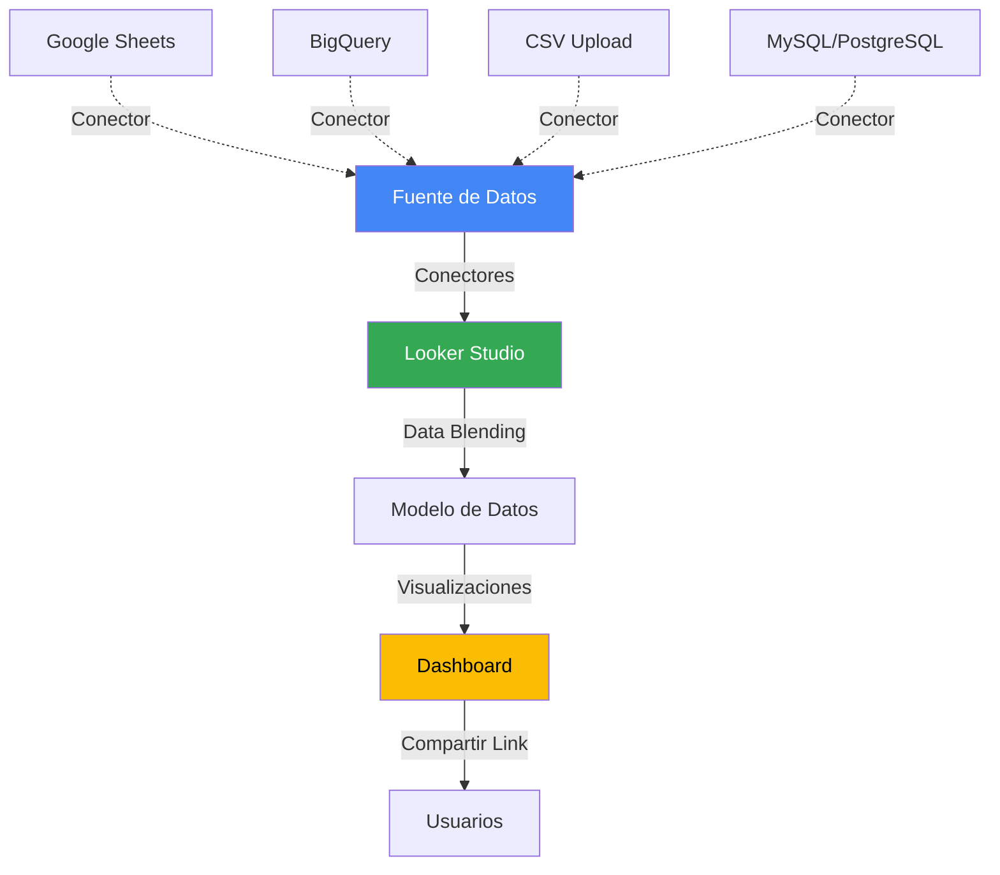
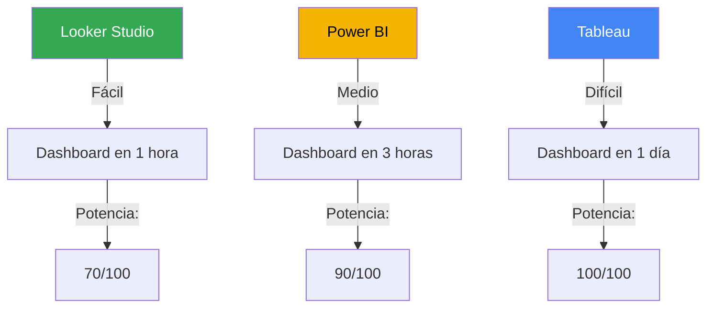

<style src="./styles/tec-theme.css"></style>

# Herramientas de Business Intelligence

## Del Excel al Dashboard Interactivo: Evolución y Ecosistema

<div class="pt-12">
  <span class="px-2 py-1 rounded cursor-pointer" hover="bg-white bg-opacity-10">
    CD2001B - Semana 4 | Módulo 2
  </span>
</div>

<div class="abs-br m-6 flex gap-2">
  <span class="text-sm opacity-50">Tec de Monterrey Campus Puebla</span>
</div>

---
layout: center
class: text-center
---

# ¿Qué es Business Intelligence (BI)?

<div class="grid grid-cols-2 gap-8 mt-12">
<div v-click>

### 📊 Definición

**Business Intelligence:** Conjunto de tecnologías, procesos y herramientas que transforman **datos crudos** en **información accionable** para la toma de decisiones

</div>
<div v-click>

### 🎯 En el Contexto de ONGs

**"Diagnóstico para Líneas de Acción"**

- Recopilar datos de beneficiarios
- Analizar estadísticamente (semanas 1-2)
- Visualizar KPIs (esta semana)
- **Tomar decisiones** informadas (semana 5)

</div>
</div>

<div v-click class="mt-12 text-xl font-bold text-gradient">
BI no es solo tecnología, es un proceso completo: Datos → Información → Insights → Decisiones
</div>

---
layout: section
---

# Parte 1: Historia y Evolución de BI

## De los Reportes en Papel al Dashboard en Tiempo Real

---

# Timeline de Business Intelligence (1990-2025)

<div class="text-sm">

| Época | Herramienta Dominante | Características | Limitaciones |
|-------|----------------------|-----------------|--------------|
| **1990s** | Excel + Access | • Hojas de cálculo manuales<br>• Tablas dinámicas<br>• Gráficos básicos | ❌ Manual, no escalable<br>❌ Propenso a errores<br>❌ Sin automatización |
| **2000-2010** | Cognos, Business Objects, SPSS | • Reportes empresariales<br>• Cubos OLAP<br>• ETL robusto | ❌ Muy caro ($50K+/año)<br>❌ Requiere TI especializado<br>❌ Ciclo lento (semanas) |
| **2004** | 🎨 **Tableau** lanzado | • **Visualización drag-and-drop**<br>• Interactividad<br>• Democratización de BI | ⚠️ Costoso para individuos<br>⚠️ Curva de aprendizaje |
| **2012** | **Looker** fundado | • Modelo semántico (LookML)<br>• BI embebido<br>• Cloud-native | ⚠️ Requiere SQL/LookML<br>⚠️ Empresarial |
| **2015** | 💼 **Power BI** lanzado | • Integración Microsoft<br>• DAX (fórmulas avanzadas)<br>• Precio accesible ($10/mes) | ⚠️ Mejor en Windows<br>⚠️ Curva de aprendizaje media |
| **2016** | **Google Data Studio** (gratis) | • 100% gratuito<br>• Cloud-first<br>• Integración Google | ⚠️ Menos potente que Power BI/Tableau |
| **2019** | Google compra Looker | • Looker Studio (rebrand 2022)<br>• Ecosistema unificado | |
| **2020-2025** | **Era Moderna:** Cloud + AI | • Self-service BI<br>• Natural language queries<br>• AI-driven insights<br>• Real-time dashboards<br>• Embedded analytics | |

</div>

<div v-click class="mt-6 p-4 bg-blue-500 bg-opacity-10 rounded text-center text-sm">

**Tendencia clave:** De herramientas caras y complejas (requieren TI) → Herramientas accesibles y fáciles (cualquiera puede usarlas)

</div>

---

# Evolución Visual: Cómo Cambió la Creación de Dashboards

<div class="grid grid-cols-3 gap-6">

<div v-click>

### 📊 1990s: Excel

**Proceso:**
1. Exportar datos de sistema
2. Copiar a Excel manualmente
3. Crear tabla dinámica
4. Insertar gráfico
5. Enviar PDF por email

**Tiempo:** Horas/días

**Problema:**
- Manual end-to-end
- Error humano
- No actualizable

</div>

<div v-click>

### 📈 2010s: Tableau/Power BI

**Proceso:**
1. Conectar a base de datos
2. Drag & drop campos
3. Dashboard interactivo
4. Publicar en servidor
5. Usuarios acceden vía web

**Tiempo:** Minutos/horas

**Mejora:**
- ✅ Automatizado
- ✅ Interactivo
- ✅ Actualizable

**Pero:** Costoso, requiere licencias

</div>

<div v-click>

### ☁️ 2020s: Looker Studio

**Proceso:**
1. Conectar Google Sheets
2. Drag & drop (sin instalar)
3. Dashboard en la nube
4. Compartir link
5. Gratis para siempre

**Tiempo:** Minutos

**Ventajas:**
- ✅ 100% gratis
- ✅ Sin instalación
- ✅ Colaborativo
- ✅ Fácil de aprender

**Trade-off:** Menos potente que las herramientas de pago

</div>

</div>

---
layout: section
---

# Parte 2: Las 3 Grandes Herramientas de BI

## Tableau vs Power BI vs Looker Studio

---

# Comparativa Completa: Las 3 Grandes

<div class="text-xs">

| Característica | **Tableau** | **Power BI** | **Looker Studio** ⭐ |
|----------------|-------------|--------------|----------------------|
| **Fundación** | 2004 (Salesforce 2019) | 2015 (Microsoft) | 2016 (Google) |
| **Precio** | 🔴 $70/user/mes (Creator)<br>$42/user/mes (Explorer) | 🟡 $10/user/mes (Pro)<br>$20/user/mes (Premium) | 🟢 **GRATIS** |
| **Instalación** | Desktop app (Mac/Win) | Desktop app (Windows only) | ☁️ 100% en navegador |
| **Curva de aprendizaje** | 🔴 Alta (3-6 meses dominio) | 🟡 Media (1-3 meses) | 🟢 Baja (1-2 semanas) |
| **Código requerido** | ⚠️ Calculated fields (opcional) | ⚠️ DAX para avanzado | ❌ Ninguno (drag & drop) |
| **Integraciones** | 🟢 80+ conectores nativos | 🟢 100+ conectores (Microsoft ecosystem) | 🟡 20+ conectores (Google ecosystem) |
| **Visualizaciones** | 🟢 Más variedad y flexibilidad | 🟢 Amplia librería | 🟡 Suficiente (10-15 tipos) |
| **Capacidad de datos** | 🟢 Millones de filas (in-memory) | 🟢 Billions (con DirectQuery) | 🟡 <100K filas (recomendado) |
| **Colaboración** | 🟡 Tableau Server/Online | 🟢 Integración Teams/SharePoint | 🟢 Compartir link (Google-style) |
| **Mobile** | ✅ App nativa (iOS/Android) | ✅ App nativa | ✅ Responsive web |
| **Casos de uso ideal** | 🏢 **Grandes empresas**<br>Análisis complejo<br>Dataviz artística | 🏢 **Empresas medianas**<br>Ecosistema Microsoft<br>Reportes financieros | 🎓 **Estudiantes, ONGs, startups**<br>Dashboards simples<br>Presupuesto $0 |

</div>

<div v-click class="mt-6 p-6 bg-green-500 bg-opacity-10 rounded text-center">

**Para este curso usaremos Looker Studio** porque es gratis, fácil de aprender, y suficientemente potente para diagnosticar ONGs

</div>

---

# ¿Cuál Herramienta Deberías Aprender?

<div class="grid grid-cols-2 gap-8">
<div>

## Según tu Perfil

### 🎓 Estudiante / Freelancer
**→ Looker Studio**
- Gratis para practicar
- Portfolio sin costo
- Suficiente para 80% de proyectos

**Después aprende:** Power BI (más demandado en empleos)

### 💼 Profesional en Empresa Grande
**→ Depende del ecosistema:**
- Microsoft 365 → **Power BI**
- Salesforce → **Tableau**
- Google Workspace → **Looker Studio**

### 🚀 Startup / ONG
**→ Looker Studio**
- $0 de presupuesto
- Escala conforme creces

</div>
<div v-click>

## Según tu Proyecto

### Dashboard Simple (KPIs + gráficos básicos)
✅ **Looker Studio** (suficiente y gratis)

### Análisis Complejo (joins, cálculos avanzados)
✅ **Power BI** (balance costo/potencia)

### Visualización "Artística" (infografías, viz ganadora de premios)
✅ **Tableau** (líder en flexibilidad visual)

### Embedded BI (dashboard dentro de tu app/producto)
✅ **Looker** (empresarial) o **Metabase** (open-source)

<div v-click class="mt-6 p-4 bg-yellow-500 bg-opacity-10 rounded text-sm">

**Realidad del Mercado Laboral (LinkedIn 2024):**
- Power BI: 120,000 ofertas
- Tableau: 85,000 ofertas
- Looker Studio: 15,000 ofertas

**Pero:** Saber Looker Studio te da base para aprender cualquiera

</div>

</div>
</div>

---

# Limitaciones de Looker Studio (Cuándo NO Usarlo)

<div class="grid grid-cols-2 gap-8">
<div>

## ❌ No Usar Looker Studio Si...

### 1. **Datos Grandes (>100K filas)**
- Looker Studio se vuelve lento
- Mejor: Power BI (DirectQuery) o Tableau

### 2. **Cálculos Complejos**
- Falta equivalente de DAX (Power BI)
- Calculated fields limitados
- Mejor: Power BI o Python

### 3. **Múltiples Fuentes Heterogéneas**
- Mezclar datos de 5+ fuentes es difícil
- Mejor: Power BI o herramienta ETL + Looker

### 4. **Control Total de Diseño**
- Limitado a templates predefinidos
- Mejor: Tableau (más flexible) o Streamlit (código)

</div>
<div v-click>

### 5. **Análisis Estadístico Avanzado**
- No tiene modelos predictivos
- No tiene clustering/ML
- Mejor: Python (Jupyter) + Streamlit

### 6. **Dashboards Offline**
- Requiere internet
- Mejor: Power BI Desktop (funciona offline)

### 7. **Gobernanza Empresarial Estricta**
- Menos features de permisos/roles
- Mejor: Power BI Premium o Tableau Server

<div v-click class="mt-6 p-4 bg-green-500 bg-opacity-10 rounded">

## ✅ Looker Studio es Perfecto Para:

- ONGs con presupuesto limitado
- Dashboards de <50K filas
- Equipos que usan Google Workspace
- Estudiantes aprendiendo BI
- Prototipos rápidos

**Tu proyecto de diagnóstico de ONG = caso de uso ideal**

</div>

</div>
</div>

---
layout: section
---

# Parte 3: Looker Studio Profundo

## Arquitectura, Componentes y Mejores Prácticas

---

# Arquitectura de Looker Studio

<div class="grid grid-cols-2 gap-8">
<div>

## Flujo de Datos



</div>
<div v-click>

## Capas de Looker Studio

### 1. **Capa de Conexión**
- 20+ conectores nativos
- Community connectors (300+)
- Credenciales guardadas

### 2. **Capa de Datos**
- Data blending (combinar fuentes)
- Calculated fields
- Filtros de fuente

### 3. **Capa de Visualización**
- Componentes (charts, scorecards, tables)
- Layout y diseño
- Temas y estilos

### 4. **Capa de Interacción**
- Filtros
- Date range controls
- Drill-down

</div>
</div>

---

# Conectores de Looker Studio

<div class="grid grid-cols-2 gap-6 text-sm">
<div>

## Conectores Nativos Más Usados

### Google Ecosystem
- ✅ **Google Sheets** (más común para principiantes)
- ✅ Google Analytics 4
- ✅ Google Ads
- ✅ BigQuery (warehouse)
- ✅ YouTube Analytics
- ✅ Search Console

### Bases de Datos
- ✅ MySQL
- ✅ PostgreSQL
- ✅ Cloud SQL
- ⚠️ (SQL Server no nativo, requiere connector)

### Archivos
- ✅ CSV Upload (archivo local)
- ✅ Google Drive

</div>
<div v-click>

## Community Connectors (300+)

### Marketing
- Facebook Ads
- Instagram Insights
- LinkedIn Ads
- TikTok Ads

### E-commerce
- Shopify
- WooCommerce
- Stripe

### CRM
- Salesforce
- HubSpot
- Zoho

### Otros
- MongoDB
- Snowflake
- Airtable

<div v-click class="mt-6 p-4 bg-blue-500 bg-opacity-10 rounded">

**Para tu proyecto ONG:**

**Opción 1 (más fácil):** Google Sheets
- Datos en Excel → Subir a Google Sheets → Conectar

**Opción 2 (más pro):** BigQuery (si tienes muchos datos)

</div>

</div>
</div>

---

# Componentes de Visualización en Looker Studio

<div class="grid grid-cols-3 gap-4 text-xs">

<div>

### 📊 Gráficos Básicos

**Time Series (Líneas)**
- Tendencias temporales
- Satisfacción mensual
- Crecimiento de beneficiarios

**Bar Chart (Barras)**
- Comparar categorías
- Programas de ONG
- Áreas geográficas

**Column Chart**
- Similar a barras (vertical)
- Comparaciones por periodo

**Pie Chart**
- Proporciones (máx 5 categorías)
- Distribución de presupuesto

**Donut Chart**
- Variante de pie
- Menos usado

</div>

<div v-click>

### 📈 Gráficos Avanzados

**Combo Chart**
- Combina barras + línea
- Ej: Beneficiarios (barras) + Satisfacción (línea)

**Area Chart**
- Tendencia con área rellena
- Acumulados

**Scatter Chart**
- Correlaciones
- Tiempo vs Satisfacción

**Geo Map**
- Mapas de calor geográficos
- Distribución por estado

**Pivot Table**
- Tablas dinámicas
- Drill-down manual

**Bullet Chart**
- Progreso hacia meta
- KPI con target

</div>

<div v-click>

### 🎯 Componentes Especiales

**Scorecard (KPI Card)**
- Métricas individuales destacadas
- Total beneficiarios
- Promedio satisfacción
- **Más usado en parte superior de dashboard**

**Table**
- Tabla de datos detallados
- Con sorting y paginación

**Treemap**
- Jerarquías visuales
- Programas y subprogramas

**Gauge (Velocímetro)**
- Medidor de progreso
- Visual pero poco usado

**Image & Text**
- Logo de la ONG
- Títulos y descripciones

**Date Range Control**
- Filtro de fechas
- Interactivo

</div>

</div>

<div v-click class="mt-6 p-4 bg-purple-500 bg-opacity-10 rounded text-center">

**Para tu dashboard ONG necesitas:** 3-5 Scorecards (arriba) + 1 Time Series + 2 Bar Charts + 1 Table (abajo)

</div>

---

# Calculated Fields: Agregar Lógica a tus Datos

<div class="grid grid-cols-2 gap-8">
<div>

## ¿Qué son?

**Calculated Fields:** Nuevas columnas creadas mediante fórmulas, sin modificar la fuente original

### Sintaxis Básica

```sql
-- Categorizar satisfacción
CASE
  WHEN satisfaccion >= 8 THEN "Satisfecho"
  WHEN satisfaccion >= 6 THEN "Neutral"
  ELSE "Insatisfecho"
END

-- Calcular edad
YEAR(CURRENT_DATE()) - YEAR(fecha_nacimiento)

-- Concatenar
CONCAT(nombre, " ", apellido)

-- Operaciones
costo_total / beneficiarios_atendidos
```

</div>
<div v-click>

## Ejemplos Útiles para ONG

### 1. Segmentos de Satisfacción
```sql
CASE
  WHEN satisfaccion >= 9 THEN "😀 Muy Satisfecho"
  WHEN satisfaccion >= 7 THEN "🙂 Satisfecho"
  WHEN satisfaccion >= 5 THEN "😐 Neutral"
  ELSE "😞 Insatisfecho"
END
```

### 2. Meta Alcanzada
```sql
CASE
  WHEN satisfaccion >= meta_satisfaccion THEN "✅ Meta Alcanzada"
  ELSE "❌ Bajo Meta"
END
```

### 3. Grupos de Edad
```sql
CASE
  WHEN edad < 18 THEN "Menor de edad"
  WHEN edad < 30 THEN "Joven"
  WHEN edad < 60 THEN "Adulto"
  ELSE "Adulto Mayor"
END
```

### 4. Costo por Beneficiario
```sql
presupuesto_total / COUNT_DISTINCT(beneficiario_id)
```

</div>
</div>

---

# Filtros e Interactividad

<div class="grid grid-cols-2 gap-8">
<div>

## Tipos de Filtros

### 1. **Filter Control (Usuario)**
- Usuario selecciona qué ver
- Dropdown, checkboxes, slider
- Ejemplo: Filtrar por área, programa, fecha

### 2. **Report-Level Filter (Fijo)**
- Aplica a todo el dashboard
- Usuario no lo ve
- Ejemplo: Solo datos 2023+

### 3. **Chart-Level Filter**
- Aplica solo a un gráfico
- Ejemplo: Top 10 programas

### 4. **Date Range Control**
- Filtro especial para fechas
- Rango (desde - hasta)

</div>
<div v-click>

## Mejores Prácticas de Filtros

### ✅ Hacer

- Ubicar filtros arriba o lateral izquierdo
- Usar filtros globales (afectan todo)
- Dar opción "Todos" en dropdowns
- Indicar qué filtros están activos
- Máximo 3-5 filtros (evitar sobrecarga)

### ❌ Evitar

- Filtros escondidos (usuario no encuentra)
- Demasiados filtros (confusión)
- Filtros sin valores (vacíos)
- Filtros sin default (usuario no sabe qué elegir)

<div v-click class="mt-6 p-4 bg-green-500 bg-opacity-10 rounded text-sm">

**Ejemplo Dashboard ONG:**

Filtros principales:
- Área (Dropdown: Norte, Sur, Este, Oeste, Todos)
- Programa (Dropdown: Alimentación, Salud, Educación, Todos)
- Fecha (Date range: Últimos 6 meses default)

</div>

</div>
</div>

---

# Data Blending: Combinar Múltiples Fuentes

<div class="grid grid-cols-2 gap-8">
<div>

## ¿Qué es Data Blending?

**Combinar datos de 2+ fuentes** basándose en una clave común (ej: ID de beneficiario)

### Ejemplo: ONG con 2 Fuentes

**Fuente 1: Beneficiarios (Google Sheets)**
```
beneficiario_id | nombre    | edad
101             | María     | 35
102             | Juan      | 42
```

**Fuente 2: Atenciones (BigQuery)**
```
beneficiario_id | fecha      | satisfaccion
101             | 2024-01-15 | 9
101             | 2024-02-20 | 8
102             | 2024-01-18 | 7
```

**Blended:** Combina por `beneficiario_id`

</div>
<div v-click>

## Configuración en Looker Studio

### Paso 1: Definir Join Key
- Campo en común: `beneficiario_id`
- Looker hace LEFT JOIN automático

### Paso 2: Elegir Métricas
- De Fuente 1: Nombre, Edad (dimensiones)
- De Fuente 2: AVG(Satisfacción), COUNT(Atenciones)

### Paso 3: Crear Chart
- Ahora puedes graficar:
  - Satisfacción por grupo de edad
  - Atenciones por beneficiario

<div v-click class="mt-6 p-4 bg-yellow-500 bg-opacity-10 rounded text-sm">

**Limitaciones:**
- Máximo 5 fuentes por blend
- Join solo por 1 campo (no composite keys)
- Puede ser lento si fuentes grandes

**Alternativa:** Hacer join en Python/BigQuery ANTES de Looker

</div>

</div>
</div>

---

# Temas y Diseño Visual

<div class="grid grid-cols-2 gap-8">
<div>

## Temas Predefinidos

Looker Studio tiene **~15 temas** listos:

- **Simple (default):** Blanco, minimalista
- **Apollo:** Azul oscuro, profesional
- **Orbita:** Colorido, moderno
- **Classic:** Estilo Google Sheets
- **Custom:** Crea el tuyo

### Elementos de un Tema

- **Paleta de colores** (primario, secundario, acento)
- **Tipografía** (títulos, cuerpo)
- **Bordes y sombras**
- **Espaciado**

</div>
<div v-click>

## Personalización para tu ONG

### Opción 1: Usar Tema Predefinido
- Elegir uno profesional (Apollo, Orbita)
- Ajustar colores principales

### Opción 2: Tema Custom (Tec de Monterrey)
```
Colores:
- Primario: #0062A4 (Azul Reflex)
- Secundario: #8CC63F (Verde)
- Acento: #FF6F31 (Naranja)
- Fondo: #FFFFFF
- Texto: #333333

Tipografía:
- Títulos: Montserrat Bold
- Cuerpo: Open Sans Regular
```

### Opción 3: Colores de la ONG
- Usar logo y paleta de la organización
- Branding consistente

<div v-click class="mt-4 p-4 bg-blue-500 bg-opacity-10 rounded text-sm">

**Tip:** Aplicar tema DESPUÉS de crear gráficos (más rápido)

</div>

</div>
</div>

---
layout: section
---

# Parte 4: Recursos Verificados y Comunidad

## Galerías, Tutoriales, Concursos y Aprendizaje Continuo

---

# Galerías de Inspiración: Aprende de los Mejores

<div class="grid grid-cols-3 gap-6 text-sm">

<div>

### 🎨 Tableau Public

**Viz of the Day**
- 🔗 [public.tableau.com/app/discover/viz-of-the-day](https://public.tableau.com/app/discover/viz-of-the-day)
- Featured daily desde 2010
- **2,000+ visualizaciones** descargables
- Puedes abrir el workbook y ver cómo fue hecho

**Categorías:**
- Business dashboards
- Sports analytics
- Healthcare
- Social issues
- Pop culture

<div v-click class="mt-4 p-3 bg-purple-500 bg-opacity-10 rounded">

**Actividad:** Explora Viz of the Day y encuentra 1 dashboard relacionado con ONGs o temas sociales

</div>

</div>

<div v-click>

### 📊 Looker Studio Gallery

**Galería Oficial**
- 🔗 [lookerstudio.google.com/gallery](https://lookerstudio.google.com/gallery)
- Templates **clonables** (botón "Use Template")
- Filtros: Marketing, Analytics, Sales, etc.

**Categorías útiles para ONGs:**
- Google Analytics dashboards
- Community templates
- Nonprofit ejemplos

**Cómo usar:**
1. Encuentra template similar a tu proyecto
2. Clic "Use Template"
3. Conecta tus datos
4. Personaliza

<div v-click class="mt-4 p-3 bg-green-500 bg-opacity-10 rounded text-xs">

**Template recomendado:** Busca "nonprofit" o "community dashboard"

</div>

</div>

<div v-click>

### 💼 Power BI Showcases

**Microsoft App Source**
- Dashboards de ejemplo
- Descargables (.pbix files)

**Numerro Gallery**
- 🔗 [numerro.io/gallery](https://www.numerro.io/gallery)
- Dashboards de usuarios

**DataViz Gallery**
- Mejores visualizaciones por categoría

<div v-click class="mt-4 p-3 bg-blue-500 bg-opacity-10 rounded text-xs">

**Diferencia vs Tableau:** Power BI tiene menos enfoque artístico, más enfoque empresarial

</div>

</div>

</div>

---

# Tutoriales y Cursos Gratuitos

<div class="grid grid-cols-2 gap-8 text-sm">
<div>

## Looker Studio

### Oficiales de Google
- 📺 **Google Analytics YouTube Channel**
  - Looker Studio basics (playlist 15 videos)
  - En inglés con subtítulos

- 📖 **Google Support Docs**
  - [support.google.com/looker-studio](https://support.google.com/looker-studio)
  - Guías paso a paso

### Comunidad (2024-2025)
- **Porter Metrics** (Blog)
  - Tutoriales completos
  - Templates gratis

- **Loves Data** (YouTube)
  - Canal especializado en Google tools
  - Looker Studio desde cero

</div>
<div v-click>

## Tableau

### Oficiales
- 📺 **Tableau Tim** (YouTube)
  - Tutoriales semanales
  - Tableau Public gratis

- 📖 **Tableau Public Training**
  - In-app guided tours
  - Learning videos integrados

### Comunidad
- **#MakeoverMonday**
  - Desafío semanal de visualización
  - Feedback de la comunidad

## Power BI

### Oficiales
- 📺 **Guy in a Cube** (YouTube)
  - Canal oficial Microsoft
  - Tutoriales avanzados

- 📖 **Microsoft Learn**
  - Cursos estructurados gratis
  - Certificación (paid)

</div>
</div>

---

# Concursos y Desafíos de Visualización

<div class="grid grid-cols-2 gap-6 text-xs">
<div>

## Power BI

### **DataViz World Championships**
- 🔗 [community.fabric.microsoft.com](https://community.fabric.microsoft.com)
- **Cuándo:** 4 rondas (Ene-Mar cada año)
- **Premios:** Viaje a conferencia + reconocimiento
- **Final:** Live en Fabric Community Conference (Las Vegas)

**Formato:**
- Tema semanal (ej: "Love", "Olympics")
- Dataset provisto
- Submit dashboard
- Comunidad vota

### **Chandoo Power BI Contest**
- **Premios:** $500 USD
- Anual
- Temas variados

### **ZoomCharts PRO Reports Challenges**
- Mensual
- Gratis participar
- Premios en software

</div>
<div v-click>

## Tableau

### **Iron Viz**
- 🏆 **El mundial de dataviz**
- **Cuándo:** Oct-Nov (anual)
- **Premios:** $10,000 USD + viaje
- **Etapas:**
  1. Qualifiers (3 rondas temáticas)
  2. Finalists (top 10)
  3. Live final en Tableau Conference

**Ganadores famosos:**
- Adam McCann (Sports)
- Sarah Bartlett (Social impact)

### **Makeover Monday**
- 🔗 [makeovermonday.co.uk](https://www.makeovermonday.co.uk)
- **Desafío semanal** desde 2016
- Dataset + viz mediocre
- Tu misión: Mejorarlo
- Feedback de Andy Kriebel (Tableau Zen Master)

**Beneficio:** Portfolio + aprendizaje

</div>
</div>

<div v-click class="mt-6 p-6 bg-yellow-500 bg-opacity-10 rounded text-center">

**¿Por qué importan estos concursos?**
- ✅ Aprendes viendo submits de otros
- ✅ Construyes portfolio
- ✅ Networking con comunidad BI
- ✅ Algunos son paso para conseguir empleo

</div>

---

# Comparación: Curva de Aprendizaje

<div class="grid grid-cols-2 gap-8">
<div>

## Timeline de Dominio

```
Looker Studio:
Semana 1: Dashboard básico funcional ✅
Semana 2: Dashboard profesional ✅
Mes 1: Dominio de calculated fields
Mes 2: Data blending avanzado
---
3 meses = "Competente"

Power BI:
Semana 1: Interfaz básica
Semana 2-4: Gráficos simples
Mes 2: DAX básico (fórmulas)
Mes 3-4: Modelado de datos
Mes 5-6: DAX avanzado
---
6 meses = "Competente"

Tableau:
Semana 1-2: Conectar datos
Mes 1: Gráficos básicos
Mes 2-3: Calculated fields
Mes 4-6: Diseño avanzado
Mes 7-12: LOD expressions, parameters
---
12 meses = "Competente"
```

</div>
<div v-click>

## Esfuerzo vs Potencia



### Recomendación de Aprendizaje

**Para estudiantes:**
1. Empieza con **Looker Studio** (este curso)
2. Aprende **Power BI** (más demanda laboral)
3. Si te especializas en dataviz: **Tableau**

**Para profesionales:**
- Si tu empresa usa Microsoft → Power BI
- Si tu empresa usa Google → Looker Studio
- Si eres consultor → Aprende los 3

</div>
</div>

---

# Certificaciones y Credenciales

<div class="grid grid-cols-3 gap-6 text-xs">

<div>

### Tableau

**Tableau Desktop Specialist**
- Nivel: Principiante
- Costo: $100 USD
- Duración: 60 min
- **Valor en CV:** Medio-Alto

**Tableau Certified Data Analyst**
- Nivel: Avanzado
- Costo: $250 USD
- **Valor en CV:** Alto

**Tableau Certified Consultant**
- Nivel: Experto
- Costo: $600 USD
- **Valor en CV:** Muy Alto

</div>

<div>

### Power BI

**PL-300: Microsoft Power BI Data Analyst**
- Nivel: Associate
- Costo: $165 USD
- Duración: 120 min
- **Valor en CV:** Alto

**Renovación:** Anual (gratis)

**Microsoft Certified: Fabric Analytics Engineer**
- Nuevo (2024)
- Incluye Power BI + Fabric
- **Valor en CV:** Alto (emergente)

</div>

<div>

### Looker Studio

**❌ No hay certificación oficial**

**Alternativas:**
- Google Analytics 4 Certification (incluye Looker Studio)
- Coursera: Google Data Analytics Certificate
  - 6 meses, $49/mes
  - Incluye módulo Looker Studio

**Valor en CV:** Bajo
- Enfocarse en **portfolio** de dashboards reales más que certificación

</div>

</div>

<div v-click class="mt-6 p-6 bg-blue-500 bg-opacity-10 rounded text-center">

**Consejo:** Para este curso, NO necesitas certificación. **Enfócate en crear un dashboard impresionante para tu ONG** que puedas mostrar en entrevistas.

</div>

---
layout: center
class: text-center
---

# Resumen: Ecosistema de BI

<div class="grid grid-cols-3 gap-6 mt-12 text-sm">

<div v-click>

### 📚 Historia
- Excel (1990s)
- Tableau (2004)
- Power BI (2015)
- Looker Studio (2016)
- Era Cloud + AI (2020s)

</div>

<div v-click>

### ⚖️ Las 3 Grandes
- **Tableau:** Más potente, más caro
- **Power BI:** Balance, ecosistema Microsoft
- **Looker Studio:** Gratis, fácil, suficiente

</div>

<div v-click>

### 🎯 Para Este Curso
- Usaremos Looker Studio (70%)
- Conocerás alternativas (30%)
- Portfolio > Certificación

</div>

</div>

<div v-click class="mt-16">

### 🔗 Recursos Clave para Recordar

- 🎨 Inspiración: [Tableau Viz of the Day](https://public.tableau.com/app/discover/viz-of-the-day)
- 📦 Templates: [Looker Studio Gallery](https://lookerstudio.google.com/gallery)
- 🏆 Concursos: Power BI DataViz Championships, Tableau Iron Viz
- 📺 Tutoriales: Google Analytics (YouTube), Guy in a Cube, Tableau Tim

</div>

---
layout: end
class: text-center
---

# ¡Gracias!

## Próxima Clase: Visualización en el Pipeline de Datos

### Actividad: Explora la Galería de Looker Studio y encuentra 1 dashboard que te inspire para tu proyecto de ONG

<div class="mt-8 opacity-75">
CD2001B - Semana 4<br>
Tec de Monterrey Campus Puebla
</div>
